<p align="center">
  
</p>

<div align="center">
  <h1>Universidad Peruana de Ciencias Aplicadas</h1>
  <p><strong>Carrera:</strong> Ingeniería de Software</p>
  <p><strong>Ciclo:</strong> 2025 - 1</p>
  <p><strong>Curso:</strong> Diseño de Experimentos de Ingeniería de Software</p>
  <p><strong>Sección:</strong> 4429</p>
  <p><strong>Profesor:</strong> Ivan Robles Fernández</p>
  <p><strong>"Informe de Trabajo Final"</strong></p>
  <p><strong>Startup:</strong> InnovaTech</p>
  <p><strong>Producto:</strong> AgroTech</p>
</div>

<table align="center">
  <tr>
    <th>Integrantes</th>
    <th>Código</th>
  </tr>
  <tr>
    <td>Delgado Corrales, Piero Gonzalo</td>
    <td>U202210749</td>
  </tr>
  <tr>
    <td>La Torre Soto, André Sebastián</td>
    <td>U202217772</td>
  </tr>
  <tr>
    <td>Paredes Puente, Sebastián Roberto</td>
    <td>U202217239</td>
  </tr>
  <tr>
    <td>Pecan Pariona, Sergio Joel</td>
    <td>U20201A938</td>
  </tr>
  <tr>
    <td>Qqueso Rodriguez, Britney Delhy</td>
    <td>U20211G671</td>
  </tr>
  <tr>
    <td>Salinas Torres, Salvador Antonio</td>
    <td>U20221B127</td>
  </tr>
</table>

<p align="center"><b>Julio 2025</b></p>

<div style="page-break-after: always;"></div>

# Registro de versiones

<table>
  <thead>
    <tr>
        <th>Versión</th>
        <th>Fecha</th>
        <th>Autor</th>
        <th>Descripción de modificación</th>
    </tr>
  </thead>
  <tbody>
  <tr>
      <td><strong>TB1</strong></td>
      <td>25/04/25</td>
      <td>
        <ul>
          <li>Delgado Corrales, Piero Gonzalo</li>
          <li>La Torre Soto, André Sebastián</li>
          <li>Paredes Puente, Sebastian Roberto</li>
          <li>Pecan Pariona, Sergio Joel</li>
          <li>Salinas Torres, Salvador Antonio</li>
        </ul>
      </td>
      <td>
        Se realizaron los siguientes puntos:
        <ul>
          <li>Capítulo I: Introducción</li>
          <li>Capítulo II: Requirements Elicitation & Analysis</li>
          <li>Capítulo III: Requirements Specification</li>
          <li>Capítulo IV: Product Design</li>
          <li>Capítulo V: Product Implementation</li>
        </ul>
      </td>
  </tr>
  <tr>
      <td><strong>TP1</strong></td>
      <td>14/05/25</td>
      <td>
        <ul>
          <li>Delgado Corrales, Piero Gonzalo</li>
          <li>La Torre Soto, André Sebastián</li>
          <li>Paredes Puente, Sebastian Roberto</li>
          <li>Pecan Pariona, Sergio Joel</li>
          <li>Salinas Torres, Salvador Antonio</li>
          <li>Qqueso Rodriguez, Britney Delhy</li>
        </ul>
      </td>
      <td>
        Se realizó el avance de los siguientes puntos:
        <ul>
          <li>Capítulo III: Requirements Specification</li>
          <li>Capítulo V: Product Implementation</li>
          <li>Capítulo VI: Product Verification & Validation</li>
          <li>Capítulo VII: DevOps Practices</li>
        </ul>
      </td>
  </tr>
  <tr>
      <td><strong>TB2</strong></td>
      <td>19/06/25</td>
      <td>
        <ul>
          <li>Delgado Corrales, Piero Gonzalo</li>
          <li>La Torre Soto, André Sebastián</li>
          <li>Paredes Puente, Sebastian Roberto</li>
          <li>Pecan Pariona, Sergio Joel</li>
          <li>Salinas Torres, Salvador Antonio</li>
          <li>Qqueso Rodriguez, Britney Delhy</li>
        </ul>
      </td>
      <td>
        Se realizó el avance de los siguientes puntos:
        <ul>
          <li>Capítulo VI: Product Verification & Validation</li>
          <li>Capítulo VII: DevOps Practices</li>
          <li>Capítulo VIII: Experiment-Driven Development</li>
        </ul>
      </td>
  </tr>
  <tr>
      <td><strong>TF1</strong></td>
      <td>07/07/25</td>
      <td>
        <ul>
          <li>Delgado Corrales, Piero Gonzalo</li>
          <li>La Torre Soto, André Sebastián</li>
          <li>Paredes Puente, Sebastian Roberto</li>
          <li>Pecan Pariona, Sergio Joel</li>
          <li>Salinas Torres, Salvador Antonio</li>
          <li>Qqueso Rodriguez, Britney Delhy</li>
        </ul>
      </td>
      <td>
        Se realizó el avance de los siguientes puntos:
        <ul>
          <li>Capítulo VIII: Experiment-Driven Development</li>
          <li>Conclusiones</li>
        </ul>
      </td>
  </tr>
  </tbody>
</table>

<div style="page-break-after: always;"></div>

# Project Report Collaboration Insights

## TB1


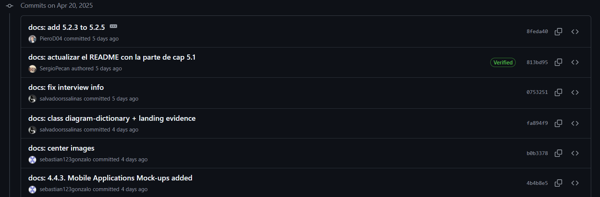


## TP1


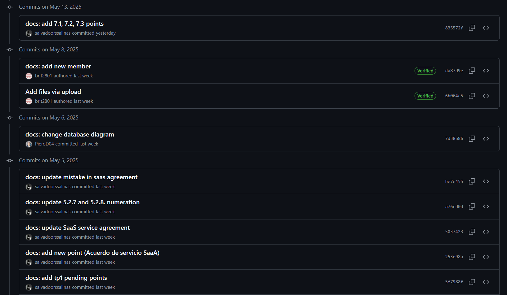


## TB2


<div style="page-break-after: always;"></div>

# Tabla de Contenido


[Registro de Versiones](#registro-de-versiones)

[Student Outcome](#student-outcome)

**Part I: As-Is Software Project**

[Capítulo I: Introducción](#Capítulo-I-Introducción)
  - [1.1. Startup Profile](#11-startup-profile)
    - [1.1.1. Descripción de la Startup](#111-descripción-de-la-startup)
    - [1.1.2. Perfiles de integrantes del equipo](#112-perfiles-de-integrantes-del-equipo)
  - [1.2. Solution Profile](#12-solution-profile)
    - [1.2.1. Antecedentes y problemática](#121-antecedentes-y-problemática)
    - [1.2.2. Lean UX Process](#122-lean-ux-process)
      - [1.2.2.1. Lean UX Problem Statements](#1221-lean-ux-problem-statements)
      - [1.2.2.2. Lean UX Assumptions](#1222-lean-ux-assumptions)
      - [1.2.2.3. Lean UX Hypothesis Statements](#1223-lean-ux-hypothesis-statements)
      - [1.2.2.4. Lean UX Canvas](#1224-lean-ux-canvas)
  - [1.3. Segmentos objetivo](#13-segmentos-objetivo)

[Capítulo II: Requirements Elicitation & Analysis](#Capítulo-II-Requirements-Elicitation--Analysis)
  - [2.1. Competidores](#21-competidores)
    - [2.1.1. Análisis competitivo](#211-análisis-competitivo)
    - [2.1.2. Estrategias y tácticas frente a competidores](#212-estrategias-y-tácticas-frente-a-competidores)
  - [2.2. Entrevistas](#22-entrevistas)
    - [2.2.1. Diseño de entrevistas](#221-diseño-de-entrevistas)
    - [2.2.2. Registro de entrevistas](#222-registro-de-entrevistas)
    - [2.2.3. Análisis de entrevistas](#223-análisis-de-entrevistas)
  - [2.3. Needfinding](#23-needfinding)
    - [2.3.1. User Personas](#231-user-personas)
    - [2.3.2. User Task Matrix](#232-user-task-matrix)
    - [2.3.3. User Journey Mapping](#233-user-journey-mapping)
    - [2.3.4. Empathy Mapping](#234-empathy-mapping)
    - [2.3.5. As-is Scenario Mapping](#235-as-is-scenario-mapping)
  - [2.4 Ubiquitous Language](#24-ubiquitous-language)

[Capítulo III: Requirements Specification](#Capítulo-III-Requirements-Specification)
  - [3.1. To-Be Scenario Mapping](#31-to-be-scenario-mapping)
  - [3.2. User Stories](#32-user-stories)
  - [3.3. Product Backlog](#33-product-backlog)
  - [3.4. Impact Mapping](#34-impact-mapping)

[Capítulo IV: Product Design](#Capítulo-IV-Product-Design)
  - [4.1. Style Guidelines](#41-style-guidelines)
    - [4.1.1. General Style Guidelines](#411-general-style-guidelines)
    - [4.1.2. Web Style Guidelines](#412-web-style-guidelines)
    - [4.1.3. Mobile Style Guidelines](#413-mobile-style-guidelines)
        - [4.1.3.1. iOS Mobile Style Guidelines](#4131-ios-mobile-style-guidelines)
        - [4.1.3.2. Android Mobile Style Guidelines](#4132-android-mobile-style-guidelines)
  - [4.2. Information Architecture](#42-information-architecture)
    - [4.2.1. Organization Systems](#421-organization-systems)
    - [4.2.2. Labeling Systems](#422-labeling-systems)
    - [4.2.3. SEO Tags and Meta Tags](#423-seo-tags-and-meta-tags)
    - [4.2.4. Searching Systems](#424-searching-systems)
    - [4.2.5. Navigation Systems](#425-navigation-systems)
  - [4.3. Landing Page UI Design](#43-landing-page-ui-design)
    - [4.3.1. Landing Page Wireframe](#431-landing-page-wireframe)
    - [4.3.2. Landing Page Mock-up](#432-landing-page-mock-up)
  - [4.4. Mobile Applications UX/UI Design](#44-mobile-applications-uxui-design)
    - [4.4.1. Mobile Applications Wireframes](#441-mobile-applications-wireframes)
    - [4.4.2. Mobile Applications Wireflow Diagrams](#442-mobile-applications-wireflow-diagrams)
    - [4.4.3. Mobile Applications Mock-ups](#443-mobile-applications-mock-ups)
    - [4.4.4. Mobile Applications User Flow Diagrams](#444-mobile-applications-user-flow-diagrams)
  - [4.5. Mobile Applications Prototyping](#45-mobile-applications-prototyping)
    - [4.5.1. Android Mobile Applications Prototyping](#451-android-mobile-applications-prototyping)
    - [4.5.2. iOS Mobile Applications Prototyping](#452-ios-mobile-applications-prototyping)
  - [4.6. Web Applications UX/UI Design](#46-web-applications-uxui-design)
    - [4.6.1. Web Applications Wireframes](#461-web-applications-wireframes)
    - [4.6.2. Web Applications Wireflow Diagrams](#462-web-applications-wireflow-diagrams)
    - [4.6.3. Web Applications Mock-ups](#463-web-applications-mock-ups)
    - [4.6.4. Web Applications User Flow Diagrams](#464-web-applications-user-flow-diagrams)
  - [4.7. Web Applications Prototyping](#47-web-applications-prototyping)
  - [4.8. Domain-Driven Software Architecture](#48-domain-driven-software-architecture)
    - [4.8.1. Software Architecture Context Diagram](#481-software-architecture-context-diagram)
    - [4.8.2. Software Architecture Container Diagrams](#482-software-architecture-container-diagrams)
    - [4.8.3. Software Architecture Components Diagrams](#483-software-architecture-components-diagrams)
  - [4.9. Software Object-Oriented Design](#49-software-object-oriented-design)
    - [4.9.1. Class Diagrams](#491-class-diagrams)
    - [4.9.2. Class Dictionary](#492-class-dictionary)
  - [4.10. Database Design](#410-database-design)
    - [4.10.1. Relational/Non-Relational Database Diagram](#4101-relationalnon-relational-database-diagram)

[Capítulo V: Product Implementation](#Capítulo-V-Product-Implementation)
  - [5.1. Software Configuration Management](#51-software-configuration-management)
    - [5.1.1. Software Development Environment Configuration](#511-software-development-environment-configuration)
    - [5.1.2. Source Code Management](#512-source-code-management)
    - [5.1.3. Source Code Style Guide & Conventions](#513-source-code-style-guide--conventions)
    - [5.1.4. Software Deployment Configuration](#514-software-deployment-configuration)
  - [5.2. Product Implementation & Deployment](#52-product-implementation--deployment)
    - [5.2.1. Sprint Backlogs](#521-sprint-backlogs)
    - [5.2.2. Implemented Landing Page Evidence](#522-implemented-landing-page-evidence)
    - [5.2.3. Implemented Frontend-Web Application Evidence](#523-implemented-frontend-web-application-evidence)
    - [5.2.4. Acuerdo de Servicio - SaaS](#524-acuerdo-de-servicio---saas)
    - [5.2.5. Implemented Native-Mobile Application Evidence](#525-implemented-native-mobile-application-evidence)
    - [5.2.6. Implemented RESTful API and/or Serverless Backend Evidence](#526-implemented-restful-api-andor-serverless-backend-evidence)
    - [5.2.7. RESTful API documentation](#527-restful-api-documentation)
    - [5.2.8. Team Collaboration Insights](#528-team-collaboration-insights)
  - [5.3. Video About-the-Product](#53-video-about-the-product)

**Part II: Verification, Validation & Pipeline**

[Capítulo VI: Product Verification & Validation](#Capítulo-VI-Product-Verification--Validation)
  - [6.1. Testing Suites & Validation](#61-testing-suites--validation)
    - [6.1.1. Core Entities Unit Tests](#611-core-entities-unit-tests)
    - [6.1.2. Core Integration Tests](#612-core-integration-tests)
    - [6.1.3. Core Behavior-Driven Development](#613-core-behavior-driven-development)
    - [6.1.4. Core System Tests](#614-core-system-tests)
  - [6.2. Static testing & Verification](#62-static-testing--verification)
    - [6.2.1. Static Code Analysis](#621-static-code-analysis)
        - [6.2.1.1. Coding standard & Code conventions](#6211-coding-standard--code-conventions)
        - [6.2.1.2. Code Quality & Code Security](#6212-code-quality--code-security)
    - [6.2.2. Reviews](#622-reviews)
  - [6.3. Validation Interviews](#63-validation-interviews)
    - [6.3.1. Diseño de Entrevistas](#631-diseño-de-entrevistas)
    - [6.3.2. Registro de Entrevistas](#632-registro-de-entrevistas)
    - [6.3.3. Evaluaciones según heurísticas](#633-evaluaciones-según-heurísticas)
  - [6.4. Auditoría de Experiencias de Usuario](#64-auditoría-de-experiencias-de-usuario)
    - [6.4.1. Auditoría realizada](#641-auditoría-realizada)
        - [6.4.1.1. Información del grupo auditado](#6411-información-del-grupo-auditado)
        - [6.4.1.2. Cronograma de auditoría realizada](#6412-cronograma-de-auditoría-realizada)
        - [6.4.1.3. Contenido de auditoría realizada](#6413-contenido-de-auditoría-realizada)
    - [6.4.2. Auditoría recibida](#642-auditoría-recibida)
        - [6.4.2.1. Información del grupo auditor](#6421-información-del-grupo-auditor)
        - [6.4.2.2. Cronograma de auditoría recibida](#6422-cronograma-de-auditoría-recibida)
        - [6.4.2.3. Contenido de auditoría recibida](#6423-contenido-de-auditoría-recibida)
        - [6.4.2.4. Resumen de modificaciones para subsanar hallazgos](#6424-resumen-de-modificaciones-para-subsanar-hallazgos)

[Capítulo VII: DevOps Practices](#Capítulo-VII-DevOps-Practices)
  - [7.1. Continuous Integration](#71-continuous-integration)
    - [7.1.1. Tools and Practices](#711-tools-and-practices)
    - [7.1.2. Build & Test Suite Pipeline Components](#712-build--test-suite-pipeline-components)
  - [7.2. Continuous Delivery](#72-continuous-delivery)
    - [7.2.1. Tools and Practices](#721-tools-and-practices)
    - [7.2.2. Stages Deployment Pipeline Components](#722-stages-deployment-pipeline-components)
  - [7.3. Continuous deployment](#73-continuous-deployment)
    - [7.3.1. Tools and Practices](#731-tools-and-practices)
    - [7.3.2. Production Deployment Pipeline Components](#732-production-deployment-pipeline-components)
  - [7.4. Continuous Monitoring](#74-continuous-monitoring)
    - [7.4.1. Tools and Practices](#741-tools-and-practices)
    - [7.4.2. Monitoring Pipeline Components](#742-monitoring-pipeline-components)
    - [7.4.3. Alerting Pipeline Components](#743-alerting-pipeline-components)
    - [7.4.4. Notification Pipeline Components](#744-notification-pipeline-components)

**Part III: Experiment-Driven Lifecycle**

[Capítulo VIII: Experiment-Driven Development](#Capítulo-VIII-Experiment-Driven-Development)
  - [8.1. Experiment Planning](#81-experiment-planning)
    - [8.1.1. As-Is Summary](#811-as-is-summary)
    - [8.1.2. Raw Material: Assumptions, Knowledge Gaps, Ideas, Claims](#812-raw-material-assumptions-knowledge-gaps-ideas-claims)
    - [8.1.3. Experiment-Ready Questions](#813-experiment-ready-questions)
    - [8.1.4. Question Backlog](#814-question-backlog)
    - [8.1.5. Experiment Cards](#815-experiment-cards)
  - [8.2. Experiment Design](#82-experiment-design)
    - [8.2.1. Hypotheses](#821-hypotheses)
    - [8.2.2. Measures](#822-measures)
    - [8.2.3. Conditions](#823-conditions)
    - [8.2.4. Scale Calculations and Decisions](#824-scale-calculations-and-decisions)
    - [8.2.5. Methods Selection](#825-methods-selection)
    - [8.2.6. Data Analytics: Goals, KPIs and Metrics Selection](#826-data-analytics-goals-kpis-and-metrics-selection)
    - [8.2.7. Web and Mobile Tracking Plan](#827-web-and-mobile-tracking-plan)
  - [8.3. Experimentation](#83-experimentation)
    - [8.3.1. To-Be User Stories](#831-to-be-user-stories)
    - [8.3.2. To-Be Product Backlog](#832-to-be-product-backlog)
    - [8.3.3. Pipeline-supported, Experiment-Driven To-Be Software Platform Lifecycle](#833-pipeline-supported-experiment-driven-to-be-software-platform-lifecycle)
        - [8.3.3.1. To-Be Sprint Backlogs](#8331-to-be-sprint-backlogs)
        - [8.3.3.2. Implemented To-Be Landing Page Evidence](#8332-implemented-to-be-landing-page-evidence)
        - [8.3.3.3. Implemented To-Be Frontend-Web Application Evidence](#8333-implemented-to-be-frontend-web-application-evidence)
        - [8.3.3.4. Implemented To-Be Native-Mobile Application Evidence](#8334-implemented-to-be-native-mobile-application-evidence)
        - [8.3.3.5. Implemented To-Be RESTful API and/or Serverless Backend Evidence](#8335-implemented-to-be-restful-api-andor-serverless-backend-evidence)
        - [8.3.3.6. Team Collaboration Insights](#8336-team-collaboration-insights)
    - [8.3.4. To-Be Validation Interviews](#834-to-be-validation-interviews)
        - [8.3.4.1. Diseño de Entrevistas](#8341-diseño-de-entrevistas)
        - [8.3.4.2. Registro de Entrevistas](#8342-registro-de-entrevistas)
  - [8.4. Experiment Aftermath & Analysis](#84-experiment-aftermath--analysis)
    - [8.4.1. Analysis and Interpretation of Results](#841-analysis-and-interpretation-of-results)
    - [8.4.2. Re-scored and Re-prioritized Question Backlog](#842-re-scored-and-re-prioritized-question-backlog)
  - [8.5. Continuous Learning](#85-continuous-learning)
    - [8.5.1. Shareback Session Artifacts: Learning Workflow](#851-shareback-session-artifacts-learning-workflow)
  - [8.6. To-Be Software Platform Pre-launch](#86-to-be-software-platform-pre-launch)
    - [8.6.1. About-the-Product Intro Video](#861-about-the-product-intro-video)

[Conclusiones](#conclusiones)
  - [Conclusiones y Recomendaciones](#conclusiones-y-recomendaciones)
  - [Video About the Team](#video-about-the-team)

[Bibliografía](#bibliografía)

[Anexos](#anexos)

# Student Outcome

**ABET – EAC - Student Outcome 4**

**Criterio:** La capacidad de reconocer responsabilidades éticas y profesionales en situaciones de ingeniería y hacer juicios informados, que deben considerar el impacto de las soluciones de ingeniería en contextos globales, económicos, ambientales y sociales.

<table style="border-collapse: collapse; width: 100%;">
  <thead style="background-color: #f2f2f2;">
    <tr>
      <th style="border: 1px solid #000; padding: 8px;"><strong>Criterio específico</strong></th>
      <th style="border: 1px solid #000; padding: 8px;"><strong>Acciones realizadas</strong></th>
      <th style="border: 1px solid #000; padding: 8px;"><strong>Conclusiones</strong></th>
    </tr>
  </thead>
  <tbody>
    <tr style="page-break-inside: avoid;">
      <td style="border: 1px solid #000; padding: 8px;">4.c.1 Reconoce responsabilidad ética y profesional en situaciones de ingeniería de software</td>
      <td style="border: 1px solid #000; padding: 8px;">
        <p><strong>Delgado Corrales, Piero Gonzalo</strong></p>
        <p><strong>TB1:</strong> Para esta entrega, participé activamente en la elaboración del informe en apartados como el solution profile, el lean ux process y needfinding. Además, me aseguré de mantener integridad en la información presentada.</p>
        <p><strong>TP:</strong> Para esta entrega, participé activamente en la elaboración de las pruebas de integración y BDD para validar la funcionalidad del Backend.</p>
        <p><strong>TB2:</strong> Para esta entrega, elaboré mejoras al capitulo 7, enfocándome en la parte de los componentes de integracion, entrega y despliegue continuo asegurandome su correcta implementación.</p>
        <p><strong>Paredes Puente, Sebastian Roberto</strong></p>
        <p><strong>TB1:</strong> Para esta entrega, participé principalmente en la sección de la aplicación móvil, enfocándome en los wireframes, wireflows, mock-ups y user flows. Fui responsable del desarrollo de la parte móvil como desarrollador móvil del equipo, aportando evidencias del funcionamiento y asegurando una experiencia fluida para el usuario.</p>
        <p><strong>TP:</strong> A lo largo de este trabajo, he planteado soluciones tecnológicas centradas en la temática del proyecto. En este proceso, he reconocido mi responsabilidad ética y profesional como futuro ingeniero de software</p>
        <p><strong>TB2:</strong> Para este proyecto investigué y aprendí sobre la entrega continua usando GitHub Actions y pipelines. Entendí la responsabilidad ética que implica automatizar procesos que impactan la calidad del software y cómo estas decisiones afectan contextos sociales, económicos y tecnológicos.</p>
        <p><strong>La torre Soto, André Sebastian</strong></p>
        <p><strong>TB1:</strong> Para esta entrega, participé mayormente en la elaboración del informe en puntos como el registro de entrevistas, el desarrollo del modelo C4 y la revisión de los diversos puntos del entregable para verificar que todo esté de acuerdo a las normativas del trabajo.</p>
        <p><strong>TP:</strong> Para esta entrega, participé en la elaboración de las pruebas de integración y BDD del backend.</p>
        <p><strong>TB2:</strong> Para esta entrega, participé en la implementación y validación de los componentes de integración continua, enfocándome especialmente en el desarrollo de pruebas de integración. Estas pruebas permitieron verificar la correcta interacción entre los distintos módulos del sistema, asegurando que el flujo de datos y funcionalidades se mantuviera consistente a lo largo del pipeline. Para ello, me apoyé tanto en los conocimientos adquiridos en clase como en material complementario investigado de forma autónoma.</p>
        <p><strong>Pecan Pariona, Sergio Joel</strong></p>
        <p><strong>TB1:</strong> Asumí un rol clave desde las primeras etapas del proyecto, liderando las entrevistas iniciales para entender el contexto de los usuarios. También fui responsable del dimensionamiento del sistema y de establecer la estructura general del proyecto, asegurándome de mantener la coherencia técnica y ética a lo largo del desarrollo.</p>
        <p><strong>TP:</strong> Durante el desarrollo del proyecto, asumí la responsabilidad ética y profesional de garantizar la calidad del sistema mediante la implementación de pruebas unitarias rigurosas.</p>
        <p><strong>TB2:</strong> En esta entrega, me encargué de supervisar la correcta integración de los componentes del sistema y de asegurar que las prácticas de entrega continua fueran implementadas de manera responsable. Consideré el impacto técnico y organizacional de cada decisión, promoviendo buenas prácticas de documentación, validación automatizada y despliegue seguro.</p>
        <p><strong>Salinas Torres, Salvador Antonio</strong></p>
        <p><strong>TB1:</strong> Me aseguré de comprender profundamente las necesidades reales de los usuarios mediante entrevistas y procesos de needfinding. Utilicé enfoques como Lean UX y diseño centrado en el usuario para garantizar soluciones útiles y responsables. Seguí buenas prácticas de modelado de datos y arquitectura (C4 Model), documentación clara (Product backlog) asegurando la calidad, seguridad y mantenibilidad del sistema</p>
        <p><strong>TP:</strong> En esta entrega parcial, apoyé en el desarollo de las pruebas dentro del Backend, los cuales fueron de mucha utilidad para determinar que nuestra solución esté funcionando de forma esperada, garantizando integridad y seguridad de datos.</p>
        <p><strong>TB2:</strong> En esta entrega, apoyé en el desarrollo de las prácticas DevOps, las cuales incluyen la integración continua, entrega continua, entre otras; así como en el desarrollo basado en experimentos. Para ello, usé los conocimientos aprendidos en clase y investigación autónoma.</p>
        <p><strong>Qqueso Rodriguez, Britney Delhy</strong></p>
        <p><strong>TP:</strong> En esta entrega, asumí una participación activa en la redacción del informe técnico, asegurando una comunicación clara y profesional. Asimismo, colaboré en el desarrollo y ejecución de pruebas en el Backend, respetando los principios éticos de calidad y responsabilidad en el proceso de validación del software.</p>
        <p><strong>TB2:</strong>En este entregable, apoye al documentar una entrevista de validación, entre otros artefactos, apliqué los conocimientos adquiridos en el curso, para asegurar un enfoque ético y profesional en el desarrollo.</p>
      </td>
      <td style="border: 1px solid #000; padding: 8px;">
        <p><strong>TB1:</strong> Como equipo, cada integrante aportó desde sus fortalezas para desarrollar una solución sólida, ética y centrada en el usuario. Desde la conducción de entrevistas y el proceso de needfinding, hasta el diseño de wireframes y la arquitectura técnica con modelos C4, demostramos un compromiso compartido con la calidad, la coherencia y el impacto responsable del proyecto. La colaboración efectiva y el enfoque en el usuario guiaron nuestras decisiones, permitiéndonos construir una aplicación funcional y alineada con principios profesionales y éticos de la ingeniería de software.</p>
        <p><strong>TP1:</strong> Como equipo, demostramos un fuerte compromiso con la responsabilidad ética y profesional durante todo el desarrollo del proyecto. Cada integrante aportó desde su rol, asegurando integridad en la información, calidad técnica y un enfoque centrado en el usuario. La elaboración de pruebas de integración y BDD, junto con la rigurosidad en las pruebas unitarias, garantizaron la confiabilidad y seguridad del sistema.</p>
        <p><strong>TB2:</strong> En esta entrega se fortalecieron las prácticas de integración, entrega y despliegue continuo, implementando pruebas, pipelines y automatizaciones responsables con GitHub Actions. Se aplicaron conocimientos técnicos y éticos adquiridos en clase y por investigación autónoma, promoviendo buenas prácticas de documentación, validación y despliegue seguro dentro del enfoque DevOps.</p>
      </td>
    </tr>
    <tr style="page-break-inside: avoid;">
      <td style="border: 1px solid #000; padding: 8px;">4.c.2 Emite juicios informados considerando el impacto de las soluciones de ingeniería de software en contextos globales, económicos, ambientales y sociales</td>
      <td style="border: 1px solid #000; padding: 8px;">
        <p><strong>Delgado Corrales, Piero Gonzalo</strong></p>
        <p><strong>TB1:</strong> Para esta entrega, analicé el impacto del proyecto en la agricultura local mediante el análisis de las entrevistas. Además, consideré el contexto económico y social de los usuarios al plantear funcionalidades que se adapten a sus necesidades.</p>
        <p><strong>TP:</strong> Para esta entrega, analicé las herramientas y procesos necesarios para el continuous deployment, delivery y monitoring.</p>
        <p><strong>TB2:</strong> Para esta entrega, analicé nuevas herramientas de integración continua y entrega continua, evaluando nuestras capacidades de implementación para asegurar una implementación factible para el equipo y el proyecto.</p>
        <p><strong>Paredes Puente, Sebastian Roberto</strong></p>
        <p><strong>TB1:</strong> Para esta entrega, analicé cómo la aplicación impacta positivamente en el contexto social y económico de los granjeros, al facilitarles el acceso a asesorías técnicas confiables desde sus dispositivos móviles. Consideré las limitaciones tecnológicas y económicas de las zonas rurales, desarrollando una solución ligera y accesible que contribuye al desarrollo sostenible de la agricultura local.</p>
        <p><strong>TP:</strong> En esta etapa del proyecto, he explorado e investigado distintas tecnologías como JUnit 5, que podrían ser útiles para nuestra solución. Al hacerlo, he procurado emitir juicios informados, evaluando no solo la viabilidad técnica, sino también el impacto económico, social y ambiental que estas decisiones podrían tener.</p>
        <p><strong>TB2:</strong> En este proyecto comprendí la importancia de tomar decisiones conscientes al aplicar herramientas de integración y entrega continua, como GitHub Actions, valorando cómo estas soluciones de software pueden influir en el entorno global, económico y social.</p>
        <p><strong>La torre Soto, André Sebastian</strong></p>
        <p><strong>TB1:</strong> Para esta entrega, identifiqué mediante las entrevistas las condiciones reales del entorno y los desafíos que enfrentan los actores involucrados. Con base en esa información, elaboré un modelo C4 que nos permitió visualizar la propuesta en distintos niveles de abstracción, facilitando un análisis crítico sobre cómo nuestro proyecto podría influir en dimensiones como la equidad social, el uso responsable de recursos, el acceso tecnológico y la dinámica económica de las comunidades involucradas.</p>
        <p><strong>TP:</strong> Para esta entrega, desarrolle e implemente pruebas unitarias para verificar el funcionamiento de cada componente del sistema. Empleé herramientas como JUnit 5 y Mockito para simular dependencias a través de mocks, lo que facilitó evaluar clases y métodos clave de forma aislada. </p>
        <p><strong>TB2:</strong> Para esta entrega, realice las respectivas entrevistas de validacion y el desarrollo de diversas pruebas de integracion para nuestro proyecto. Estas fueron de gran utilidad para mejorar nuestro producto con los datos recopilados en la entrevista y asegurar el correcto funcionamiento de los diversos componentes de este.</p>
        <p><strong>Pecan Pariona, Sergio Joel</strong></p>
        <p><strong>TB1:</strong> Desde el inicio del proyecto, enfoqué mis esfuerzos en comprender el entorno socioeconómico de los usuarios a través de entrevistas y análisis contextual. Esto me permitió dimensionar adecuadamente el sistema y proponer una estructura tecnológica que se alinee con las condiciones reales de las zonas rurales, contribuyendo así a una solución viable, inclusiva y de alto impacto social.</p>
        <p><strong>TP:</strong> Realicé En el proyecto, me encargué de desarrollar y ejecutar pruebas unitarias para validar el comportamiento correcto de los componentes individuales del sistema. Utilicé JUnit 5 y Mockito para asegurar que cada clase y método clave funcionaran de forma aislada, simulando dependencias mediante mocks. Estas pruebas permitieron detectar errores tempranos y garantizar que la lógica de negocio cumpliera con los requisitos establecidos. </p>
        <p><strong>TB2:</strong> Para esta entrega, analicé cómo la implementación de procesos automatizados como CI/CD puede escalar nuestras soluciones sin perder de vista su impacto en entornos rurales con limitaciones tecnológicas. Evalué alternativas ligeras y eficientes, considerando la sostenibilidad de los despliegues en contextos de baja conectividad y recursos limitados. </p>
        <p><strong>Salinas Torres, Salvador Antonio</strong></p>
        <p><strong>TB1:</strong> Desarrollamos una app web y móvil utilizando entrevistas, prototipos y modelado, lo cual ayudó a tomar decisiones informadas, comprendí que una solución accesible y eficiente no solo mejora la experiencia del usuario, sino que también reduce barreras sociales, costos y el impacto ambiental.</p>
        <p><strong>TP:</strong>  Realicé la indagación acerca de las herramientas y practicas a utilizar para las DevOps Practices, considerando la integración continua, entrega continua y despliegue continuo.</p>
        <p><strong>TB2:</strong> En esta entrega, se realizaron las entrevistas de validación y las evaluaciones según heurísticas. Estas fueron de mucha utilidad para seguir mejorando nuestro producto a partir de las ideas que nos brinda nuestros segmentos objetivo.</p>
        <p><strong>Qqueso Rodriguez, Britney Delhy</strong></p>
        <p><strong>TP:</strong>  En esta entrega, realicé el análisis y la selección de herramientas y procesos adecuados para implementar las pruebas, considerando su viabilidad técnica y su impacto en el rendimiento del sistema, la eficiencia operativa y la sostenibilidad del proyecto en distintos contextos sociales y económicos.</p>
        <p><strong>TB2:</strong> En esta entrega, llevamos a cabo entrevistas de validación con los segmentos objetivo, las cuales nos permitieron identificar áreas de mejora en nuestro producto. Esto fue clave para tomar decisiones de mejora alineadas con las necesidades de los usuarios</p>
      </td>
      <td style="border: 1px solid #000; padding: 8px;">
        <p><strong>TB1:</strong> Como equipo, demostramos un enfoque crítico y consciente al evaluar el impacto de nuestra solución tecnológica en contextos reales. A través del análisis de entrevistas, diseño accesible y modelado arquitectónico, consideramos factores sociales, económicos y ambientales que afectan directamente a las comunidades rurales. Esto nos permitió diseñar una aplicación viable, inclusiva y sostenible, comprometida con el desarrollo equitativo y con decisiones informadas que buscan generar un cambio positivo en la agricultura local.</p>
        <p><strong>TP1:</strong> Durante el proyecto, realizamos un análisis profundo del contexto socioeconómico y ambiental de los usuarios, lo cual orientó el diseño y desarrollo de la solución. Consideramos las limitaciones tecnológicas y económicas de las zonas rurales para crear una aplicación accesible, ligera y escalable que promueva prácticas agrícolas sostenibles y fomente la inclusión social. La selección de arquitecturas y tecnologías se enfocó en la eficiencia, mantenibilidad y reducción de residuos tecnológicos.</p>
        <p><strong>TB2:</strong> En esta entrega se combinaron el análisis técnico y la validación con usuarios para fortalecer la integración y entrega continua del proyecto. Se evaluaron herramientas como GitHub Actions y su viabilidad en contextos con limitaciones tecnológicas, priorizando soluciones sostenibles. Las entrevistas de validación y pruebas de integración permitieron mejorar el producto con base en datos reales, garantizando su funcionalidad y adecuación a las necesidades del usuario.</p>
      </td>
    </tr>
  </tbody>
</table>

<div style="page-break-after: always;"></div>

# Capítulo I: Introducción
## 1.1. Startup Profile
### 1.1.1. Descripción de la Startup

Nuestra startup se llama Innovatech y está enfocada en resolver los retos de la gestión agrícola mediante nuestro producto AgroTech, una aplicación integral que ofrece soluciones tecnológicas y asesoría especializada para optimizar el manejo de las granjas de forma inteligente y eficiente.

**Misión:**
Facilitar el acceso de los agricultores a asesoramiento experto, impulsando prácticas agrícolas sostenibles y modernas que incrementen la productividad, rentabilidad y el desarrollo de las comunidades rurales.

**Visión:**
Ser referentes en innovación tecnológica para el sector agropecuario, promoviendo la sostenibilidad y el bienestar animal a través de herramientas accesibles y efectivas.

**Logo de AgroTech**
<p align="center">
  
</p>

_Imagen 1. Logo de AgroTech_

### 1.1.2. Perfiles de integrantes del equipo

<table>
  <tr>
    <td>
      
    </td>
    <td valign="top">
      <p><b>Delgado Corrales, Piero Gonzalo</b></p>
      <p>
        Soy estudiante de séptimo ciclo de Ingeniería de Software, con experiencia en diseño web empleando HTML y CSS, además del uso de Figma para elaborar prototipos. He trabajado con diversos frameworks tanto de frontend (Vue, Angular y React) como de backend (Spring Boot, .NET y Django). Me considero una persona responsable y organizada, comprometida con una gestión eficiente del tiempo.
      </p>
    </td>
  </tr>
  <tr>
    <td>
      
    </td>
    <td valign="top">
      <p><b>Salinas Torres, Salvador Antonio</b></p>
      <p>
        Soy Salvador y actualmente curso el séptimo ciclo de la carrera de Ingeniería de Software. Poseo conocimientos en: programación orientada a objetos en C++, Python, C# y Java; desarrollo de Frontend Web con frameworks de Angular y Vue; desarrollo de backend con frameworks de Spring Boot y .NET; desarrollo móvil con Kotlin y Dart; gestión de base de datos en SQL Server, MySQL y SQLite. Considero que soy una persona responsable y siempre organizo el tiempo para hacerlos tranquilamente antes de la fecha de entrega.
      </p>
    </td>
  </tr>
  <tr>
    <td>
      
    </td>
    <td valign="top">
      <p><b>Paredes Puente, Sebastian Roberto</b></p>
      <p>
        Soy Sebastian, estudiante del séptimo ciclo de Ingeniería de Software. A lo largo de mi formación he adquirido experiencia trabajando con diversos lenguajes como C++, Python, C# y Java, aplicando principios de programación orientada a objetos. Además, he desarrollado proyectos web utilizando Angular y Vue para el frontend, y he implementado servicios backend con Spring Boot y .NET. También he explorado el desarrollo móvil con Kotlin y Dart, y tengo manejo de bases de datos como SQL Server, MySQL y SQLite. 
      </p>
    </td>
  </tr>
  <tr>
    <td>
      
    </td>
    <td valign="top">
      <p><b>Pecan Pariona, Sergio Joel</b></p>
      <p>
        Sergio es estudiante del 7mo ciclo de Ingeniería de Software en la UPC. Tiene conocimientos en desarrollo web, bases de datos y metodologías ágiles. A lo largo de su formación, ha trabajado con herramientas como Git, Docker y Jenkins, participando en diversos proyectos académicos que le han permitido fortalecer sus habilidades técnicas y de trabajo en equipo. Le interesa seguir aprendiendo y ganar experiencia en el campo del desarrollo de software.
      </p>
    </td>
  </tr>
  <tr>
    <td>
      
    </td>
    <td valign="top">
      <p><b>La Torre Soto, André Sebastian</b></p>
      <p>
        Soy André Sebastián La Torre Soto, actualmente me encuentro en el séptimo ciclo de la carrera de Ingeniería de Software. Durante mi transcurso en la universidad he logrado aprender acerca de varios lenguajes y herramientas como pueden ser Python, C++, JavaScript, SQL, desarrollo web y móvil. Elegí esta carrera por mi afinidad con las matemáticas y las nuevas tecnologías. Soy alguien que disfruta el aprender y mejorar lo aprendido, a pesar de que esto a veces resulte difícil. Espero poder aportar de manera positiva en este grupo para que juntos todos podamos alcanzar nuestras metas.
      </p>
    </td>
  </tr>
  <tr>
    <td>
      
    </td>
    <td valign="top">
      <p><b>Qqueso Rodriguez, Britney Delhy</b></p>
      <p>
        Soy estudiante de la carrera de Ingeniería de Software en la Universidad Peruana de Ciencias Aplicadas (UPC). Me considero una persona autodidacta, dedicada, creativa y responsable. Cuento con experiencia en liderazgo y trabajo en equipo, y disfruto aprendiendo tanto de las personas como de las tecnologías con las que colaboro. Poseo conocimientos en diversos lenguajes de programación, como Python, HTML, CSS, JavaScript, entre otros.
      </p>
    </td>
  </tr>
</table>

## 1.2. Solution Profile
### 1.2.1. Antecedentes y problemática

**5 W’s**

**What:** Una parte del sector agropecuario enfrenta dificultades en la gestión eficaz de las granjas, acceso limitado a tecnología adecuada, y la necesidad de mejorar tanto el bienestar animal como la sostenibilidad en sus prácticas.

**Where:** El enfoque será a nivel nacional, con especial atención en las regiones del Perú con mayor actividad económica y comercial en el rubro agropecuario.

**When:** Actualmente, el sector agrícola enfrenta estos retos. El crecimiento poblacional y la creciente demanda de alimentos exigen una producción más eficiente. Además, las preocupaciones ambientales exigen buscar prácticas más sostenibles.

**Who:** Los principales beneficiarios son los granjeros, quienes recibirán soluciones adaptadas a su contexto. También participan asesores especializados que aportan su experiencia para apoyar a los agricultores en la toma de decisiones informadas.

**Why:** Es crucial enfrentar estos retos para mejorar la productividad y sostenibilidad de las granjas, garantizar el bienestar animal, y aumentar la rentabilidad de los agricultores, contribuyendo así a la seguridad alimentaria del país.

**2 H's**

**How:** Se resolverá a través de AgroTech, una aplicación web y móvil que brinda asesoramiento, ayudando a los granjeros a gestionar sus granjas con mayor eficiencia, impulsando así su producción y rentabilidad.

**How Much:** Se proyecta un impacto positivo en la eficiencia de las granjas, elevando la productividad y fomentando prácticas sostenibles en el sector.
De acuerdo con Ames (2022), el agro representa cerca del 27.5% del empleo nacional, pero solo aporta un 5.2% al PBI, lo que evidencia una baja productividad frente a otros países de la región. Esto se traduce en menores ingresos para los agricultores y mayor vulnerabilidad ante el clima y los mercados globales.

### 1.2.2. Lean UX Process
#### 1.2.2.1. Lean UX Problem Statements

**Problem Statement 1**  
| Nuestro producto busca optimizar la gestión de granjas en el Perú. |
|:--|
| Hemos identificado que gran parte de los agricultores en el país enfrentan dificultades al administrar eficientemente sus granjas, lo que impacta negativamente en su productividad y ganancias. |
| ¿Puede nuestra aplicación AgroTech ser una solución efectiva para mejorar la gestión agrícola y elevar la productividad de los granjeros peruanos? |

**Problem Statement 2**  
| Nuestro producto busca incrementar la rentabilidad de los agricultores en el Perú. |
|:--|
| Detectamos que gran parte de los granjeros en el Perú enfrentan obstáculos para alcanzar una rentabilidad constante, principalmente por una gestión ineficiente de sus granjas. |
| ¿Podría AgroTech ser la herramienta que los granjeros necesitan para optimizar sus procesos y mejorar sus ingresos? |

**Problem Statement 3**  
| Nuestro producto busca ofrecer asesoría técnica especializada a los granjeros peruanos. |
|:--|
| Observamos que acceder a orientación profesional en gestión agrícola sigue siendo un reto para muchos productores. |
| ¿De qué manera AgroTech puede facilitar el acceso a asesoramiento experto que impulse una mejor gestión de las granjas? |

#### 1.2.2.2. Lean UX Assumptions

**1. ¿Quién es el usuario?**
El usuario principal es el agricultor con poca experiencia, quien se beneficiará del acompañamiento de asesores especializados que emplean la plataforma para guiarlo en la administración efectiva de su granja. AgroTech facilita la adopción de técnicas sostenibles y contribuye al incremento de la productividad en el sector agrícola.

**2. ¿Dónde encaja nuestro producto en su trabajo o vida?**
AgroTech se integra en la rutina del agricultor al brindar orientación técnica especializada que mejora la gestión de sus actividades diarias. La plataforma se convierte en una aliada constante al proporcionar herramientas para una administración eficiente, mejorar el cuidado de cultivos y animales, implementar prácticas responsables y facilitar la comercialización.

**3. ¿Qué problemas busca resolver nuestro producto?**
El rubro agropecuario presenta múltiples retos como el limitado acceso a conocimientos técnicos y la falta de asesoría especializada. Estas carencias afectan a los agricultores al dificultar prácticas clave como el manejo de suelos, el uso racional de recursos hídricos y fertilizantes, y el control de plagas. Esto genera baja productividad, mayores gastos operativos y compromete la sostenibilidad, reduciendo la competitividad del país y afectando su economía.

**4. ¿Cuándo y cómo se usa nuestro producto?**
AgroTech es una herramienta clave para mejorar la eficiencia operativa, acceder a asesoramiento en tiempo real e implementar prácticas sostenibles. Está diseñada para agricultores con poca experiencia que requieren asistencia en la gestión diaria. Puede usarse desde dispositivos móviles o computadoras, permitiendo el acceso a cualquier hora tanto por parte de los productores como de los asesores.

**5. ¿Qué características son importantes?**

- Proporcionar recomendaciones personalizadas y detalladas sobre la gestión de granjas, abarcando áreas clave como el manejo de recursos, bienestar animal y cultivo, y la implementación de prácticas sostenibles.

- Asegurar que los usuarios reciban asesoramiento en tiempo real, adaptado a sus necesidades específicas y permitiendo una evolución constante en la gestión de sus granjas.

**6. ¿Cómo debe lucir y comportarse nuestro producto?**
AgroTech debe contar con una interfaz intuitiva y atractiva visualmente. Su desempeño debe ser ágil, brindando información útil de forma clara. La seguridad es clave, garantizando la confidencialidad de los datos del usuario.

**Presentación de otros supuestos:**

<table border="1">
  <tr>
    <td>Considero que mis clientes necesitan una solución integral para gestionar sus actividades agropecuarias, incluyendo el bienestar de animales y cultivos, reproducción y comercialización. Planeo generar ingresos mediante suscripciones a la plataforma AgroTech.</td>
    <td>Estas necesidades pueden ser atendidas con tecnología de monitoreo y análisis, junto con el soporte de especialistas que ofrezcan orientación personalizada.</td>
  </tr>
  <tr>
    <td>Mi principal competidor en el mercado es BestFarm.</td>
    <td>Mis clientes iniciales serán agricultores del Perú que buscan hacer más rentables y eficientes sus operaciones.</td>
  </tr>
  <tr>
    <td>AgroTech enfrentará los retos del sector al conectar expertos con productores inexpertos, proporcionando conocimientos prácticos y soluciones adaptadas a distintas áreas de producción.</td>
    <td>El mayor valor que nuestros clientes buscan es incrementar la rentabilidad de sus granjas, cuidando al mismo tiempo el bienestar de cultivos y animales, con un enfoque sostenible.</td>
  </tr>
  <tr>
    <td>El mayor desafío es la resistencia al cambio por parte de ciertos agricultores, quienes podrían mostrarse escépticos ante nuevas formas de trabajo.</td>
    <td>Existe el riesgo de que los clientes no renueven su suscripción si no perciben mejoras reales en la gestión de sus granjas.</td>
  </tr>
  <tr>
    <td>Esto se abordará con una estrategia educativa y de acompañamiento continuo, demostrando el impacto de AgroTech a través de resultados concretos y casos exitosos.</td>
    <td>Captaré a la mayoría de mis clientes mediante marketing digital dirigido, presencia en eventos agrícolas y alianzas con instituciones del sector.</td>
  </tr>
  <tr>
    <td>El eje principal de AgroTech es brindar asesoramiento técnico especializado mediante soluciones inteligentes que potencien la productividad y sostenibilidad en la agricultura.</td>
  </tr>
</table>

#### 1.2.2.3 Lean UX Hypothesis Statements

**Hypothesis Statement 1**

| Creemos que al ofrecer a los agricultores con poca experiencia en Perú acceso a tecnologías de vanguardia y asesoría especializada mediante AgroTech, se logrará una mejora en la eficiencia y rentabilidad de sus granjas. |
| - |
| Sabremos que esto es cierto… |
| Cuando se registre un aumento del 20% en la cantidad de solicitudes de asesoría durante los primeros 6 meses tras el lanzamiento. |

**Hypothesis Statement 2**

| Creemos que al fomentar la adopción de prácticas agrícolas responsables y sostenibles en el sector agropecuario de Perú a través de AgroTech, los agricultores adoptarán un enfoque más consciente del medio ambiente. |
| - |
| Sabremos que esto es cierto… |
| Cuando proporcionemos orientación y recursos enfocados en prácticas sostenibles a través de AgroTech y observemos un incremento del 15% en la implementación de estas prácticas en los primeros 6 meses tras el lanzamiento. |

**Hypothesis Statement 3**

| Creemos que al introducir una nueva estructura de comisiones para los asesores en AgroTech, se incrementará tanto el número de asesores activos como su nivel de satisfacción. |
| - |
| Sabremos que esto es cierto… |
| Cuando veamos un incremento del 20% en el número de asesores activos dentro de los primeros tres meses tras la implementación de la nueva estructura de comisiones. Además, mediremos la retroalimentación de los asesores a través de encuestas regulares, y consideraremos que hemos tenido éxito si al menos el 70% de las respuestas son positivas en relación con la nueva estructura de comisiones. |

#### 1.2.2.4. Lean UX Canvas. 


_Imagen 2. Lean UX Canvas_

## 1.3. Segmentos objetivo

**1. Agricultores con poca experiencia**

Los agricultores con poca experiencia en Perú enfrentan desafíos para gestionar eficientemente sus fincas debido a la falta de conocimientos y recursos. Esto reduce la productividad y rentabilidad. AgroTech ofrece herramientas avanzadas y asesoría especializada para mejorar la gestión, optimizar recursos y aumentar la rentabilidad, contribuyendo a una agricultura más sostenible.

|**Segmento objetivo**|Agricultores con poca experiencia|
| :- | :- |
|**Edad**|18-40 años|
|**Ubicación**|Perú|
|**Sexo**|Masculino y Femenino|
|**Formación educativa**|Educación primaria|
|**Poder adquisitivo**|Bajo y medio|

**2. Asesores con experiencia**

Los asesores con experiencia son claves en el sector agropecuario, brindando orientación técnica y operativa a los productores. AgroTech les permite ampliar su alcance y gestionar sus asesorías de manera eficiente, mejorando la productividad y sostenibilidad de las granjas. Esto refuerza su rol como facilitadores clave en el desarrollo del sector.

|**Segmento objetivo**|Asesores con experiencia|
| :- | :- |
|**Edad**|22-60 años|
|**Ubicación**|Perú|
|**Sexo**|Masculino y Femenino|
|**Formación educativa**|Universitaria o superior|
|**Poder adquisitivo**|Bajo, medio y alto|

<div style="page-break-after: always;"></div>

# Capítulo II: Requirements Elicitation & Analysis
## 2.1. Competidores
### 2.1.1. Análisis competitivo

<table border="1" cellpadding="10" cellspacing="0">
  <tr>
    <th colspan="6" valign="top"><b>Competitive Analysis Landscape</b></th>
  </tr>
  <tr>
    <td rowspan="1" valign="top"><b>¿Por qué llevar a cabo este análisis?</b></td>
    <td colspan="5" valign="top">
      <ul>
        <li>Objetivo 1: Obtener información sobre las ofertas de nuestros competidores y aprender de las áreas en las que tienen limitaciones.</li>
        <li>Objetivo 2: Reconocer las fortalezas y debilidades de nuestros competidores para desarrollar una estrategia competitiva robusta y eficaz.</li>
      </ul>
    </td>
  </tr>
  <tr>
    <td colspan="2" valign="top"><b>(En la cabecera colocar por cada competidor nombre y logo)</b></td>
    <td valign="top">
      <p><b>AgroTech</b></p>
      <p></p>
    </td>
    <td valign="top">
      <p><b>BestFarm</b></p>
      <p></p>
    </td>
    <td valign="top">
      <p><b>AgriWebb</b></p>
      <p></p>
    </td>
    <td valign="top">
      <p><b>Trimble Ag</b></p>
      <p></p>
    </td>
  </tr>
  <tr>
    <td rowspan="2"><b>Perfil</b></td>
    <td valign="top"><b>Overview</b></td>
    <td valign="top"><b>AgroTech</b> es una plataforma completa que ofrece orientación experta y soluciones tecnológicas para optimizar la gestión de granjas de forma eficiente y sostenible.</td>
    <td valign="top"><b>BestFarm</b> es una plataforma digital diseñada para la gestión integral de granjas agrícolas y ganaderas.</td>
    <td valign="top"><b>AgriWebb</b> es una plataforma digital con enfoque en la trazabilidad del ganado y la productividad agrícola.</td>
    <td valign="top"><b>Trimble Ag</b> ofrece soluciones avanzadas para la gestión de fincas, incluyendo planificación de cultivos y monitoreo de recursos.</td>
  </tr>
  <tr>
    <td valign="top"><b>Ventaja competitiva</b><br>¿Qué valor ofrece a los clientes?</td>
    <td valign="top"><b>AgroTech</b> conecta a agricultores novatos con expertos para mejorar la productividad y sostenibilidad.</td>
    <td valign="top"><b>BestFarm</b> destaca por su simplicidad y accesibilidad, integrando cultivos y ganado en una sola plataforma.</td>
    <td valign="top"><b>AgriWebb</b> sobresale por su trazabilidad y captura de datos en tiempo real.</td>
    <td valign="top"><b>Trimble Ag</b> integra múltiples fuentes de datos y proporciona una visión completa de la finca.</td>
  </tr>
  <tr>
    <td rowspan="2"><b>Perfil de Marketing</b></td>
    <td valign="top"><b>Mercado objetivo</b></td>
    <td valign="top">Granjeros con poca experiencia y aquellos que buscan optimizar la gestión de sus granjas.</td>
    <td valign="top">Agricultores y ganaderos que buscan una solución integral para sus fincas.</td>
    <td valign="top">Ganaderos y agricultores que desean eficiencia y trazabilidad.</td>
    <td valign="top">Agricultores de tamaño medio a grande que requieren soluciones integradas.</td>
  </tr>
  <tr>
    <td valign="top"><b>Estrategias de marketing</b></td>
    <td valign="top">Marketing digital dirigido, colaboraciones agrícolas y eventos del sector.</td>
    <td valign="top">Campañas digitales, demostraciones y alianzas con distribuidores.</td>
    <td valign="top">Marketing digital, talleres educativos y cooperación con organizaciones.</td>
    <td valign="top">Ferias agrícolas, marketing digital y asociaciones tecnológicas.</td>
  </tr>
  <tr>
    <td rowspan="3"><b>Perfil de Producto</b></td>
    <td valign="top"><b>Productos & Servicios</b></td>
    <td valign="top">Asesoramiento especializado mediante app web y móvil.</td>
    <td valign="top">Software de gestión con planificación, recursos y monitoreo animal.</td>
    <td valign="top">Software de fincas con trazabilidad, salud animal y cultivos.</td>
    <td valign="top">Software agrícola y ganadero con planificación y análisis de datos.</td>
  </tr>
  <tr>
    <td valign="top"><b>Precios & Costos</b></td>
    <td valign="top">Modelo de suscripción mensual o anual, según necesidades.</td>
    <td valign="top">Suscripción escalonada según tamaño de la finca.</td>
    <td valign="top">Planes según tamaño y necesidades de la finca.</td>
    <td valign="top">Suscripción con niveles por características y tamaño.</td>
  </tr>
  <tr>
    <td valign="top"><b>Canales de distribución</b></td>
    <td valign="top">Plataformas web y móviles.</td>
    <td valign="top">Plataforma web.</td>
    <td valign="top">Plataforma web.</td>
    <td valign="top">Plataforma web.</td>
  </tr>
  <tr>
    <td rowspan="5"><b>Análisis SWOT</b></td>
    <td colspan="5" valign="top">Realice esto para su startup y sus competidores. Las fortalezas deben apoyar las oportunidades y fortalecer su ventaja competitiva.</td>
  </tr>
  <tr>
    <td valign="top"><b>Fortalezas</b></td>
    <td valign="top">Conexión directa con asesores, asesoramiento especializado.</td>
    <td valign="top">Plataforma integral, fácil de usar.</td>
    <td valign="top">Foco en trazabilidad, interfaz intuitiva.</td>
    <td valign="top">Alta tecnología, gestión integral.</td>
  </tr>
  <tr>
    <td valign="top"><b>Debilidades</b></td>
    <td valign="top">Barrera tecnológica, necesidad de asesores expertos.</td>
    <td valign="top">Poca personalización, enfoque generalista.</td>
    <td valign="top">Costo elevado, requiere buena conectividad.</td>
    <td valign="top">Precio alto, curva de aprendizaje.</td>
  </tr>
  <tr>
    <td valign="top"><b>Oportunidades</b></td>
    <td valign="top">Expansión en zonas rurales, asesoría personalizada.</td>
    <td valign="top">Crecimiento en mercados rurales, nuevas funciones.</td>
    <td valign="top">Mercados emergentes, integración con IoT.</td>
    <td valign="top">Demanda de soluciones integradas, innovación tecnológica.</td>
  </tr>
  <tr>
    <td valign="top"><b>Amenazas</b></td>
    <td valign="top">Competencia establecida, resistencia al cambio.</td>
    <td valign="top">Competidores especializados, cambios en preferencias.</td>
    <td valign="top">Rivalidad fuerte, demandas más específicas.</td>
    <td valign="top">Competencia más accesible, cambios tecnológicos.</td>
  </tr>
</table>

### 2.1.2. Estrategias y tácticas frente a competidores

**1. Estrategia: Fortalecimiento del Soporte al Cliente**
- **Táctica:** Implementaremos programas de capacitación integral para granjeros que cubran todos los aspectos de AgroTech.
- **Explicación:** Esto garantizará que los usuarios comprendan completamente las funcionalidades de la plataforma, facilitando su adopción y uso efectivo.

**2. Estrategia: Mejora Continua de la Plataforma**
- **Táctica:** Estableceremos un sistema de retroalimentación continua con los usuarios para identificar áreas de mejora y lanzar actualizaciones periódicas basadas en esa retroalimentación.
- **Explicación:** Mantendremos AgroTech actualizada y alineada con las necesidades cambiantes de los usuarios, asegurando su relevancia y efectividad.

**3. Estrategia: Expansión de la Red de Colaboradores**
- **Táctica:** Formaremos alianzas con universidades y centros de investigación agrícola para desarrollar nuevos conocimientos y tecnologías.
- **Explicación:** Estas colaboraciones facilitarán el acceso a investigaciones avanzadas y tecnologías emergentes, lo que enriquecerá la oferta de AgroTech y promoverá la innovación.

**4. Estrategia: Promoción de la Sostenibilidad**
- **Táctica:** Incorporaremos herramientas y recursos que ayuden a los granjeros a adoptar prácticas agrícolas más sostenibles.
- **Explicación:** Fomentar prácticas agrícolas sostenibles no solo beneficiará al medio ambiente, sino que también responderá a la creciente demanda de prácticas responsables entre los consumidores y reguladores.

**5. Estrategia: Optimización de la Experiencia del Usuario**
- **Táctica:** Rediseñaremos la interfaz de AgroTech para hacerla más intuitiva y accesible para usuarios con diferentes niveles de experiencia.
- **Explicación:** Esto facilitará la adopción de la plataforma por parte de los granjeros, especialmente aquellos con menos familiaridad con tecnologías avanzadas, mejorando la eficiencia y satisfacción del usuario.

## 2.2. Entrevistas
### 2.2.1. Diseño de entrevistas

**Preguntas generales**

**Objetivo:** Obtener información general de todos los entrevistados, los cuales serán muy útiles al momento de crear nuestros User Personas.

1. ¿Cuál es su nombre?
2. ¿Qué edad tiene?
3. ¿Dónde reside actualmente?
4. ¿A qué se dedica?
5. ¿Qué navegador usa normalmente?
6. ¿Qué dispositivo móvil tiene?

**Segmento Objetivo: Granjeros con poca experiencia**

**Objetivo:** Entender las necesidades, desafíos y expectativas de granjeros con poca experiencia para adaptar AgroTech a sus requerimientos específicos.

1. ¿Cuánto tiempo lleva gestionando su granja y qué tipo de formación ha recibido en manejo agrícola (informal o formal)?
2. ¿Cuáles son sus principales objetivos para el desarrollo de su granja?
3. ¿Cuáles son los principales desafíos que enfrenta en la gestión de su granja?
4. ¿Qué obstáculos ha encontrado al intentar implementar prácticas agrícolas más sostenibles y modernas?
5. ¿A través de qué canales digitales suele buscar información o interactuar con expertos agrícolas?
6. ¿Qué tipo de asesoramiento considera más valioso para su granja: técnico, financiero, de gestión, u otro?
7. ¿Con qué frecuencia cree que necesitaría asesoramiento especializado para resolver problemas específicos en su granja?
8. ¿Qué formato de asesoramiento prefiere (por ejemplo, consultas en línea, reuniones presenciales, guías escritas)?
9. ¿Ha tenido experiencias previas con asesores agrícolas? Si no, ¿qué esperaría de una asesoría con un experto?
10. ¿Qué dificultades tiene para obtener el asesoramiento que necesita para su granja?
11. ¿Qué cualidades le gustaría que tuviera una aplicación para separación de asesorías para que sea útil para usted?
12. ¿Cómo preferiría recibir seguimiento después de una sesión de asesoramiento (revisiones periódicas, informes o consultas adicionales)?

**Segmento Objetivo: Asesores experimentados**

**Objetivo:** Comprender las necesidades y expectativas de los asesores para optimizar su uso de AgroTech y mejorar su eficacia en la asesoría.

1. ¿Cuánto tiempo lleva trabajando como asesor y en qué áreas específicas de la gestión de granjas se especializa?
2. ¿Cuál es su enfoque principal al ofrecer asesoría a los granjeros?
3. Según su experiencia, ¿qué tipo de asesoramiento buscan más los granjeros (técnico, financiero, gestión, etc.)?
4. ¿Cuáles son los mayores desafíos que enfrenta en la prestación de asesoría a los granjeros?
5. ¿Qué problemas ha encontrado al coordinar horarios y medios de comunicación para llevar a cabo las sesiones de asesoría?
6. ¿Qué tan complejo es mantener a los granjeros como clientes recurrentes? ¿Qué factores considera cruciales para la retención de clientes?
7. ¿Qué funcionalidades le gustaría ver en una plataforma de asesoramiento para mejorar su capacidad de asesorar a los granjeros?
8. Después de una sesión de asesoría, ¿cómo suele hacer el seguimiento con el granjero? ¿Qué tan importante es este seguimiento para el éxito de la asesoría?

### 2.2.2. Registro de entrevistas

**Segmento: Granjero con poca experiencia**

**Entrevista 1**

**Entrevistador:** Sebastian Paredes

**Entrevistado:** Marcelo Neyra

**Enlace a entrevista:** https://youtu.be/rHiZI37vcJY


_Imagen 3. Entrevista con Marcelo Neyra_

**Resumen:**
Marcelo Neyra, un joven estudiante que asiste a su padre en la administración de una pequeña granja familiar, expresa que, en sus tareas diarias como regar el huerto o cuidar los animales, requiere apoyo y asesoramiento confiable. Al hablarle sobre la propuesta de una aplicación para recibir consejos de expertos en el ámbito agrícola, consideró que le sería de gran utilidad.

----

**Entrevista 2**

**Entrevistador:** Salvador Salinas

**Entrevistado:** Anderson Gonza

**Enlace a entrevista:** https://youtu.be/f_8SsNOV2Ew


_Imagen 4. Entrevista con Anderson Gonza_

**Resumen:** Anderson Gonza es un joven estudiante que suele ayudar a su padre en la gestión de una pequeña granja de cuyes. Comenta que necesita apoyo para conocer sobre ciertas técnicas para el cuidado de los animales y cultivos, así como sobre el clima, el cual influye bastante en la producción. Al comentarle sobre la idea de una app para recibir asesorías con expertos en este sector, mencionó que le sería muy útil a través de reuniones en línea o a través de un chat virtual. Asimismo, comenta que debería ser una aplicación fácil de usar y accesible para todos.

----

**Entrevista 3**

**Entrevistador:** André La torre

**Entrevistado:** Pedro Ramos

**Enlace a entrevista:** https://youtu.be/HlrX2MvSqsc


_Imagen 5. Entrevista con Pedro Ramos_

**Resumen:** Pedro Ramos es un agricultor de 32 años que reside en Santa Rosa y lleva alrededor de ocho meses gestionando su propia granja. Su experiencia en el manejo agrícola ha sido mayormente informal, aprendiendo de otros agricultores y mediante videos en internet. Su principal objetivo es lograr que su granja sea rentable y sostenible, aunque enfrenta desafíos como el clima impredecible, las plagas y la falta de conocimientos técnicos. Al hablar sobre una posible aplicación para asesorías agrícolas, señaló que le sería muy útil, sobre todo si permite videollamadas o chats con expertos. Además, considera importante que la app sea sencilla de usar, que permita encontrar asesores cercanos y que ofrezca seguimiento continuo después de las sesiones.

-----

**Segmento: Asesores experimentados**

**Entrevista 1**

**Entrevistador:** Piero Delgado

**Entrevistado:** Adrián Espinoza

**Enlace a entrevista:** https://youtu.be/ANKhs9e_x5E


_Imagen 6. Entrevista con Adrián Espinoza_

**Resumen:** Adrián ha estado involucrado en la crianza de cuyes desde joven por su familia y recientemente ha empezado a ofrecer asesoramiento a otras familias en alimentación, manejo sanitario y selección de razas de cuyes. Por ello, decidió estudiar Medicina Veterinaria en Arequipa para aprender más de la crianza de animales. Durante la entrevista, destacó los desafíos comunes que enfrentan los criadores principiantes, como el manejo de la alimentación y la prevención de enfermedades. Actualmente, utiliza principalmente su conocimiento personal y recursos en línea para brindar asesoramiento, pero está interesado en explorar nuevas herramientas como aplicaciones.

----

**Entrevista 2**

**Entrevistador:** Salvador Salinas

**Entrevistado:** Tamara García

**Enlace a entrevista:** https://youtu.be/Xoqhu8TpxRc


_Imagen 7. Entrevista con Tamara García_

**Resumen:** Tamara García es una potencial asesora con conocimientos en la gestión de una granja de mangos y está dispuesta a aconsejar a granjeros que necesiten apoyo. Su principal recurso es la experiencia que ha ganado gracias a su familia. Menciona que ya ha apoyado a otras personas anteriormente, pero han sido conocidos como familia y amigos. Igualmente, está interesada en poder ayudar a muchas más personas, brindando asesorías cada cierto tiempo cuando haya granjeros que necesiten.

----

**Entrevista 3**

**Entrevistador:** Sergio Joel Pecan Pariona

**Entrevistado:** Yudi Pariona Torres

**Enlace a entrevista:** https://youtu.be/nsbdy2zdK30


_Imagen 8. Entrevista con yudi Pariona_

**Resumen:** 
Agricultor de Yauli, Huancavelica, con 2 años de experiencia. Cultiva papa y habas, aprendió de forma informal. Usa YouTube, WhatsApp y Google Chrome. Busca mejorar su producción y vender mejor. Enfrenta retos como el clima y el manejo de plagas. Prefiere asesoría técnica por voz o videollamada, sencilla y práctica, con seguimiento por audio y recordatorios en una app fácil de usar.

### 2.2.3. Análisis de entrevistas
**Segmento: Granjeros con poca experiencia**

El análisis de entrevistas a granjeros con poca experiencia revela patrones comunes que permiten identificar características clave para crear arquetipos representativos. Este grupo se distingue por su falta de experiencia en la gestión de granjas y su gran necesidad de apoyo técnico. Las entrevistas proporcionan una visión detallada de los desafíos y expectativas de estos granjeros, especialmente respecto al uso de herramientas tecnológicas para recibir asesoría.

*Segmento Demográfico:*

- **Edad:** Principalmente jóvenes (16 a 30 años).
- **Sexo:** Masculino y Femenino.
- **Ocupación:** Estudiantes que ayudan en la gestión de granjas familiares.

*Segmento Geográfico:*

- **País:** Perú.
- **Idioma:** Español.

*Segmento Psicográfico:*

- **Clase Social:** NSE C y NSE D, debido a que trabajan en granjas familiares pequeñas con recursos limitados.
- **Intereses:** Buscan mejorar sus habilidades en el manejo de granjas, aumentar la producción y aprender sobre nuevas técnicas de cultivo y cuidado animal.

*Segmento Conductual:*

- **Conocimientos:**  Tienen conocimientos básicos adquiridos de forma empírica o por transmisión familiar. Muchos no tienen formación técnica formal, aunque han asistido ocasionalmente a charlas o talleres locales.
- **Actitudes:** Muestran disposición al aprendizaje, apertura al uso de nuevas tecnologías y deseo de mejorar sus prácticas. Sin embargo, también presentan cierta desconfianza hacia cambios drásticos o métodos que no comprenden del todo.

*Características Objetivas:*
- Tienen acceso limitado a internet, generalmente a través de cabinas o datos móviles.

- Utilizan principalmente celulares con Android.

- Prefieren plataformas accesibles como WhatsApp y YouTube.

- Usan tecnología de manera funcional y práctica, con apoyo de familiares cuando es necesario.

*Características Subjetivas:*
- Se sienten motivados por el deseo de sacar adelante la granja familiar.

- Valoran el asesoramiento cercano, práctico y adaptado a su contexto.

- Se sienten inseguros frente a decisiones técnicas por falta de experiencia.

- Prefieren la comunicación verbal (audio o video) frente a textos largos o técnicos.


**Segmento: Asesores experimentados**

Las entrevistas con asesores experimentados ofrecen valiosa información sobre sus prácticas, motivaciones y desafíos. A partir de sus respuestas, se pueden identificar los rasgos más representativos que influyen en su enfoque de asesoramiento. Este análisis se centra en comprender las necesidades tecnológicas y barreras que enfrentan, así como en cómo su experiencia y especialización guían su interés en utilizar herramientas avanzadas para mejorar la calidad de la asesoría que brindan.

*Segmento Demográfico:*

- **Edad:** Adultos jóvenes a adultos (20 a 45 años).
- **Sexo:** Masculino y Femenino.
- **Ocupación:** Asesores en gestión agrícola y veterinaria.

*Segmento Geográfico:*

- **País:** Perú.
- **Idioma:** Español.

*Segmento Psicográfico:*

- **Clase Social:** NSE A y NSE B, por su nivel de especialización y experiencia en el sector.
- **Intereses:** Ofrecer asesoramiento profesional, mejorar la productividad agrícola y encontrar herramientas que faciliten la gestión de granjas.

*Segmento Conductual:*

- **Conocimientos:** Experiencia avanzada en gestión de granjas, técnicas de cultivo y cuidado de animales. Utilizan recursos en línea y herramientas digitales para asesorar.
- **Actitudes:** Están interesados en integrar nuevas tecnologías que les permitan ofrecer asesorías más eficaces y personalizadas. Enfrentan desafíos como la resistencia al cambio y las limitaciones presupuestarias de los granjeros.

*Características Objetivas:*

- Ofrecen asesoramiento basado en su conocimiento personal y experiencia familiar, complementado con recursos en línea.

- Desean incorporar nuevas herramientas tecnológicas, como análisis predictivos y sistemas de seguimiento.

- Utilizan dispositivos Android y el navegador Chrome para estar siempre conectados.

*Características Subjetivas:*

- Tienen una fuerte motivación para ayudar a otros granjeros, especialmente a aquellos que están comenzando, mostrando una actitud altruista y de compromiso con el desarrollo del sector agrícola.

- Mencionan que uno de los desafíos más grandes que enfrentan es la resistencia al cambio por parte de los granjeros, lo que puede dificultar la implementación de nuevas prácticas o tecnologías.

- Enfatizan la importancia de ofrecer soluciones prácticas y personalizadas, adaptadas a las necesidades específicas de cada granja.

## 2.3. Needfinding
### 2.3.1. User Personas

El User Persona es una representación ficticia de un usuario ideal, creada a partir de datos reales y patrones de comportamiento observados. Esta descripción incluye sus características demográficas, metas, necesidades, desafíos y comportamientos en relación con un producto o servicio. En este contexto, nos ha ayudado a representar de manera efectiva nuestros dos segmentos objetivo, proporcionando una comprensión más detallada de sus perfiles y necesidades.

**Segmento: Granjeros con poca experiencia**


_Imagen 9. User Persona: Granjero con poca experiencia_

**Segmento: Asesores experimentados**


_Imagen 10. User Persona: Asesor experimentado_

### 2.3.2. User Task Matrix

El User Task Matrix es una herramienta que organiza y presenta las tareas que los usuarios deben ejecutar al interactuar con un producto o servicio. Esta matriz cruza las tareas con diversas variables, como la frecuencia, la relevancia o la dificultad, para identificar las funciones más esenciales y cómo priorizarlas en el diseño. Es útil para comprender las necesidades de los usuarios y mejorar su experiencia al optimizar las tareas clave.

<table>
  <tr>
    <th rowspan="2" valign="top"><b>Task Matrix</b></th>
    <th colspan="2" valign="top"><b>Asesores</b></th>
    <th colspan="2" valign="top"><b>Granjeros</b></th>
  </tr>
  <tr>
    <td valign="top"><b>Frecuencia</b></td>
    <td valign="top"><b>Importancia</b></td>
    <td valign="top"><b>Frecuencia</b></td>
    <td valign="top"><b>Importancia</b></td>
  </tr>
  <tr>
    <td>Participar en sesiones de asesoría</td>
    <td>Mensual</td>
    <td>Media</td>
    <td>Mensual</td>
    <td>Media</td>
  </tr>
  <tr>
    <td>Resolver problemas específicos en granjas</td>
    <td>Según necesidad</td>
    <td>Muy Alta</td>
    <td>Según necesidad</td>
    <td>Muy Alta</td>
  </tr>
  <tr>
    <td>Desarrollar sesiones de capacitación</td>
    <td>A veces</td>
    <td>Alta</td>
    <td>A veces</td>
    <td>Media</td>
  </tr>
  <tr>
    <td>Evaluar condiciones y necesidades de las granjas</td>
    <td>Casi nunca</td>
    <td>Alta</td>
    <td>Diaria</td>
    <td>Media</td>
  </tr>
  <tr>
    <td>Proveer retroalimentación sobre prácticas agrícolas</td>
    <td>Mensual</td>
    <td>Alta</td>
    <td>Casi nunca</td>
    <td>Baja</td>
  </tr>
  <tr>
    <td>Guiar sobre nuevas tecnologías</td>
    <td>Mensual</td>
    <td>Alta</td>
    <td>Casi nunca</td>
    <td>Baja</td>
  </tr>
  <tr>
    <td>Revisar avances de asesorías previas</td>
    <td>Mensual</td>
    <td>Alta</td>
    <td>Semanal</td>
    <td>Alta</td>
  </tr>
  <tr>
    <td>Asistir a eventos sobre tendencias agrícolas</td>
    <td>A veces</td>
    <td>Media</td>
    <td>Nunca</td>
    <td>Baja</td>
  </tr>
  <tr>
    <td>Analizar datos de producción y dar recomendaciones</td>
    <td>Mensual</td>
    <td>Alta</td>
    <td>Mensual</td>
    <td>Alta</td>
  </tr>
  <tr>
    <td>Orientar sobre selección de cultivos adecuados</td>
    <td>Según necesidad</td>
    <td>Alta</td>
    <td>Según necesidad</td>
    <td>Alta</td>
  </tr>
  <tr>
    <td>Realizar seguimiento de asesorías anteriores</td>
    <td>Semanal</td>
    <td>Alta</td>
    <td>Semanal</td>
    <td>Alta</td>
  </tr>
  <tr>
    <td>Proporcionar asesoramiento sobre sostenibilidad</td>
    <td>Mensual</td>
    <td>Alta</td>
    <td>Casi nunca</td>
    <td>Baja</td>
  </tr>
</table>

A partir del Task Matrix, se ha observado que las tareas diarias de los granjeros, como recibir apoyo técnico y participar en sesiones de asesoramiento, son cruciales para su desarrollo. Mientras que los asesores se concentran en evaluar, capacitar y ofrecer orientación especializada. Este análisis sugiere que la plataforma debe adaptarse a las necesidades específicas de ambos grupos, ofreciendo soporte eficiente tanto para la resolución de problemas como para la formación y mejora continua.

### 2.3.3. User Journey Mapping

El User Journey Mapping es una técnica que ayuda a representar el proceso que sigue un usuario al interactuar con un producto o servicio, desde el inicio hasta alcanzar su objetivo final. Este mapa destaca los momentos de contacto, emociones, necesidades y dificultades que enfrenta el usuario en cada fase. Su propósito es entender mejor la experiencia del usuario para optimizar el diseño y proporcionar soluciones más eficaces.


**Segmento: Granjeros con poca experiencia**


_Imagen 11. User Journey Mapping: Granjero con poca experiencia_

**Segmento: Asesores experimentados**


_Imagen 12. User Journey Mapping: Asesor experimentado_

### 2.3.4. Empathy Mapping

El Empathy Mapping es una herramienta clave para entender a los usuarios, en este caso, tanto a los granjeros novatos como a los asesores expertos. Al crear un Empathy Map, se obtiene una visión completa de sus necesidades, motivaciones, frustraciones y comportamientos al analizar lo que piensan, sienten, dicen y hacen. Esto permite diseñar una solución que se ajuste mejor a sus expectativas y optimizar su experiencia con la aplicación.

**Segmento: Granjeros con poca experiencia**


_Imagen 13. Empathy Map: Granjero con poca experiencia_

**Segmento: Asesores experimentados**


_Imagen 14. Empathy Map: Asesor experimentado_

### 2.3.5. As-is Scenario Mapping

El As-Is Scenario Mapping es una herramienta utilizada para analizar y documentar los procesos y experiencias actuales de los usuarios antes de implementar una nueva solución. En este proyecto, se centra en cómo los granjeros sin experiencia y los asesores expertos abordan sus necesidades de asesoría agrícola sin la aplicación propuesta. Este mapeo es crucial para identificar los problemas y las ineficiencias en los métodos existentes, proporcionando una base para comparar con los escenarios futuros (To-Be) y garantizar que la nueva solución aborde adecuadamente las necesidades detectadas.

**Segmento: Granjeros con poca experiencia**

<table>
  <thead>
    <tr>
      <td>Fases</td>
      <td>Enfrentando problemas</td>
      <td>Búsqueda de soluciones</td>
      <td>Consulta con fuentes locales</td>
      <td>Toma de decisiones</td>
    </tr>
  </thead>
  <tbody>
    <tr>
      <td>Doing</td>
      <td>Los granjeros se enfrentan a dificultades en sus cultivos sin saber cómo abordarlas.</td>
      <td>Intentan resolver los problemas por su cuenta a través de internet, foros o consejos de otros granjeros.</td>
      <td>Consultan con otros granjeros locales o comerciantes, quienes ofrecen recomendaciones basadas en su experiencia personal.</td>
      <td>Deciden qué hacer basándose en la información que han reunido.</td>
    </tr>
    <tr>
      <td>Thinking</td>
      <td>"Este cultivo tiene plagas, pero no sé qué tratamiento aplicar o si lo que tengo servirá."</td>
      <td>"Vi en línea que podría usar un pesticida, pero algunos dicen que puede dañar las plantas. No estoy seguro."</td>
      <td>"El vecino sugiere que use el mismo tratamiento que él, pero mi situación es distinta, y no sé si funcionará."</td>
      <td>"Estoy aplicando este pesticida, pero no tengo claro si es la mejor opción. Espero no perder toda la cosecha."</td>
    </tr>
    <tr>
      <td>Feeling</td>
      <td>Frustración por no contar con el conocimiento necesario para resolver los problemas.</td>
      <td>Confusión debido a la gran cantidad de información contradictoria o poco relevante.</td>
      <td>Incertidumbre por la falta de asesoría adecuada y específica.</td>
      <td>Miedo a las posibles repercusiones de sus decisiones.</td>
    </tr>
  </tbody>
</table>

**Segmento: Asesores experimentados**

<table>
  <thead>
    <tr>
      <td>Fases</td>
      <td>Búsqueda de trabajo</td>
      <td>Promoción de servicios</td>
      <td>Contacto con granjeros</td>
      <td>Coordinación de asesorías</td>
    </tr>
  </thead>
  <tbody>
    <tr>
      <td>Doing</td>
      <td>Los asesores buscan oportunidades de trabajo en asesoría agrícola a través de anuncios en línea, redes sociales y recomendaciones.</td>
      <td>Promocionan sus servicios mediante redes sociales, sitios web personales y referencias.</td>
      <td>Se comunican con los granjeros por correo electrónico, redes sociales o llamadas telefónicas.</td>
      <td>Coordinan las sesiones de asesoría.</td>
    </tr>
    <tr>
      <td>Thinking</td>
      <td>"Es difícil encontrar oportunidades de asesoría. Los anuncios son pocos y no sé dónde más buscar para ofrecer mis servicios."</td>
      <td>"He promocionado mis servicios en varias plataformas, pero no veo un aumento en los clientes potenciales. ¿Qué más puedo hacer para atraerlos?"</td>
      <td>"He enviado varios mensajes y correos, pero no obtengo respuestas o la comunicación es poco clara. Esto hace que sea difícil conectar con clientes potenciales."</td>
      <td>"¡Qué difícil coordinar horarios a través de mensajes y llamadas! Muchas veces los granjeros tienen horarios impredecibles, lo que complica la planificación."</td>
    </tr>
    <tr>
      <td>Feeling</td>
      <td>Desánimo por la escasez de oportunidades y la falta de claridad sobre dónde encontrar clientes potenciales.</td>
      <td>Estrés debido a la baja visibilidad y el esfuerzo que no se traduce en resultados concretos.</td>
      <td>Desánimo por la falta de respuestas y la dificultad de establecer una comunicación efectiva.</td>
      <td>Frustración por las dificultades de elegir una fecha y medio adecuados.</td>
    </tr>
  </tbody>
</table>

<div style="page-break-after: always;"></div>

# Capítulo III: Requirements Specification
## 3.1. To-Be Scenario Mapping

El To-Be Scenario Mapping es una herramienta que ilustra cómo cambiarán los procesos y las experiencias de los usuarios después de la implementación de una nueva solución. En este caso, se centra en cómo la aplicación mejorará el acceso de los granjeros inexpertos a asesorías especializadas y cómo los asesores experimentados podrán encontrar y comunicarse con los granjeros. Este mapeo resalta las mejoras en eficiencia, facilidad y beneficios que la aplicación ofrecerá, permitiendo visualizar el futuro deseado y garantizando que la solución cumpla con las expectativas de los usuarios, resolviendo los problemas detectados en el escenario actual (As-Is).

**Segmento: Granjeros con poca experiencia**

<table>
  <thead>
    <tr>
      <td>Phases</td>
      <td>Promoción de servicios</td>
      <td>Contacto con granjeros</td>
      <td>Realización de asesorías</td>
      <td>Seguimiento</td>
    </tr>
  </thead>
  <tbody>
    <tr>
      <td>Doing</td>
      <td>Los asesores crean publicaciones destacando los servicios que ofrecen para atraer la atención de los granjeros.</td>
      <td>Reciben alertas sobre solicitudes de asesoría de los granjeros y revisan los detalles para conocer la fecha y hora de la asesoría.</td>
      <td>Llevan a cabo las sesiones de asesoría acordadas, proporcionando recomendaciones y soluciones personalizadas durante la consulta.</td>
      <td>Realizan un seguimiento con los granjeros a través de la aplicación, revisan los avances obtenidos y ajustan las recomendaciones si es necesario.</td>
    </tr>
    <tr>
      <td>Thinking</td>
      <td>"La aplicación me permite exhibir mis habilidades y experiencia de forma efectiva, lo cual puede atraer a más granjeros interesados en asesoría."</td>
      <td>"La aplicación facilita la gestión de solicitudes y el contacto inicial, permitiéndome organizar rápidamente las consultas y centrarme en proporcionar una asesoría efectiva."</td>
      <td>"La aplicación me proporciona una forma sencilla de unirme a una videoconferencia para llevar a cabo la asesoría, eliminando la necesidad de otras coordinaciones."</td>
      <td>"El seguimiento es sencillo, ya que puedo contactar al granjero directamente a través de la aplicación."</td>
    </tr>
    <tr>
      <td>Feeling</td>
      <td>Motivación al poder presentar sus servicios de forma atractiva y eficiente para recibir más oportunidades de trabajo.</td>
      <td>Alivio al poder gestionar todas las solicitudes de asesoría de manera ágil y sin complicaciones.</td>
      <td>Contento al contar con una plataforma que facilita unirse a videoconferencias para realizar la asesoría sin complicaciones adicionales.</td>
      <td>Alivio al contar con una herramienta que hace más sencillo el seguimiento y mantiene una comunicación fluida con los granjeros.</td>
    </tr>
  </tbody>
</table>

**Segmento: Asesores experimentados**

<table>
  <thead>
    <tr>
      <th>Phases</th>
      <th>Promoción de servicios</th>
      <th>Contacto con granjeros</th>
      <th>Realización de asesorías</th>
      <th>Seguimiento</th>
    </tr>
  </thead>
  <tbody>
    <tr>
      <td>Doing</td>
      <td>Los asesores crean publicaciones detallando los servicios que ofrecen con el fin de atraer a los granjeros.</td>
      <td>Reciben alertas de solicitudes de asesoría de los granjeros y revisan los detalles para conocer la fecha y hora de la consulta.</td>
      <td>Llevan a cabo las sesiones de asesoría programadas, brindando recomendaciones y soluciones personalizadas durante la consulta.</td>
      <td>Realizan un seguimiento con los granjeros a través de la aplicación, revisando los resultados obtenidos y ajustando las recomendaciones según sea necesario.</td>
    </tr>
    <tr>
      <td>Thinking</td>
      <td>"La aplicación me permite destacar mis habilidades y experiencia de manera efectiva, lo que puede atraer a más granjeros interesados en recibir asesoría."</td>
      <td>"La aplicación facilita la gestión de solicitudes y el contacto inicial, permitiéndome organizar rápidamente las consultas y concentrarme en ofrecer una asesoría efectiva."</td>
      <td>"La aplicación me ofrece una opción simple para unirme a una videoconferencia y llevar a cabo la asesoría, eliminando la necesidad de coordinar otros aspectos logísticos."</td>
      <td>"El seguimiento se vuelve sencillo, ya que puedo contactar al granjero directamente a través de la aplicación."</td>
    </tr>
    <tr>
      <td>Feeling</td>
      <td>Motivación al poder exhibir sus servicios de manera atractiva y efectiva, lo que puede resultar en más oportunidades laborales.</td>
      <td>Alivio al poder gestionar todas las solicitudes de asesoría de manera simple y eficiente.</td>
      <td>Satisfacción al contar con una plataforma que facilita unirse a la videoconferencia para realizar la asesoría sin complicaciones adicionales.</td>
      <td>Alivio al disponer de una herramienta que facilita el seguimiento y permite mantener una comunicación fluida y continua con los granjeros.</td>
    </tr>
  </tbody>
</table>

<div style="page-break-after: always;"></div>

## 3.2. User Stories

Se identificaron las siguientes épicas que se componen de las historias de usuario.

<table>
  <tr>
    <th><b>Epic ID</b></th>
    <th><b>Epic</b></th>
    <th><b>User Story ID</b></th>
    <th><b>User Stories</b></th>
  </tr>
  <tr>
    <td rowspan="10">1</td>
    <td rowspan="10">Sistema de búsqueda y programación de citas</td>
    <td>US01</td>
    <td>Visualización del catálogo de asesores</td>
  </tr>
  <tr><td>US02</td><td>Visualización de información de un asesor</td></tr>
  <tr><td>US03</td><td>Visualización de horarios de asesores</td></tr>
  <tr><td>US04</td><td>Programación de citas con asesores</td></tr>
  <tr><td>US05</td><td>Calificación del asesor luego de una cita</td></tr>
  <tr><td>US06</td><td>Separación de horarios de disponibilidad para asesorías</td></tr>
  <tr><td>US18</td><td>Navegación dentro de la plataforma</td></tr>
  <tr><td>US19</td><td>Visualización de historial de citas</td></tr>
  <tr><td>US20</td><td>Cancelación de citas</td></tr>
  <tr><td>US21</td><td>Búsqueda y filtrado de citas</td></tr>
  <tr>
    <td rowspan="2">2</td>
    <td rowspan="2">Publicaciones de asesores</td>
    <td>US07</td>
    <td>Gestión de publicaciones de asesores</td>
  </tr>
  <tr><td>US08</td><td>Visualización de publicaciones de los asesores</td></tr>
  <tr>
    <td rowspan="4">3</td>
    <td rowspan="4">Sistema de gestión de usuarios</td>
    <td>US09</td>
    <td>Registro de un usuario nuevo</td>
  </tr>
  <tr><td>US10</td><td>Inicio de sesión</td></tr>
  <tr><td>US11</td><td>Visualización de notificaciones del usuario</td></tr>
  <tr><td>US12</td><td>Modificar perfil de usuario</td></tr>
  <tr>
    <td rowspan="5">4</td>
    <td rowspan="5">Landing Page</td>
    <td>US13</td>
    <td>Visualización de la sección de inicio de la Landing Page</td>
  </tr>
  <tr><td>US14</td><td>Visualización de la sección 'Acerca de' de la Landing Page</td></tr>
  <tr><td>US15</td><td>Visualización de la sección 'Sobre Nosotros' de la Landing Page</td></tr>
  <tr><td>US16</td><td>Visualización de la sección 'Características' de la Landing Page</td></tr>
  <tr><td>US17</td><td>Visualización de la sección 'Contacto' de la Landing Page</td></tr>
  <tr>
    <td rowspan="2">5</td>
    <td rowspan="2">Gestión de granja</td>
    <td>US22</td>
    <td>Gestión de recintos</td>
  </tr>
  <tr><td>US23</td><td>Gestión de animales</td></tr>
  <tr>
    <td rowspan="7">6</td>
    <td rowspan="7">Funcionalidades de Web API (Backend)</td>
    <td>TS01</td>
    <td>Uso de una API para videollamadas</td>
  </tr>
  <tr><td>TS02</td><td>Uso de una API para alojar imágenes</td></tr>
  <tr><td>TS03</td><td>Uso de nuestra API para gestionar perfiles</td></tr>
  <tr><td>TS04</td><td>Uso de nuestra API para gestionar asesorías</td></tr>
  <tr><td>TS05</td><td>Uso de nuestra API para gestionar publicaciones</td></tr>
  <tr><td>TS06</td><td>Uso de nuestra API para gestionar recintos de animales</td></tr>
  <tr><td>TS07</td><td>Uso de nuestra API para gestionar autenticación</td></tr>
</table>

<style>
  .custom-table {
    width: 100%;
    border-collapse: collapse;
    page-break-inside: avoid;
  }
  .custom-table th, .custom-table td {
    border: 1px solid #ccc;
    padding: 4px;
    vertical-align: top;
    text-align: left;
  }
  .custom-table thead {
    background-color: #f2f2f2;
    display: table-header-group;
  }
  .custom-table td p {
    margin: 2px 0;
  }
</style>

<table class="custom-table">
  <thead>
    <tr>
      <th>Epic / Story ID</th>
      <th>Título</th>
      <th>Descripción</th>
      <th>Criterios de Aceptación</th>
      <th>Relacionado con (Epic ID)</th>
    </tr>
  </thead>
  <tbody>
    <tr>
      <td>US01</td>
      <td>Visualización del catálogo de asesores</td>
      <td>Como granjero con poca experiencia, quiero explorar el catálogo de asesores para conocer quiénes me pueden apoyar con asesorías.</td>
      <td>
        <p><strong>Escenario 1: Explorar catálogo de asesores</strong></p>
        <p><strong>Given</strong> el granjero con poca experiencia quiere explorar el catálogo de asesores.</p>
        <p><strong>And</strong> se encuentra en la plataforma.</p>
        <p><strong>When</strong> seleccione el botón relacionado con el "Catálogo de asesores".</p>
        <p><strong>Then</strong> el sistema le mostrará una lista de todos los asesores disponibles en la plataforma.</p>
        <p><strong>Escenario 2: Filtrar búsqueda de asesores</strong></p>
        <p><strong>Given</strong> el granjero con poca experiencia quiere personalizar su búsqueda.</p>
        <p><strong>And</strong> se encuentra en el apartado de "Asesores".</p>
        <p><strong>When</strong> seleccione el botón de filtros.</p>
        <p><strong>Then</strong> el sistema le permitirá filtrar el catálogo de asesores por nombre o reputación.</p>
      </td>
      <td>E01</td>
    </tr>
    <tr>
      <td>US02</td>
      <td>Visualización de información de un asesor</td>
      <td>Como granjero con poca experiencia, quiero ver la información de un asesor para tomar una decisión informada antes de separar una cita.</td>
      <td>
        <p><strong>Escenario 1: Ver información de un asesor</strong></p>
        <p><strong>Given</strong> el granjero con poca experiencia quiere ver información de un asesor.</p>
        <p><strong>And</strong> se encuentra en el apartado del "Catálogo de Asesores".</p>
        <p><strong>When</strong> seleccione al cuadro de un asesor.</p>
        <p><strong>Then</strong> el sistema le mostrará la información del asesor como nombre, experiencia, calificación y reseñas.</p>
        <p><strong>Escenario 2: Fallar al visualizar la información del asesor</strong></p>
        <p><strong>Given</strong> el granjero con poca experiencia quiere ver información relevante del asesor.</p>
        <p><strong>And</strong> se encuentra en el apartado de "Asesores".</p>
        <p><strong>When</strong> seleccione al cuadro de un asesor en la interfaz.</p>
        <p><strong>And</strong> se encuentre con un error al cargar la información.</p>
        <p><strong>Then</strong> el sistema le mostrará un mensaje de error de carga en la interfaz.</p>
      </td>
      <td>E01</td>
    </tr>
    <tr>
      <td>US03</td>
      <td>Visualización de horarios de asesores</td>
      <td>Como granjero con poca experiencia, quiero ver los horarios disponibles de los asesores para seleccionar un horario que se ajuste a mi agenda.</td>
      <td>
        <p><strong>Escenario 1: Visualizar horarios disponibles</strong></p>
        <p><strong>Given</strong> el granjero con poca experiencia desea visualizar los horarios disponibles de un asesor elegido.</p>
        <p><strong>And</strong> se encuentra viendo la información del perfil de un asesor.</p>
        <p><strong>When</strong> haga clic en el botón "Reservar Cita" en la interfaz.</p>
        <p><strong>Then</strong> el sistema le mostrará una interfaz con los horarios disponibles del asesor.</p>
        <p><strong>Escenario 2: Fallar al intentar visualizar horarios</strong></p>
        <p><strong>Given</strong> el granjero con poca experiencia desea visualizar los horarios disponibles del asesor elegido.</p>
        <p><strong>And</strong> se encuentra viendo la información del perfil de un asesor.</p>
        <p><strong>When</strong> haga clic en el botón "Reservar Cita" en la interfaz.</p>
        <p><strong>And</strong> el asesor no tenga horarios disponibles.</p>
        <p><strong>Then</strong> el sistema le mostrará un mensaje de error "El asesor no tiene horarios disponibles" en la interfaz.</p>
      </td>
      <td>E01</td>
    </tr>
    <tr>
      <td>US04</td>
      <td>Programación de citas con asesores</td>
      <td>Como granjero con poca experiencia, quiero programar una cita con un asesor para recibir orientación personalizada en el sector agropecuario.</td>
      <td>
        <p><strong>Escenario 1: Programar cita</strong></p>
        <p><strong>Given</strong> el granjero con poca experiencia desea programar una cita.</p>
        <p><strong>And</strong> se encuentra en el apartado de "Horarios Disponibles" del perfil de un asesor.</p>
        <p><strong>When</strong> seleccione un horario disponible.</p>
        <p><strong>And</strong> complete los campos solicitados.</p>
        <p><strong>And</strong> haga clic en el botón "Reservar Cita".</p>
        <p><strong>Then</strong> el sistema le mostrará un mensaje de confirmación.</p>
        <p><strong>Escenario 2: Fallar al programar cita</strong></p>
        <p><strong>Given</strong> el granjero con poca experiencia desea programar una cita.</p>
        <p><strong>And</strong> se encuentra en el apartado de "Horarios Disponibles" del perfil de un asesor.</p>
        <p><strong>When</strong> seleccione un horario disponible.</p>
        <p><strong>And</strong> se encuentra un error técnico o de conexión que impide completar la programación.</p>
        <p><strong>Then</strong> el sistema le mostrará un mensaje de error.</p>
      </td>
      <td>E01</td>
    </tr>
    <tr>
      <td>US05</td>
      <td>Calificación del asesor luego de una cita</td>
      <td>Como granjero con poca experiencia, quiero calificar al asesor luego de la consulta para ayudar a otros granjeros a tomar una decisión informada antes de separar una cita.</td>
      <td>
        <p><strong>Escenario 1: Calificar al asesor</strong></p>
        <p><strong>Given</strong> el granjero con poca experiencia desea hacer un feedback referente al servicio del asesor.</p>
        <p><strong>And</strong> se encuentra en la vista de historial de asesorías.</p>
        <p><strong>And</strong> selecciona una asesoría sin reseña.</p>
        <p><strong>When</strong> haga clic en el botón "Calificar" en la interfaz.</p>
        <p><strong>Then</strong> el sistema le permitirá asignarle un número de estrellas y comentar el servicio del asesor.</p>
        <p><strong>Escenario 2: Omitir Calificación</strong></p>
        <p><strong>Given</strong> el granjero con poca experiencia no desea dar feedback al asesor referente al servicio.</p>
        <p><strong>And</strong> se encuentra en la vista de historial de asesorías.</p>
        <p><strong>And</strong> selecciona una asesoría sin reseña.</p>
        <p><strong>When</strong> haga clic en el botón "Regresar" en la interfaz.</p>
        <p><strong>Then</strong> el sistema le permitirá omitir la reseña.</p>
      </td>
      <td>E01</td>
    </tr>
    <tr>
      <td>US06</td>
      <td>Separación de horarios de disponibilidad para asesorías</td>
      <td>Como asesor, quiero poder separar los horarios en los que estoy disponible para que los usuarios interesados puedan agendar una asesoría en un momento conveniente.</td>
      <td>
        <p><strong>Escenario 1: Registrar disponibilidad para asesorías</strong></p>
        <p><strong>Given</strong> el asesor desea registrar su horario de disponibilidad para una asesoría.</p>
        <p><strong>And</strong> está visualizando la sección de "Horarios disponibles" en su dispositivo.</p>
        <p><strong>When</strong> haga clic en el botón para registrar un nuevo horario.</p>
        <p><strong>And</strong> complete los datos del nuevo horario.</p>
        <p><strong>Then</strong> el sistema actualizará y guardará los horarios y horas seleccionadas como disponibles.</p>
        <p><strong>Escenario 2: Eliminar horario de disponibilidad para asesorías</strong></p>
        <p><strong>Given</strong> el asesor desea eliminar un horario de disponibilidad para asesorías.</p>
        <p><strong>And</strong> está visualizando la página de "Horario disponible" en su dispositivo.</p>
        <p><strong>When</strong> haga clic en el botón "Eliminar" relacionado al horario que desea eliminar.</p>
        <p><strong>And</strong> confirme la eliminación del horario.</p>
        <p><strong>Then</strong> el sistema eliminará el horario de disponibilidad seleccionado.</p>
      </td>
      <td>E01</td>
    </tr>
    <tr>
      <td>US07</td>
      <td>Gestión de publicaciones de asesores</td>
      <td>Como asesor, quiero hacer publicaciones referentes a mis trabajos para tener una mayor visibilidad con los granjeros inexpertos.</td>
      <td>
        <p><strong>Escenario 1: Crear una nueva publicación</strong></p>
        <p><strong>Given</strong> que el asesor está en el apartado de "Mis publicaciones".</p>
        <p><strong>When</strong> hace clic en "Crear Publicación".</p>
        <p><strong>And</strong> completa el formulario y presiona "Publicar".</p>
        <p><strong>Then</strong> el sistema confirma la acción y la publicación se vuelve visible para los granjeros.</p>
        <p><strong>Escenario 2: Editar una publicación existente</strong></p>
        <p><strong>Given</strong> que el asesor tiene una publicación</p>
        <p><strong>And</strong> está en el apartado "Mis publicaciones".</p>
        <p><strong>When</strong> selecciona "Editar"</p>
        <p><strong>And</strong> modifica el contenido y guarda los cambios.</p>
        <p><strong>Then</strong> el sistema confirma la acción y actualiza la publicación.</p>
        <p><strong>Escenario 3: Eliminar una publicación existente</strong></p>
        <p><strong>Given</strong> que el asesor tiene una publicación</p>
        <p><strong>And</strong> está en el apartado "Mis publicaciones".</p>
        <p><strong>When</strong> selecciona "Eliminar"</p>
        <p><strong>And</strong> confirma la acción.</p>
        <p><strong>Then</strong> el sistema confirma la eliminación y la publicación desaparece de la lista.</p>
      </td>
      <td>E02</td>
    </tr>
    <tr>
      <td>US08</td>
      <td>Visualización de publicaciones de los asesores</td>
      <td>Como granjero con poca experiencia, quiero poder ver las publicaciones de los asesores para obtener información útil y solicitar asesoramiento en base a esas publicaciones.</td>
      <td>
        <p><strong>Escenario 1: Visualizar publicaciones de asesores</strong></p>
        <p><strong>Given</strong> el granjero con poca experiencia desea ver las publicaciones de los asesores.</p>
        <p><strong>When</strong> haga clic en el botón de publicaciones.</p>
        <p><strong>Then</strong> el sistema le mostrará una lista de las publicaciones de los asesores.</p>
        <p><strong>Escenario 2: Fallo al cargar publicaciones de asesores</strong></p>
        <p><strong>Given</strong> el granjero con poca experiencia desea ver las publicaciones de los asesores.</p>
        <p><strong>When</strong> haga clic en el botón de publicaciones.</p>
        <p><strong>And</strong> ocurre un error en la conexión con el servidor.</p>
        <p><strong>Then</strong> el sistema mostrará un mensaje de error indicando que no se pudieron cargar las publicaciones.</p>
      </td>
      <td>E02</td>
    </tr>
    <tr>
      <td>US09</td>
      <td>Registro de un usuario nuevo</td>
      <td>Como usuario, quiero registrarme para acceder a las funciones de usuario.</td>
      <td>
        <p><strong>Escenario 1: Registro de cuenta por formulario</strong></p>
        <p><strong>Given</strong> el usuario desea registrarse en la plataforma.</p>
        <p><strong>And</strong> se encuentra en el apartado de "Registrarse".</p>
        <p><strong>When</strong> complete el formulario de registro con su información personal de forma correcta.</p>
        <p><strong>And</strong> seleccione su rol en la aplicación entre "Granjero" o "Asesor".</p>
        <p><strong>Then</strong> la cuenta se creará exitosamente.</p>
        <p><strong>Escenario 2: Registro incorrecto de cuenta</strong></p>
        <p><strong>Given</strong> el usuario se encuentra en el apartado de "Registrarse".</p>
        <p><strong>When</strong> ingrese los datos solicitados de manera errónea.</p>
        <p><strong>Then</strong> la cuenta no se creará.</p>
        <p><strong>And</strong> recibirá un mensaje indicando el error en los datos ingresados.</p>
      </td>
      <td>E03</td>
    </tr>
    <tr>
      <td>US10</td>
      <td>Inicio de sesión</td>
      <td>Como usuario quiero acceder a mi cuenta registrada para acceder a las funciones de usuario.</td>
      <td>
        <p><strong>Escenario 1: Inicio de sesión exitoso</strong></p>
        <p><strong>Given</strong> el usuario desea acceder a su cuenta registrada.</p>
        <p><strong>And</strong> se encuentra en el apartado de "Iniciar Sesión".</p>
        <p><strong>When</strong> introduzca sus credenciales correctamente.</p>
        <p><strong>Then</strong> será redireccionado a su vista de usuario.</p>
        <p><strong>Escenario 2: Inicio de sesión fallido</strong></p>
        <p><strong>Given</strong> el usuario desea acceder a su cuenta registrada.</p>
        <p><strong>And</strong> se encuentra en el apartado de "Iniciar Sesión".</p>
        <p><strong>When</strong> introduzca sus credenciales incorrectamente.</p>
        <p><strong>Then</strong> no se le permitirá acceso a su cuenta.</p>
        <p><strong>And</strong> recibirá un mensaje indicando el error.</p>
      </td>
      <td>E03</td>
    </tr>
    <tr>
      <td>US11</td>
      <td>Visualización de notificaciones del usuario</td>
      <td>Como usuario de la aplicación, quiero recibir notificaciones referentes al estado de las asesorías u otra información relevante para mantenerme informado.</td>
      <td>
        <p><strong>Escenario 1: Recibir notificaciones de asesorías programadas</strong></p>
        <p><strong>Given</strong> el usuario está registrado en la plataforma.</p>
        <p><strong>When</strong> se aproxime la fecha de una asesoría.</p>
        <p><strong>Then</strong> el sistema le enviará una notificación indicando la proximidad de la asesoría.</p>
        <p><strong>Escenario 2: Recibir notificaciones de información relevante</strong></p>
        <p><strong>Given</strong> el usuario está registrado en la plataforma.</p>
        <p><strong>When</strong> se genere información relevante para el usuario, como cambios en la política de privacidad, actualizaciones importantes, o nuevas funcionalidades.</p>
        <p><strong>Then</strong> el sistema le enviará una notificación indicando la relevancia de dicha información.</p>
      </td>
      <td>E03</td>
    </tr>
    <tr>
      <td>US12</td>
      <td>Modificar perfil de usuario</td>
      <td>Como usuario, quiero poder modificar mi perfil para actualizar los datos que desee.</td>
      <td>
        <p><strong>Escenario 1: Modificación de datos de perfil exitosa</strong></p>
        <p><strong>Given</strong> el usuario desea modificar los datos de su perfil.</p>
        <p><strong>When</strong> ingrese a la sección de Perfil del menú.</p>
        <p><strong>And</strong> llene los campos sobre los que desea modificar.</p>
        <p><strong>Then</strong> se verificará los datos ingresados.</p>
        <p><strong>And</strong> el sistema actualizará los datos del perfil.</p>
        <p><strong>Escenario 2: Modificación de datos de perfil fallida</strong></p>
        <p><strong>Given</strong> el usuario desea modificar los datos de su perfil.</p>
        <p><strong>When</strong> ingrese a la sección de Perfil del menú.</p>
        <p><strong>And</strong> llene los campos sobre los que desea modificar.</p>
        <p><strong>Then</strong> se verificará los datos ingresados.</p>
        <p><strong>And</strong> el sistema mostrará un mensaje de error indicando el dato erróneo.</p>
      </td>
      <td>E03</td>
    </tr>
    <tr>
      <td>US13</td>
      <td>Visualización de la sección de inicio de la Landing Page</td>
      <td>Como potencial usuario quiero acceder a una página de inicio para conocer la idea principal de la plataforma y ver un diseño agradable.</td>
      <td>
        <p><strong>Escenario 1: Visualización de página de inicio</strong></p>
        <p><strong>Given</strong> el usuario desea conocer sobre la plataforma.</p>
        <p><strong>When</strong> ingresa al Landing Page.</p>
        <p><strong>Then</strong> se mostrará la página inicial sencilla que da a entender la idea principal.</p>
      </td>
      <td>E04</td>
    </tr>
    <tr>
      <td>US14</td>
      <td>Visualización de la sección 'Acerca de' de la Landing Page</td>
      <td>Como potencial usuario quiero acceder a una página sobre el problema que resuelve para conocer el propósito de la plataforma.</td>
      <td>
        <p><strong>Escenario 1: Visualización de la sección</strong></p>
        <p><strong>Given</strong> el usuario desea conocer sobre el problema que resuelve la plataforma.</p>
        <p><strong>When</strong> ingresa al Landing Page.</p>
        <p><strong>And</strong> ingresa a la sección 'Acerca De'.</p>
        <p><strong>Then</strong> se mostrará la página Acerca De, en la que se detalla la problemática que resolverá la aplicación.</p>
      </td>
      <td>E04</td>
    </tr>
    <tr>
      <td>US15</td>
      <td>Visualización de la sección 'Sobre Nosotros' de la Landing Page</td>
      <td>Como potencial usuario quiero acceder a una página sobre la startup para conocer el propósito de la empresa detrás de la plataforma.</td>
      <td>
        <p><strong>Escenario 1: Visualización de la sección</strong></p>
        <p><strong>Given</strong> el usuario desea conocer sobre la empresa detrás de la plataforma.</p>
        <p><strong>When</strong> ingresa al Landing Page.</p>
        <p><strong>And</strong> ingresa a la sección 'Sobre Nosotros'.</p>
        <p><strong>Then</strong> se mostrará la página Sobre Nosotros, en la que detalla información sobre la startup, su misión y visión.</p>
      </td>
      <td>E04</td>
    </tr>
    <tr>
      <td>US16</td>
      <td>Visualización de la sección 'Características' de la Landing Page</td>
      <td>Como potencial usuario quiero acceder a una página sobre las características para conocer las principales funcionalidades de la plataforma.</td>
      <td>
        <p><strong>Escenario 1: Visualización de la sección</strong></p>
        <p><strong>Given</strong> el usuario desea conocer sobre las características de la plataforma.</p>
        <p><strong>When</strong> ingresa al Landing Page.</p>
        <p><strong>And</strong> ingresa a la sección 'Características'.</p>
        <p><strong>Then</strong> se mostrará la página Características en la que detalla información sobre las funcionalidades principales que ofrece la plataforma.</p>
      </td>
      <td>E04</td>
    </tr>
    <tr>
      <td>US17</td>
      <td>Visualización de la sección 'Contacto' de la Landing Page</td>
      <td>Como potencial usuario quiero acceder a una página de contacto para poder contactar con la empresa en caso tenga algún problema, duda o sugerencia.</td>
      <td>
        <p><strong>Escenario 1: Visualización de la sección</strong></p>
        <p><strong>Given</strong> el usuario desea contactar con el área de soporte de la empresa.</p>
        <p><strong>When</strong> ingresa al Landing Page.</p>
        <p><strong>And</strong> ingresa a la sección 'Contacto'.</p>
        <p><strong>Then</strong> se mostrará la página Contacto, en la que se muestra los medios de contacto que puede usar el usuario para hacer consultas.</p>
      </td>
      <td>E04</td>
    </tr>
    <tr>
      <td>US18</td>
      <td>Navegación dentro de la plataforma</td>
      <td>Como usuario, quiero acceder fácilmente a las funcionalidades principales de la aplicación para explorar la aplicación de forma intuitiva según el dispositivo.</td>
      <td>
        <p><strong>Escenario 1: Navegación en aplicación móvil</strong></p>
        <p><strong>Given</strong> el usuario ha ingresado a la aplicación desde un dispositivo móvil.</p>
        <p><strong>When</strong> inicie sesión correctamente.</p>
        <p><strong>Then</strong> el sistema lo redirigirá a la pantalla de inicio, donde podrá visualizar y acceder a las funcionalidades principales de la aplicación.</p>
        <p><strong>Escenario 2: Navegación en página web</strong></p>
        <p><strong>Given</strong> el usuario ha ingresado a la aplicación desde un navegador web.</p>
        <p><strong>When</strong> inicie sesión correctamente.</p>
        <p><strong>Then</strong> el sistema mostrará la barra de navegación en la interfaz principal, permitiendo acceder fácilmente a las diferentes secciones de la aplicación.</p>
      </td>
      <td>E01</td>
    </tr>
    <tr>
      <td>US19</td>
      <td>Visualización de historial de citas</td>
      <td>Como usuario, quiero ver un historial de mis citas anteriores para tener un registro de las reuniones y sus detalles.</td>
      <td>
        <p><strong>Escenario 1: Acceso al historial de citas</strong></p>
        <p><strong>Given</strong> el usuario está en la sección de perfil de su cuenta.</p>
        <p><strong>When</strong> selecciona la opción para ver el historial de citas.</p>
        <p><strong>Then</strong> podrá ver una lista de todas las citas anteriores, incluyendo fechas, horas y detalles de las reuniones</p>
      </td>
      <td>E01</td>
    </tr>
    <tr>
      <td>US20</td>
      <td>Cancelación de citas</td>
      <td>Como usuario, quiero poder cancelar mis citas existentes para ajustarlas a mis nuevas disponibilidades o necesidades.</td>
      <td>
        <p><strong>Escenario 1: Cancelación de una cita</strong></p>
        <p><strong>Given</strong> el usuario tiene una cita programada y desea cancelarla.</p>
        <p><strong>When</strong> selecciona la cita del listado de citas.</p>
        <p><strong>And</strong> selecciona la opción para cancelar la cita.</p>
        <p><strong>Then</strong> el sistema cancelará la cita y notificará al usuario y al asesor sobre el cambio.</p>
      </td>
      <td>E01</td>
    </tr>
    <tr>
      <td>US21</td>
      <td>Búsqueda y filtrado de citas</td>
      <td>Como usuario, quiero buscar y filtrar mis citas programadas para encontrar fácilmente una cita específica o consultar citas en una fecha determinada.</td>
      <td>
        <p><strong>Escenario 1: Búsqueda de citas</strong></p>
        <p><strong>Given</strong> el usuario está en la sección de citas de la aplicación.</p>
        <p><strong>When</strong> se elija la fecha a filtrar para la cita</p>
        <p><strong>Then</strong> el sistema mostrará una lista de citas que coincidan con la fecha elegida.</p>
      </td>
      <td>E01</td>
    </tr>
    <tr>
      <td>US22</td>
      <td>Gestión de recintos</td>
      <td>Como granjero con poca experiencia, quiero registrar, editar y eliminar recintos de mis animales, para mantener un control organizado y actualizado sobre los espacios donde se encuentran.</td>
      <td>
        <p><strong>Escenario 1: Registrar un recinto</strong></p>
        <p><strong>Given</strong> el usuario accede a la sección de recintos.</p>
        <p><strong>When</strong> complete el formulario con los datos del nuevo recinto.</p>
        <p><strong>Then</strong> el sistema guardará el recinto y lo mostrará en la lista.</p>
        <p><strong>Escenario 2: Editar un recinto existente</strong></p>
        <p><strong>Given</strong> el usuario visualiza un recinto en la lista.</p>
        <p><strong>When</strong> seleccione la opción de editar y modifique los datos.</p>
        <p><strong>Then</strong> el sistema actualizará la información del recinto.</p>
        <p><strong>Escenario 3: Eliminar un recinto</strong></p>
        <p><strong>Given</strong> el usuario visualiza un recinto en la lista.</p>
        <p><strong>When</strong> seleccione la opción de eliminar.</p>
        <p><strong>Then</strong> el sistema pedirá confirmación y, al aceptarla, eliminará el recinto.</p>
      </td>
      <td>E05</td>
    </tr>
    <tr>
      <td>US23</td>
      <td>Gestión de animales</td>
      <td>Como granjero con poca experiencia, quiero registrar, editar y eliminar animales, asignándoles a recintos específicos, para llevar un registro claro y ordenado de cada uno de ellos.</td>
      <td>
        <p><strong>Escenario 1: Registrar un animal en un recinto</strong></p>
        <p><strong>Given</strong> el usuario accede a la sección de recintos.</p>
        <p><strong>When</strong> complete el formulario con los datos del animal y seleccione un recinto.</p>
        <p><strong>Then</strong> el sistema guardará el animal y lo asociará al recinto elegido.</p>
        <p><strong>Escenario 2: Editar información de un animal</strong></p>
        <p><strong>Given</strong> el usuario visualiza un animal en la lista.</p>
        <p><strong>When</strong> seleccione la opción de editar y realice los cambios.</p>
        <p><strong>Then</strong> el sistema actualizará la información del animal.</p>
        <p><strong>Escenario 3: Eliminar un animal</strong></p>
        <p><strong>Given</strong> el usuario visualiza un animal en la lista.</p>
        <p><strong>When</strong> seleccione la opción de eliminar.</p>
        <p><strong>Then</strong> el sistema pedirá confirmación y, al aceptarla, eliminará al animal del registro.</p>
      </td>
      <td>E05</td>
    </tr>
    <tr>
      <td>TS01</td>
      <td>Uso de una API para videollamadas</td>
      <td>Como desarrollador quiero integrar la creación de videollamadas utilizando la API de Jitsi Meet para facilitar las asesorías en la aplicación.</td>
      <td>
        <p><strong>Escenario 1: Creación de videollamada</strong></p>
        <p><strong>Given</strong> el usuario tiene una asesoría pendiente.</p>
        <p><strong>When</strong> seleccione la opción de ingresar a la asesoría.</p>
        <p><strong>Then</strong> el sistema lo redireccionará a un enlace con la videollamada de Jitsi Meet para que el usuario acceda a la asesoría.</p>
      </td>
      <td>E06</td>
    </tr>
    <tr>
      <td>TS02</td>
      <td>Uso de una API para alojar imágenes</td>
      <td>Como desarrollador quiero integrar la API de almacenamiento de Firebase para que los usuarios puedan subir y visualizar sus imágenes de foto de perfil y publicaciones.</td>
      <td>
        <p><strong>Escenario 1: Subir imagen en la aplicación</strong></p>
        <p><strong>Given</strong> el usuario desea subir una imagen en nuestra plataforma.</p>
        <p><strong>When</strong> se reciba la imagen en el formato compatible.</p>
        <p><strong>Then</strong> el sistema sube la imagen usando la API del almacenamiento de Firebase para generar el enlace de visualización.</p>
      </td>
      <td>E06</td>
    </tr>
      <tr>
      <td>TS03</td>
      <td>Uso de nuestra API para gestionar perfiles</td>
      <td>Como desarrollador quiero integrar un API para gestionar la información de los perfiles de los usuarios en la base de datos, de manera que pueda realizar operaciones CRUD (Crear, Leer, Actualizar, Borrar) a través de solicitudes HTTP.</td>
      <td>
        <p><strong>Escenario 1: Integrar un API para manejar las solicitudes HTTP de los perfiles de usuario</strong></p>
        <p><strong>Given</strong> la aplicación tiene acceso a la documentación de la API y las credenciales necesarias para realizar la integración.</p>
        <p><strong>When</strong> se envía una solicitud de tipo GET, POST o PUT con los datos solicitados del usuario a la API.</p>
        <p><strong>Then</strong> la API responde con un código de estado correspondiente (200 OK o 201 Created).</p>
        <p><strong>And</strong> se realiza la operación solicitada.</p>
        <p><strong>Escenario 2: Manejar errores en la Integración de API para Solicitudes HTTP de perfiles de usuario</strong></p>
        <p><strong>Given</strong> la aplicación tiene acceso a la documentación de la API y las credenciales necesarias para realizar la integración.</p>
        <p><strong>When</strong> se envía una solicitud de tipo GET, POST o PUT con los datos solicitados del usuario a la API.</p>
        <p><strong>And</strong> ocurre un error.</p>
        <p><strong>Then</strong> la API responde con un código de estado correspondiente al error (400 Bad Request, 401 Unauthorized, 403 Forbidden, 404 Not Found, 500 Internal Server Error).</p>
        <p><strong>And</strong> el sistema proporciona un mensaje de error descriptivo que ayuda al desarrollador a identificar y corregir el problema.</p>
      </td>
      <td>E06</td>
    </tr>
    <tr>
      <td>TS04</td>
      <td>Uso de nuestra API para gestionar asesorías</td>
      <td>Como desarrollador quiero integrar un API para gestionar la información de las asesorías en la base de datos, de manera que pueda realizar operaciones CRUD (Crear, Leer, Actualizar, Borrar) a través de solicitudes HTTP.</td>
      <td>
        <p><strong>Escenario 1: Integrar un API para manejar las solicitudes HTTP de las asesorías</strong></p>
        <p><strong>Given</strong> la aplicación tiene acceso a la documentación de la API y las credenciales necesarias para realizar la integración.</p>
        <p><strong>When</strong> se envía una solicitud de tipo GET, POST o PUT con los datos solicitados relacionados a las asesorías a la API.</p>
        <p><strong>Then</strong> la API responde con un código de estado correspondiente (200 OK o 201 Created).</p>
        <p><strong>And</strong> se realiza la operación solicitada.</p>
        <p><strong>Escenario 2: Manejar errores en la Integración de API para Solicitudes HTTP de asesorías</strong></p>
        <p><strong>Given</strong> la aplicación tiene acceso a la documentación de la API y las credenciales necesarias para realizar la integración.</p>
        <p><strong>When</strong> se envía una solicitud de tipo GET, POST o PUT con los datos solicitados relacionados a las asesorías a la API.</p>
        <p><strong>And</strong> ocurre un error.</p>
        <p><strong>Then</strong> la API responde con un código de estado correspondiente al error (400 Bad Request, 401 Unauthorized, 403 Forbidden, 404 Not Found, 500 Internal Server Error).</p>
        <p><strong>And</strong> el sistema proporciona un mensaje de error descriptivo que ayuda al desarrollador a identificar y corregir el problema.</p>
      </td>
      <td>E06</td>
    </tr>
    <tr>
      <td>TS05</td>
      <td>Uso de nuestra API para gestionar publicaciones</td>
      <td>Como desarrollador quiero integrar un API para gestionar la información de las publicaciones en la base de datos, de manera que pueda realizar operaciones CRUD (Crear, Leer, Actualizar, Borrar) a través de solicitudes HTTP.</td>
      <td>
        <p><strong>Escenario 1: Integrar un API para manejar las solicitudes HTTP de las publicaciones</strong></p>
        <p><strong>Given</strong> la aplicación tiene acceso a la documentación de la API y las credenciales necesarias para realizar la integración.</p>
        <p><strong>When</strong> se envía una solicitud de tipo GET, POST o PUT con los datos solicitados de las publicaciones a la API.</p>
        <p><strong>Then</strong> la API responde con un código de estado correspondiente (200 OK o 201 Created).</p>
        <p><strong>And</strong> se realiza la operación solicitada.</p>
        <p><strong>Escenario 2: Manejar errores en la Integración de API para Solicitudes HTTP de publicaciones</strong></p>
        <p><strong>Given</strong> la aplicación tiene acceso a la documentación de la API y las credenciales necesarias para realizar la integración.</p>
        <p><strong>When</strong> se envía una solicitud de tipo GET, POST o PUT con los datos solicitados de las publicaciones a la API.</p>
        <p><strong>And</strong> ocurre un error.</p>
        <p><strong>Then</strong> la API responde con un código de estado correspondiente al error (400 Bad Request, 401 Unauthorized, 403 Forbidden, 404 Not Found, 500 Internal Server Error).</p>
        <p><strong>And</strong> el sistema proporciona un mensaje de error descriptivo que ayuda al desarrollador a identificar y corregir el problema.</p>
      </td>
      <td>E06</td>
    </tr>
    <tr>
      <td>TS06</td>
      <td>Uso de nuestra API para gestionar recintos de animales</td>
      <td>Como desarrollador quiero integrar un API para gestionar la información de los recintos de animales en la base de datos, de manera que pueda realizar operaciones CRUD (Crear, Leer, Actualizar, Borrar) a través de solicitudes HTTP.</td>
      <td>
        <p><strong>Escenario 1: Integrar un API para manejar las solicitudes HTTP de los recintos</strong></p>
        <p><strong>Given</strong> la aplicación tiene acceso a la documentación de la API y las credenciales necesarias para realizar la integración.</p>
        <p><strong>When</strong> se envía una solicitud de tipo GET, POST o PUT con los datos solicitados relacionados a los recintos a la API.</p>
        <p><strong>Then</strong> la API responde con un código de estado correspondiente (200 OK o 201 Created).</p>
        <p><strong>And</strong> se realiza la operación solicitada.</p>
        <p><strong>Escenario 2: Manejar errores en la Integración de API para Solicitudes HTTP de recintos</strong></p>
        <p><strong>Given</strong> la aplicación tiene acceso a la documentación de la API y las credenciales necesarias para realizar la integración.</p>
        <p><strong>When</strong> se envía una solicitud de tipo GET, POST o PUT con los datos solicitados relacionados a los recintos a la API.</p>
        <p><strong>And</strong> ocurre un error.</p>
        <p><strong>Then</strong> la API responde con un código de estado correspondiente al error (400 Bad Request, 401 Unauthorized, 403 Forbidden, 404 Not Found, 500 Internal Server Error).</p>
        <p><strong>And</strong> el sistema proporciona un mensaje de error descriptivo que ayuda al desarrollador a identificar y corregir el problema.</p>
      </td>
      <td>E06</td>
    </tr>
    <tr>
      <td>TS07</td>
      <td>Uso de nuestra API para gestionar autenticación</td>
      <td>Como desarrollador quiero integrar un API para gestionar la información de los usuarios en la base de datos, de manera que pueda realizar operaciones CRUD (Crear, Leer, Actualizar, Borrar) a través de solicitudes HTTP.</td>
      <td>
        <p><strong>Escenario 1: Registro de un nuevo usuario con verificación de seguridad (sign-up)</strong></p>
        <p><strong>Given</strong> el usuario desea registrarse</p>
        <p><strong>When</strong> el sistema recibe una solicitud POST con los datos del nuevo usuario a la API</p>
        <p><strong>Then</strong> se registrará el nuevo usuario</p>
        <p><strong>And</strong> brindará respuesta a la petición realizada</p>
        <p><strong>Escenario 2: Inicio de sesión del usuario con verificación de seguridad exitoso (sign-in)</strong></p>
        <p><strong>Given</strong> el usuario desea iniciar sesión de forma segura</p>
        <p><strong>When</strong> el sistema recibe una solicitud POST con las credenciales de inicio de sesión del usuario (correo electrónico y contraseña) a la API</p>
        <p><strong>Then</strong> se verificarán las credenciales</p>
        <p><strong>And</strong> la API responde con un código de estado 200 y el token de autenticación válido</p>
        <p><strong>Escenario 3: Inicio de sesión del usuario con verificación de seguridad fallido (sign-in)</strong></p>
        <p><strong>Given</strong> el usuario desea iniciar sesión de forma segura</p>
        <p><strong>When</strong> el sistema recibe una solicitud POST con las credenciales de inicio de sesión del usuario (correo electrónico y contraseña) a la API</p>
        <p><strong>Then</strong> se verificarán las credenciales</p>
        <p><strong>And</strong> la API responde con un código de estado 400 indicando que no se encontró un usuario con las credenciales ingresadas</p>
      </td>
      <td>E06</td>
    </tr>
  </tbody>
</table>


## 3.3. Product Backlog

[Enlace a Product Backlog en Trello](https://trello.com/b/7ZDXuPqa/agrotech-product-backlog)

|**# Orden**|**User Story Id**|**Título**|**Descripción**|**Story Points (1/2/3/5/8)**|
| :- | :- | :- | :- | :- |
|1|TS03|Uso de nuestra API para gestionar perfiles|Como desarrollador quiero integrar un API para gestionar la información de los perfiles de los usuarios en la base de datos, de manera que pueda realizar operaciones CRUD (Crear, Leer, Actualizar, Borrar) a través de solicitudes HTTP.|5|
|2|TS04|Uso de nuestra API para gestionar asesorías|Como desarrollador quiero integrar un API para gestionar la información de las asesorías en la base de datos, de manera que pueda realizar operaciones CRUD (Crear, Leer, Actualizar, Borrar) a través de solicitudes HTTP.|5|
|3|TS05|Uso de nuestra API para gestionar publicaciones|Como desarrollador quiero integrar un API para gestionar la información de las publicaciones en la base de datos, de manera que pueda realizar operaciones CRUD (Crear, Leer, Actualizar, Borrar) a través de solicitudes HTTP.|5|
|4|TS06|Uso de nuestra API para gestionar recintos de animales|Como desarrollador quiero integrar un API para gestionar la información de los recintos de animales en la base de datos, de manera que pueda realizar operaciones CRUD (Crear, Leer, Actualizar, Borrar) a través de solicitudes HTTP.|5|
|5|TS07|Uso de nuestra API para gestionar autenticación|Como desarrollador quiero integrar un API para gestionar la información de los usuarios en la base de datos, de manera que pueda realizar operaciones CRUD (Crear, Leer, Actualizar, Borrar) a través de solicitudes HTTP.|5|
|6|TS01|Uso de una API para videollamadas|Como desarrollador quiero integrar la creación de videollamadas utilizando la API de Jitsi Meet para facilitar las asesorías en la aplicación.|3|
|7|TS02|Uso de una API para alojar imágenes|Como desarrollador quiero integrar la API de almacenamiento de Firebase para que los usuarios puedan subir y visualizar sus imágenes de foto de perfil y publicaciones.|3|
|8|US13|Visualización de la sección de inicio de la Landing Page|Como potencial usuario quiero acceder a una página de inicio para conocer la idea principal de la plataforma y ver un diseño agradable.|2|
|9|US14|Visualización de la sección 'Acerca de' de la Landing Page|Como potencial usuario quiero acceder a una página sobre el problema que resuelve para conocer el propósito de la plataforma.|2|
|10|US15|Visualización de la sección 'Sobre Nosotros' de la Landing Page|Como potencial usuario quiero acceder a una página sobre la startup para conocer el propósito de la empresa detrás de la plataforma.|2|
|11|US16|Visualización de la sección 'Características' de la Landing Page|Como potencial usuario quiero acceder a una página sobre las características para conocer las principales funcionalidades de la plataforma.|2|
|12|US17|Visualización de la sección 'Contacto' de la Landing Page|Como potencial usuario quiero acceder a una página de contacto para poder contactar con la empresa en caso tenga algún problema, duda o sugerencia.|2|
|13|US18|Navegación dentro de la plataforma|Como usuario, quiero acceder fácilmente a las funcionalidades principales de la aplicación para explorar la aplicación de forma intuitiva según el dispositivo.|3|
|14|US01|Visualización del catálogo de asesores|Como granjero con poca experiencia, quiero explorar el catálogo de asesores para conocer quiénes me pueden apoyar con asesorías.|2|
|15|US02|Visualización de información de un asesor|Como granjero con poca experiencia, quiero ver la información de un asesor para tomar una decisión informada antes de separar una cita.|2|
|16|US06|Separación de horarios de disponibilidad para asesorías|Como asesor, quiero poder separar los horarios en los que estoy disponible para que los usuarios interesados puedan agendar una asesoría en un momento conveniente.|5|
|17|US03|Visualización de horarios de asesores|Como granjero con poca experiencia, quiero ver los horarios disponibles de los asesores para seleccionar un horario que se ajuste a mi agenda.|3|
|18|US04|Programación de citas con asesores|Como granjero con poca experiencia, quiero programar una cita con un asesor para recibir orientación personalizada en el sector agropecuario.|5|
|19|US05|Calificación del asesor luego de una cita|Como granjero con poca experiencia, quiero calificar al asesor luego de la consulta para ayudar a otros granjeros a tomar una decisión informada antes de separar una cita.|3|
|20|US19|Visualización de historial de citas|Como usuario, quiero ver un historial de mis citas anteriores para tener un registro de las reuniones y sus detalles.|3|
|21|US20|Cancelación de citas|Como usuario, quiero poder cancelar mis citas existentes para ajustarlas a mis nuevas disponibilidades o necesidades.|2|
|22|US21|Búsqueda y filtrado de citas|Como usuario, quiero buscar y filtrar mis citas programadas para encontrar fácilmente una cita específica o consultar citas en una fecha determinada.|3|
|23|US22|Gestión de recintos|Como granjero con poca experiencia, quiero registrar, editar y eliminar recintos de mis animales, para mantener un control organizado y actualizado sobre los espacios donde se encuentran.|5|
|24|US23|Gestión de animales|Como granjero con poca experiencia, quiero registrar, editar y eliminar animales, asignándoles a recintos específicos, para llevar un registro claro y ordenado de cada uno de ellos.|5|
|25|US07|Gestión de publicaciones de asesores|Como asesor, quiero hacer publicaciones referentes a mis trabajos para tener una mayor visibilidad con los granjeros inexpertos.|5|
|26|US08|Visualización de publicaciones de los asesores|Como granjero con poca experiencia, quiero poder ver las publicaciones de los asesores para obtener información útil y solicitar asesoramiento en base a esas publicaciones.|2|
|27|US09|Registro de un usuario nuevo|Como usuario, quiero registrarme para acceder a las funciones de usuario.|3|
|28|US10|Inicio de sesión|Como usuario quiero acceder a mi cuenta registrada para acceder a las funciones de usuario.|2|
|29|US11|Visualización de notificaciones del usuario|Como usuario de la aplicación, quiero recibir notificaciones referentes al estado de las asesorías u otra información relevante para mantenerme informado.|2|
|30|US12|Modificar perfil de usuario|Como usuario, quiero poder modificar mi perfil para actualizar los datos que desee.|3|

<div style="page-break-after: always;"></div>

## 3.4. Impact Mapping

El Impact Mapping es una técnica estratégica que se utiliza para planificar y comunicar cómo un proyecto o producto contribuirá a alcanzar los objetivos de negocio. A través de esta herramienta, se identifican los Business Goals que se desean lograr, las Personas clave que influirán en estos objetivos, los Impacts que se espera de estas personas, y los Deliverables que se desarrollarán para generar esos impactos. Además, se detallan las User Stories que describen cómo los usuarios interactuarán con los entregables para lograr el impacto deseado. De esta manera, el Impact Mapping ayuda a alinear el desarrollo de productos con los objetivos estratégicos, asegurando que cada esfuerzo contribuya directamente al éxito del proyecto.

**Segmento: Granjeros con poca experiencia**

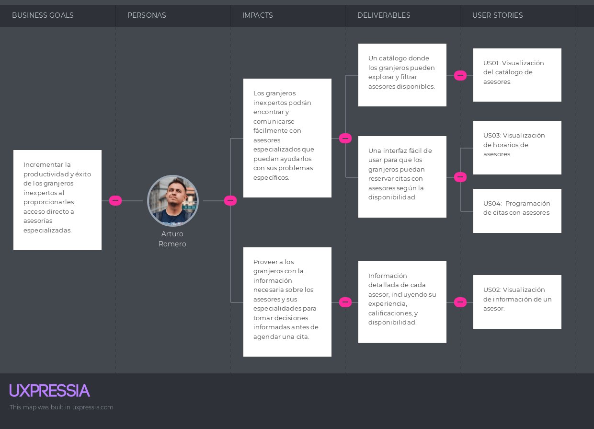

_Imagen 15: Impact Map para Granjero con poca experiencia_

**Segmento: Asesores experimentados**


_Imagen 16: Impact Map para Asesor experimentado_

<div style="page-break-after: always;"></div>

# Capítulo IV: Product Design

## 4.1. Style Guidelines

El estilo de nuestro producto jugará un papel fundamental en brindar a nuestros usuarios una experiencia visual que sea tanto satisfactoria como atractiva. A continuación, se proporcionará una descripción detallada más detallada de las características de nuestro proyecto.

### 4.1.1. General Style Guidelines

<strong>Consistencia Visual: </strong>Mantener una coherencia visual en todos los aspectos de la aplicación es clave para crear una experiencia intuitiva. Esto incluye el uso de una paleta de colores uniforme que refleje la naturaleza y la vida agrícola, una tipografía legible y tamaños de fuente adecuados para facilitar la lectura en diferentes condiciones de luz.

<p align="center">
  
</p>

_Imagen 17. Imagen de consistencia visual_

<strong>Simplicidad y Claridad: </strong>La interfaz debe ser sencilla y fácil de navegar, con un diseño limpio que evite la sobrecarga de información. El uso de un lenguaje claro y directo es fundamental para asegurar que los usuarios, independientemente de su nivel de experiencia con la tecnología, puedan entender rápidamente cómo utilizar la aplicación.

<p align="center">
  
</p>

_Imagen 18. Imagen de simplicidad y claridad_

<strong>Accesibilidad: </strong>Diseñar la aplicación teniendo en cuenta las necesidades de accesibilidad, como texto ampliable, contraste de colores para personas con discapacidades visuales, y compatibilidad con tecnologías de asistencia como lectores de pantalla.

<p align="center">
  
</p>

_Imagen 19. Imagen de necesidades de accesibilidad de usuarios_

<strong>Tipografía: </strong>La tipografía seleccionada para AgroTech es "Roboto", una fuente sans-serif moderna y altamente legible. Roboto destaca por su estilo limpio y contemporáneo, transmitiendo profesionalismo y actualización. La elección de Roboto garantiza que el texto en las interfaces de usuario sea fácilmente legible y mantenga una apariencia moderna y uniforme. Además, Roboto es una fuente versátil que ofrece una amplia gama de pesos y estilos, permitiendo una adaptación flexible a diferentes contextos y tamaños de texto en la aplicación.

<p align="center">
  
</p>

_Imagen 20. Imagen de tipografía_


<strong>Branding: </strong>El logotipo de AgroTech tiene un diseño circular, simbolizando la conexión y la unidad que queremos fomentar entre las comunidades agrícolas peruanas. En el corazón del círculo, se encuentra un animal, representando la esencia de la agricultura y la ganadería. Este animal está rodeado por un campo verde, que simboliza la fertilidad y el crecimiento. La combinación de estos elementos refleja nuestro compromiso con el desarrollo sostenible y la mejora de la calidad de vida de los agricultores.

<p align="center">
  
</p>

_Imagen 21. Imagen de logo de AgroTech_

<strong>Colors: </strong> AgroTech ha seleccionado cuidadosamente una paleta de colores que refleja los valores y la identidad de la plataforma. Los tonos elegidos comunican confiabilidad y eficiencia en la contratación de asesores especializados y en el uso de herramientas avanzadas.

<p align="center">
  
</p>

_Imagen 22. Imagen de paleta de colores_

### 4.1.2. Web Style Guidelines

<strong>Spacing: </strong> El espaciado adecuado entre elementos es esencial para lograr una apariencia equilibrada y una experiencia de usuario cómoda en AgroTech. Hemos establecido pautas claras de espaciado que garantizan coherencia y claridad en toda la plataforma.

<p align="center">
  
</p>

_Imagen 23. Spacing de AgroTech_

<strong>Grid System: </strong>El grid system es una herramienta esencial en el diseño y la organización de la interfaz de usuario de AgroTech. Proporciona una estructura visual que ayuda a distribuir y alinear los elementos de la página de manera consistente y armoniosa en diferentes tamaños de pantalla.

<p align="center">
  
</p>

_Imagen 24. Grid System de AgroTech_

<strong>Buttons: </strong>Los botones son elementos importantes en la interfaz de usuario de AgroTech, ya que proporcionan una forma clara y visualmente destacada para que los usuarios realicen acciones importantes. Hemos definido un estilo de botón consistente que refleja la identidad visual de la plataforma y promueve una experiencia de usuario intuitiva y coherente.

<p align="center">
  
</p>

_Imagen 25. Buttons de AgroTech_

<strong>Input System: </strong>El input system es fundamental en la experiencia del usuario, ya que proporciona formas para que los usuarios ingresen datos y realicen acciones dentro de la plataforma. Hemos definido un sistema de entrada consistente que garantiza una experiencia de usuario intuitiva y coherente en toda la interfaz.

<p align="center">
  
</p>

_Imagen 26. Input System de AgroTech_

### 4.1.3. Mobile Style Guidelines

<p>La versión móvil de AgroTech busca ofrecer una experiencia coherente con la identidad visual de la plataforma, optimizando la interfaz para dispositivos móviles. Se han seguido las buenas prácticas de diseño para asegurar accesibilidad, claridad visual y facilidad de uso en pantallas más pequeñas.</P>

#### 4.1.3.1. iOS Mobile Style Guidelines

En la versión para iOS, se respetan los principios de la Human Interface Guidelines de Apple, adaptando el estilo de AgroTech a las convenciones visuales del sistema operativo:

- **Navegación fluida**: Uso de barras de navegación superiores con títulos claros y botones de retroceso cuando sea necesario.
- **Botones táctiles**: Tamaños adecuados para el toque (mínimo 44x44 pt) y con suficiente separación entre elementos interactivos.
- **Transiciones suaves**: Uso de animaciones sutiles para mejorar la experiencia sin sobrecargar el rendimiento.
- **Gestos nativos**: Compatibilidad con gestos del sistema como deslizar para volver.
- **Tipografía**: Uso de la fuente Roboto respetando los lineamientos de legibilidad en pantallas Retina.


#### 4.1.3.2. Android Mobile Style Guidelines

En la versión para Android, se sigue la filosofía de Material Design, alineando el diseño visual de AgroTech con los patrones de interfaz esperados por los usuarios de Android:

- **Componentes estándar**: Uso de elementos nativos como Floating Action Buttons, AppBars y Navigation Drawers.
- **Interacción táctil**: Botones accesibles con mínimo de 48dp y feedback visual (como ripple effect) al presionarlos.
- **Diseño adaptable**: Soporte para múltiples tamaños de pantalla y orientación vertical/horizontal.
- **Transiciones y animaciones**: Utilización de transiciones suaves que mejoran la navegación entre pantallas.
- **Tipografía**: Se mantiene el uso de Roboto, optimizado para Android por ser fuente nativa del sistema.


## 4.2. Information Architecture

La arquitectura de información desempeña un papel fundamental en la organización y estructuración del contenido para garantizar su accesibilidad y comprensión por parte de los usuarios. En este apartado, se detallarán los sistemas de organización, etiquetado, etiquetas SEO y metaetiquetas, sistema de búsqueda y sistemas de navegación que componen la arquitectura de la información de nuestro producto.

### 4.2.1. Organization Systems

En AgroTech, utilizamos un sistema de jerarquía visual adaptado a la interfaz móvil para resaltar la información clave y permitir a los usuarios encontrar fácilmente lo que necesitan. La organización secuencial en la aplicación guía a los usuarios a través del proceso de búsqueda y contacto con asesores. La categorización del contenido se realiza en función de la audiencia principal: Granjeros y Asesores.

### 4.2.2. Labeling Systems

Hemos desarrollado un sistema de etiquetado claro y conciso para facilitar la navegación en la aplicación móvil. Las etiquetas utilizadas son:

**Vista de Granjero:**

<table>
  <tbody>
  <tr>
      <th>Appointments - Citas</th>
      <td>Se implementará un botón que permitirá visualizar la información de las citas registradas.</td>
  </tr>
  <tr>
      <th>Advisors - Asesores</th>
      <td>Se implementará un botón que permitirá a los usuarios buscar asesores.</td>
  </tr>
  <tr>
      <th>Posts - Publicaciones</th>
      <td>Se implementará un botón que permitirá a los usuarios ver publicaciones de asesores.</td>
  </tr>
  <tr>
      <th>My Farm - Mi Granja</th>
      <td>Se implementará un botón que permitirá al usuario llevar un registro y seguimiento de los recintos de animales en la granja.</td>
  </tr>
  <tr>
      <th>Notifications - Notificaciones</th>
      <td>Se implementará un botón que permitirá visualizar notificaciones de citas.</td>
  </tr>
  <tr>
      <th>Profile - Perfil</th>
      <td>Se implementará un botón que permitirá al usuario visualizar y editar su perfil.</td>
  </tr>
  <tr>
      <th>Logout</th>
      <td>Se implementará un botón que permitirá al usuario cerrar sesión.</td>
  </tr>
  </tbody>
</table>

**Vista de Asesor:**

<table>
  <tbody>
  <tr>
      <th>Appointments - Citas</th>
      <td>Se implementará un botón que permitirá visualizar la información de las citas registradas.</td>
  </tr>
  <tr>
      <th>My Posts - Mis publicaciones</th>
      <td>Se implementará un botón que permitirá al asesor gestionar sus publicacion.</td>
  </tr>
  <tr>
      <th>Schedules - Horarios</th>
      <td>Se implementará un botón que permitirá gestionar los horarios para sus citas.</td>
  </tr>
  <tr>
      <th>Notifications - Notificaciones</th>
      <td>Se implementará un botón que permitirá visualizar notificaciones de citas.</td>
  </tr>
  <tr>
      <th>Profile - Perfil</th>
      <td>Se implementará un botón que permitirá al usuario visualizar y editar su perfil.</td>
  </tr>
  <tr>
      <th>Logout</th>
      <td>Se implementará un botón que permitirá al usuario cerrar sesión.</td>
  </tr>
  </tbody>
</table>

### 4.2.3. SEO Tags and Meta Tags

Para mejorar la visibilidad y el rendimiento de AgroTech en motores de búsqueda y en las tiendas de aplicaciones, se han implementado las siguientes etiquetas SEO y metaetiquetas:

<strong>Metaetiqueta de Descripción: </strong>Proporciona una breve descripción del contenido y propósito de la aplicación, ayudando a los usuarios a entender de qué se trata la aplicación y a mejorar la tasa de clics.

````
<meta name="description" content="AgroTech is a platform that provides farmers with the necessary information to improve their farming practices.">
````


<strong>Metaetiqueta de Autor: </strong>Especifica el autor de la aplicación, lo que ayuda a atribuir la propiedad intelectual y la fuente del contenido.

````
<meta name="author" content="AgroTech">
````

<strong>Metaetiqueta de Robots: </strong>Indica a los motores de búsqueda cómo deben indexar y rastrear la página, permitiendo que se indexe y que se sigan los enlaces en la aplicación.

````
<meta name="robots" content="index, follow">
````

<strong>Etiqueta de Título: </strong> Define el título de la aplicación que aparece en los resultados de búsqueda y en las pestañas del navegador.

````
<title>AgroTech</title>
````

<strong>Etiqueta de Idioma: </strong> Especifica el idioma principal del contenido de la aplicación para ayudar a los motores de búsqueda a entender y clasificar el contenido adecuadamente.

````
<html lang="es">
````

<p align="center">
  
</p>

_Imagen 27. Imagen de SEO Tags and Meta Tags_


### 4.2.4. Searching Systems

La aplicación AgroTech desarrollará un sistema de búsqueda intuitivo, diseñado para que los usuarios encuentren rápidamente la información que necesitan. Este sistema se basará en filtros inteligentes que simplificarán la búsqueda de asesores y citas, evitando así que los usuarios se vean abrumados por la cantidad de información disponible. Con esta mejora, nuestra aplicación garantizará una experiencia de usuario más fluida y satisfactoria al buscar información relevante.

<table>
  <tbody>
  <tr>
      <th>Nombre</th>
      <td>Permite al usuario buscar según el nombre del asesor.</td>
  </tr>
  <tr>
      <th>Experiencia</th>
      <td>Permite al usuario buscar asesores con un nivel de experiencia específico.</td>
  </tr>
  <tr>
      <th>Calificación</th>
      <td>Permite al usuario buscar asesores según las calificaciones obtenidas.</td>
  </tr> 
  <tr>
      <th>Palabras Clave</th>
      <td>Proporciona un cuadro de búsqueda donde los usuarios pueden ingresar palabras clave específicas relacionadas con el tipo de asesoría que necesitan.</td>
  </tr>
  <tr>
      <th>Fecha</th>
      <td>Permite al usuario buscar citas acorde a la fecha.</td>
  </tr>
  </tbody>
</table>

### 4.2.5. Navigation Systems

Tanto la interfaz web como móvil están diseñadas para una navegación eficiente. La navegación es intuitiva y permite a los usuarios acceder fácilmente a las diferentes secciones de la aplicación. A continuación, se describen los sistemas de navegación implementados:

**Web:**

- ***Menú Superior:*** Un menú de navegación horizontal en la parte superior de la página que incluye enlaces a las secciones principales de la aplicación, como "Citas", "Asesores", "Publicaciones", "Perfil", etc.

**Móvil:**

 - ***Menú de Navegación:*** Menús adaptados para dispositivos móviles, que pueden incluir menús desplegables, botones en la parte superior o inferior de la pantalla, y accesos directos en la barra lateral.


## 4.3. Landing Page UI Design

### 4.3.1. Landing Page Wireframe

Los wireframes son el esquema básico de la Landing page, mostrando la estructura principal y la disposición de los elementos. Aquí se detallan las secciones clave como el encabezado, el área de beneficios, las llamadas a la acción y la ubicación de imágenes, enfocándose en la usabilidad y el flujo de la página sin distracciones visuales.

**Página de inicio**

<p align="center">
  
</p>

_Imagen 28. Wireframe de la página de inicio_

<p align="center">
  
</p>

_Imagen 29. Wireframe de la página de inicio (Mobile)_

**Página de Problemática**

<p align="center">
  
</p>

_Imagen 30. Wireframe de la página de problemática_

<p align="center">
  
</p>

_Imagen 31. Wireframe de la página de problemática (Mobile)_

**Página de Características**

<p align="center">
  
</p>

_Imagen 32. Wireframe de la página de características_

<p align="center">
  
</p>

_Imagen 33. Wireframe de la página de características (Mobile)_

**Página de Sobre Nosotros**

<p align="center">
  
</p>

_Imagen 34. Wireframe de la página de sobre nosotros_

<p align="center">
  
</p>

_Imagen 35. Wireframe de la página de sobre nosotros (Mobile)_

**Página de Contacto**

<p align="center">
  
</p>

_Imagen 36. Wireframe de la página de contacto_

<p align="center">
  
</p>

_Imagen 37. Wireframe de la página de contacto (Mobile)_


### 4.3.2. Landing Page Mock-up

Los mockups añaden detalles visuales y de diseño a los wireframes, mostrando la paleta de colores, tipografía y estilo gráfico que tendrá la landing page. Representan cómo se verá la página final, integrando los elementos visuales que harán la experiencia más atractiva y coherente con la marca.

**Página de inicio**

<p align="center">
  
</p>

_Imagen 38. Mockup de la página de inicio_

<p align="center">
  
</p>

_Imagen 39. Mockup de la página de inicio (Mobile)_

**Página de Problemática**

<p align="center">
  
</p>

_Imagen 40. Mockup de la página de problemática_

<p align="center">
  
</p>

_Imagen 41. Mockup de la página de problemática (Mobile)_

**Página de Características**

<p align="center">
  
</p>

_Imagen 42. Mockup de la página de características_

<p align="center">
  
</p>

_Imagen 43. Mockup de la página de características (Mobile)_

**Página de Sobre Nosotros**

<p align="center">
  
</p>

_Imagen 44. Mockup de la página de sobre nosotros_

<p align="center">
  
</p>

_Imagen 45. Mockup de la página de sobre nosotros (Mobile)_

**Página de Contacto**

<p align="center">
  
</p>

_Imagen 46. Mockup de la página de contacto_

<p align="center">
  
</p>

_Imagen 47. Mockup de la página de contacto (Mobile)_


## 4.4. Mobile Applications UX/UI Design
### 4.4.1. Mobile Applications Wireframes


<p align="center">

</p>

<p align="center">

</p>

_Imagen 48. Wireframe de inicio de sesion_

<p align="center">

</p>

_Imagen 49. Wireframe de seleccion de rol_

<p align="center">

</p>

_Imagen 50. Wireframe de creación de cuenta de granjero_

<p align="center">

</p>

_Imagen 51. Wireframe de creación de cuenta de asesor_

<p align="center">

</p>

_Imagen 52. Wireframe de confirmación de creación de cuenta de granjero_

<p align="center">

</p>

_Imagen 53. Wireframe de confirmación de creación de cuenta de asesor_

<p align="center">

</p>

_Imagen 54. Wireframe de página de inicio de granjero_

<p align="center">

</p>

_Imagen 55. Wireframe de página de reserva de asesorías_

<p align="center">

</p>

_Imagen 56. Wireframe de página para editar perfil de granjero_

<p align="center">

</p>

_Imagen 57. Wireframe de página para ver asesorias pendientes y pasadas de granjero_

<p align="center">

</p>

_Imagen 58. Wireframe de página para ver detalles de asesorias de granjero_

<p align="center">

</p>

_Imagen 59. Wireframe de página para calificar asesoria de granjero_

<p align="center">

</p>

_Imagen 60. Wireframe de página para ver notificaciones de granjero_

<p align="center">

</p>

_Imagen 61. Wireframe de página para ver publicaciones de asesores_

<p align="center">

</p>

_Imagen 62. Wireframe de página para ver, agregar y eliminar recintos del perfil Granjero_

<p align="center">

</p>

_Imagen 63. Wireframe de página para ver, agregar, editar y eliminar animales del perfil Granjero_

<p align="center">

</p>

_Imagen 64. Wireframe de página de inicio de asesor_

<p align="center">

</p>

_Imagen 65. Wireframe de página móvil para ver, crear, editar y eliminar publicaciones del perfil Asesor_

<p align="center">

</p>

_Imagen 66. Wireframe de página para ver notificaciones de asesor_

<p align="center">

</p>

_Imagen 67. Wireframe de página para ver asesorías pendientes y pasadas de asesor_

<p align="center">

</p>

_Imagen 68. Wireframe de página para ver detalles/calificaciones de asesorías de asesor_

<p align="center">

</p>

_Imagen 69. Wireframe de página para ver, agregar y eliminar horarios disponibles del Asesor_

<p align="center">

</p>

_Imagen 70. Wireframe de página para editar perfil de asesor_

### 4.4.2. Mobile Applications Wireflow Diagrams

<h3 align="center">Wireflow Diagrams para usuario Granjero Inexperto</h1>

<p align="center">

</p>

_Imagen 71. Wireflow 1 (mobile)_

<p align="center">

</p>

_Imagen 72. Wireflow 2 (mobile)_

<p align="center">

</p>

_Imagen 73. Wireflow 3 (mobile)_

<p align="center">

</p>

_Imagen 74. Wireflow 4 (mobile)_

<p align="center">

</p>

_Imagen 75. Wireflow 5 (mobile)_

<p align="center">

</p>

_Imagen 76. Wireflow 6 (mobile)_

<p align="center">

</p>

_Imagen 77. Wireflow 7 (mobile)_

<p align="center">

</p>

_Imagen 78. Wireflow 8 (mobile)_

<p align="center">

</p>

_Imagen 79. Wireflow 9 (mobile)_

<p align="center">

</p>

_Imagen 80. Wireflow 10 (mobile)_

<p align="center">

</p>

_Imagen 81. Wireflow 11 (mobile)_

<p align="center">

</p>

_Imagen 82. Wireflow 12 (mobile)_

<p align="center">

</p>

_Imagen 83. Wireflow 13 (mobile)_

<h3 align="center">Wireflow Diagrams para usuario Asesor</h1>

<p align="center">

</p>

_Imagen 84. Wireflow 14 (mobile)_

<p align="center">

</p>

_Imagen 85. Wireflow 15 (mobile)_

<p align="center">

</p>

_Imagen 86. Wireflow 16 (mobile)_

<p align="center">

</p>

_Imagen 87. Wireflow 17 (mobile)_

<p align="center">

</p>

_Imagen 88. Wireflow 18 (mobile)_

<p align="center">

</p>

_Imagen 89. Wireflow 19 (mobile)_

<p align="center">

</p>

_Imagen 90. Wireflow 20 (mobile)_

<p align="center">

</p>

_Imagen 91. Wireflow 21 (mobile)_


<p align="center">

</p>

_Imagen 92. Wireflow 22 (mobile)_


### 4.4.3. Mobile Applications Mock-ups

Los mockups de la app aportan estilo visual y detalles gráficos, mostrando cómo lucirán las pantallas finales con colores, tipografías y elementos visuales que crean una experiencia atractiva y alineada con la identidad de la app.

<p align="center">

</p>

_Imagen 93. Mock Up de bienvenida_

<p align="center">

</p>

_Imagen 94. Mock Up de inicio de sesion_

<p align="center">

</p>

_Imagen 95. Mock Up de seleccion de rol_

<p align="center">

</p>

_Imagen 96. Mock Up de creación de cuenta de granjero_

<p align="center">

</p>

_Imagen 97. Mock Up de creación de cuenta de asesor_

<p align="center">

</p>

_Imagen 98. Mock Up de confirmación de creación de cuenta de granjero_

<p align="center">

</p>

_Imagen 99. Mock Up de confirmación de creación de cuenta de asesor_

<p align="center">

</p>

_Imagen 100. Mock Up de página de inicio de granjero_

<p align="center">

</p>

_Imagen 101. Mock Up de página de reserva de asesorías_

<p align="center">

</p>

_Imagen 102. Mock Up de página para editar perfil de granjero_

<p align="center">

</p>

_Imagen 103. Mock Up de página para ver asesorias pendientes y pasadas de granjero_

<p align="center">

</p>

_Imagen 104. Mock Up de página para ver detalles de asesorias de granjero_

<p align="center">

</p>

_Imagen 105. Mock Up de página para calificar asesoria de granjero_

<p align="center">

</p>

_Imagen 106. Mock Up de página para ver notificaciones de granjero_

<p align="center">

</p>

_Imagen 107. Mock Up de página para ver publicaciones de asesores_

<p align="center">

</p>

_Imagen 108. Mock Up de página para ver, agregar y eliminar recintos del perfil Granjero_

<p align="center">

</p>

_Imagen 109. Mock Up de página para ver, agregar, editar y eliminar animales del perfil Granjero_

<p align="center">

</p>

_Imagen 110. Mock Up de página de inicio de asesor_

<p align="center">

</p>

_Imagen 111. Mock Up de página móvil para ver, crear, editar y eliminar publicaciones del perfil Asesor_

<p align="center">

</p>

_Imagen 112. Mock Up de página para ver notificaciones de asesor_

<p align="center">

</p>

_Imagen 113. Mock Up de página para ver asesorías pendientes y pasadas de asesor_

<p align="center">

</p>

_Imagen 114. Mock Up de página para ver detalles/calificaciones de asesorías de asesor_

<p align="center">

</p>

_Imagen 115. Mock Up de página para ver, agregar y eliminar horarios disponibles del Asesor_

<p align="center">

</p>

_Imagen 116. Mock Up de página para editar perfil de asesor_


### 4.4.4. Mobile Applications User Flow Diagrams

<h3 align="center">User Flow Diagrams para usuario Granjero Inexperto</h3>

<p align="center">

</p>

_Imagen 117. User flow 1 (mobile)_

<p align="center">

</p>

_Imagen 118. User flow 2 (mobile)_

<p align="center">

</p>

_Imagen 119. User flow 3 (mobile)_

<p align="center">

</p>

_Imagen 120. User flow 4 (mobile)_


<p align="center">

</p>

_Imagen 121. User flow 5 (mobile)_

<p align="center">

</p>

_Imagen 122. User flow 6 (mobile)_

<p align="center">

</p>

_Imagen 123. User flow 7 (mobile)_

<p align="center">

</p>

_Imagen 124. User flow 8 (mobile)_

<p align="center">

</p>

_Imagen 125. User flow 9 (mobile)_

<p align="center">

</p>

_Imagen 126. User flow 10 (mobile)_

<p align="center">

</p>

_Imagen 127. User flow 11 (mobile)_

<p align="center">

</p>

_Imagen 128. User flow 12 (mobile)_

<p align="center">

</p>

_Imagen 129. User flow 13 (mobile)_


<h3 align="center">User Flow Diagrams para usuario Asesor</h3>

<p align="center">

</p>

_Imagen 130. User flow 14 (mobile)_

<p align="center">

</p>

_Imagen 131. User flow 15 (mobile)_

<p align="center">

</p>

_Imagen 132. User flow 16 (mobile)_

<p align="center">

</p>

_Imagen 133. User flow 17 (mobile)_

<p align="center">

</p>

_Imagen 134. User flow 18 (mobile)_

<p align="center">

</p>

_Imagen 135. User flow 19 (mobile)_

<p align="center">

</p>

_Imagen 136. User flow 20 (mobile)_

<p align="center">

</p>

_Imagen 137. User flow 21 (mobile)_

<p align="center">

</p>

_Imagen 138. User flow 22 (mobile)_

## 4.5. Mobile Applications Prototyping

### 4.5.1. Android Mobile Applications Prototyping

El prototipo de interacción real para aplicaciones móviles Android permite simular la navegación y las funciones tal como las experimentará el usuario final en su dispositivo. A través de una representación interactiva del flujo entre pantallas, este prototipo muestra cómo responderán los elementos táctiles y mejora la usabilidad de la app antes de su desarrollo final. [Enlace a Figma](https://www.figma.com/proto/28qWSJQGZxkutQKmfUcLb0/Moviles-App?node-id=90-215&t=P3iOVM7zbrNtQmvV-0&scaling=min-zoom&content-scaling=fixed&page-id=1%3A3&starting-point-node-id=43%3A5&show-proto-sidebar=1)

Asimismo, se realizó un video de explicación mostrando la interacción con los elementos para mostrar como se comporta la aplicación móvil android. [Enlace a video](https://upcedupe-my.sharepoint.com/:v:/g/personal/u202217239_upc_edu_pe/EXGT841bqwBHv_D4s9Z9yHEB3H-rYC7-MF0v5ABNQl7ivQ?e=R9CpKR&nav=eyJyZWZlcnJhbEluZm8iOnsicmVmZXJyYWxBcHAiOiJTdHJlYW1XZWJBcHAiLCJyZWZlcnJhbFZpZXciOiJTaGFyZURpYWxvZy1MaW5rIiwicmVmZXJyYWxBcHBQbGF0Zm9ybSI6IldlYiIsInJlZmVycmFsTW9kZSI6InZpZXcifX0%3D)


<p align="center">
  
</p>

_Imagen 139. Prototipo de la aplicación móvil Android_


### 4.5.2. iOS Mobile Applications Prototyping

El prototipo de interacción real para aplicaciones móviles iOS permite simular la experiencia de uso tal como la vivirá el usuario final en un dispositivo Apple. Mediante un flujo interactivo entre pantallas, este prototipo muestra cómo se comportarán los elementos táctiles y visuales, facilitando la validación de la usabilidad y la interfaz antes de entrar en la fase de desarrollo. [Enlace a Figma](https://www.figma.com/proto/28qWSJQGZxkutQKmfUcLb0/Moviles-App?node-id=90-215&t=P3iOVM7zbrNtQmvV-0&scaling=min-zoom&content-scaling=fixed&page-id=1%3A3&starting-point-node-id=43%3A5&show-proto-sidebar=1)

Asimismo, se realizó un video de explicación mostrando la interacción con los elementos para mostrar como se comporta la aplicación móvil ios. [Enlace a video](https://upcedupe-my.sharepoint.com/:v:/g/personal/u202217239_upc_edu_pe/EXGT841bqwBHv_D4s9Z9yHEB3H-rYC7-MF0v5ABNQl7ivQ?e=R9CpKR&nav=eyJyZWZlcnJhbEluZm8iOnsicmVmZXJyYWxBcHAiOiJTdHJlYW1XZWJBcHAiLCJyZWZlcnJhbFZpZXciOiJTaGFyZURpYWxvZy1MaW5rIiwicmVmZXJyYWxBcHBQbGF0Zm9ybSI6IldlYiIsInJlZmVycmFsTW9kZSI6InZpZXcifX0%3D)


<p align="center">
  
</p>

_Imagen 140. Prototipo de la aplicación móvil iOS_

## 4.6. Web Applications UX/UI Design
### 4.6.1. Web Applications Wireframes

En este apartado, se muestran todos los wireframes necesarios para cumplir las funcionalidades indicadas en las User Stories con sus escenarios relacionados con el Web Application.

**Sign up y Log In**

<p align="center">
  
</p>

_Imagen 141. Wireframes de la página de inicio de sesión y registro_

**Vista de Citas (Granjero)**

<p align="center">
  
</p>

_Imagen 142. Wireframe de la vista de citas (Granjero)_

**Vista de asesores (Granjero)**

<p align="center">
  
</p>

_Imagen 143. Wireframe de la vista de asesores (Granjero)_

**Vista de Mi Granja (Granjero)**

<p align="center">
  
</p>

_Imagen 144. Wireframe de la vista de mi granja (Granjero)_

**Vista de notificaciones, publicaciones y perfil (Granjero)**

<p align="center">
  
</p>

_Imagen 145. Wireframe de la vista de notificaciones, publicaciones y perfil (Granjero)_

**Vista de citas (Asesor)**

<p align="center">
  
</p>

_Imagen 146. Wireframe de la vista de citas (Asesor)_

**Vista de publicaciones (Asesor)**

<p align="center">
  
</p>

_Imagen 147. Wireframe de la vista de publicaciones (Asesor)_

**Vista de horarios (Asesor)**

<p align="center">
  
</p>

_Imagen 148. Wireframe de la vista de horarios (Asesor)_

**Vista de notificaciones y perfil (Asesor)**

<p align="center">
  
</p>

_Imagen 149. Wireframe de la vista de notificaciones y perfil (Asesor)_

### 4.6.2. Web Applications Wireflow Diagrams

<h3 align="center">Wireflow Diagrams para usuario Granjero Inexperto</h3>

<p align="center">
  
</p>

_Imagen 150. Wireflow Diagram 1_

<p align="center">
  
</p>

_Imagen 151. Wireflow Diagram 2_

<p align="center">
  
</p>

_Imagen 152. Wireflow Diagram 3_

<p align="center">
  
</p>

_Imagen 153. Wireflow Diagram 4_

<p align="center">
  
</p>

_Imagen 154. Wireflow Diagram 5_

<p align="center">
  
</p>

_Imagen 155. Wireflow Diagram 6_

<p align="center">
  
</p>

_Imagen 156. Wireflow Diagram 7_

<p align="center">
  
</p>

_Imagen 157. Wireflow Diagram 8_

<p align="center">
  
</p>

_Imagen 158. Wireflow Diagram 9_

<h3 align="center">Wireflow Diagrams para usuario Asesor</h3>

<p align="center">
  
</p>

_Imagen 159. Wireflow Diagram 10_

<p align="center">
  
</p>

_Imagen 160. Wireflow Diagram 11_

### 4.6.3. Web Applications Mock-ups

En este apartado, se muestran todos los mock-ups basados de los wireframes previamento mencionados. Añadiendo los colores del general style guidelines e imágenes para mejorar la visibilidad de la aplicación.

**Sign Up y Log In**

<p align="center">
  
</p>

_Imagen 161. Mockup de la página de inicio de sesión y registro_

**Vista de Citas (Granjero)**

<p align="center">
  
</p>

_Imagen 162. Mockup de la vista de citas (Granjero)_

**Vista de asesores (Granjero)**

<p align="center">
  
</p>

_Imagen 163. Mockup de la vista de asesores (Granjero)_

**Vista de Mi Granja (Granjero)**

<p align="center">
  
</p>

_Imagen 164. Mockup de la vista de mi granja (Granjero)_

**Vista de notificaciones, publicaciones y perfil (Granjero)**

<p align="center">
  
</p>

_Imagen 165. Mockup de la vista de notificaciones, publicaciones y perfil (Granjero)_

**Vista de citas (Asesor)**

<p align="center">
  
</p>

_Imagen 166. Mockup de la vista de citas (Asesor)_

**Vista de publicaciones (Asesor)**

<p align="center">
  
</p>

_Imagen 167. Mockup de la vista de publicaciones (Asesor)_

**Vista de horarios (Asesor)**

<p align="center">
  
</p>

_Imagen 168. Mockup de la vista de horarios (Asesor)_

**Vista de notificaciones y perfil (Asesor)**

<p align="center">
  
</p>

_Imagen 169. Mockup de la vista de notificaciones y perfil (Asesor)_

### 4.6.4. Web Applications User Flow Diagrams

<h3 align="center">User Flow Diagrams para usuario Granjero Inexperto</h3>

<p align="center">
  
</p>

_Imagen 170. User Flow Diagram 1_

<p align="center">
  
</p>

_Imagen 171. User Flow Diagram 2_

<p align="center">
  
</p>

_Imagen 172. User Flow Diagram 3_

<p align="center">
  
</p>

_Imagen 173. User Flow Diagram 4_

<p align="center">
  
</p>

_Imagen 174. User Flow Diagram 5_

<p align="center">
  
</p>

_Imagen 175. User Flow Diagram 6_

<p align="center">
  
</p>

_Imagen 176. User Flow Diagram 7_

<p align="center">
  
</p>

_Imagen 177. User Flow Diagram 8_

<p align="center">
  
</p>

_Imagen 178. User Flow Diagram 9_

<h3 align="center">User Flow Diagrams para usuario Asesor</h3>

<p align="center">
  
</p>

_Imagen 179. User Flow Diagram 10_

<p align="center">
  
</p>

_Imagen 180. User Flow Diagram 11_

## 4.7. Web Applications Prototyping

El prototipo de interacción real permite simular la navegación y las funciones de la app web tal como las experimentará el usuario final. Ofrece una representación interactiva del flujo entre pantallas, mostrando cómo responderán los elementos y mejorando la usabilidad antes de la fase de desarrollo. [Enlace a Figma](https://www.figma.com/proto/6QBa0SzTmn7Gg0VUnCRUAS/Experimentos-Web?node-id=3122-2189&starting-point-node-id=3122%3A2189&show-proto-sidebar=1&t=2meXH4KXef6rCnOm-1)

Asimismo, se realizó un video de explicación mostrando la interacción con los elementos para mostrar como se comporta la aplicación web. [Enlace a video](https://upcedupe-my.sharepoint.com/:v:/g/personal/u20221b127_upc_edu_pe/ETARXl7DzzdBvDLdRm6dUdABsgrPR3Ls7xYZ0lqpJph1MQ?nav=eyJyZWZlcnJhbEluZm8iOnsicmVmZXJyYWxBcHAiOiJPbmVEcml2ZUZvckJ1c2luZXNzIiwicmVmZXJyYWxBcHBQbGF0Zm9ybSI6IldlYiIsInJlZmVycmFsTW9kZSI6InZpZXciLCJyZWZlcnJhbFZpZXciOiJNeUZpbGVzTGlua0NvcHkifX0&e=GPf3VA)

<p align="center">
  
</p>

_Imagen 181. Prototipo de la aplicación web_

## 4.8. Domain-Driven Software Architecture
La Arquitectura de Software Orientada al Dominio se centra en comprender el dominio del problema antes de iniciar el diseño del sistema. Este enfoque permite alinear la tecnología con los objetivos del negocio, lo que ayuda a reducir la complejidad y a mejorar la eficiencia en el desarrollo del software.

### 4.8.1. Software Architecture Context Diagram
Este diagrama proporciona una vista de alto nivel de nuestro sistema de software y su entorno externo.

<p align="center">
  
</p>

_Imagen 182. Diagrama de contexto del sistema_


### 4.8.2. Software Architecture Container Diagrams
Este diagrama se centra en descomponer el sistema en contenedores de alto nivel, que pueden ser aplicaciones, servicios web, bases de datos, etc.


<p align="center">
  
</p>

_Imagen 183. Diagrama de contenedores del sistema_

### 4.8.3. Software Architecture Components Diagrams
Estos diagramas exploran con mayor detalle los contenedores mostrados previamente, desglosando cada uno en los componentes individuales que lo conforman.

#### Appointment BC Component Diagram
<p align="center">
  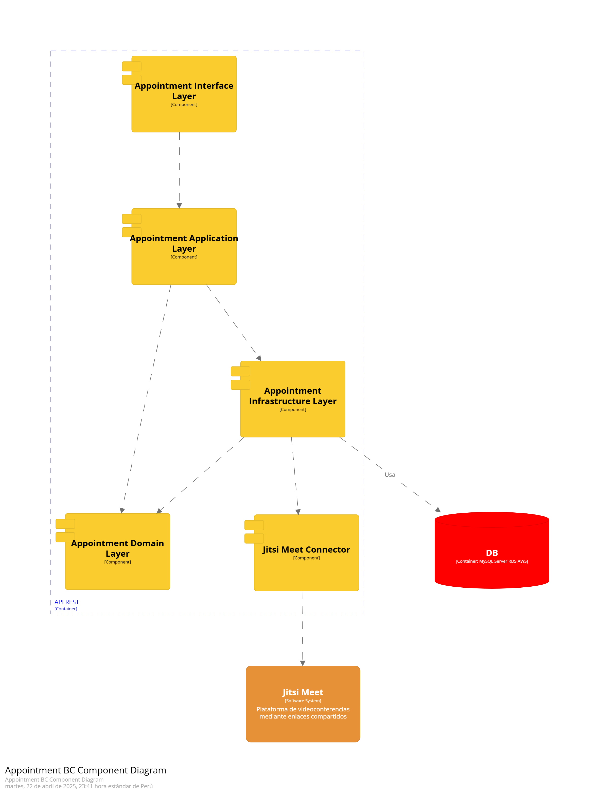
</p>

_Imagen 184. Diagrama de componentes del BC Appointment_

#### Profile BC Component Diagram 
<p align="center">
  
</p>

_Imagen 185. Diagrama de componentes del BC Profile_

#### Management BC Component Diagram
<p align="center">
  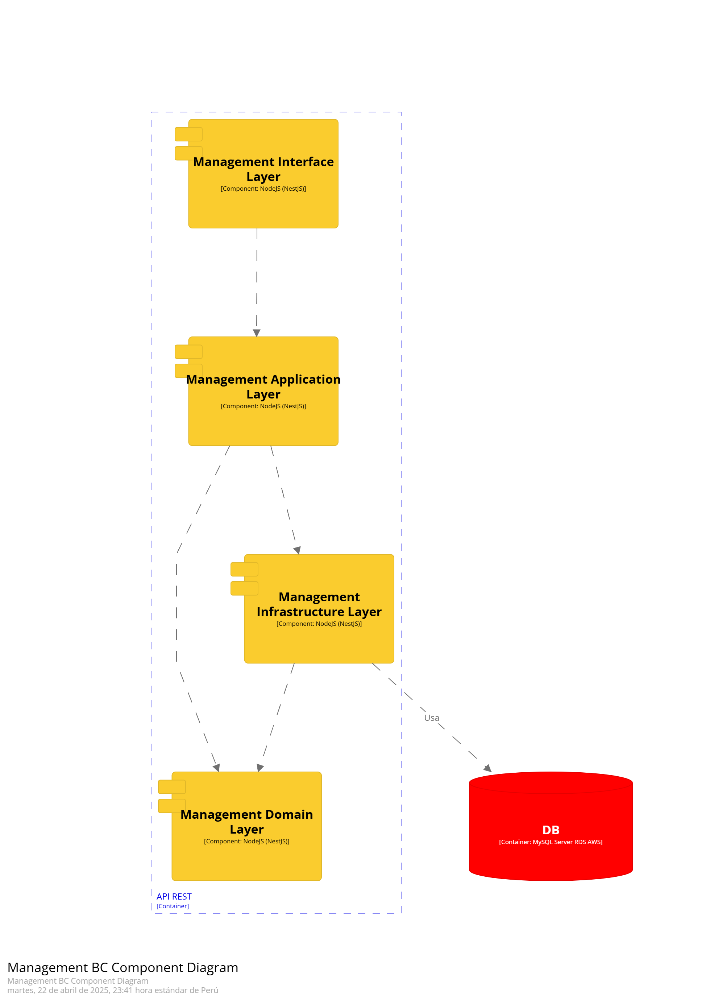
</p>

_Imagen 186. Diagrama de componentes del BC Management_

#### Post BC Component Diagram
<p align="center">
  
</p>

_Imagen 187. Diagrama de componentes del BC Post_

#### API Rest Component Diagram
<p align="center">
  
</p>

_Imagen 188. Diagrama de componentes del API Rest_


## 4.9. Software Object-Oriented Design
### 4.9.1. Class Diagrams

Los diagramas de clase son herramientas cruciales en el diseño de sistemas orientados a objetos, ya que proporcionan una representación visual de las clases y sus relaciones dentro del sistema. En esta sección, se presentarán los diagramas de clase que detallan la estructura de cada bounded context: Profile, Appointment, Management y Post.

<p align="center">
  
</p>

_Imagen 189. Diagrama de Clase: Profile_

<p align="center">
  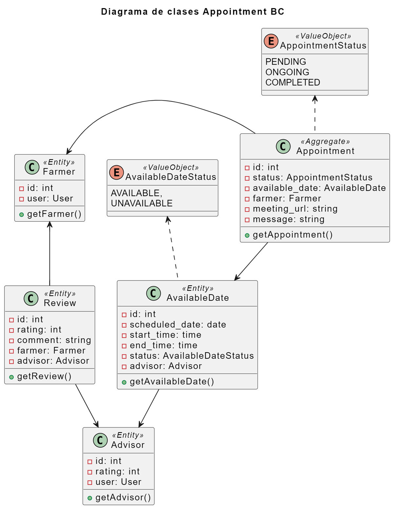
</p>

_Imagen 190. Diagrama de Clase: Appointment_

<p align="center">
  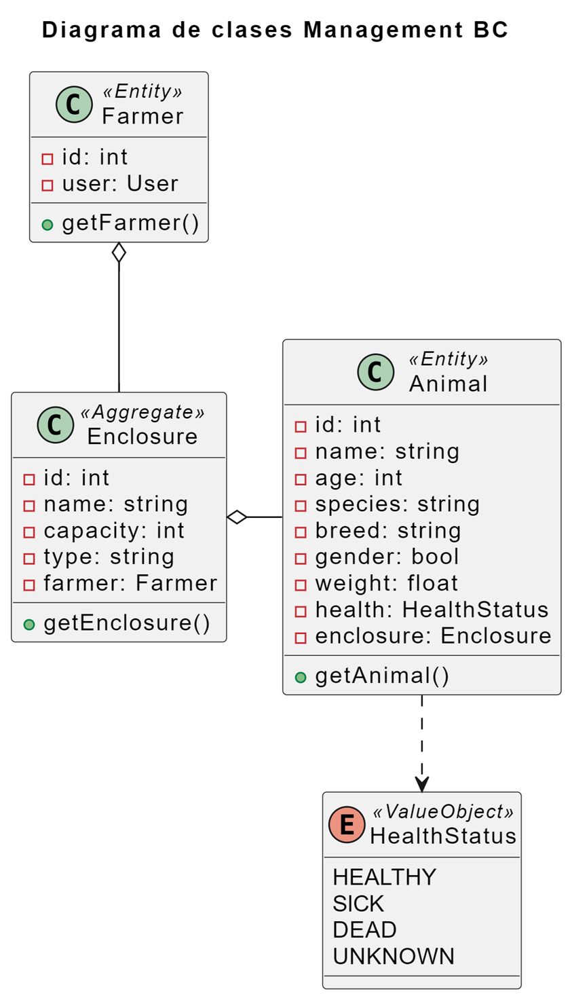
</p>

_Imagen 191. Diagrama de Clase: Management_

<p align="center">
  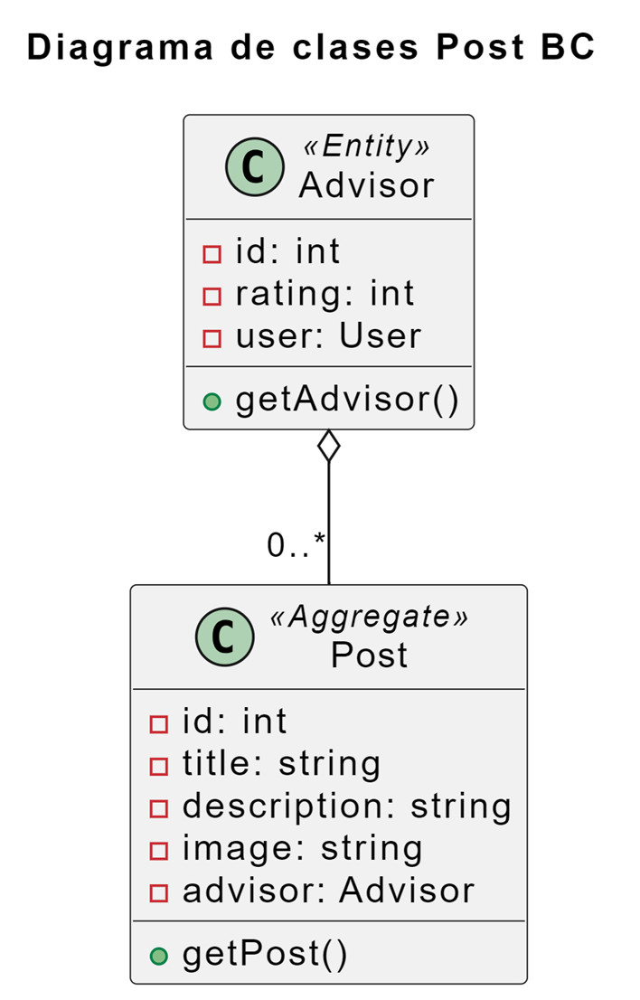
</p>

_Imagen 192. Diagrama de Clase: Post_

### 4.9.2. Class Dictionary

En esta sección, se especificarán las características detalladas de cada clase del sistema mediante un diccionario de clases. A continuación se presenta una tabla con las clases y una descripción sobre sus atributos, métodos y una breve descripción de cada una.

<table>
    <thead>
        <tr>
            <th>Clase</th>
            <th>Descripción</th>
        </tr>
    </thead>
    <tbody>
        <tr>
            <td>User</td>
            <td>Representa un usuario del sistema. Incluye atributos como <em>id</em>, <em>username</em>, <em>password</em>, un <em>profile</em> asociado, un <em>role</em>, y una lista de <em>notifications</em>. Métodos principales: <em>getUser()</em>, <em>getNotifications()</em>.</td>
        </tr>
        <tr>
            <td>Farmer</td>
            <td>Representa a los usuarios del sector de granjero. Hereda de la clase <em>User</em>. Incluye un <em>user</em> asociado. Método principal: <em>getFarmer()</em>.</td>
        </tr>
        <tr>
            <td>Advisor</td>
            <td>Representa a los usuarios del sector de asesores especializados. Incluye atributos como <em>id</em>, <em>rating</em>, y un <em>user</em> asociado. Método principal: <em>getAdvisor()</em>.</td>
        </tr>
        <tr>
            <td>Profile</td>
            <td>Contiene la información detallada del usuario, incluyendo atributos como <em>firstname</em>, <em>lastname</em>, <em>city</em>, <em>country</em>, <em>birthdate</em>, <em>description</em>, <em>photo</em>, <em>occupation</em>, <em>experience</em>, y un <em>user</em> asociado. Método principal: <em>getProfile()</em>.</td>
        </tr>
        <tr>
            <td>Notification</td>
            <td>Representa una notificación que se enviará al usuario. Incluye atributos como <em>id</em>, <em>title</em>, <em>message</em>, y un <em>user</em> asociado. Método principal: <em>getNotification()</em>.</td>
        </tr>
        <tr>
            <td>Role</td>
            <td>Define el rol de un usuario dentro del sistema. Incluye atributos como <em>id</em> y <em>name</em>. Método principal: <em>getRole()</em>.</td>
        </tr>
        <tr>
            <td>Appointment</td>
            <td>Representa una cita programada entre un asesor y un granjero. Incluye atributos como <em>id</em>, <em>message</em>, <em>meeting_url</em>, <em>status</em>, un <em>available_date</em>, y un <em>farmer</em>. Método principal: <em>getAppointment()</em>.</td>
        </tr>
        <tr>
            <td>Review</td>
            <td>Contiene la evaluación y comentario de una asesoría. Incluye atributos como <em>id</em>, <em>rating</em>, <em>comment</em>, un <em>advisor</em> y un <em>farmer</em>. Método principal: <em>getReview()</em>.</td>
        </tr>
        <tr>
            <td>AvailableDate</td>
            <td>Representa los horarios cuando el asesor puede realizar una asesoría. Incluye atributos como <em>id</em>, <em>scheduled_date</em>, <em>start_time</em>, <em>end_time</em>, <em>status</em>, y un <em>advisor</em> asociado. Método principal: <em>getAvailableDate()</em>.</td>
        </tr>
        <tr>
            <td>Status</td>
            <td>Representa los estados posibles de una cita: <em>PENDING</em>, <em>ONGOING</em>, <em>COMPLETED</em>.</td>
        </tr>
        <tr>
            <td>Enclosure</td>
            <td>Representa un recinto de un granjero. Incluye atributos como <em>id</em>, <em>name</em>, <em>capacity</em>, <em>type</em>, y un <em>farmer</em> asociado. Método principal: <em>getEnclosure()</em>.</td>
        </tr>
        <tr>
            <td>Animal</td>
            <td>Representa un animal de un recinto. Incluye atributos como <em>id</em>, <em>name</em>, <em>age</em>, <em>species</em>, <em>breed</em>, <em>gender</em>, <em>weight</em>, <em>health</em>, y un <em>enclosure</em> asociado. Método principal: <em>getAnimal()</em>.</td>
        </tr>
        <tr>
            <td>Post</td>
            <td>Representa una publicación hecha por un asesor. Incluye atributos como <em>id</em>, <em>title</em>, <em>description</em>, <em>image</em>, y un <em>advisor</em> asociado. Método principal: <em>getPost()</em>.</td>
        </tr>
    </tbody>
</table>

<div style="page-break-after: always;"></div>

## 4.10. Database Design
### 4.10.1. Relational/Non-Relational Database Diagram

<p align="center">
  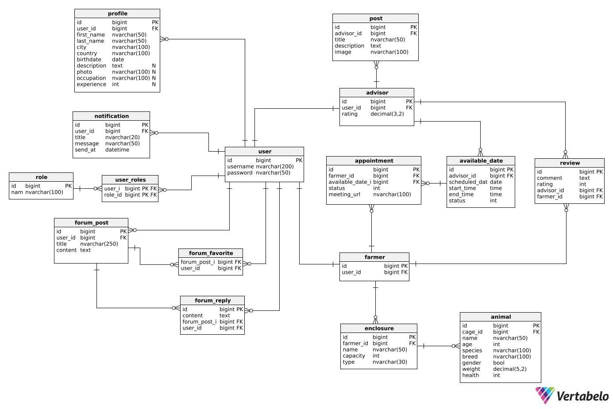
</p>

_Imagen 193. Diagrama de base de datos relacional_

<div style="page-break-after: always;"></div>

# Capítulo V: Product Implementation

## 5.1. Software Configuration Management

### 5.1.1. Software Development Environment Configuration
**Product UX/UI Design:**

Se realizaron los productos de UX con la herramienta UXPressia, así como el User Persona, Empathy Mapping, Impact Mapping, entre otras. Gracias a esto pudimos modelar bien los diseños de la experiencia de usuario, lo cual nos sirve para poder ponernos en una mejor perspectiva para nuestros segmentos objetivo. Por otro lado, hicimos los prototipos de la aplicación móvil utilizando la herramienta Figma, la cual nos permitió crear los Wireframes y Mock-ups para tener un diseño previo al desarrollo de la aplicación.


**Software Development:**

Como principales IDEs, utilizamos WebStorm y Android Studio, con los cuales estamos más familiarizados por ser de Jetbrains. Por otro lado, para el desarrollo usamos los lenguajes aprendidos previamente, como HTML, CSS y JavaScript para la landing page, TypeScript para el frontend web, y Kotlin para la aplicación móvil.


**Software Testing:**

Las pruebas de aceptación son importantes a realizar para comprobar que los criterios de aceptación planteados están favoreciendo a las necesidades del negocio y cumplir con los requerimientos, para lo cual utilizamos el lenguaje Gherkin. Este consiste en trabajar el escenario con Given When Then, y lograr identificar las variables de input y output, lo cual es sencillo de entender para todos ya que utiliza lenguaje natural. Gracias a este, es que se logra garantizar la calidad del software, por ello cumple un papel esencial en los proyectos de desarrollo.

### 5.1.2. Source Code Management

Usuarios de GitHub
<table>
  <thead>
    <tr>
        <th>Integrante</th>
        <th>Usuario de GitHub</th>
    </tr>
  </thead>
  <tbody>
    <tr>
        <td>Delgado Corrales, Piero Gonzalo</td>
        <td>PieroD04</td>
    </tr>
    <tr>
        <td>Paredes Puente, Sebastián Roberto</td>
        <td>sebastian123gonzalo</td>
    </tr>
    <tr>
        <td>Salinas Torres, Salvador Antonio</td>
        <td>salvadoorssalinas</td>
    </tr>
    <tr>
        <td>Pecan Pariona, Sergio Joel</td>
        <td>SergioPecan</td>
    </tr>
    <tr>
        <td>La Torre Soto, André Sebastián</td>
        <td>AndreSebastian18</td>
    </tr>
    <tr>
        <td>Qqueso Rodriguez, Britney Delhy</td>
        <td>brit2801</td>
    </tr>
  </tbody>
</table>

**URL de la organización en GitHub:** [https://github.com/InnovaTech-UPC](https://github.com/InnovaTech-UPC)

Para el desarrollo del trabajo se hará uso de GitFlow, el cual es un modelo de flujo de trabajo para la gestión de control de versiones Git. Está compuesta por ramas y cada una cumple un propósito distinto. Las ramas que utilizamos son: Feature, Develop, Release y Main.


### 5.1.3. Source Code Style Guide & Conventions

En el desarrollo de este trabajo, se utilizará una gran variedad de lenguajes para trabajar en el Landing Page, Frontend Web y Mobile Application. Para ello, se utilizará la siguiente guía de estilos y convenciones.

**HTML**

Es el lenguaje utilizado para estructurar el contenido de una página web, brindando una variedad de elementos posibles como texto, imágenes, formularios, etc.
https://www.w3schools.com/html/html5_syntax.asp

- Declarar el tipo de documento en la primera línea con \<!DOCTYPE html>.
- Respetar la estructura básica del HTML: \<html>, \<head>, \<body>.
- Declarar el título de la página para dar a conocer al usuario en qué página se encuentra. (Usar el elemento \<title> en \<head>)
- Se usará la indentación coherente para lograr una lectura sencilla del código, por lo que es importante tener la tabulación correcta para cada nivel de anidamiento.
- Siempre cerrar los elementos que lo requieran, ya sea una división, párrafo, título. (Si se declara una \<div>, siempre cerrarlo con \</div>)
- Declarar el atributo “alt” para las imágenes.


**CSS**

Es el lenguaje utilizado para definir el diseño de la página web, así como los estilos, fuentes, colores, contenedores, etc.
https://google.github.io/styleguide/htmlcssguide.html
- Usar indentación de forma correcta.
- Los nombres para elementos deben ser cortos y en minúsculas.
- Declarar los colores en código hexadecimal. (Ejemplo: #024A86)
- Dejar comentarios para conocer el propósito del estilo y su uso.
- El diseño debe ser responsive para que los usuarios lo puedan visualizar cómodamente desde el dispositivo en qué se encuentren.


**TypeScript**
Es un superset de JavaScript ampliamente utilizado en el desarrollo con Angular, ya que añade tipado estático y otras funcionalidades que mejoran la escalabilidad y mantenibilidad del código.

- Declarar nombres coherentes y descriptivos para variables, funciones y clases.
- Incluir comentarios que expliquen claramente el propósito de cada bloque de código.
- Finalizar cada línea con punto y coma para mantener consistencia.
- Usar const y let de forma adecuada: const para valores que no cambian y let para aquellos que sí.
- Emplear comparaciones estrictas (=== y !==) para evitar errores de tipo.
- Aprovechar el tipado de TypeScript para declarar tipos explícitos y prevenir errores en tiempo de compilación.

**Kotlin**

Es un lenguaje de programación moderno que se utiliza para el desarrollo de aplicaciones móviles en Android.
https://developer.android.com/kotlin/style-guide
- Nombrar las variables, funciones y clases con CamelCase, además de ser significativos y cortos.
- Utilizar HTTPS para establecer una conexión segura.
- Usar indentación correctamente para un código coherente y ordenado.
- Usar comillas dobles (“) para las cadenas de texto.
- Dejar comentarios en cada bloque de código para explicar su funcionalidad.
- Declarar constantes cuando sean variables que no cambiarán su valor a lo largo de todo el código.


### 5.1.4. Software Deployment Configuration

Igualmente como se ha trabajado con el Backend, también utilizaremos el sistema de Git y repositorios en GitHub para el desarrollo de la Landing Page, Frontend Web y la Mobile Application. De esta manera, cada miembro podrá trabajar de forma remota desde su IDE, teniendo una copia del repositorio Git a través del repositorio en línea almacenado en GitHub, así poder hacer commits para empujar los cambios que hayan realizado.

Asimismo, utilizaremos el sistema de GitHub Pages para desplegar la Landing Page de nuestro proyecto. GitHub Pages es un servicio que ofrece GitHub para alojar sitios web estáticos de forma gratuita. Permite a los desarrolladores alojar un sitio web directamente desde un repositorio de GitHub, lo que facilita la publicación de sitios web sin tener que preocuparse por la infraestructura de alojamiento.

Para el Backend se usará Render, que es un servicio de alojamiento de aplicaciones web y APIs. Permite a los desarrolladores desplegar sus aplicaciones en la nube sin necesidad de preocuparse por la infraestructura subyacente. Render ofrece escalabilidad automática, lo que significa que puede manejar picos de tráfico sin problemas. Además, proporciona una interfaz fácil de usar para gestionar y monitorear las aplicaciones desplegadas. Finalmente, para la aplicación web se usará Vercel, una plataforma de despliegue y alojamiento para aplicaciones web modernas. Permite desplegar aplicaciones de forma rápida y sencilla, con integración continua y escalabilidad automática.

## 5.2. Product Implementation & Deployment

### 5.2.1. Sprint Backlogs

#### 5.2.1.1. Sprint 1

**Sprint Planning 1**

<table>
  <tr>
    <th>Sprint #</th>
    <td>Sprint 1</td>
  </tr>
  <tr>
    <th colspan="2"><strong>Sprint Planning Background</strong></th>
  </tr>
  <tr>
    <th>Date</th>
    <td>2025-04-03</td>
  </tr>
  <tr>
    <th>Time</th>
    <td>12:00 PM</td>
  </tr>
  <tr>
    <th>Location</th>
    <td>Presencial (En la universidad)</td>
  </tr>
  <tr>
    <th>Prepared by</th>
    <td>Salinas Torres, Salvador Antonio</td>
  </tr>
  <tr>
    <th>Attendees (to planning meeting)</th>
    <td>
      <p>Delgado Corrales, Piero Gonzalo</p>
      <p>La Torre Soto, Andre Sebastian</p>
      <p>Paredes Puente, Sebastian Roberto</p>
      <p>Pecan Pariona, Sergio Joel</p>
      <p>Salinas Torres, Salvador Antonio</p>
    </td>
  </tr>
  <tr>
    <th>Sprint n - 1 Review Summary</th>
    <td>No se ha trabajado un sprint anterior de implementación del producto.</td>
  </tr>
  <tr>
    <th>Sprint n - 1 Retrospective Summary</th>
    <td>No se ha trabajado un sprint anterior de implementación del producto.</td>
  </tr>
  <tr>
    <th colspan="2"><strong>Sprint Goal & User Stories</strong></th>
  </tr>
  <tr>
    <th>Sprint 1 Goal</th>
    <td>Nuestro objetivo es implementar el Backend y la Landing Page. Creemos que brindará un gran valor ya que el Backend gestiona la lógica de negocio, los datos, la seguridad, la escalabilidad y la integración con otros sistemas; y la Landing Page está diseñada para una conversión específica, mejorando la tasa de conversión y generando más leads. Esto se confirmará cuando se haya integrado todos los endpoints necesarios para la aplicación, y se haya desplegado la Landing Page para que los potenciales usuarios puedan conocer el producto.</td>
  </tr>
  <tr>
    <th>Sprint 1 Velocity</th>
    <td>41</td>
  </tr>
  <tr>
    <th>Sum of Story Points</th>
    <td>41</td>
  </tr>
</table>


**Sprint Backlog 1**

<table><tr><th colspan="1" valign="top">Sprint #</th><th colspan="7" valign="top">Sprint 1</th></tr>
<tr><td colspan="2" valign="top">User Story</td><td colspan="6" valign="top">Work-Item / Task</td></tr>
<tr><td colspan="1" valign="top">Id</td><td colspan="1" valign="top">Title</td><td colspan="1" valign="top">Id</td><td colspan="1" valign="top">Title</td><td colspan="1" valign="top">Description</td><td colspan="1" valign="top">Estimation </td><td colspan="1" valign="top">Assigned To</td><td colspan="1" valign="top">Status (To-Do / In-Process / Review / Done)</td></tr>
<tr><td colspan="1" rowspan="2" valign="top">TS03</td><td colspan="1" rowspan="2" valign="top">Uso de nuestra API para gestionar perfiles</td><td colspan="1" valign="top">WI01</td><td colspan="1" valign="top">Implementación de protocolos HTTP para perfiles</td><td colspan="1" valign="top">Se implementan los protocolos HTTP para los perfiles de los usuarios (granjeros y asesores) dentro de nuestra API.</td><td colspan="1" rowspan="2" valign="top">5</td><td colspan="1" valign="top">Salvador Salinas</td><td colspan="1" valign="top">Done</td></tr>
<tr><td colspan="1" valign="top">WI02</td><td colspan="1" valign="top">Implementación de protocolos HTTP para notificaciones</td><td colspan="1" valign="top">Se implementan los protocolos HTTP para las notificaciones dentro de nuestra API.</td><td colspan="1" valign="top">Salvador Salinas</td><td colspan="1" valign="top">Done</td></tr>
<tr><td colspan="1" rowspan="3" valign="top">TS04</td><td colspan="1" rowspan="3" valign="top">Uso de nuestra API para gestionar citas de asesoría</td><td colspan="1" valign="top">WI03</td><td colspan="1" valign="top">Implementación de protocolos HTTP para citas</td><td colspan="1" valign="top">Se implementan los protocolos HTTP para las citas de asesorías dentro de nuestra API.</td><td colspan="1" rowspan="3" valign="top">5</td><td colspan="1" valign="top">Piero Delgado</td><td colspan="1" valign="top">Done</td></tr>
<tr><td colspan="1" valign="top">WI04</td><td colspan="1" valign="top">Implementación de protocolos HTTP para horarios disponibles</td><td colspan="1" valign="top">Se implementan los protocolos HTTP para los horarios disponibles de los asesores dentro de nuestra API.</td><td colspan="1" valign="top">Sergio Pecan</td><td colspan="1" valign="top">Done</td></tr>
<tr><td colspan="1" valign="top">WI05</td><td colspan="1" valign="top">Implementación de protocolos HTTP para reseñas</td><td colspan="1" valign="top">Se implementan los protocolos HTTP para las reseñas sobre los asesores dentro de nuestra API.</td><td colspan="1" valign="top">Piero Delgado</td><td colspan="1" valign="top">Done</td></tr>
<tr><td colspan="1" valign="top">TS05</td><td colspan="1" valign="top">Uso de nuestra API para gestionar publicaciones</td><td colspan="1" valign="top">WI06</td><td colspan="1" valign="top">Implementación de protocolos HTTP para publicaciones</td><td colspan="1" valign="top">Se implementan los protocolos HTTP para las publicaciones dentro de nuestra API.</td><td colspan="1" valign="top">5</td><td colspan="1" valign="top">Salvador Salinas</td><td colspan="1" valign="top">Done</td></tr>
<tr><td colspan="1" rowspan="2" valign="top">TS06</td><td colspan="1" rowspan="2" valign="top">Uso de nuestra API para gestionar recinto de animales	</td><td colspan="1" valign="top">WI07</td><td colspan="1" valign="top">Implementación de protocolos HTTP para recintos</td><td colspan="1" valign="top">Se implementan los protocolos HTTP para las recintos de los granjeros dentro de nuestra API.</td><td colspan="1" rowspan="2" valign="top">5</td><td colspan="1" valign="top">Sebastian Paredes</td><td colspan="1" valign="top">Done</td></tr>
<tr><td colspan="1" valign="top">WI08</td><td colspan="1" valign="top">Implementación de protocolos HTTP para animales</td><td colspan="1" valign="top">Se implementan los protocolos HTTP para los animales de los recintos dentro de nuestra API.</td><td colspan="1" valign="top">Piero Delgado</td><td colspan="1" valign="top">Done</td></tr>
<tr><td colspan="1" rowspan="1" valign="top">TS07</td><td colspan="1" rowspan="1" valign="top">Uso de nuestra API para gestionar autenticación</td><td colspan="1" valign="top">WI09</td><td colspan="1" valign="top">Implementación de autenticación IAM</td><td colspan="1" valign="top">Se implementan los protocolos HTTP para la autenticación de los usuarios (granjeros y asesores) dentro de nuestra API.</td><td colspan="1" rowspan="1" valign="top">5</td><td colspan="1" valign="top">Piero Delgado</td><td colspan="1" valign="top">Done</td></tr>
<tr><td colspan="1" rowspan="1" valign="top">TS01</td><td colspan="1" rowspan="1" valign="top">Uso de una API para videollamadas</td><td colspan="1" valign="top">WI10</td><td colspan="1" valign="top">Integración de API para videollamadas</td><td colspan="1" valign="top">Se integra el sistema de Jitsi Meet para la creación de videollamadas para las asesorías.</td><td colspan="1" rowspan="1" valign="top">3</td><td colspan="1" valign="top">Piero Delgado</td><td colspan="1" valign="top">Done</td></tr>
<tr><td colspan="1" rowspan="1" valign="top">TS02</td><td colspan="1" rowspan="1" valign="top">Uso de una API para alojar imágenes</td><td colspan="1" valign="top">WI11</td><td colspan="1" valign="top">Integración de API para alojamiento</td><td colspan="1" valign="top">Se integra el sistema de Firebase Storage para el alojamiento de imágenes.</td><td colspan="1" rowspan="1" valign="top">3</td><td colspan="1" valign="top">Salvador Salinas</td><td colspan="1" valign="top">Done</td></tr>
<tr><td colspan="1" rowspan="2" valign="top">US13</td><td colspan="1" rowspan="2" valign="top">Visualización de la sección de inicio de la Landing Page	</td><td colspan="1" valign="top">WI12</td><td colspan="1" valign="top">Implementación de navbar y footer</td><td colspan="1" valign="top">Se implementa el navbar para navegar por la Landing Page y el footer en la parte inferior.</td><td colspan="1" rowspan="2" valign="top">2</td><td colspan="1" valign="top">Salvador Salinas</td><td colspan="1" valign="top">Done</td></tr>
<tr><td colspan="1" valign="top">WI13</td><td colspan="1" valign="top">Implementación de página de inicio</td><td colspan="1" valign="top">Se implementa la página de inicio de forma responsive y con su archivo css correspondiente.	</td><td colspan="1" valign="top">Salvador Salinas</td><td colspan="1" valign="top">Done</td></tr>
<tr><td colspan="1" valign="top">US14</td><td colspan="1" valign="top">Visualización de la sección 'Acerca de' de la Landing Page</td><td colspan="1" valign="top">WI14</td><td colspan="1" valign="top">Implementación de página 'Acerca de'</td><td colspan="1" valign="top">Se implementa la página sobre la Problemática, de forma responsive y con su archivo css correspondiente.	</td><td colspan="1" valign="top">2</td><td colspan="1" valign="top">Sergio Pecan</td><td colspan="1" valign="top">Done</td></tr>
<tr><td colspan="1" valign="top">US15</td><td colspan="1" valign="top">Visualización de la sección 'Sobre Nosotros' de la Landing Page</td><td colspan="1" valign="top">WI15</td><td colspan="1" valign="top">Implementación de página 'Sobre Nosotros'</td><td colspan="1" valign="top">Se implementa la página Sobre Nosotros, de forma responsive y con su archivo css correspondiente.	</td><td colspan="1" valign="top">2</td><td colspan="1" valign="top">Piero Delgado</td><td colspan="1" valign="top">Done</td></tr>
<tr><td colspan="1" valign="top">US16</td><td colspan="1" valign="top">	Visualización de la sección 'Características' de la Landing Page</td><td colspan="1" valign="top">WI16</td><td colspan="1" valign="top">Implementación de página 'Características'</td><td colspan="1" valign="top">Se implementa la página Características, de forma responsive y con su archivo css correspondiente.</td><td colspan="1" valign="top">2</td><td colspan="1" valign="top">Andre La Torre</td><td colspan="1" valign="top">Done</td></tr>
<tr><td colspan="1" valign="top">US17</td><td colspan="1" valign="top">Visualización de la sección 'Contacto' de la Landing Page</td><td colspan="1" valign="top">WI17</td><td colspan="1" valign="top">Implementación de página 'Contacto'</td><td colspan="1" valign="top">Se implementa la página Contacto, de forma responsive y con su archivo css correspondiente.</td><td colspan="1" valign="top">2</td><td colspan="1" valign="top">Sebastian Paredes</td><td colspan="1" valign="top">Done</td></tr>
</table>

**Development Evidence for Sprint Review**

A continuación, se detallan los commits realizados, los cuales se trabajaron a partir de las tareas asignadas a cada miembro como se muestra en el Sprint Backlog 1. De este modo, se trabajó en el Backend y Landing Page.

Repositorio Backend: <https://github.com/InnovaTech-UPC/Backend>

Repositorio Landing Page: <https://github.com/InnovaTech-UPC/Landing>

|**Repository**|**Branch**|**Commit Id**|**Commit Message**|**Commited on (Date)**|
| :- | :- | :- | :- | :- |
|InnovaTech-UPC/Backend|main|5fb3a85|feat: base backend|05/04/2025|
|InnovaTech-UPC/Backend|main|9001251|feat: add cors customizer|05/04/2025|
|InnovaTech-UPC/Backend|develop|1d2f8d2|fix: deleted extra semicolon ";"|05/04/2025|
|InnovaTech-UPC/Backend|develop|4d7abc9|feat:(appointment) add verification of date|09/04/2025|
|InnovaTech-UPC/Backend|develop|f7cd1c4|feat: add animals & enclosures endpoints|14/04/2025|
|InnovaTech-UPC/Landing|main|bc45f18|feat: base landing page|15/04/2025|
|InnovaTech-UPC/Backend|develop|0d17402|fix: missing field in constructor|15/04/2025|
|InnovaTech-UPC/Landing|main|4b8708c|feat: update profile images|21/04/2025|
|InnovaTech-UPC/Landing|main|e7c5770|style: change colors|21/04/2025|
|InnovaTech-UPC/Backend|release|66f73a5|chore: add env variables for security|21/04/2025|


**Execution Evidence for Sprint Review**

Durante el desarrollo del sprint, el equipo se percato de que necesitaria nuevos endpoints para realizar. Para demostrar la ejecución de las tareas realizadas, se grabó un video que presenta los procesos alcanzados.

URL del video: [Video de ejecución de Backend](https://youtu.be/cfxofo_DrT8)

<p align="center">
  
</p>

_Imagen 194. Evidencia de Backend_

Se culminó la implementación de la Landing Page, la cual se encuentra en el siguiente enlace: [Landing Page](https://innovatech-upc.github.io/Landing/).

<p align="center">
  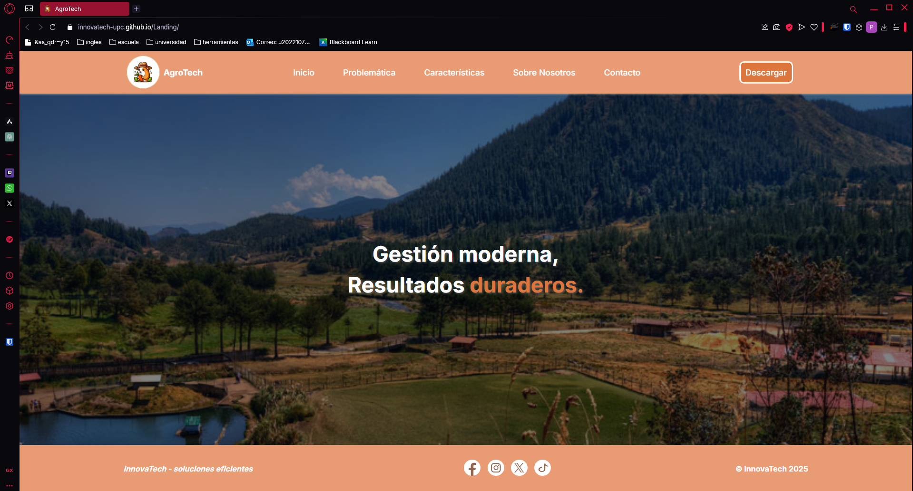
</p>

_Imagen 195. Evidencia de la Landing Page_

**Services Documentation Evidence for Sprint Review**

Para este sprint, hemos implementado una primera versión de la API con los endpoints necesarios para el funcionamiento de nuestro proyecto.

Enlace a API desplegado: <https://agrotech-zg6b.onrender.com/swagger-ui/index.html>

|Método|Endpoint|Descripción|
|--|--|--|
|GET|/api/v1/users|Se obtiene la lista de usuarios|
|GET|/api/v1/users/{id}|Se obtiene un usuario por ID|
|GET|/api/v1/appointments|Se obtiene la lista de las citas|
|POST|/api/v1/appointments|Se publica una nueva cita|
|GET|/api/v1/appointments/{id}|Se obtiene una cita por ID|
|PUT|/api/v1/appointments/{id}|Se modifica una cita por ID|
|DELETE|/api/v1/appointments/{id}|Se elimina una cita por ID|
|GET|/api/v1/available-dates|Se obtiene la lista de horarios disponibles|
|POST|/api/v1/available-dates|Se publica un nuevo horario|
|GET|/api/v1/available-dates/{id}|Se obtiene un horario por ID|
|PUT|/api/v1/available-dates/{id}|Se modifica un horario por ID|
|DELETE|/api/v1/available-dates/{id}|Se elimina un horario por ID|
|GET|/api/v1/posts|Se obtiene la lista de publicaciones|
|POST|/api/v1/posts|Se publica una nueva publicación|
|GET|/api/v1/posts/{id}|Se obtiene una publicación por ID|
|PUT|/api/v1/posts/{id}|Se modifica una publicación por ID|
|DELETE|/api/v1/posts/{id}|Se elimina una publicación por ID|
|GET|/api/v1/profiles|Se obtiene la lista de perfiles|
|GET|/api/v1/profiles/advisors|Se obtiene la lista de perfiles de los asesores|
|POST|/api/v1/profiles|Se publica un nuevo perfil|
|GET|/api/v1/profiles/{id}|Se obtiene un perfil por ID|
|GET|/api/v1/profiles/{userId}/user|Se obtiene un perfil por userID|
|PUT|/api/v1/profiles/{id}|Se modifica un perfil por ID|
|DELETE|/api/v1/profiles/{id}|Se elimina un perfil por ID|
|GET|/api/v1/advisors|Se obtiene la lista de asesores|
|POST|/api/v1/advisors|Se publica un nuevo asesor|
|GET|/api/v1/advisors/{id}|Se obtiene un asesor por ID|
|GET|/api/v1/advisors/{userId}/user|Se obtiene un asesor por userID|
|PUT|/api/v1/advisors/{id}|Se modifica un asesor por ID|
|DELETE|/api/v1/advisors/{id}|Se elimina un asesor por ID|
|GET|/api/v1/farmers|Se obtiene la lista de granjeros|
|POST|/api/v1/farmers|Se publica un nuevo granjero|
|GET|/api/v1/farmers/{id}|Se obtiene un granjero por ID|
|GET|/api/v1/farmers/{userId}/user|Se obtiene un granjero por userID|
|DELETE|/api/v1/farmers/{id}|Se elimina un granjero por ID|
|GET|/api/v1/notifications|Se obtiene la lista de notificaciones|
|POST|/api/v1/notifications|Se publica una nueva notificación|
|GET|/api/v1/notifications/{id}|Se obtiene una notificación por ID|
|GET|/api/v1/notifications/{userId}/user|Se obtiene la lista de notificaciones de un usuario|
|DELETE|/api/v1/notifications/{id}|Se elimina una notificación por ID|
|GET|/api/v1/reviews|Se obtiene la lista de reseñas|
|POST|/api/v1/reviews|Se publica una nueva reseña|
|GET|/api/v1/reviews/{id}|Se obtiene una reseña por ID|
|PUT|/api/v1/reviews/{id}|Se modifica una reseña por ID|
|DELETE|/api/v1/reviews/{id}|Se elimina una reseña por ID|
|GET|/api/v1/enclosures|Se obtiene la lista de recintos|
|POST|/api/v1/enclosures|Se publica un nuevo recinto|
|GET|/api/v1/enclosures/{id}|Se obtiene un recinto por ID|
|PUT|/api/v1/enclosures/{id}|Se modifica un recinto por ID|
|DELETE|/api/v1/enclosures/{id}|Se elimina un recinto por ID|
|GET|/api/v1/animals|Se obtiene la lista de recintos|
|POST|/api/v1/animals|Se publica un nuevo animal|
|GET|/api/v1/animals/{id}|Se obtiene un animal por ID|
|PUT|/api/v1/animals/{id}|Se modifica un animal por ID|
|DELETE|/api/v1/animals/{id}|Se elimina un animal por ID|

#### 5.2.1.2. Sprint 2

**Sprint Planning 2**

<table>
  <tr>
    <th>Sprint #</th>
    <td>Sprint 2</td>
  </tr>
  <tr>
    <th colspan="2"><strong>Sprint Planning Background</strong></th>
  </tr>
  <tr>
    <th>Date</th>
    <td>2025-04-10</td>
  </tr>
  <tr>
    <th>Time</th>
    <td>12:00 PM</td>
  </tr>
  <tr>
    <th>Location</th>
    <td>Presencial (En la universidad)</td>
  </tr>
  <tr>
    <th>Prepared by</th>
    <td>Salinas Torres, Salvador Antonio</td>
  </tr>
  <tr>
    <th>Attendees (to planning meeting)</th>
    <td>
      <p>Delgado Corrales, Piero Gonzalo</p>
      <p>La Torre Soto, Andre Sebastian</p>
      <p>Paredes Puente, Sebastian Roberto</p>
      <p>Pecan Pariona, Sergio Joel</p>
      <p>Salinas Torres, Salvador Antonio</p>
    </td>
  </tr>
  <tr>
    <th>Sprint n - 1 Review Summary</th>
    <td>Se desarrolló el Backend y la Landing Page.</td>
  </tr>
  <tr>
    <th>Sprint n - 1 Retrospective Summary</th>
    <td>Se logró trabajar en equipo y terminar de refinar el Backend y la Landing Page.</td>
  </tr>
  <tr>
    <th colspan="2"><strong>Sprint Goal & User Stories</strong></th>
  </tr>
  <tr>
    <th>Sprint 2 Goal</th>
    <td>Nuestro objetivo es implementar la Aplicación. Creemos que brindará un gran valor ya que afecta directamente la experiencia del usuario, la retención de usuarios y, en última instancia, el éxito de un negocio. Esto se confirmará cuando se haya implementado la aplicación en su totalidad y los usuarios se encuentren satisfecho con esta.</td>
  </tr>
  <tr>
    <th>Sprint 2 Velocity</th>
    <td>58</td>
  </tr>
  <tr>
    <th>Sum of Story Points</th>
    <td>58</td>
  </tr>
</table>

**Sprint Backlog 2**

<table><tr><th colspan="1" valign="top">Sprint #</th><th colspan="7" valign="top">Sprint 2</th></tr>
<tr><td colspan="2" valign="top">User Story</td><td colspan="6" valign="top">Work-Item / Task</td></tr>
<tr><td colspan="1" valign="top">Id</td><td colspan="1" valign="top">Title</td><td colspan="1" valign="top">Id</td><td colspan="1" valign="top">Title</td><td colspan="1" valign="top">Description</td><td colspan="1" valign="top">Estimation </td><td colspan="1" valign="top">Assigned To</td><td colspan="1" valign="top">Status (To-Do / In-Process / Review / Done)</td></tr>
<tr><td colspan="1" rowspan="2" valign="top">US18</td><td colspan="1" rowspan="2" valign="top">Navegación dentro de la plataforma</td><td colspan="1" valign="top">WI01</td><td colspan="1" valign="top">Implementación de toolbar (web)</td><td colspan="1" valign="top">Se implementa el toolbar y menú lateral para que el usuario pueda navegar con facilidad por la aplicación web.</td><td colspan="1" rowspan="2" valign="top">3</td><td colspan="1" valign="top">Salvador Salinas</td><td colspan="1" valign="top">Done</td></tr>
<tr><td colspan="1" valign="top">WI02</td><td colspan="1" valign="top">Implementación de pantalla de inicio (móvil)</td><td colspan="1" valign="top">Se implementa la pantalla de inicio para que el usuario pueda navegar por la aplicación móvil con facilidad.</td><td colspan="1" valign="top">Sebastian Paredes</td><td colspan="1" valign="top">Done</td></tr>
<tr><td colspan="1" rowspan="2" valign="top">US01</td><td colspan="1" rowspan="2" valign="top">Visualización del catálogo de asesores</td><td colspan="1" valign="top">WI03</td><td colspan="1" valign="top">Implementación de listado de asesores</td><td colspan="1" valign="top">Se implementa la pantalla para visualizar el listado de asesores con los cuales poder programar citas.</td><td colspan="1" rowspan="2" valign="top">2</td><td colspan="1" valign="top">Piero Delgado</td><td colspan="1" valign="top">Done</td></tr>
<tr><td colspan="1" valign="top">WI04</td><td colspan="1" valign="top">Implementación de búsqueda y filtrado</td><td colspan="1" valign="top">Se implementa la funcionalidad para buscar y filtrar asesores.</td><td colspan="1" valign="top">Sebastian Paredes</td><td colspan="1" valign="top">Done</td></tr>
<tr><td colspan="1" rowspan="2" valign="top">US02</td><td colspan="1" rowspan="2" valign="top">Visualización de información de un asesor</td><td colspan="1" valign="top">WI05</td><td colspan="1" valign="top">Implementación de vista de detalles de asesor</td><td colspan="1" valign="top">Se implementa la vista para visualizar la información esencial de un asesor específico, mostrando su descripción, ocupación y experiencia.</td><td colspan="1" rowspan="2" valign="top">2</td><td colspan="1" valign="top">Salvador Salinas</td><td colspan="1" valign="top">Done</td></tr>
<tr><td colspan="1" valign="top">WI06</td><td colspan="1" valign="top">Implementación de listado de reseñas</td><td colspan="1" valign="top">Se implementa la pantalla que muestra el listado de las reseñas del asesor realizadas por otros granjeros en la aplicación.</td><td colspan="1" valign="top">Sergio Pecan</td><td colspan="1" valign="top">Done</td></tr>
<tr><td colspan="1" rowspan="1" valign="top">US06</td><td colspan="1" rowspan="1" valign="top">Separación de horarios de disponibilidad para asesorías</td><td colspan="1" valign="top">WI07</td><td colspan="1" valign="top">Implementación de separación de horarios para asesorías</td><td colspan="1" valign="top">Se implementa la funcionalidad para que los asesores puedan gestionar sus horarios para brindar asesorías.</td><td colspan="1" rowspan="1" valign="top">5</td><td colspan="1" valign="top">Salvador Salinas</td><td colspan="1" valign="top">Done</td></tr>
<tr><td colspan="1" valign="top">US03</td><td colspan="1" valign="top">Visualización de horarios de asesores</td><td colspan="1" valign="top">WI08</td><td colspan="1" valign="top">Implementación de visualización de horarios de un asesor</td><td colspan="1" valign="top">Se implementa la vista para que el granjero pueda visualizar los horarios de disponibilidad que tiene un asesor.</td><td colspan="1" valign="top">3</td><td colspan="1" valign="top">Sebastian Paredes</td><td colspan="1" valign="top">Done</td></tr>
<tr><td colspan="1" valign="top">US04</td><td colspan="1" valign="top">Programación de citas con asesores</td><td colspan="1" valign="top">WI09</td><td colspan="1" valign="top">Implementación de vista para programar una cita</td><td colspan="1" valign="top">Se implementa la pantalla para que el granjero pueda programar una cita con un asesor.</td><td colspan="1" valign="top">5</td><td colspan="1" valign="top">Piero Delgado</td><td colspan="1" valign="top">Done</td></tr>
<tr><td colspan="1" valign="top">US05</td><td colspan="1" valign="top">Calificación del asesor luego de una cita</td><td colspan="1" valign="top">WI10</td><td colspan="1" valign="top">Implementación de calificación del asesor</td><td colspan="1" valign="top">Se implementa la vista para que el granjero pueda dejar una calificación al asesor luego de haber llevado al menos una cita con este.</td><td colspan="1" valign="top">3</td><td colspan="1" valign="top">Andre La Torre</td><td colspan="1" valign="top">Done</td></tr>
<tr><td colspan="1" valign="top">US19</td><td colspan="1" valign="top">Visualización de Historial de Citas</td><td colspan="1" valign="top">WI11</td><td colspan="1" valign="top">Implementación de listado de citas</td><td colspan="1" valign="top">Se implementa la pantalla para que el usuario pueda visualizar el listado de citas que ha tenido.</td><td colspan="1" valign="top">3</td><td colspan="1" valign="top">Sebastian Paredes</td><td colspan="1" valign="top">Done</td></tr>
<tr><td colspan="1" valign="top">US20</td><td colspan="1" valign="top">Cancelación de citas</td><td colspan="1" valign="top">WI12</td><td colspan="1" valign="top">Implementación de funcionalidad para cancelar citas</td><td colspan="1" valign="top">Se implementa la funcionalidad que permite al usuario cancelar su cita antes de tiempo.</td><td colspan="1" valign="top">2</td><td colspan="1" valign="top">Piero Delgado</td><td colspan="1" valign="top">Done</td></tr>
<tr><td colspan="1" valign="top">US21</td><td colspan="1" valign="top">Búsqueda y Filtrado de Citas</td><td colspan="1" valign="top">WI13</td><td colspan="1" valign="top">Implementación de búsqueda y filtrado de citas</td><td colspan="1" valign="top">Se implementa la funcionalidad de búsqueda para filtrar el listado de citas por una fecha específica.</td><td colspan="1" valign="top">3</td><td colspan="1" valign="top">Sergio Pecan</td><td colspan="1" valign="top">Done</td></tr>
<tr><td colspan="1" valign="top">US22</td><td colspan="1" valign="top">Gestión de recintos</td><td colspan="1" valign="top">WI14</td><td colspan="1" valign="top">Implementación de gestión de recintos</td><td colspan="1" valign="top">Se implementa la funcionalidad de gestión de recintos para que los granjeros puedan ver, editar y eliminar sus recintos de animales.</td><td colspan="1" valign="top">5</td><td colspan="1" valign="top">Piero Delgado, Salvador Salinas</td><td colspan="1" valign="top">Done</td></tr>
<tr><td colspan="1" valign="top">US23</td><td colspan="1" valign="top">Gestión de animales</td><td colspan="1" valign="top">WI15</td><td colspan="1" valign="top">Implementación de gestión de animales</td><td colspan="1" valign="top">Se implementa la funcionalidad de gestión de recintos para que los granjeros puedan ver, editar y eliminar los animales de sus recintos.</td><td colspan="1" valign="top">5</td><td colspan="1" valign="top">Piero Delgado, Salvador Salinas</td><td colspan="1" valign="top">Done</td></tr>
<tr><td colspan="1" valign="top">US07</td><td colspan="1" valign="top">Gestión de publicaciones de asesores</td><td colspan="1" valign="top">WI16</td><td colspan="1" valign="top">Implementación de gestión de publicaciones</td><td colspan="1" valign="top">Se implementa la funcionalidad de gestión de publicaciones para que los asesores puedan ver, editar y eliminar sus publicaciones.</td><td colspan="1" valign="top">5</td><td colspan="1" valign="top">Sebastian Paredes</td><td colspan="1" valign="top">Done</td></tr>
<tr><td colspan="1" valign="top">US08</td><td colspan="1" valign="top">Visualización de publicaciones de los asesores</td><td colspan="1" valign="top">WI17</td><td colspan="1" valign="top">Implementación de vista para explorar publicaciones de los asesores</td><td colspan="1" valign="top">Se implementa la vista para que los granjeros puedan ver las publicaciones de los asesores.</td><td colspan="1" valign="top">2</td><td colspan="1" valign="top">Sebastian Paredes, Piero Delgado</td><td colspan="1" valign="top">Done</td></tr>
<tr><td colspan="1" rowspan="2" valign="top">US09</td><td colspan="1" rowspan="2" valign="top">Registro de un usuario nuevo</td><td colspan="1" valign="top">WI18</td><td colspan="1" valign="top">Implementación de registro de usuario Granjero</td><td colspan="1" valign="top">Se implementa la vista para que un granjero pueda crear su nueva cuenta.</td><td colspan="1" rowspan="2" valign="top">3</td><td colspan="1" valign="top">Sebastian Paredes</td><td colspan="1" valign="top">Done</td></tr>
<tr><td colspan="1" valign="top">WI19</td><td colspan="1" valign="top">Implementación de registro de usuario Asesor</td><td colspan="1" valign="top">Se implementa la vista para que un asesor pueda crear su nueva cuenta.</td><td colspan="1" valign="top">Salvador Salinas</td><td colspan="1" valign="top">Done</td></tr>
<tr><td colspan="1" valign="top">US10</td><td colspan="1" valign="top">Inicio de sesión</td><td colspan="1" valign="top">WI20</td><td colspan="1" valign="top">Implementación de inicio de sesión</td><td colspan="1" valign="top">Se implementa la vista para que el usuario pueda iniciar sesión.</td><td colspan="1" valign="top">2</td><td colspan="1" valign="top">Piero Delgado</td><td colspan="1" valign="top">Done</td></tr>
<tr><td colspan="1" valign="top">US11</td><td colspan="1" valign="top">Visualización de notificaciones del usuario</td><td colspan="1" valign="top">WI21</td><td colspan="1" valign="top">Implementación de vista de notificaciones</td><td colspan="1" valign="top">Se implementa la vista que muestra el listado de las notificaciones del usuario.</td><td colspan="1" valign="top">2</td><td colspan="1" valign="top">Piero Delgado</td><td colspan="1" valign="top">Done</td></tr>
<tr><td colspan="1" valign="top">US12</td><td colspan="1" valign="top">Modificar perfil de usuario</td><td colspan="1" valign="top">WI22</td><td colspan="1" valign="top">Implementación de vista para modificar perfil de granjero</td><td colspan="1" valign="top">Se implementa la vista que permite al usuario granjero modificar los datos de su perfil.</td><td colspan="1" valign="top">3</td><td colspan="1" valign="top">Sebastian Paredes</td><td colspan="1" valign="top">Done</td></tr>
</table>

**Development Evidence for Sprint Review**

A continuación, se detallan los commits realizados, los cuales se trabajaron a partir de las tareas asignadas a cada miembro como se muestra en el Sprint Backlog 2. De este modo, se trabajó en la aplicación web y móvil.

Repositorio Frontend web: <https://github.com/InnovaTech-UPC/Frontend>

Repositorio Mobile App: <https://github.com/InnovaTech-UPC/Mobile>

|**Repository**|**Branch**|**Commit Id**|**Commit Message**|**Commited on (Date)**|
| :- | :- | :- | :- | :- |
|InnovaTech-UPC/Mobile|main|7ba1de3|feat: base project added|02/04/2025|
|InnovaTech-UPC/Mobile|develop|7ba1de3|feat: rename startup name in config files|03/04/2025|
|InnovaTech-UPC/Mobile|feature/advisor-view|4503173|feat: advisor home logic added|07/04/2025|
|InnovaTech-UPC/Mobile|feature/advisor-view|0195668|feat: buttons notifications and menu added|07/04/2025|
|InnovaTech-UPC/Mobile|feature/advisor-view|1a4b905|feat: cards for advisorHomeScreen styles updated|09/04/2025|
|InnovaTech-UPC/Mobile|feature/advisor-view|9f0fd81|feat: advisorHomeScreen section final styles added|09/04/2025|
|InnovaTech-UPC/Mobile|feature/advisor-view|3686784|feat: final styles for advisor home screen|09/04/2025|
|InnovaTech-UPC/Mobile|feature/advisor-view|cf813a5|feat: align items for home screen|09/04/2025|
|InnovaTech-UPC/Mobile|feature/advisor-view|a40f704|feat: Update advisorHomeScreen|10/04/2025|
|InnovaTech-UPC/Mobile|feature/advisor-view|3cf5950|feat: add advisor posts|10/04/2025|
|InnovaTech-UPC/Mobile|feature/advisor-view|0269cfc|feat: datapicker dialog added for create account farmer forms|10/04/2025|
|InnovaTech-UPC/Mobile|feature/advisor-view|55a30a8|feat: add post detail|10/04/2025|
|InnovaTech-UPC/Mobile|feature/advisor-view|92a6cba|feat: add create post|10/04/2025|
|InnovaTech-UPC/Mobile|feature/advisor-view|bfd888a|feat: create account for advisors files added|10/04/2025|
|InnovaTech-UPC/Mobile|feature/advisor-view|964cd49|feat: advisor appointments list screen added|12/04/2025|
|InnovaTech-UPC/Mobile|feature/advisor-view|96b02e5|feat: advisor appointments history screen added|12/04/2025|
|InnovaTech-UPC/Frontend|main|285bc89|feat: base frontend|13/04/2025|
|InnovaTech-UPC/Frontend|develop|bd27627|refactor: move folders to correct location|13/04/2025|
|InnovaTech-UPC/Frontend|feature/profile|3ef8cc3|style: improve error titles and error layout|13/04/2025|
|InnovaTech-UPC/Frontend|feature/profile|d814b91|feat(profile): profile page (to update data)|14/04/2025|
|InnovaTech-UPC/Frontend|feature/management|dc3b338|feat(management): enclosure management|15/04/2025|
|InnovaTech-UPC/Frontend|feature/management|abb9bf8|feat(management): animals management|15/04/2025|
|InnovaTech-UPC/Frontend|feature/management|9aab7fa|feat(management): add routes + register animal|15/04/2025|
|InnovaTech-UPC/Mobile|feature/advisor-view|416cad7|feat: appointment detail screen added|15/04/2025|
|InnovaTech-UPC/Mobile|feature/advisor-view|851b19d|feat: delete appointment screen added|15/04/2025|
|InnovaTech-UPC/Mobile|feature/advisor-view|533e2ce|feat: detail for completed appointments screen added|15/04/2025|
|InnovaTech-UPC/Frontend|feature/management|649a0f7|style: update header style (arrow back + title)|16/04/2025|
|InnovaTech-UPC/Frontend|feature/advisor-available-dates|03e830a|feat(advisor view): list available dates|16/04/2025|
|InnovaTech-UPC/Mobile|feature/advisor-view|ec9c5c9|feat: AdvisorAvailableDatesScreen added (styles will be implemented later)|16/04/2025|
|InnovaTech-UPC/Mobile|feature/advisor-view|629c635|feat: Styles for AdvisorAvailableDates added|16/04/2025|
|InnovaTech-UPC/Mobile|feature/advisor-view|a5a14b1|fix: advisor relogin redirects to correct route|17/04/2025|
|InnovaTech-UPC/Mobile|feature/advisor-view|eab83d2|feat: add advisor profile screen|17/04/2025|
|InnovaTech-UPC/Mobile|feature/farmer-view|37d359b|refactor: improve farmer profile functionality|17/04/2025|
|InnovaTech-UPC/Mobile|feature/farmer-view|58f4300|chore: remove recover password screens|17/04/2025|
|InnovaTech-UPC/Mobile|feature/farmer-view|0b1085e|feat: add animal & enclosure data logic|17/04/2025|
|InnovaTech-UPC/Mobile|feature/farmer-view|f1fb3c3|fix: missing filter for upcoming appointment|17/04/2025|
|InnovaTech-UPC/Mobile|feature/farmer-view|94761b0|feat: add advisor profile missing navigation|18/04/2025|
|InnovaTech-UPC/Mobile|feature/farmer-view|bafa02e|feat: add enclosure list|18/04/2025|
|InnovaTech-UPC/Mobile|feature/farmer-view|34dc1bd|feat: add animal list|18/04/2025|
|InnovaTech-UPC/Mobile|feature/farmer-view|2c139b6|feat: change app icon|18/04/2025|
|InnovaTech-UPC/Mobile|feature/farmer-view|a217db5|feat: add animal details|18/04/2025|
|InnovaTech-UPC/Mobile|feature/farmer-view|f45b9e0|fix(advisor-home): layout error|20/04/2025|
|InnovaTech-UPC/Frontend|develop|d149d0c|chore: setup product environment|21/04/2025|
|InnovaTech-UPC/Frontend|develop|d40af46|style: remove inter font|21/04/2025|
|InnovaTech-UPC/Mobile|develop|8f19215|feat: color for buttons of available dates screen changed|21/04/2025|
|InnovaTech-UPC/Mobile|develop|5976f24|feat: text of forms changed|21/04/2025|
|InnovaTech-UPC/Mobile|develop|aaf974c|feat: styles for buttons from other screen changed|21/04/2025|
|InnovaTech-UPC/Mobile|develop|59e67f5|feat: styles for card in AnimalListScreen updated|21/04/2025|
|InnovaTech-UPC/Mobile|develop|9a87961|feat: add gender attribute to animal|21/04/2025|
|InnovaTech-UPC/Frontend|develop|10ef750|fix: get profile for the review (farmer view)|22/04/2025|

**Execution Evidence for Sprint Review**

Se culminó la implementación de la aplicación tanto web como móvil. La aplicación web fue desarrollada utilizando Angular y la aplicación móvil fue desarrollada utilizando Kotlin. Ambas aplicaciones fueron probadas en diferentes navegadores y dispositivos Android, asegurando su correcto funcionamiento y adaptabilidad a diferentes tamaños de pantalla.
Incluye funcionalidades como la gestión de citas, visualización del catálogo de asesores, la gestión de publicaciones, gestión de recintos (exclusiva para granjeros) y la gestión del perfil del usuario. La API RESTful fue implementada utilizando Spring Boot, permitiendo la comunicación entre el frontend y el backend de la aplicación.

También se grabó un video que proporciona información sobre el producto AgroTech, mencionando las diferentes funcionalidades de la aplicación.

[Enlace a video de ejecución web](https://upcedupe-my.sharepoint.com/:v:/g/personal/u20221b127_upc_edu_pe/EeL3CcdTWYdDlby12SlapGYBGscuD8InPVcQhnF387RNew?nav=eyJyZWZlcnJhbEluZm8iOnsicmVmZXJyYWxBcHAiOiJPbmVEcml2ZUZvckJ1c2luZXNzIiwicmVmZXJyYWxBcHBQbGF0Zm9ybSI6IldlYiIsInJlZmVycmFsTW9kZSI6InZpZXciLCJyZWZlcnJhbFZpZXciOiJNeUZpbGVzTGlua0NvcHkifX0&e=YezPEO) 

[Enlace a página web desplegada](https://agrotech-ten.vercel.app/)

<p align="center">
  
</p>

_Imagen 196. Evidencia de la Aplicación Web_


[Enlace a video de ejecución móvil](https://upcedupe-my.sharepoint.com/:v:/g/personal/u20201a938_upc_edu_pe/EVB5oaspy_NFr3WUnyYCmU0Bewvg0rwNwSspjwrGNluSXg?e=c6FuLs&nav=eyJyZWZlcnJhbEluZm8iOnsicmVmZXJyYWxBcHAiOiJTdHJlYW1XZWJBcHAiLCJyZWZlcnJhbFZpZXciOiJTaGFyZURpYWxvZy1MaW5rIiwicmVmZXJyYWxBcHBQbGF0Zm9ybSI6IldlYiIsInJlZmVycmFsTW9kZSI6InZpZXcifX0%3D)

<p align="center">
  
</p>

_Imagen 197. Evidencia de la Aplicación Móvil_


### 5.2.2 Implemented Landing Page Evidence

La landing page fue desarrollada utilizando HTML, CSS y JavaScript. Se implementaron funcionalidades como la visualización de información sobre la aplicación, la gestión de citas, la visualización del catálogo de asesores, la gestión de publicaciones y la gestión del perfil del usuario. La landing page fue probada en diferentes navegadores asegurando su correcto funcionamiento y adaptabilidad a diferentes tamaños de pantalla.

<https://innovatech-upc.github.io/Landing/>


_Imagen 198. Evidencia del funcionamiento de la landing page_

### 5.2.3. Implemented Frontend-Web Application Evidence

La aplicación web AgroTech fue desarrollada utilizando Angular. Se implementaron funcionalidades como la gestión de citas, la visualización del catálogo de asesores, la gestión de publicaciones y la gestión del perfil del usuario. La aplicación fue probada en diferentes navegadores asegurando su correcto funcionamiento y adaptabilidad a diferentes tamaños de pantalla.

<https://agrotech-ten.vercel.app/>


_Imagen 199. Evidencia del funcionamiento de la aplicación web (Granjero)_


_Imagen 200. Evidencia del funcionamiento de la aplicación web (Asesor)_

### 5.2.4. Acuerdo de Servicio - SaaS

A continuación, se muestra el acuerdo de servicio que se encuentra en la aplicación web y móvil. Este acuerdo es un documento legal que establece los términos y condiciones bajo los cuales los usuarios pueden utilizar la aplicación AgroTech. El acuerdo incluye información sobre la propiedad intelectual, la responsabilidad del usuario, la limitación de responsabilidad, la política de privacidad y otros aspectos legales relevantes.

**1. Aceptación del Acuerdo**

Al registrarse o utilizar AgroTech, el usuario acepta los términos establecidos en este Acuerdo de Servicio. Este documento regula el uso de la plataforma SaaS AgroTech, integrada en los presentes Términos y Condiciones.

**2. Descripción del Servicio**

AgroTech es una plataforma digital que ofrece:

a) A los granjeros: acceso a un catálogo de asesores, asesorías virtuales con asesores a través de videollamadas (mediante Jitsi Meet), y un sistema de gestión de granjas que permite registrar recintos y animales.

b) A los asesores: la posibilidad de crear un perfil profesional, gestionar horarios de asesoría y realizar publicaciones sobre servicios de asesoría dentro de la plataforma para ser contactados por granjeros que requieran asistencia especializada.

**3. Licencia de Uso**

InnovaTech otorga al usuario una licencia limitada, no exclusiva, intransferible y revocable para acceder y utilizar la plataforma AgroTech conforme a este acuerdo.

**4. Obligaciones del Usuario**

El usuario (granjero y asesor) se compromete a:

- Utilizar la plataforma de forma legal y ética.
- Proporcionar información veraz y actualizada.
- Mantener la confidencialidad de sus credenciales.
- No vulnerar la seguridad, integridad o disponibilidad del servicio.

Los asesores se comprometen a:

- Publicar únicamente servicios que estén calificados para ofrecer.
- Mantener la calidad, claridad y veracidad de sus publicaciones.
- Cumplir con las asesorías acordadas con los granjeros.
- No ofrecer servicios fraudulentos, inseguros o contrarios a la ley.

**5. Disponibilidad y Soporte**

InnovaTech realizará esfuerzos razonables para asegurar la disponibilidad continua del servicio. Sin embargo, no se garantiza un tiempo de actividad del 100%. Se ofrecerá soporte técnico a través de canales oficiales publicados en la plataforma.

**6. Privacidad y Protección de Datos**

InnovaTech se compromete a proteger la información personal y operativa de sus usuarios, conforme a la normativa aplicable en materia de protección de datos. La política de privacidad complementa este acuerdo.

**7. Propiedad Intelectual**

Todos los derechos sobre el software, diseño, marca y contenidos de InnovaTech pertenecen a sus respectivos titulares. El usuario no adquiere ningún derecho sobre el código fuente ni puede reproducirlo, modificarlo o distribuirlo.

**8. Limitación de Responsabilidad**

InnovaTech no se hace responsable por:

- Resultados de las asesorías brindadas por los expertos.
- Pérdidas por uso incorrecto de la plataforma.
- Daños causados por terceros no relacionados con AgroTech.

**9. Modificaciones**

InnovaTech podrá modificar este Acuerdo en cualquier momento. Los cambios se notificarán mediante publicación en el sitio web o la plataforma. El uso continuado del servicio implica la aceptación de dichos cambios.

**10. Terminación del Servicio**

El usuario puede cancelar su cuenta en cualquier momento. InnovaTech se reserva el derecho de suspender o eliminar cuentas que violen estos términos, sin previo aviso.

### 5.2.5. Implemented Native-Mobile Application Evidence

La aplicación móvil AgroTech fue desarrollada utilizando Kotlin. Se implementaron funcionalidades como la gestión de citas, la visualización del catálogo de asesores, la gestión de publicaciones y la gestión del perfil del usuario. La aplicación fue probada en dispositivos Android, asegurando su correcto funcionamiento y adaptabilidad a diferentes tamaños de pantalla.


_Imagen 201. Evidencia del funcionamiento de la aplicación móvil (Granjero)_


_Imagen 202. Evidencia del funcionamiento de la aplicación móvil (Asesor)_

### 5.2.6. Implemented RESTful API and/or Serverless Backend Evidence

Se implementó una API RESTful utilizando Spring Boot, que permite la comunicación entre el frontend y el backend de la aplicación. Esta API incluye varios endpoints para gestionar los recursos necesarios, como usuarios, productos y citas. Para comprobar la implementación de la API, se realizaron solicitudes HTTP a los diferentes endpoints utilizando Swagger, lo que permitió verificar que la API respondía correctamente a las solicitudes y devolvía los datos esperados.

<https://agrotech-zg6b.onrender.com/swagger-ui/index.html>


_Imagen 203. Evidencia del funcionamiento del backend (Sign Up)_


_Imagen 204. Evidencia del funcionamiento del backend (Sign In)_


_Imagen 205. Evidencia del funcionamiento del backend (Profiles)_


_Imagen 206. Evidencia del funcionamiento del backend (Available Dates)_

### 5.2.7. RESTful API documentation

Para la documentación de la API RESTful, se utilizó la herramienta Swagger. Esta herramienta nos proporciona una interfaz gráfica donde se pueden explorar los diferentes endpoints de la API, ver los parámetros requeridos y las respuestas esperadas.


_Imagen 207. RESTful API Documentation con Swagger_

### 5.2.8. Team Collaboration Insights

La colaboración del equipo fue fundamental para el éxito del proyecto. Se utilizó GitHub como plataforma principal para la gestión del código y la documentación. Cada miembro del equipo trabajó en diferentes ramas, lo que permitió un desarrollo paralelo y una integración continua. Además, se realizaron reuniones periódicas para revisar el progreso, discutir problemas y planificar las siguientes etapas del desarrollo.


## 5.3 Video About-the-Product

En el vídeo se proporciona información sobre el producto AgroTech. Se mencionan las diferentes funcionalidades de la aplicación como son la visualización del catálogo de asesores, la gestión de citas, visualización de publicaciones, etc.


_Imagen 208. Video About The Product_

Enlace al vídeo de Microsoft Stream: [Video About The Product](https://upcedupe-my.sharepoint.com/:v:/g/personal/u202210749_upc_edu_pe/ERS-UfdGpCZHkg0UmAZPV-IB3-JkXhLcJXp_3o-s8orlvg?e=Qh8htY)

<div style="page-break-after: always;"></div>

# Capítulo VI: Product Verification & Validation

## 6.1. Testing Suites & Validation

Para garantizar la calidad del producto, se implementaron diferentes tipos de pruebas a lo largo del ciclo de desarrollo. Estas pruebas abarcaron desde pruebas unitarias hasta pruebas de sistema, asegurando que cada componente del sistema funcionara correctamente y cumpliese con los requisitos establecidos.

Hasta el momento, se han realizado pruebas que alcanzan una cobertura del 84% en el código de la API RESTful, lo que indica un alto nivel de calidad y fiabilidad en el sistema. Estas pruebas se llevaron a cabo utilizando herramientas como JUnit y Mockito para el backend.


_Imagen 209. Coverage Report_

### 6.1.1. Core Entities Unit Tests
Se desarrollaron pruebas unitarias enfocadas en las entidades principales del sistema, incluyendo modelos de datos, clases de lógica de negocio y funciones utilitarias.
Cada prueba se ejecutó en aislamiento para garantizar que las funcionalidades individuales funcionen de forma correcta y coherente con los requisitos funcionales. Se aplicó el principio de test-driven development (TDD) para asegurar cobertura desde las etapas tempranas del desarrollo.

**Resumen de pruebas unitarias en Agrotech API**

Las pruebas implementadas en los distintos módulos del proyecto utilizan principalmente **JUnit 5** para la ejecución de tests y **Mockito** para la simulación (mocking) de dependencias externas como repositorios, servicios y entidades relacionadas. En algunos casos, también se emplea la validación con **Jakarta Validation** y se integran pruebas de eventos con **Spring Boot Test**.

1. Pruebas de comandos y servicios de dominio

- **PostCommandServiceImplTest**  
  Verifica que un post se cree correctamente con un comando válido y un advisor existente. Asegura la correcta interacción con repositorios y servicios externos.

- **EnclosureCommandServiceImplTest y EnclosureTest**  
  Validan la creación de un enclosure con datos válidos y también con valores nulos, asegurando que el objeto se construye correctamente y maneja valores nulos sin fallos. Comprueba la inicialización adecuada de listas internas como la de animales.

- **AnimalCommandServiceImplTest**  
  Confirma que un animal puede ser creado cuando el enclosure existe y que la persistencia retorna el ID esperado.

**Ejemplo: Prueba para el command service de animal**

```java
class AnimalCommandServiceImplTest {
    @Mock
    private AnimalRepository animalRepository;
    @Mock
    private EnclosureRepository enclosureRepository;
    @InjectMocks
    private AnimalCommandServiceImpl animalCommandService;
    @BeforeEach
    void setUp() {
        MockitoAnnotations.openMocks(this);
    }

    // Successfully create a new animal with valid CreateAnimalCommand and existing enclosure
    @Test
    public void test_handle_create_animal_command_with_valid_data_returns_animal_id() {
        // Arrange
        Long enclosureId = 1L;
        Long expectedAnimalId = 1L;

        CreateAnimalCommand command = new CreateAnimalCommand(
                "Bessie",
                3,
                "Cow",
                "Holstein",
                true,
                450.5f,
                "HEALTHY",
                enclosureId
        );

        // Crea un EnclosureEntity (no Enclosure)
        EnclosureEntity mockEnclosureEntity = new EnclosureEntity();
        mockEnclosureEntity.setId(enclosureId);

        // Crea un AnimalEntity simulado con ID
        AnimalEntity savedAnimalEntity = new AnimalEntity();
        savedAnimalEntity.setId(expectedAnimalId);

        // Configura mocks correctamente
        when(enclosureRepository.findById(enclosureId)).thenReturn(Optional.of(mockEnclosureEntity));
        when(animalRepository.save(any(AnimalEntity.class))).thenReturn(savedAnimalEntity);

        // Act
        Long actualAnimalId = animalCommandService.handle(command);

        // Assert
        assertEquals(expectedAnimalId, actualAnimalId);
        verify(animalRepository).save(any(AnimalEntity.class));
        verify(enclosureRepository).findById(enclosureId);
    }
}
```

2. Pruebas de modelo y validación

- **RoleTest**  
  Asegura la correcta conversión entre strings y enums para roles, validando tanto entradas válidas como inválidas (nulos), y que se lance la excepción adecuada ante errores.

- **UserTest**  
  Verifica que al crear un usuario las colecciones internas se inicializan vacías y que la validación de formato de username (email) funciona correctamente, detectando violaciones cuando corresponde.

**Ejemplo: Prueba para el usuario**

```java
class UserTest {
    // Creating a User with username and password initializes empty roles collection
    @Test
    public void test_user_constructor_initializes_empty_collections() {
        // Arrange
        String username = "test@example.com";
        String password = "password123";

        // Act
        User user = new User(username, password);

        // Assert
        assertEquals(username, user.getUsername());
        assertEquals(password, user.getPassword());
        assertNotNull(user.getRoles());
        assertTrue(user.getRoles().isEmpty());
    }
}
```

3. Pruebas de consulta y eventos

- **RoleQueryServiceImplTest**  
  Comprueba que la consulta de roles retorna todos los roles existentes, incluso cuando se recibe un parámetro nulo.

- **ApplicationReadyEventHandlerTest**  
  Simula el evento de inicio de la aplicación para verificar que se llama al servicio encargado de crear roles iniciales (seed). También prueba la propagación correcta de excepciones en caso de error.

**Ejemplo: Prueba para ApplicationReadyEventHandler**

```java
class ApplicationReadyEventHandlerTest {
    // Event handler correctly calls roleCommandService.handle with a new SeedRolesCommand
    @Test
    public void test_on_application_ready_calls_role_command_service() {
        // Arrange
        RoleCommandService mockRoleCommandService = Mockito.mock(RoleCommandService.class);
        ApplicationReadyEventHandler handler = new ApplicationReadyEventHandler(mockRoleCommandService);
        ApplicationReadyEvent mockEvent = Mockito.mock(ApplicationReadyEvent.class);
        ConfigurableApplicationContext mockContext = Mockito.mock(ConfigurableApplicationContext.class);

        Mockito.when(mockEvent.getApplicationContext()).thenReturn(mockContext);
        Mockito.when(mockContext.getId()).thenReturn("test-application");

        // Act
        handler.on(mockEvent);

        // Assert
        Mockito.verify(mockRoleCommandService).handle(Mockito.any(SeedRolesCommand.class));
    }
    // Handling when roleCommandService throws an exception
    @Test
    public void test_on_application_ready_handles_exception_from_role_command_service() {
        // Arrange
        RoleCommandService mockRoleCommandService = Mockito.mock(RoleCommandService.class);
        ApplicationReadyEventHandler handler = new ApplicationReadyEventHandler(mockRoleCommandService);
        ApplicationReadyEvent mockEvent = Mockito.mock(ApplicationReadyEvent.class);
        ConfigurableApplicationContext mockContext = Mockito.mock(ConfigurableApplicationContext.class);

        Mockito.when(mockEvent.getApplicationContext()).thenReturn(mockContext);
        Mockito.when(mockContext.getId()).thenReturn("test-application");
        Mockito.doThrow(new RuntimeException("Test exception")).when(mockRoleCommandService).handle(Mockito.any(SeedRolesCommand.class));

        // Act & Assert
        assertThrows(RuntimeException.class, () -> handler.on(mockEvent));
        Mockito.verify(mockRoleCommandService).handle(Mockito.any(SeedRolesCommand.class));
    }
}
```

4. Pruebas de dominio de citas y notificaciones

- **CreateNotificationByAppointmentCancelledTest**  
  Valida la creación correcta de un evento de notificación cuando una cita es cancelada.

- **AvailableDateTest y AppointmentTest**  
  Garantizan que la creación de fechas disponibles y citas asigna los atributos correctos y establece estados iniciales adecuados como AVAILABLE y PENDING.

- **AppointmentDeletedEventHandlerTest**  
  Verifica que al eliminar una cita se actualice el estado de la fecha disponible y se cree la notificación correspondiente para el usuario.

- **ReviewCommandServiceImplTest**  
  Asegura que la creación de una review actualiza correctamente el rating del advisor y persiste los datos como se espera.

- **AvailableDateCommandServiceImplTest**  
  Comprueba que cuando el advisor no existe al crear una fecha disponible, se lanza la excepción `AdvisorNotFoundException` y no se persiste la entidad.

**Ejemplo: Prueba para el Appointment**

```java
class AppointmentTest {
    // Creating a new Appointment with valid CreateAppointmentCommand sets correct initial values
    @Test
    public void test_create_appointment_with_valid_command_sets_correct_values() {
        // Arrange
        Long availableDateId = 1L;
        Long farmerId = 2L;
        String message = "I would like to schedule an appointment";

        CreateAppointmentCommand command = new CreateAppointmentCommand(availableDateId, farmerId, message);

        Farmer farmer = mock(Farmer.class);
        when(farmer.getId()).thenReturn(farmerId);

        AvailableDate availableDate = mock(AvailableDate.class);
        when(availableDate.getId()).thenReturn(availableDateId);

        // Act
        Appointment appointment = Appointment.create(command, farmer, availableDate);

        // Assert
        assertEquals(message, appointment.getMessage());
        assertEquals(AppointmentStatus.PENDING, appointment.getStatus());
        assertEquals(farmer, appointment.getFarmer());
        assertEquals(availableDate, appointment.getAvailableDate());
        assertNotNull(appointment.getMeetingUrl());
        assertEquals(farmerId, appointment.getFarmerId());
        assertEquals(availableDateId, appointment.getAvailableDateId());
        assertEquals("PENDING", appointment.getAppointmentStatus());
    }
}
```

**Objetivos clave de las pruebas unitarias**

- Asegurar la correcta creación y persistencia de entidades clave (posts, enclosures, animales, citas, roles, reviews).  
- Validar el comportamiento correcto ante entradas válidas e inválidas, incluyendo manejo de excepciones.  
- Confirmar la integración y comunicación entre servicios, repositorios y eventos del sistema.  
- Garantizar la robustez y estabilidad del backend frente a condiciones de error y casos límites.  


El éxito de estas pruebas permitió detectar y corregir errores lógicos de manera temprana en el ciclo de desarrollo.


_Imagen 210. Unit Tests_

### 6.1.2. Core Integration Tests

Las pruebas de integración se enfocaron en verificar el correcto funcionamiento de los módulos en conjunto, validando las interacciones entre los repositorios, servicios y controladores de los distintos bounded contexts.

Estas pruebas aseguraron que las diferentes partes del sistema se comunican de manera fluida, detectando problemas de integración como errores de validación y gestión de excepciones.

**IAM bounded context**

Se realizaron pruebas de integración en los controladores de Authentication, User y Roles, asegurando que los endpoints funcionen correctamente. Estas pruebas incluyeron la verificación de la creación de usuarios, inicio de sesión y asignación de roles.

Por ejemplo, se validó el proceso de creación de un nuevo usuario y su asignación a un rol específico, asegurando que la información se almacene correctamente en la base de datos.

```java
@SpringBootTest(classes = AgrotechApplication.class)
@AutoConfigureMockMvc
@Transactional
@TestInstance(TestInstance.Lifecycle.PER_METHOD)
class AuthenticationControllerIntegrationTest {

    @Autowired
    private MockMvc mockMvc;

    @Autowired
    private ObjectMapper objectMapper;

    @Test
    void signUpWithValidDataReturnsCreated() throws Exception {
        // Arrange
        SignUpResource request = new SignUpResource(
                "user_" + UUID.randomUUID() + "@test.com", "password", List.of("ROLE_USER")
        );
        // Act
        mockMvc.perform(post("/api/v1/authentication/sign-up")
                        .contentType(MediaType.APPLICATION_JSON)
                        .content(objectMapper.writeValueAsString(request)))
                // Assert
                .andExpect(status().isCreated())
                .andExpect(jsonPath("$.username").value(request.username()));
    }

    @Test
    void signUpWithExistingEmailReturnsBadRequest() throws Exception {
        // Arrange
        String username = "existinguser@test.com";

        // Act
        SignUpResource request = new SignUpResource(username, "password", List.of("ROLE_USER"));
        mockMvc.perform(post("/api/v1/authentication/sign-up")
                        .contentType(MediaType.APPLICATION_JSON)
                        .content(objectMapper.writeValueAsString(request)))
                .andExpect(status().isCreated());

        // Second sign-up with same username
        mockMvc.perform(post("/api/v1/authentication/sign-up")
                        .contentType(MediaType.APPLICATION_JSON)
                        .content(objectMapper.writeValueAsString(request)))
                // Assert
                .andExpect(status().isBadRequest());
    }

    @Test
    void signInWithCorrectCredentialsReturnsOk() throws Exception {
        // Arrange
        String username = "validuser@test.com";
        String password = "password";

        // Act
        SignUpResource signUp = new SignUpResource(username, password, List.of("ROLE_USER"));
        mockMvc.perform(post("/api/v1/authentication/sign-up")
                        .contentType(MediaType.APPLICATION_JSON)
                        .content(objectMapper.writeValueAsString(signUp)))
                .andExpect(status().isCreated());

        SignInResource signIn = new SignInResource(username, password);
        mockMvc.perform(post("/api/v1/authentication/sign-in")
                        .contentType(MediaType.APPLICATION_JSON)
                        .content(objectMapper.writeValueAsString(signIn)))
                // Assert
                .andExpect(status().isOk())
                .andExpect(jsonPath("$.token").isNotEmpty())
                .andExpect(jsonPath("$.id").isNumber());
    }

    @Test
    void signInWithInvalidCredentialsReturnsBadRequest() throws Exception {
        // Arrange
        SignInResource signIn = new SignInResource("nonexistent@test.com", "wrongpassword");
        // Act
        mockMvc.perform(post("/api/v1/authentication/sign-in")
                        .contentType(MediaType.APPLICATION_JSON)
                        .content(objectMapper.writeValueAsString(signIn)))
                // Assert
                .andExpect(status().isBadRequest());
    }
}
```


_Imagen 211. IAM Integration Tests_


**Management bounded context**

Se realizaron pruebas de integración en los controladores de Animal y Enclosure, asegurando que los endpoints funcionen correctamente. Estas pruebas incluyeron la verificación de la creación, actualización, eliminación y consulta de información de animales y recintos.

Por ejemplo, se validó el proceso de creación de un recinto asociado a un granjero, asegurando que la información se almacene correctamente en la base de datos. Asimismo, se hizo un setup de datos inicial para facilitar la ejecución de las pruebas, generando un usuario, un granjero y un token de acceso para que no se requiera un inicio de sesión manual en cada prueba.

```java
@SpringBootTest(classes = AgrotechApplication.class)
@AutoConfigureMockMvc
@Transactional
@TestInstance(TestInstance.Lifecycle.PER_METHOD)
class EnclosuresControllerIntegrationTest {
    @Autowired
    private MockMvc mockMvc;
    @Autowired
    private ObjectMapper objectMapper;
    @Autowired
    private FarmerCommandService farmerCommandService;
    @Autowired
    private FarmerQueryService farmerQueryService;
    @Autowired
    private EnclosureCommandService enclosureCommandService;
    @Autowired
    private EnclosureQueryService enclosureQueryService;
    @Autowired
    private UserCommandService userCommandService;

    private String token;
    private Farmer farmer;

    @BeforeEach
    void setup() throws Throwable { // fail es un Throwable
        User user = userCommandService.handle(new SignUpCommand("testuser@example.com", "password", List.of(Role.getDefaultRole())))
                .orElseThrow(() -> fail("User creation failed"));
        ImmutablePair<User, String> signInResult = userCommandService.handle(new SignInCommand("testuser@example.com", "password"))
                .orElseThrow(() -> fail("User sign-in failed"));
        Long farmerId = farmerCommandService.handle(new CreateFarmerCommand(user.getId()), user);
        Farmer farmer = farmerQueryService.handle(new GetFarmerByIdQuery(farmerId))
                .orElseThrow(() -> fail("Farmer creation failed"));
        this.token = signInResult.getRight();
        this.farmer = farmer;
    }

    @Test
    void postEnclosure() throws Exception {
        // Arrange
        CreateEnclosureResource resource = new CreateEnclosureResource("Barn", 10, "Barn Type", farmer.getId());
        // Act
        mockMvc.perform(post("/api/v1/enclosures")
                        .contentType("application/json")
                        .header("Authorization", "Bearer " + token)
                        .content(objectMapper.writeValueAsString(resource)))
                // Assert
                .andExpect(status().isCreated())
                .andExpect(jsonPath("$.name").value("Barn"))
                .andExpect(jsonPath("$.capacity").value(10))
                .andExpect(jsonPath("$.type").value("Barn Type"));
    }

    @Test
    void getEnclosures() throws Exception {
        // Arrange
        CreateEnclosureCommand commandOne = new CreateEnclosureCommand("Stable", 6, "Horse", farmer.getId());
        CreateEnclosureCommand commandTwo = new CreateEnclosureCommand("Corral", 4, "Cow", farmer.getId());
        // Act
        enclosureCommandService.handle(commandOne);
        enclosureCommandService.handle(commandTwo);
        mockMvc.perform(get("/api/v1/enclosures")
                        .header("Authorization", "Bearer " + token))
                // Assert
                .andExpect(status().isOk())
                .andExpect(jsonPath("$", hasSize(2)))
                .andExpect(jsonPath("$[0].name").value("Stable"))
                .andExpect(jsonPath("$[1].name").value("Corral"));
    }

    @Test
    void updateEnclosure() throws Throwable {
        // Arrange
        CreateEnclosureCommand command = new CreateEnclosureCommand("Old Corral", 3, "Pig", farmer.getId());
        Long enclosureId = enclosureCommandService.handle(command);
        Enclosure enclosure = enclosureQueryService.handle(new GetEnclosureByIdQuery(enclosureId))
                .orElseThrow(() -> fail("Enclosure creation failed"));
        UpdateEnclosureResource updateResource = new UpdateEnclosureResource("New Corral", 5, "Pig");
        // Act
        mockMvc.perform(put("/api/v1/enclosures/" + enclosure.getId())
                        .contentType("application/json")
                        .header("Authorization", "Bearer " + token)
                        .content(objectMapper.writeValueAsString(updateResource)))
                // Assert
                .andExpect(status().isOk())
                .andExpect(jsonPath("$.name").value("New Corral"))
                .andExpect(jsonPath("$.capacity").value(5));
    }

    @Test
    void deleteEnclosure() throws Exception {
        // Arrange
        CreateEnclosureCommand command = new CreateEnclosureCommand("Temporary", 2, "Goat", farmer.getId());
        Long enclosureId = enclosureCommandService.handle(command);
        // Act
        mockMvc.perform(delete("/api/v1/enclosures/" + enclosureId)
                        .header("Authorization", "Bearer " + token))
                // Assert
                .andExpect(status().isOk());
        assertFalse(enclosureQueryService.handle(new GetEnclosureByIdQuery(enclosureId)).isPresent(), "Enclosure should be deleted");
    }

    @Test
    void postEnclosureWithInvalidToken() throws Exception {
        CreateEnclosureResource resource = new CreateEnclosureResource("Invalid", 3, "Rare Type", 1L);

        mockMvc.perform(post("/api/v1/enclosures")
                        .contentType("application/json")
                        .header("Authorization", "Bearer invalid_token")
                        .content(objectMapper.writeValueAsString(resource)))
                .andExpect(status().isUnauthorized());
    }

    @Test
    void getEnclosuresWithInvalidToken() throws Exception {
        mockMvc.perform(get("/api/v1/enclosures")
                        .header("Authorization", "Bearer invalid_token"))
                .andExpect(status().isUnauthorized());
    }

    @Test
    void updateEnclosureWithInvalidToken() throws Exception {
        UpdateEnclosureResource update = new UpdateEnclosureResource("Invalid", 1, "Sheep");

        mockMvc.perform(put("/api/v1/enclosures/1")
                        .contentType("application/json")
                        .header("Authorization", "Bearer invalid_token")
                        .content(objectMapper.writeValueAsString(update)))
                .andExpect(status().isUnauthorized());
    }

    @Test
    void deleteEnclosureWithInvalidToken() throws Exception {
        mockMvc.perform(delete("/api/v1/enclosures/1")
                        .header("Authorization", "Bearer invalid_token"))
                .andExpect(status().isUnauthorized());
    }
}
```


_Imagen 212. Management Integration Tests_


### 6.1.3. Core Behavior-Driven Development

Se aplicó la metodología Behavior-Driven Development (BDD) para definir y probar los comportamientos esperados del sistema desde la perspectiva del usuario final.

Utilizando herramientas como Cucumber y Gherkin  se escribieron escenarios estructurados con el formato Given–When–Then que representan casos de uso clave, tales como:

**US01**

```gherkin
Feature: Visualización del catálogo de asesores
  Como granjero con poca experiencia
  quiero explorar el catálogo de asesores
  para conocer quiénes me pueden apoyar con asesorías

  Scenario: Explorar catálogo de asesores
    Given el granjero con poca experiencia quiere explorar el catálogo de asesores
    And se encuentra en la plataforma
    When seleccione el botón relacionado con el "Asesores"
    Then el sistema le mostrará una lista de todos los asesores disponibles en la plataforma

  Scenario: Filtrar búsqueda de asesores
    Given el granjero con poca experiencia quiere personalizar su búsqueda
    And se encuentra en el apartado de "Asesores"
    When seleccione el botón de filtros
    Then el sistema le permitirá filtrar el catálogo de asesores por nombre o reputación
```

**US02**

```gherkin
Feature: Visualización de información de un asesor
  Como granjero con poca experiencia
  quiero ver la información de un asesor
  para tomar una decisión informada antes de separar una cita

  Scenario Outline: Ver información de un asesor
    Given el granjero con poca experiencia quiere ver información de un asesor
    And se encuentra en el apartado de Asesores
    When seleccione al cuadro de un <asesor>
    Then el sistema le mostrará la información del asesor como nombre, experiencia, calificación y reseñas

    Examples:
      | asesor |
      | 2      |

  Scenario Outline: Fallar al visualizar la información del asesor
    Given el granjero con poca experiencia quiere ver información relevante del asesor
    And se encuentra en el apartado de Asesores
    When seleccione al cuadro de un <asesor> en la interfaz
    And se encuentre con un <error> al cargar la información
    Then el sistema le mostrará un mensaje de error de carga en la interfaz

    Examples:
      | asesor | error |
      | 0      | 404   |
```

**US03**

```gherkin
Feature: Visualización de horarios de asesores
  Como granjero con poca experiencia
  quiero ver los horarios disponibles de los asesores
  para seleccionar un horario que se ajuste a mi agenda

  Scenario Outline: Visualizar horarios disponibles
    Given el granjero con poca experiencia desea visualizar los horarios disponibles de un asesor elegido
    And se encuentra viendo la información del perfil de un <asesor>
    When haga clic en el botón Agendar Cita en la interfaz
    Then el sistema le mostrará una interfaz con los horarios disponibles del asesor

    Examples:
      | asesor |
      | 1      |

  Scenario Outline: Fallar al intentar visualizar horarios
    Given el granjero con poca experiencia desea visualizar los horarios disponibles de un asesor elegido
    And se encuentra viendo la información del perfil de un <asesor>
    When haga clic en el botón Agendar Cita en la interfaz
    And el asesor no tenga horarios disponibles
    Then el sistema le mostrará un mensaje de error El asesor no tiene horarios disponibles en la interfaz

    Examples:
      | asesor |
      | 2      |
```

**US06**

```gherkin
Feature: Separación de horarios de disponibilidad para asesorías
  Como asesor
  quiero poder separar los horarios en los que estoy disponible
  para que los usuarios interesados puedan agendar una asesoría en un momento conveniente

  Scenario: Registrar disponibilidad para asesorías
    Given el asesor desea registrar su horario de disponibilidad para una asesoría
    And está visualizando la sección de "Horarios disponibles" en su dispositivo
    When haga clic en el botón para registrar un nuevo horario
    And complete los datos del nuevo horario
    Then el sistema actualizará y guardará los horarios y horas seleccionadas como disponibles

  Scenario: Eliminar horario de disponibilidad para asesorías
    Given el asesor desea eliminar un horario de disponibilidad para asesorías
    And está visualizando la página de "Horario disponible" en su dispositivo
    When haga clic en el botón "Eliminar" relacionado al horario que desea eliminar
    And confirme la eliminación del horario
    Then el sistema eliminará el horario de disponibilidad seleccionado
```

**US07**

```gherkin
Feature: Gestión de publicaciones de asesores
  Como asesor
  quiero hacer publicaciones referentes a mis trabajos
  para tener una mayor visibilidad con los granjeros inexpertos

  Scenario: Crear una nueva publicación
    Given que el asesor está en el apartado de "Mis publicaciones"
    When hace clic en "Crear Publicación"
    And completa el formulario y presiona "Publicar"
    Then el sistema confirma la acción y la publicación se vuelve visible para los granjeros

  Scenario: Editar una publicación existente
    Given que el asesor tiene una publicación
    And está en el apartado "Mis publicaciones"
    When selecciona "Editar"
    And modifica el contenido y guarda los cambios
    Then el sistema confirma la acción y actualiza la publicación

  Scenario: Eliminar una publicación existente
    Given que el asesor tiene una publicación
    And está en el apartado "Mis publicaciones"
    When selecciona "Eliminar"
    And confirma la acción
    Then el sistema confirma la eliminación y la publicación desaparece de la lista
```

**US09**

```gherkin
Feature: Registro de un usuario nuevo
  Como usuario
  quiero registrarme
  para acceder a las funciones de usuario

  Scenario Outline: Registro exitoso
    Given el usuario quiere registrarse con el servicio
    When el usuario se registra con su usuario "<user>" y contraseña "<password>"
    Then la respuesta del registro contiene un status 201

    Examples:
    | user        | password |
    | unique_user | 12345678 |

  Scenario Outline: Registro fallido
    Given el usuario quiere registrarse con el servicio
    When el usuario se registra con su usuario "<invalid_user>" y contraseña "<password>"
    Then la respuesta del registro contiene un status 400
    And la respuesta contiene un mensaje de error

    Examples:
    | invalid_user      | password |
    | example2          | 12345678 |
    | example@gmail.com | 1234567  |
```

**US10**

```gherkin
Feature: Inicio de sesión
  Como usuario
  quiero acceder a mi cuenta registrada
  para acceder a las funciones de usuario

  # Para este escenario, se requiere que el usuario example@gmail.com
  # esté registrado con la contraseña 12345678 en la base de datos
  Scenario Outline: Inicio de sesión exitoso
    Given el usuario quiere loguearse con el servicio
    When el usuario ingrese su usuario "<user>" y contraseña "<password>"
    Then la respuesta del login contiene un status 200
    And la respuesta contiene un token "token"

    Examples:
    | user | password |
    | example@gmail.com | 12345678 |

  Scenario Outline: Inicio de sesión fallido
    Given el usuario quiere loguearse con el servicio
    When el usuario ingrese su usuario "<invalid_user>" y contraseña "<invalid_password>"
    Then la respuesta del login contiene un status 400
    And la respuesta contiene un error "error"

    Examples:
    | invalid_user | invalid_password |
    | example@gmail.com | 1234567 |
    | example2 | 12345678 |
```

**US22**

```gherkin
Feature: Gestión de recintos
  Como granjero con poca experiencia,
  quiero registrar, editar y eliminar recintos de mis animales,
  para mantener un control organizado y actualizado sobre los espacios donde se encuentran.

  Scenario: Registrar un recinto
    Given el usuario accede a la sección de recintos
    When complete el formulario con los datos del nuevo recinto
    Then el sistema guardará el recinto y lo mostrará en la lista

  Scenario: Editar un recinto existente
    Given el usuario visualiza un recinto en la lista
    When seleccione la opción de editar y modifique los datos
    Then el sistema actualizará la información del recinto

  Scenario: Eliminar un recinto
    Given el usuario visualiza un recinto en la lista
    When seleccione la opción de eliminar
    Then el sistema pedirá confirmación y, al aceptarla, eliminará el recinto
```

**US23**

```gherkin
Feature: Gestión de animales
  Como granjero con poca experiencia,
  quiero registrar, editar y eliminar animales, asignándoles a recintos específicos,
  para llevar un registro claro y ordenado de cada uno de ellos.

  Scenario: Registrar un animal en un recinto
    Given el usuario accede a la sección de recintos
    When complete el formulario con los  datos del animal y seleccione un recinto
    Then el sistema guardará el animal y lo asociará al recinto elegido

  Scenario: Editar información de un animal
    Given el usuario visualiza un animal en la lista
    When seleccione la opción de editar y realice los cambios
    Then el sistema actualizará la información del animal

  Scenario: Eliminar un animal
    Given el usuario visualiza un animal en la lista
    When seleccione la opción de eliminar el animal
    Then el sistema pedirá confirmación y, al aceptarla, eliminará al animal del registro
```

En este caso, se realizaron pruebas de comportamiento en los controladores de Authentication, Post, Appointment y Management, asegurando que los endpoints funcionen correctamente. Estas pruebas incluyeron la verificación de la creación de usuarios, inicio de sesión, creación de publicaciones, gestión de citas y recintos.

**Prueba para US01**

```java
public class US01Steps {
    Response response;
    String token;

    @Given("el granjero con poca experiencia quiere explorar el catálogo de asesores")
    public void el_granjero_con_poca_experiencia_quiere_explorar_el_catálogo_de_asesores() {
        System.out.println("El granjero quiere explorar el catálogo de asesores.");
    }

    @And("se encuentra en la plataforma")
    public void se_encuentra_en_la_plataforma() {
        System.out.println("El granjero está en la plataforma.");
        baseURI = "http://localhost:8080/api/v1";

        // Simulate user login
        String username = "admin@gmail.com";
        String password = "123456";

        String jsonBody = String.format("{\"username\":\"%s\",\"password\":\"%s\"}", username, password);
        response = given()
                .contentType("application/json")
                .body(jsonBody)
                .when()
                .post("/authentication/sign-in");

        // Debugging: Print the response body
        System.out.println("Login Response Body: " + response.getBody().asString());

        // Extract token and validate
        token = response.getBody().jsonPath().get("token");
        assertNotNull(token, "Token is null. Login failed.");
        System.out.println("Generated Token: " + token);
    }


    @When("seleccione el botón relacionado con el {string}")
    public void seleccione_el_botón_relacionado_con_el(String catalogo) {
        System.out.println("El granjero selecciona el botón: " + catalogo);
    }

    @Then("el sistema le mostrará una lista de todos los asesores disponibles en la plataforma")
    public void el_sistema_le_mostrará_una_lista_de_todos_los_asesores_disponibles_en_la_plataforma() {
        System.out.println("El sistema muestra la lista de asesores.");
        response = given()
                .contentType("application/json")
                .header("Authorization", "Bearer " + token)
                .when()
                .get("/profiles/advisors");

        // Debugging: Print the response body
        System.out.println("Response Body: " + response.getBody().asString());

        // Verify the response contains the expected data
        assertNotNull(response.getBody().jsonPath().getList("data"), "The 'data' field in the response is null.");
        System.out.println("Lista de asesores: " + response.getBody().jsonPath().getList("data"));
    }

    @Given("el granjero con poca experiencia quiere personalizar su búsqueda")
    public void el_granjero_con_poca_experiencia_quiere_personalizar_su_búsqueda() {
        System.out.println("El granjero quiere personalizar su búsqueda.");
    }

    @And("se encuentra en el apartado de {string}")
    public void se_encuentra_en_el_apartado_de(String asesores) {
        System.out.println("El granjero está en el apartado: " + asesores);
    }

    @When("seleccione el botón de filtros")
    public void seleccione_el_botón_de_filtros() {
        System.out.println("El granjero selecciona el botón de filtros.");
    }

    @Then("el sistema le permitirá filtrar el catálogo de asesores por nombre o reputación")
    public void el_sistema_le_permitirá_filtrar_el_catálogo_de_asesores_por_nombre_o_reputación() {
        System.out.println("El sistema permite filtrar el catálogo.");
    }
}
```

**Prueba para US02**

```java
public class US02Steps {
    Response response;
    String token;
    int error;

    @Given("el granjero con poca experiencia quiere ver información de un asesor")
    public void el_granjero_con_poca_experiencia_quiere_ver_asesor() {
        System.out.println("El granjero está en la plataforma.");
        baseURI = "http://localhost:8080/api/v1";
        // Simulate user login
        String username = "example@gmail.com";
        String password = "12345678";

        String jsonBody = String.format("{\"username\":\"%s\",\"password\":\"%s\"}", username, password);
        response = given()
                .contentType("application/json")
                .body(jsonBody)
                .when()
                .post("/authentication/sign-in");

        token = response.getBody().jsonPath().get("token");
    }

    @And("se encuentra en el apartado de Asesores")
    public void se_encuentra_en_el_apartado_asesores() {
        System.out.println("El granjero se encuentra en: Asesores");

    }

    @When("seleccione al cuadro de un {int}")
    public void seleccione_el_cuadro_de_un_asesor(int id) {
        // Simulate selecting an advisor
        response = given()
                .contentType("application/json")
                .header("Authorization", "Bearer " + token)
                .when()
                .get("/profiles/" + id + "/user");

        assertEquals(200, response.getStatusCode());
        assertNotNull(response.getBody().jsonPath().get(""));
    }

    @Then("el sistema le mostrará la información del asesor como nombre, experiencia, calificación y reseñas")
    public void el_sistema_le_mostrará_la_informacion_del_asesor() {
        // armar salida
        String name = response.getBody().jsonPath().get("firstName") + " " + response.getBody().jsonPath().get("lastName");
        String location = response.getBody().jsonPath().get("city") + ", " + response.getBody().jsonPath().get("country");
        String description = response.getBody().jsonPath().get("description");
        String occupation = response.getBody().jsonPath().get("occupation");
        String experience = response.getBody().jsonPath().get("experience") + " años";
        System.out.println("Información del asesor: "
                + "\nNombre: " + name
                + "\nUbicación: " + location
                + "\nDescripción: " + description
                + "\nOcupación: " + occupation
                + "\nExperiencia: " + experience);
    }

    @Given("el granjero con poca experiencia quiere ver información relevante del asesor")
    public void el_granjero_con_poca_experiencia_quiere_ver_informacion_relevante_del_asesor() {
        System.out.println("El granjero está en la plataforma.");
        baseURI = "http://localhost:8080/api/v1";
        // Simulate user login
        String username = "example@gmail.com";
        String password = "12345678";

        String jsonBody = String.format("{\"username\":\"%s\",\"password\":\"%s\"}", username, password);
        response = given()
                .contentType("application/json")
                .body(jsonBody)
                .when()
                .post("/authentication/sign-in");

        token = response.getBody().jsonPath().get("token");
    }

    @When("seleccione al cuadro de un {int} en la interfaz")
    public void seleccione_al_cuadro_de_un_asesor_en_la_interfaz(int id) {
        // Simulate selecting an advisor
        response = given()
                .contentType("application/json")
                .header("Authorization", "Bearer " + token)
                .when()
                .get("/profiles/" + id + "/user");

    }

    @And("se encuentre con un {int} al cargar la información")
    public void se_encuentre_con_un_404_al_cargar_informacion(int error) {
        this.error = error;
    }

    @Then("el sistema le mostrará un mensaje de error de carga en la interfaz")
    public void el_sistema_le_mostrará_un_mensaje_de_error_al_no_encontrar_el_asesor() {
        assertEquals(error, response.getStatusCode());
        System.out.println("Error: " + response.getStatusCode());
    }
}
```

**Prueba para US03**

```java
public class US03Steps {
    Response response;
    String token;
    int advisorId;

    @Given("el granjero con poca experiencia desea visualizar los horarios disponibles de un asesor elegido")
    public void el_granjero_con_poca_experiencia_desea_visualizar_horarios_disponibles() {
        System.out.println("El granjero quiere ver los horarios de un asesor.");
        baseURI = "http://localhost:8080/api/v1";
        // Simulate user login
        String username = "example@gmail.com";
        String password = "12345678";

        String jsonBody = String.format("{\"username\":\"%s\",\"password\":\"%s\"}", username, password);
        response = given()
                .contentType("application/json")
                .body(jsonBody)
                .when()
                .post("/authentication/sign-in");

        token = response.getBody().jsonPath().get("token");
    }

    @And("se encuentra viendo la información del perfil de un {int}")
    public void se_encuentra_viendo_informacion_perfil_asesor(int id) {
        System.out.println("El granjero está viendo el perfil del asesor con ID: " + id);
        advisorId = id;
        response = given()
                .contentType("application/json")
                .header("Authorization", "Bearer " + token)
                .when()
                .get("/profiles/" + id + "/user");

        assertEquals(200, response.getStatusCode());
        assertNotNull(response.getBody().jsonPath().get(""));
    }

    @When("haga clic en el botón Agendar Cita en la interfaz")
    public void haga_clic_en_boton_agendar_cita() {
        System.out.println("El granjero hace clic en el botón Agendar Cita.");
        // Load dates
        response = given()
                .contentType("application/json")
                .header("Authorization", "Bearer " + token)
                .when()
                .get("/available_dates?advisorId=" + advisorId);
    }

    @Then("el sistema le mostrará una interfaz con los horarios disponibles del asesor")
    public void el_sistema_le_mostrará_horarios_disponibles() {
        System.out.println("El sistema muestra los horarios disponibles del asesor.");
        assertEquals(200, response.getStatusCode());
        assertNotNull(response.getBody().jsonPath().getList(""));
        System.out.println("Horarios disponibles: " + response.getBody().jsonPath().getList(""));
    }


    @And("el asesor no tenga horarios disponibles")
    public void el_asesor_no_tenga_horarios_disponibles() {
        System.out.println("El asesor no tiene horarios disponibles.");
    }

    @Then("el sistema le mostrará un mensaje de error El asesor no tiene horarios disponibles en la interfaz")
    public void el_sistema_le_mostrará_mensaje_error_horarios_no_disponibles() {
        assertTrue(response.getBody().jsonPath().getList("").isEmpty());
        System.out.println("Horarios disponibles: " + response.getBody().jsonPath().getList(""));
        System.out.println("El asesor no tiene horarios disponibles.");
    }
}
```

**Prueba para US06**

```java
public class US06Steps {
    Response response;
    String token;
    int userId;
    int advisorId;
    int availableDateId;

    @Given("el asesor desea registrar su horario de disponibilidad para una asesoría")
    public void asesor_desea_registrar_disponibilidad() {
        baseURI = "http://localhost:8080/api/v1";
        String jsonBody = "{\"username\":\"example2@gmail.com\",\"password\":\"12345678\"}";
        response = given().contentType("application/json").body(jsonBody).post("/authentication/sign-in");
        token = response.jsonPath().get("token");
        userId = response.jsonPath().getInt("id");

        response = given().header("Authorization", "Bearer " + token)
                .get("/advisors/" + userId + "/user");
        advisorId = response.jsonPath().getInt("id");
    }

    @And("está visualizando la sección de {string} en su dispositivo")
    public void viendo_seccion(String seccion) {
        System.out.println("Visualizando sección: " + seccion);
    }

    @When("haga clic en el botón para registrar un nuevo horario")
    public void clic_en_registrar_horario() {
        System.out.println("Clic en botón: Registrar nuevo horario");
    }

    @And("complete los datos del nuevo horario")
    public void completar_datos_nuevo_horario() {
        Date scheduledDate = new Date(System.currentTimeMillis() + 86400000);
        String formattedDate = String.format("%tF", scheduledDate); // Formato YYYY-MM-DD
        String body = String.format("{\"advisorId\":\"%s\",\"scheduledDate\":\"%s\",\"startTime\":\"08:00\",\"endTime\":\"09:00\"}", advisorId, formattedDate);
        response = given().header("Authorization", "Bearer " + token)
                .contentType("application/json")
                .body(body)
                .post("/available_dates");

    }

    @Then("el sistema actualizará y guardará los horarios y horas seleccionadas como disponibles")
    public void sistema_guarda_disponibilidad() {
        availableDateId = response.jsonPath().getInt("id");
        assertEquals(201, response.getStatusCode());
        System.out.println("Horario " + availableDateId + " registrado correctamente");
    }

    @Given("el asesor desea eliminar un horario de disponibilidad para asesorías")
    public void asesor_desea_eliminar_horario() {
        baseURI = "http://localhost:8080/api/v1";
        String jsonBody = "{\"username\":\"example2@gmail.com\",\"password\":\"12345678\"}";
        response = given().contentType("application/json").body(jsonBody).post("/authentication/sign-in");
        token = response.jsonPath().get("token");
        userId = response.jsonPath().getInt("id");
        response = given().header("Authorization", "Bearer " + token)
                .get("/advisors/" + userId + "/user");
        advisorId = response.jsonPath().getInt("id");

        // Asegurarse de que hay un horario disponible para eliminar
        response = given().header("Authorization", "Bearer " + token)
                .get("/available_dates?advisorId=" + advisorId);

        assertEquals(200, response.getStatusCode());
        if (response.jsonPath().getList("id").isEmpty()) {
            fail("No hay horarios disponibles para eliminar");
        } else {
            availableDateId = response.jsonPath().getInt("id[0]"); // Tomar el primer horario disponible
            System.out.println("Horario disponible para eliminar: " + availableDateId);
        }
    }

    @And("está visualizando la página de {string} en su dispositivo")
    public void esta_visualizando_pagina_en_Dispositivo(String pagina) {
        System.out.println("Visualizando página: " + pagina);
    }

    @When("haga clic en el botón {string} relacionado al horario que desea eliminar")
    public void clic_en_eliminar_horario(String boton) {
        System.out.println("Clic en botón: " + boton);
    }

    @And("confirme la eliminación del horario")
    public void confirmar_eliminacion_horario() {
        response = given().header("Authorization", "Bearer " + token)
                .delete("/available_dates/" + availableDateId);
    }

    @Then("el sistema eliminará el horario de disponibilidad seleccionado")
    public void sistema_elimina_horario() {
        assertEquals(200, response.getStatusCode());
        System.out.println("Horario eliminado correctamente");
    }
}
```

**Prueba para US07**

```java
public class US07Steps {
    Response response;
    String token;
    int userId;
    int advisorId;
    int postId;

    @Given("que el asesor está en el apartado de {string}")
    public void asesor_en_apartado(String apartado) {
        baseURI = "http://localhost:8080/api/v1";
        String jsonBody = "{\"username\":\"example2@gmail.com\",\"password\":\"12345678\"}";
        response = given().contentType("application/json").body(jsonBody).post("/authentication/sign-in");
        token = response.jsonPath().get("token");
        userId = response.jsonPath().getInt("id");

        response = given().header("Authorization", "Bearer " + token)
                .get("/advisors/" + userId + "/user");
        advisorId = response.jsonPath().getInt("id");

        System.out.println("Apartado: " + apartado);
    }

    @When("hace clic en {string}")
    public void clic_en_crear_publicacion(String boton) {
        System.out.println("Clic en: " + boton);
    }

    @And("completa el formulario y presiona {string}")
    public void completa_formulario_y_publica(String accion) {
        System.out.println("Completa el formulario y presiona: " + accion);
        String body = "{\"advisorId\":" + advisorId + ",\"title\":\"Nueva publicación\",\"description\":\"Asesoría en riego por goteo\",\"image\":\"https://example.com/image.jpg\"}";
        response = given().header("Authorization", "Bearer " + token)
                .contentType("application/json")
                .body(body)
                .post("/posts");
        postId = response.jsonPath().getInt("id");
    }

    @Then("el sistema confirma la acción y la publicación se vuelve visible para los granjeros")
    public void sistema_confirma_publicacion() {
        assertEquals(201, response.getStatusCode());
        System.out.println("Publicación creada: " + postId);
    }

    @Given("que el asesor tiene una publicación")
    public void asesor_tiene_publicacion() {
        baseURI = "http://localhost:8080/api/v1";
        String jsonBody = "{\"username\":\"example2@gmail.com\",\"password\":\"12345678\"}";
        response = given().contentType("application/json").body(jsonBody).post("/authentication/sign-in");
        token = response.jsonPath().get("token");
        userId = response.jsonPath().getInt("id");

        response = given().header("Authorization", "Bearer " + token)
                .get("/advisors/" + userId + "/user");
        advisorId = response.jsonPath().getInt("id");

        // Asumiendo que el asesor tiene al menos una publicación
        response = given().header("Authorization", "Bearer " + token)
                .get("/posts?advisorId=" + advisorId);

        assertEquals(200, response.getStatusCode());
        assertNotNull(response.getBody().jsonPath().getList("id"));

        if (response.jsonPath().getList("id").isEmpty()) {
            fail("No hay publicaciones disponibles para el asesor");
        }
        else {
            postId = response.jsonPath().getInt("id[0]");
            System.out.println("Publicación encontrada: " + postId);
        }
    }
    @And("está en el apartado {string}")
    public void esta_en_el_apartado(String apartado) {
        System.out.println("Asesor esta en el apartado: " + apartado);
    }

    @When("selecciona {string}")
    public void selecciona_accion(String accion) {
        System.out.println("Selecciona: " + accion);
    }

    @And("modifica el contenido y guarda los cambios")
    public void modifica_y_guarda() {
        String updated = "{\"title\":\"Publicación actualizada\",\"description\":\"Actualizado\",\"image\":\"https://example.com/updated_image.jpg\"}";
        response = given().header("Authorization", "Bearer " + token)
                .contentType("application/json")
                .body(updated)
                .put("/posts/" + postId);
    }

    @Then("el sistema confirma la acción y actualiza la publicación")
    public void sistema_actualiza_publicacion() {
        assertEquals(200, response.getStatusCode());
        System.out.println("Publicación actualizada correctamente");
    }

    @And("confirma la acción")
    public void confirma_eliminar() {
        response = given().header("Authorization", "Bearer " + token)
                .delete("/posts/" + postId);
    }

    @Then("el sistema confirma la eliminación y la publicación desaparece de la lista")
    public void sistema_elimina_publicacion() {
        assertEquals(200, response.getStatusCode());
        System.out.println("Publicación eliminada");
    }
}
```

**Prueba para US09**

```java
public class US09Steps {
    Response response;
    String uniqueEmail;
    String[] role;

    @Given("el usuario quiere registrarse con el servicio")
    public void servicio_disponible() {
        baseURI = "http://localhost:8080/api/v1";
    }

    @When("el usuario se registra con su usuario {string} y contraseña {string}")
    public void usuario_ingresa_datos(String user, String password) {
        if (user.equals("unique_user")) {
            uniqueEmail = "testuser_" + System.currentTimeMillis() + "@gmail.com";
        } else {
            uniqueEmail = user;
        }

        role = new String[]{"ROLE_USER"};

        String jsonBody = String.format(
                "{\"username\":\"%s\",\"password\":\"%s\", \"roles\":[\"%s\"]}",
                uniqueEmail, password, String.join("\",\"", role));

        response = given()
                .contentType("application/json")
                .body(jsonBody)
                .when()
                .post("/authentication/sign-up");
    }

    @Then("la respuesta del registro contiene un status {int}")
    public void respuesta_contiene_status(int status) {
        response.then().statusCode(status);
    }

    @And("la respuesta contiene un mensaje de error")
    public void respuesta_contiene() {
        assertNotNull(response.getBody().jsonPath().get("message"));
    }
}
```

**Prueba para US10**

```java
public class US10Steps {
    Response response;

    @Given("el usuario quiere loguearse con el servicio")
    public void servicio_esta_disponible() {
        baseURI="http://localhost:8080/api/v1";
    }

    @When("el usuario ingrese su usuario {string} y contraseña {string}")
    public void usuario_ingresa_datos(String username, String password) {
        String jsonBody = String.format("{\"username\":\"%s\",\"password\":\"%s\"}", username, password);
        response = given()
                .contentType("application/json")
                .body(jsonBody)
                .when()
                .post("/authentication/sign-in");
    }
    @Then("la respuesta del login contiene un status {int}")
    public void respuesta_status(int status) {
        response.then().statusCode(status);
    }
    @And("la respuesta contiene un token {string}")
    public void respuesta_contiene_token(String text) {
        assertNotNull(response.getBody().jsonPath().get("token"));
    }

    @And("la respuesta contiene un error {string}")
    public void respuesta_contiene_mensaje_error(String text) {
        assertNotNull(response.getBody().jsonPath().get("error"));
        assertNotNull(response.getBody().jsonPath().get("message"));
    }

}
```

**Prueba para US22**

```java
public class US22Steps {
    Response response;
    String token;
    int userId;
    int enclosureId;

    @Given("el usuario accede a la sección de recintos")
    public void usuario_accede_seccion_recintos() {
        baseURI = "http://localhost:8080/api/v1";
        String jsonBody = "{\"username\":\"farmer@gmail.com\",\"password\":\"123456\"}";
        response = given().contentType("application/json").body(jsonBody).post("/authentication/sign-in");
        token = response.jsonPath().get("token");
        userId = response.jsonPath().getInt("id");
    }

    @When("complete el formulario con los datos del nuevo recinto")
    public void completar_formulario_nuevo_recinto() {
        String body = "{\"name\":\"Recinto A\",\"capacity\":10,\"type\":\"Pequeño\",\"farmerId\":" + userId + "}";
        response = given().header("Authorization", "Bearer " + token)
                .contentType("application/json")
                .body(body)
                .post("/enclosures");
    }

    @Then("el sistema guardará el recinto y lo mostrará en la lista")
    public void sistema_guarda_recinto() {
        enclosureId = response.jsonPath().getInt("id");
        assertEquals(201, response.getStatusCode());
        System.out.println("Recinto registrado correctamente con ID: " + enclosureId);
    }

    @Given("el usuario visualiza un recinto en la lista")
    public void usuario_visualiza_recinto_lista() {
        if (token == null || token.isEmpty()) {
            usuario_accede_seccion_recintos();
        }

        // Crear un recinto si no hay
        String recintoBody = "{\"name\":\"Recinto Auto\",\"capacity\":6,\"type\":\"Mediano\",\"farmerId\":" + userId + "}";
        Response createResponse = given().header("Authorization", "Bearer " + token)
                .contentType("application/json")
                .body(recintoBody)
                .post("/enclosures");

        assertEquals(201, createResponse.getStatusCode(), "No se pudo crear recinto para editar o eliminar");

        enclosureId = createResponse.jsonPath().getInt("id");

        // Verificar que se puede obtener desde la API
        response = given().header("Authorization", "Bearer " + token)
                .get("/enclosures/" + enclosureId);

        assertEquals(200, response.getStatusCode(), "El recinto no se pudo visualizar tras crearse");
        System.out.println("Recinto disponible para editar/eliminar: " + enclosureId);
    }


    @When("seleccione la opción de editar y modifique los datos")
    public void editar_recinto() {
        String body = "{\"name\":\"Recinto B\",\"capacity\":15,\"type\":\"Grande\"}";
        response = given().header("Authorization", "Bearer " + token)
                .contentType("application/json")
                .body(body)
                .put("/enclosures/" + enclosureId);
    }

    @Then("el sistema actualizará la información del recinto")
    public void sistema_actualiza_recinto() {
        assertEquals(200, response.getStatusCode());
        System.out.println("Recinto actualizado correctamente");
    }

    @When("seleccione la opción de eliminar")
    public void eliminar_recinto() {
        response = given().header("Authorization", "Bearer " + token)
                .delete("/enclosures/" + enclosureId);
    }

    @Then("el sistema pedirá confirmación y, al aceptarla, eliminará el recinto")
    public void sistema_elimina_recinto() {
        assertEquals(200, response.getStatusCode());
        System.out.println("Recinto eliminado correctamente");
    }
}
```

**Prueba para US23**

```java
public class US23Steps {
    private Response response;
    private String token;
    private int userId;
    private int enclosureId;
    private int animalId;

    @Given("el usuario accede a la sección de recintos para gestión de animales")
    public void usuario_accede_seccion_recintos() {
        baseURI = "http://localhost:8080/api/v1";

        // Login para obtener token y userId
        String loginJson = "{\"username\":\"farmer@gmail.com\",\"password\":\"123456\"}";
        response = given()
                .contentType("application/json")
                .body(loginJson)
                .post("/authentication/sign-in");

        assertEquals(200, response.getStatusCode(), "Error al iniciar sesión");

        token = response.jsonPath().getString("token");
        userId = response.jsonPath().getInt("id");

        assertNotNull(token, "Token no debe ser nulo");
        assertTrue(userId > 0, "userId inválido");

        // Crear un recinto para asociar animales (si no existe)
        String enclosureJson = String.format(
                "{\"name\":\"Recinto Auto\",\"capacity\":10,\"type\":\"Pequeño\",\"farmerId\":%d}",
                userId
        );

        Response enclosureResponse = given()
                .header("Authorization", "Bearer " + token)
                .contentType("application/json")
                .body(enclosureJson)
                .post("/enclosures");

        assertEquals(201, enclosureResponse.getStatusCode(), "No se pudo crear recinto para asociar animales");

        enclosureId = enclosureResponse.jsonPath().getInt("id");
        assertTrue(enclosureId > 0, "EnclosureId inválido");
    }

    @When("complete el formulario con los  datos del animal y seleccione un recinto")
    public void completar_formulario_animal() {
        String animalJson = String.format(
                "{\"name\":\"Animal A\",\"age\":2,\"species\":\"Oveja\",\"breed\":\"Merino\",\"gender\":true,\"weight\":45.0,\"health\":\"HEALTHY\",\"enclosureId\":%d}",
                enclosureId
        );

        response = given()
                .header("Authorization", "Bearer " + token)
                .contentType("application/json")
                .body(animalJson)
                .post("/animals");
    }

    @Then("el sistema guardará el animal y lo asociará al recinto elegido")
    public void sistema_guarda_animal() {
        if (token == null || token.isEmpty() || userId == 0 || enclosureId == 0) {
            usuario_accede_seccion_recintos();
        }

        assertEquals(200, response.getStatusCode(), "Código de respuesta incorrecto");

        animalId = response.jsonPath().getInt("id");
        assertTrue(animalId > 0, "ID del animal no válido");

        System.out.println("Animal registrado correctamente con ID: " + animalId);
    }

    @Given("el usuario visualiza un animal en la lista")
    public void usuario_visualiza_animal_lista() {
        if (token == null || token.isEmpty() || userId == 0 || enclosureId == 0) {
            usuario_accede_seccion_recintos();
        }

        // Crear un animal para editar o eliminar
        String animalJson = String.format(
                "{\"name\":\"Animal Auto\",\"age\":5,\"species\":\"Caballo\",\"breed\":\"Andaluz\",\"gender\":true,\"weight\":400.5,\"health\":\"HEALTHY\",\"enclosureId\":%d}",
                enclosureId
        );

        Response createResponse = given()
                .header("Authorization", "Bearer " + token)
                .contentType("application/json")
                .body(animalJson)
                .post("/animals");

        assertEquals(201, createResponse.getStatusCode(), "No se pudo crear animal para editar o eliminar");

        animalId = createResponse.jsonPath().getInt("id");
        assertTrue(animalId > 0, "ID del animal no válido");

        response = given()
                .header("Authorization", "Bearer " + token)
                .get("/animals/" + animalId);

        assertEquals(200, response.getStatusCode(), "El animal no se pudo visualizar tras crearse");
        System.out.println("Animal disponible para editar/eliminar: " + animalId);
    }

    @When("seleccione la opción de editar y realice los cambios")
    public void editar_animal() {
        String animalUpdateJson = String.format(
                "{\"name\":\"Animal B\",\"age\":3,\"species\":\"Vaca\",\"breed\":\"Holstein\",\"gender\":false,\"weight\":350.0,\"health\":\"SICK\",\"enclosureId\":%d}",
                enclosureId
        );

        response = given()
                .header("Authorization", "Bearer " + token)
                .contentType("application/json")
                .body(animalUpdateJson)
                .put("/animals/" + animalId);
    }

    @Then("el sistema actualizará la información del animal")
    public void sistema_actualiza_animal() {
        assertEquals(200, response.getStatusCode(), "No se pudo actualizar la información del animal");
        System.out.println("Animal actualizado correctamente");
    }

    @When("seleccione la opción de eliminar el animal")
    public void eliminar_animal() {
        response = given()
                .header("Authorization", "Bearer " + token)
                .delete("/animals/" + animalId);
    }

    @Then("el sistema pedirá confirmación y, al aceptarla, eliminará al animal del registro")
    public void sistema_elimina_animal() {
        assertEquals(200, response.getStatusCode(), "No se pudo eliminar el animal");
        System.out.println("Animal eliminado correctamente");
    }
}
```


### 6.1.4. Core System Tests

Las pruebas del sistema central se centraron en validar el comportamiento integral de la aplicación, asegurando que los componentes de frontend y backend trabajen de manera fluida y sin errores. Estas pruebas garantizaron que los procesos esenciales, como la navegación, interacción del usuario y la comunicación con los servicios del backend, se ejecuten correctamente dentro del contexto de la aplicación completa.

Para las pruebas de integración del sistema, se utilizó TestBed como herramienta principal, ejecutando pruebas de extremo a extremo (E2E) sobre el frontend desarrollado en Angular. Las pruebas cubrieron los flujos críticos de la aplicación, como la autenticación, la gestión de usuarios y roles, la navegación y validación de los datos visualizados y enviados a la API.

**Autenticación y Gestión de Usuarios**

Se validó el proceso de inicio de sesión, asegurando que los formularios de entrada acepten credenciales válidas, redirijan correctamente al usuario y muestren los mensajes de error adecuados en caso de credenciales incorrectas. Además, se comprobó la creación de usuarios y su correcta asignación a roles, verificando que la información de usuario se refleje correctamente en las interfaces de administración.

**Prueba de Inicio de Sesión y Mensajes de Bienvenida**

```typescript
describe('AuthenticationApiService', () => {
  let service: AuthenticationApiService;
  let httpMock: HttpTestingController;

  beforeEach(() => {
    TestBed.configureTestingModule({
      imports: [HttpClientTestingModule],
      providers: [AuthenticationApiService]
    });
    service = TestBed.inject(AuthenticationApiService);
    httpMock = TestBed.inject(HttpTestingController);
  });

  afterEach(() => {
    httpMock.verify();
  });

  it('should be created', () => {
    expect(service).toBeTruthy();
  });

  it('should send correct payload for signUp', () => {
    const mockUser = { username: 'testuser', password: 'password123', roles: ['ROLE_USER', 'ROLE_ADMIN'] };
    service.signUp(mockUser.username, mockUser.password, 'ROLE_ADMIN').subscribe(response => {
      expect(response).toBeTruthy();
    });

    const req = httpMock.expectOne(`http://localhost:8080/api/v1/authentication/sign-up`);
    expect(req.request.method).toBe('POST');
    expect(req.request.body).toEqual(mockUser);
    req.flush({ success: true });
  });

  it('should send correct payload for signIn and store token', () => {
    const mockUser = { username: 'testuser', password: 'password123' };
    const mockToken = 'mock-token';
    spyOn(service, 'newToken');

    service.signIn(mockUser.username, mockUser.password).subscribe(response => {
      expect(response).toBeTruthy();
    });

    const req = httpMock.expectOne(`http://localhost:8080/api/v1/authentication/sign-in`);
    expect(req.request.method).toBe('POST');
    expect(req.request.body).toEqual(mockUser);
    req.flush({ token: mockToken });

    expect(service.newToken).toHaveBeenCalledWith(mockToken);
  });

  it('should return true if user is signed in', () => {
    localStorage.setItem('isLogged', 'true');
    expect(service.isSignedIn()).toBeTrue();
  });

  it('should return false if user is not signed in', () => {
    localStorage.setItem('isLogged', 'false');
    expect(service.isSignedIn()).toBeFalse();
  });
});
```

```typescript
describe('LoginComponent', () => {
  let component: LoginComponent;
  let fixture: ComponentFixture<LoginComponent>;
  let snackBar: jasmine.SpyObj<MatSnackBar>;
  let authenticationApiService: jasmine.SpyObj<AuthenticationApiService>;
  let profileApiService: jasmine.SpyObj<ProfileApiService>;

  beforeEach(async () => {
    authenticationApiService = jasmine.createSpyObj('AuthenticationApiService', ['signIn']);
    profileApiService = jasmine.createSpyObj('ProfileApiService', ['getProfileByUserId']);
    snackBar = jasmine.createSpyObj('MatSnackBar', ['open']);

    await TestBed.configureTestingModule({
      imports: [
        LoginComponent,
        ReactiveFormsModule,
        HttpClientTestingModule,
        RouterTestingModule,
        BrowserAnimationsModule
      ],
      providers: [
        { provide: MatSnackBar, useValue: snackBar },
        { provide: AuthenticationApiService, useValue: authenticationApiService },
        { provide: ProfileApiService, useValue: profileApiService }
      ]
    }).compileComponents();

    fixture = TestBed.createComponent(LoginComponent);
    component = fixture.componentInstance;
    fixture.detectChanges();
  });

  it('should show a success message when login succeeds', fakeAsync(() => {
    authenticationApiService.signIn.and.returnValue(of({ id: 1, username: 'john_doe', token: 'valid_token' }));
    profileApiService.getProfileByUserId.and.returnValue(of({
      id: 1, userId: 1, firstName: 'John', lastName: 'Doe', city: 'string', country: 'string',
      birthDate: 'string', description: 'string', photo: 'string', occupation: '', experience: 0
    }));
    component.loginForm.controls['email'].setValue('farmer@example.com');
    component.loginForm.controls['password'].setValue('validpassword');
    fixture.detectChanges();

    component.login();
    tick(); // Simulate the passage of time for async operations

    expect(snackBar.open).toHaveBeenCalledWith('Bienvenid@ John 🤗', 'Cerrar', { duration: 2000 });
  }));

  it('should show an error message when login fails', fakeAsync(() => {
    authenticationApiService.signIn.and.returnValue(throwError(() => new Error('Invalid credentials')));
    component.loginForm.controls['email'].setValue('wrong@example.com');
    component.loginForm.controls['password'].setValue('wrongpassword');
    fixture.detectChanges();

    component.login();
    tick(); // Simulate the passage of time for async operations

    expect(snackBar.open).toHaveBeenCalledWith('Error. Credenciales no encontradas😥', 'Cerrar', { duration: 3000 });
  }));
});
```

**Pruebas de CRUD**

```typescript
// Para la gestión de citas (Appointments)
describe('AppointmentApiService', () => {
  let service: AppointmentApiService;
  let httpMock: HttpTestingController;

  beforeEach(() => {
    TestBed.configureTestingModule({
      imports: [HttpClientTestingModule],
      providers: [AppointmentApiService]
    });
    service = TestBed.inject(AppointmentApiService);
    httpMock = TestBed.inject(HttpTestingController);
  });

  afterEach(() => {
    httpMock.verify();
  });

  it('should be created', () => {
    expect(service).toBeTruthy();
  });

  it('should fetch appointments by farmer ID', () => {
    const farmerId = 1;

    service.getAppointmentsByFarmerId(farmerId).subscribe(appointments => {
      expect(appointments).toBeDefined();
    });

    const req = httpMock.expectOne(`http://localhost:8080/api/v1/appointments?farmerId=${farmerId}`);
    expect(req.request.method).toBe('GET');
  });

  it('should fetch appointment by ID', () => {
    const appointmentId = 1;

    service.getOne(appointmentId).subscribe(appointment => {
      expect(appointment).toBeDefined();
    });

    const req = httpMock.expectOne(`http://localhost:8080/api/v1/appointments/${appointmentId}`);
    expect(req.request.method).toBe('GET');
  });

  it('should create a new appointment', () => {
    const newAppointment = { id: 1, farmerId: 1, message: 'Help with irrigation', availableDateId: 1, status: 'PENDING', meetingUrl: 'http://example.com/meeting' };

    service.create(newAppointment).subscribe(appointment => {
      expect(appointment).toBeDefined();
    });

    const req = httpMock.expectOne(`http://localhost:8080/api/v1/appointments`);
    expect(req.request.method).toBe('POST');
    expect(req.request.body).toEqual(newAppointment);
  });
});
```

```typescript
// Para la gestión de perfiles (Profiles)
describe('ProfileApiService', () => {
  let service: ProfileApiService;
  let httpMock: HttpTestingController;

  beforeEach(() => {
    TestBed.configureTestingModule({
      imports: [HttpClientTestingModule],
      providers: [ProfileApiService]
    });
    service = TestBed.inject(ProfileApiService);
    httpMock = TestBed.inject(HttpTestingController);
  });

  afterEach(() => {
    httpMock.verify();
  });

  it('should be created', () => {
    expect(service).toBeTruthy();
  });

  it('should fetch profile by user ID', () => {
    const userId = 1;

    service.getProfileByUserId(userId).subscribe(profile => {
      expect(profile).toBeDefined();
    });

    const req = httpMock.expectOne(`http://localhost:8080/api/v1/profiles/${userId}/user`);
    expect(req.request.method).toBe('GET');
  });

  it('should create a new profile', () => {
    const newProfile = {id: 1, userId: 1, firstName: 'John', lastName: 'Doe', city: 'Lima', country: 'Peru',
      birthDate: '1980-01-01', description: 'Hello, I am an advisor.', photo: 'photo-url', occupation: 'Farm manager', experience: 10 };

    service.create(newProfile).subscribe(profile => {
      expect(profile).toBeDefined();
    });

    const req = httpMock.expectOne(`http://localhost:8080/api/v1/profiles`);
    expect(req.request.method).toBe('POST');
    expect(req.request.body).toEqual(newProfile);
  });
});
```


_Imagen 213. Pruebas de Sistema_

## 6.2. Static testing & Verification

### 6.2.1. Static Code Analysis

#### 6.2.1.1. Coding standard & Code conventions

Durante el desarrollo de la aplicación, se establecieron y aplicaron estándares de codificación específicos para cada tecnología utilizada en el proyecto. Para el frontend web con Angular, se emplearon las convenciones recomendadas por la comunidad de TypeScript junto con herramientas como ESLint, que permitieron asegurar un estilo de código uniforme, legible y mantenible. En el desarrollo móvil con Kotlin, se siguieron las guías oficiales de codificación proporcionadas por JetBrains, haciendo énfasis en la claridad, la nomenclatura adecuada de variables y funciones, y la correcta indentación del código.

Para el backend en Spring Boot, se aplicaron las buenas prácticas de desarrollo en Java, asegurando un uso correcto de estructuras de control, modularización del código y comentarios descriptivos cuando fueron necesarios. Estas convenciones permitieron mantener una base de código coherente entre los distintos integrantes del equipo y facilitaron la revisión y el mantenimiento del proyecto.

Además, se implementaron principios de diseño de software para mejorar la calidad del código y su seguridad:

-	Clean Code: Es fundamental utilizar nombres claros y descriptivos para variables, funciones y clases. Las funciones deben ser cortas y enfocarse en una sola responsabilidad, eliminando el código muerto y los comentarios innecesarios. Este enfoque contribuye a una mayor comprensión y facilita la colaboración entre desarrolladores.

-	Domain-Driven Design (DDD): Se debe emplear un lenguaje ubicuo que refleje los términos del negocio. Es esencial dividir el sistema en bounded contexts y utilizar entidades y objetos de valor de manera apropiada. Además, la lógica del dominio debe ser gestionada a través de servicios de dominio y repositorios, lo que promueve una arquitectura más organizada y alineada con los objetivos del negocio.

#### 6.2.1.2. Code Quality & Code Security

Con el objetivo de asegurar un código de alta calidad y libre de vulnerabilidades, se llevó a cabo un proceso continuo de análisis estático y revisión manual del código, apoyado por herramientas como ESLint y SonarQube. Estas herramientas permitieron identificar problemas de complejidad excesiva, duplicación de lógica, código no utilizado, y otras prácticas que afectan la mantenibilidad del sistema.

En el ámbito de la seguridad del código, se detectaron y abordaron varias vulnerabilidades durante el desarrollo:

**Inyección SQL:** En el backend desarrollado con Spring Boot, se refactoró el código utilizando consultas preparadas con parámetros (PreparedStatement) y consultas JPQL seguras en los repositorios de JPA.

**Cross-Site Scripting (XSS):** En la aplicación web (Angular), se detectaron puntos vulnerables a XSS donde se insertaba contenido dinámico en el DOM sin sanitización previa. Para ello, utilizaremos DomSanitizer, el cual incluye las funciones de sanitización automática de Angular. Así, evitaremos el uso de innerHTML cuando no era estrictamente necesario.

**Manejo inseguro de autenticación y sesiones:** En la integración entre frontend, backend y la app móvil, se verificó que los tokens JWT utilizados para autenticación eran enviados de forma segura mediante el encabezado HTTP Authorization. Se establecieron tiempos de expiración apropiados para los tokens y se implementó la renovación de sesión controlada.

Todas estas acciones contribuyeron a fortalecer la seguridad general del sistema y reducir el riesgo de ataques comunes en aplicaciones web y móviles. Estas medidas se mantendrán en futuras fases de desarrollo mediante procesos automatizados de análisis y validación en cada etapa del pipeline de integración continua.

### 6.2.2. Reviews

Las revisiones de código son un proceso fundamental para garantizar la calidad y la conformidad con las normas establecidas. Este proceso implica tanto revisiones manuales como automáticas y debe seguir ciertas pautas:

Tipos de Revisiones:
-	Revisión de Código por Pares: Un desarrollador revisa el código de otro desarrollador para garantizar que cumpla con los estándares y sea comprensible.
-	Revisión de Código Formal: Incluye una reunión estructurada donde se evalúa el código con un checklist, lo que permite detectar problemas en grupo.
-	Revisión Automática: Utilización de herramientas como ESLint y SonarQube para detectar errores y problemas de calidad en tiempo real.

Proceso de Revisión:
-	Creación de Pull Requests: Los desarrolladores deben crear un PR que incluya una descripción clara de los cambios realizados y las pruebas asociadas.
-	Checklist de Revisión: Debe existir una lista de verificación que cubra aspectos como la claridad del código, la cobertura de pruebas y el manejo de errores.
-	Comentarios y Feedback: Los revisores deben proporcionar comentarios constructivos y específicos, y cualquier problema identificado debe ser abordado antes de la aprobación final.
-	Aprobación o Rechazo de PR: El PR debe ser aprobado por al menos un revisor adicional antes de fusionarse en la rama principal.
Criterios de Aceptación:
-	Calidad y Seguridad del Código: El código debe cumplir con los estándares de calidad y no introducir vulnerabilidades de seguridad.
-	Cobertura de Pruebas: Se requiere una cobertura mínima de pruebas (por ejemplo, 80%) para asegurar que el código nuevo esté adecuadamente probado.
Frecuencia de Revisiones: 
Se deben realizar revisiones de código de forma regular, preferiblemente al final de cada sprint o en intervalos definidos, para asegurar que el código no se acumule y se mantenga la calidad.


## 6.3. Validation Interviews

### 6.3.1. Diseño de Entrevistas

Se realizarán entrevistas a los usuarios finales para validar la funcionalidad de la aplicación. Se realizarán entrevistas a los granjeros y asesores que son altamente beneficiados con nuestra solución.

Para estas entrevistas de validación, se mostrará la Landing Page desarrollada y la aplicación web y móvil.

**Preguntas sobre Landing Page**

- ¿Encuentras útil la información presentada en la landing page?
- ¿La información en la sección "Sobre Nosotros" te ayuda a confiar en la plataforma?
- ¿Consideras que la información proporcionada es clara y concisa, o percibes que hay demasiada o muy poca?
- ¿Qué opinas sobre la organización y disposición de los elementos en la página?
- ¿Los elementos visuales, como imágenes y colores, son atractivos y relevantes?
- ¿Es fácil comprender la naturaleza de nuestro producto al revisar la página?

**Preguntas sobre la Aplicación**

**Para Granjeros**

Se considerará los userflows de:
- Creación de cuenta e inicio de sesión
- Interacción con la sección de citas
- Interacción con la sección de asesores
- Interacción con la sección de publicaciones
- Interacción con la sección de recintos
- Interacción con la sección de notificaciones
- Interacción con la sección de perfil de usuario

Preguntas:
- ¿Qué opinas de la forma de ver las calificaciones y opiniones sobre un asesor?
- ¿Te resulta fácil utilizar la opción de búsqueda de asesores en la plataforma?
- ¿Te parece que la funcionalidad para agendar una cita con un asesor es intuitiva y fácil de usar?
- ¿Te parece ordenada la forma en la que puedes revisar tus citas de la plataforma?
- ¿Encuentras útil la opción de calificar a un asesor después de una cita?
- ¿Qué opinas de la opción de cancelar una cita en la aplicación?
- ¿Te resulta fácil modificar tu perfil de usuario en la aplicación?
- ¿Te parece que la organización de la aplicación se entiende y comprende fácilmente?

**Para Asesores**

Se considerará los userflows de:
- Creación de cuenta e inicio de sesión
- Interacción con la sección de citas
- Interacción con la sección de mis publicaciones
- Interacción con la sección de horarios de disponibilidad
- Interacción con la sección de notificaciones
- Interacción con la sección de perfil de usuario

Preguntas:
- ¿Qué opinas de la forma de recibir notificaciones de recordatorios de citas próximas?
- ¿Qué tan fácil te parece gestionar y organizar tus próximas citas usando la plataforma?
- ¿Te parece ordenada la forma en la que puedes revisar tus citas de la plataforma?
- ¿Cómo evalúas la facilidad de uso para crear publicaciones en la plataforma?
- ¿Qué opinas de la forma de agregar tus horarios de disponibilidad en la plataforma?
- ¿Qué opinas de la opción de cancelar una cita en la aplicación?
- ¿Te resulta fácil modificar tu perfil de usuario en la aplicación?
- ¿Te parece que la organización de la aplicación se entiende y comprende fácilmente?

### 6.3.2. Registro de Entrevistas

**Segmento: Granjero con poca experiencia**

**Entrevista 1**

**Entrevistador:** André La torre

**Entrevistado:** Pedro Ramos

**Enlace a entrevista:** https://youtu.be/jBAWRKVgvvU


_Imagen 214. Entrevista de validación con Pedro Ramos_

**Resumen:**
En esta entrevista, Pedro Ramos comentó que la información presentada en la landing page le pareció útil y clara, destacando que la sección "Sobre Nosotros" le generó confianza en la plataforma. Señaló que el contenido está bien distribuido y no resulta excesivo, aunque sugirió incorporar elementos más visuales como videos explicativos. También valoró positivamente los colores e imágenes utilizados por ser agradables y relacionados con el ámbito agrícola. En cuanto a la aplicación, Pedro consideró útil la visualización de calificaciones y opiniones de los asesores, y le resultó fácil buscar expertos, aunque recomendó incluir filtros por tipo de cultivo. Opinó que agendar citas es un proceso intuitivo, y la sección para revisar citas le pareció ordenada. Destacó la opción de calificar y cancelar citas como herramientas necesarias. Además, indicó que modificar el perfil fue sencillo y que la organización general de la aplicación es comprensible y práctica para un usuario con poca experiencia.

**Entrevista 2**

**Entrevistador:** Sebastian Paredes

**Entrevistado:** Marcelo Neyra

**Enlace a entrevista:** https://youtu.be/EP88Jk11Hlk


_Imagen 215. Entrevista de validación con Marcelo Neyra_

**Resumen:**
Marcelo Neyra comentó que encontró la información presentada en la landing page útil, especialmente en la sección "Sobre Nosotros," lo cual le inspiró confianza en la plataforma. Sin embargo, sugirió que el contenido podría ser más breve para facilitar la lectura. También mencionó que la barra de navegación y el pie de página le parecieron demasiado grandes, lo cual afectaba la estética.
En cuanto a la aplicación, Marcelo consideró interesante la forma de ver las calificaciones y opiniones de los asesores y le resultó fácil utilizar la opción de búsqueda. Opinó que la funcionalidad para agendar citas es intuitiva y que la organización para revisar citas es adecuada. Además, destacó la utilidad de la opción de calificar a un asesor después de una cita y calificó positivamente la opción de cancelar citas. Afirmó que le resulta sencillo modificar su perfil y percibe que la organización general de la aplicación es fácil de comprender.

----

**Entrevista 3**

**Entrevistador:** Salvador Salinas

**Entrevistado:** Anderson Gonza

**Enlace a entrevista:** https://youtu.be/qie9o2Rvn4Y


_Imagen 216. Entrevista de validación con Anderson Gonza_

**Resumen:**
En esta entrevista con Anderson, se le presentó la landing page y la aplicación móvil de AgroTech. Anderson consideró que la información de la landing page es útil y clara para que cualquier persona pueda entender rápidamente sobre de lo que trata la aplicación. En la aplicación, Anderson encontró útil la forma de ver las calificaciones y opiniones de los asesores, así como la opción de búsqueda. Consideró que la funcionalidad para agendar citas es intuitiva y que la organización de la aplicación es fácil de comprender. Opinó que la opción de calificar a un asesor después de una cita es útil y que la opción de cancelar citas es sencilla de utilizar. En general, percibió la aplicación está bien organizada y es fácil de usar.

----

**Segmento: Asesor experto**

**Entrevista 1**

**Entrevistador:** Sergio Pecan

**Entrevistado:** -Yudi Pariona

**Enlace a entrevista:** -https://drive.google.com/file/d/102mdHO_ER4ZH1q-jE8CPOYDko0L869oc/view?usp=sharing


_Imagen 217. Entrevista de validación con Yudi_

**Resumen:**
Yudi considera que la landing page es clara, pero necesita ver precios y casos reales para confiar más. Sugiere reemplazar imágenes de stock por fotos auténticas. Sobre la app, destaca lo intuitivo de agendar y revisar citas, pero pide mejores filtros por cultivo y clima. Valora poder calificar asesores y sugiere añadir fotos. Cancelar es fácil, aunque poco clara la penalización. En general, ve valor en la plataforma y nota que mejora con el uso.

----

**Entrevista 2**

**Entrevistador:** Britney Qqueso

**Entrevistado:** Arnold Vargas

**Enlace a entrevista:** https://youtu.be/EnyzLlLAlc0


_Imagen 218. Entrevista de validación con Arnold Vargas_

**Resumen:**
En esta entrevista con Arnold, se le presentó la landing page y la aplicación web de AgroTech. Arnold consideró la landing page útil, clara y concisa, generando confianza y permitiendo comprender rápidamente el producto gracias a su diseño agradable e intuitivo. En cuanto a la aplicación web, destacó la utilidad de las notificaciones de citas y la facilidad para gestionar citas y publicaciones. En general, la percibió como una herramienta intuitiva, fácil de usar y bien organizada. Como sugerencias, propuso integrar comentarios en las publicaciones y añadir enlaces a redes profesionales (como LinkedIn) en los perfiles para brindar mayor información y confianza a los granjeros.

----

**Entrevista 3**

**Entrevistador:** Piero Delgado

**Entrevistado:** Adrian Espinoza

**Enlace a entrevista:** https://youtu.be/078AzxKUxCQ


_Imagen 219. Entrevista de validación con Adrian Espinoza_

**Resumen:**
En esta entrevista, Adrián Espinoza encuentra la landing page como una buena forma de concientizar sobre el problema de la gestión de granjas, la información proporcionada le permite conocer más sobre la aplicación y menciona que le da confianza conocer quienes son las personas detrás del aplicativo. Asimismo, menciona que estéticamente la landing es atractiva y los elementos están bien distribuidos. Por otro lado, menciona que la aplicación que es intuitiva y fácil de manejar, y que las funcionalidades cubren sus necesidades y son útiles.

### 6.3.3. Evaluaciones según heurísticas

**Site o App a Evaluar:** AgroTech

**Tareas a evaluar:**

El alcance de esta evaluación incluye la revisión de usabilidad de las siguientes tareas:
1. Acceder a la aplicación desde la landing page
2. Enviar un mensaje de contacto desde la landing page
1. Crear cuenta en la aplicación
2. Inicio de sesión
3. Visualizar y gestionar citas
4. Visualizar y gestionar recintos
5. Visualizar información de asesores
6. Visualizar publicaciones
7. Visualizar y gestionar perfil de usuario

No están incluidas en esta versión de la evaluación las siguientes tareas:
1. Recuperación de cuenta

**ESCALA DE SEVERIDAD:**
*Los errores serán puntuados tomando en cuenta la siguiente escala de severidad*
|***Nivel***|***Descripción***|
| :-: | :-: |
|*1*|*Problema superficial: puede ser fácilmente superado por el usuario o ocurre con muy poca frecuencia. No necesita ser arreglado a no ser que exista disponibilidad de tiempo.*|
|*2*|*Problema menor: puede ocurrir un poco más frecuentemente o es un poco más difícil de superar para el usuario. Se le debería asignar una prioridad baja resolverlo de cara al siguiente reléase*|
|*3*|*Problema mayor: ocurre frecuentemente o los usuarios no son capaces de resolverlos. Es importante que sean corregidos y se les debe asignar una prioridad alta.*|
|*4*|*Problema muy grave: un error de gran impacto que impide al usuario continuar con el uso de la herramienta. Es imperativo que sea corregido antes del lanzamiento.*|

**TABLA DE RESUMEN:**

|**#**|**Problema**|**Escala de severidad**|**Heurística/principio violada(o)**|
| :- | :- | :- | :- |
|1| El formulario de contacto no confirma el envío del mensaje | 3 | Usability: Visibility of system status |
|2| El formulario de registro no cuenta con agrupación visual de campos | 2 | Usability: Aesthetic and minimalist design |
|3| Inconsistencia de términos en la página de recintos | 2 | Usability: Consistency and standards |

**DESCRIPCIÓN DE PROBLEMAS:**

**PROBLEMA #1:** El formulario de contacto no confirma el envío del mensaje

**Severidad:** 2

**Heurística violada:** Usability: Visibility of system status

**Problema**: Cuando el usuario envía un mensaje a través del formulario de contacto en la landing page, no recibe ninguna confirmación de que su mensaje ha sido enviado y solo se reinicia el formulario.

**Imagen:**


_Imagen 220. Heuristica 1_

**Recomendación:** Implementar un mensaje de confirmación que se muestre al usuario después de enviar el formulario, indicando que su mensaje ha sido enviado correctamente.

-----

**PROBLEMA #2:** El formulario de registro no cuenta con agrupación visual de campos

**Severidad:** 2

**Heurística violada:** Usability: Aesthetic and minimalist design

**Problema**: Al momento de registrarse en la aplicación, el formulario simplemente muestra los campos de entrada en una sola línea, lo que puede dificultar la comprensión de los campos requeridos y la organización visual del formulario. Esto puede llevar a confusión y errores al completar el registro.

**Imagen:**


_Imagen 221. Heuristica 2_

**Recomendación:** Organizar los campos del formulario de registro en grupos lógicos, utilizando etiquetas claras y separadores visuales para mejorar la legibilidad y la usabilidad.

-----

**PROBLEMA #3:** Inconsistencia en términos en la página de recintos

**Severidad:** 2

**Heurística violada:** Usability: Consistency and standards

**Problema**: En la página de listado de recintos, hay una inconsistencia en los términos. En caso no haya ningún recinto registrado, se muestra el mensaje "No se han encontrado jaulas". Esto puede generar confusión en los usuarios, ya que el término "jaulas" no es el más adecuado para referirse a los recintos en el contexto de la aplicación.

**Imagen:**


_Imagen 222. Heuristica 3_

**Recomendación:** Cambiar el término "jaulas" por "recintos" en el mensaje de la página de recintos para mantener la consistencia con el resto de la aplicación y evitar confusiones.

## 6.4. Auditoría de Experiencias de Usuario

### 6.4.1. Auditoría realizada

#### 6.4.1.1. Información del grupo auditado

**Nombre del grupo auditado:** CodeMinds

**Proyecto auditado:** RutaKids

**Segmento objetivo evaluado:** Directivos escolares/Padres de familia

**Integrantes del grupo auditado:**
- Luis Eduardo Herrera González
- Abel Angel Ortega Huaraca
- Franky Oswald Mallma Espiritu
- Belen del Rocio Ramos Rios
- Ariana Vargas Revollé
- Mateo Alejandro Vilchez Rios

#### 6.4.1.2. Cronograma de auditoría realizada

| Fecha | Actividad | Responsable |
| :---: | :---: | :---: |
| 19-06-2025 | Reunión de coordinación con grupo auditado | Miembros de ambos equipos |
| 19-06-2025 | Evaluación de heurísticas | InnovaTech |
| 19-06-2025 | Discusión de hallazgos y entrega de recomendaciones | InnovaTech |

#### 6.4.1.3. Contenido de auditoría realizada

**a) Criterios utilizados**

La auditoría se basó en los siguientes principios de evaluación:
-	Usabilidad (heurísticas de Nielsen)
- Diseño inclusivo
-	Arquitectura de información
-	Accesibilidad visual y funcional
-	Percepción de confianza

Se empleó la plantilla de evaluación heurística proporcionada en el curso, adaptando las observaciones según el contexto del proyecto RutaKids.


**b) Interfaz(es) evaluadas**

**1. Landing Page – https://llantatech.org.pe/**

Se analizó la claridad de la propuesta de valor, la estructura del contenido, la efectividad de los llamados a la acción (CTAs) y el nivel de confianza que transmite. Además, se examinó el diseño visual, la jerarquía tipográfica y el estilo del lenguaje empleado en los textos para verificar si resulta relevante y comprensible para los distintos tipos de usuarios.

Hallazgos:
-	La propuesta de valor se comprende desde el inicio.
-	Se identificaron buenas prácticas en cuanto a diseño visual: uso coherente de colores, adecuada jerarquía tipográfica, espacios en blanco bien distribuidos que favorecen la lectura, imágenes de calidad alineadas con el mensaje de la marca, diseño responsive que se adapta correctamente a distintos dispositivos.

**2. Aplicación Web –  https://rutakids-webapp-angular18.onrender.com/authentication/sign-in**

Se evaluaron los siguientes flujos principales:
-	Inicio de sesión
-	Dashboard principal
-	Módulo de estudiantes
-	Módulo de movilidad
-	Módulo de rutas
-	Módulo de notificaciones
-	Módulo de correos
-	Módulo de perfil
-	Módulo de configuración
-	Navegación y estructura de menús laterales

Hallazgos:
- La navegación es clara y consistente, con menús laterales bien estructurados.
- El dashboard principal proporciona una visión general clara de las funcionalidades disponibles.
- Los módulos de estudiantes, movilidad y rutas están bien organizados, permitiendo un acceso rápido a la información relevante.

**c) Resultados de la auditoría basada en heurísticas**

A continuación, se presentan los principales hallazgos encontrados durante la evaluación heurística de las interfaces del proyecto RutaKids, agrupados según los principios de usabilidad de Nielsen y arquitectura de información. Cada problema identificado incluye su severidad y una recomendación específica para su mejora.

|#|Problema|Severidad|Heurística violada|Recomendación|Ubicación|
| :-: | :- | :-: | :- | :- | :- |
|1|El botón CTA para iniciar sesión no funciona|2|Arquitectura de Información: ¿Es utilizable?|Agregar la url de la aplicación para que sea redirigido.|Landing Page|
|2|La sección FAQ no cuenta con información relevante|3|Usabilidad: Ayuda y Documentación|Agregar preguntas frecuentes que respondan a las dudas comunes de los usuarios.|App Web|
|3|La sección de correo no funciona correctamente|3|Arquitectura de Información: ¿Es controlable? |Corregir el enlace para que los usuarios puedan enviar correos electrónicos.|App Web|
|4|El formulario de registro de una movilidad no valida correctamente los campos|2|Usabilidad: Prevención de errores|Implementar validaciones en los campos del formulario para evitar errores al enviar.|App Web|
|5|Falta consistencia en el lenguaje utilizado en la aplicación, muestra mensajes en español e inglés.|3|Usabilidad: Consistencia y estándares|Unificar el lenguaje utilizado en toda la aplicación para evitar confusiones, e implementar correctamente internacionalización (i18n) para soportar múltiples idiomas.|App Web|

### 6.4.2. Auditoría recibida

#### 6.4.2.1. Información del grupo auditor

**Nombre del grupo auditado:** SuperMedStartUp

**Integrantes del grupo auditor:**
- Astrid Jimena Boronda Heidinger
- Luis Sebastian Chinchihualpa Saldarriaga
- Juan Eduardo Montes Figueroa
- Adrián Enrique Jesús Palma Obispo
- Erick Joaquin Palomino Santa Cruz
- Eduardo Renato Ventura Chancafe

#### 6.4.2.2. Cronograma de auditoría recibida

| Fecha | Actividad | Responsable |
| :---: | :---: | :---: |
| 17-06-2025 | Reunión de coordinación con grupo auditado | Miembros de ambos equipos |
| 18-06-2025 | Envío de artefactos a revisar | InnovaTech |
| 20-06-2025 | Recepción de auditoría | InnovaTech |

#### 6.4.2.3. Contenido de auditoría recibida

**a) Criterios utilizados**

La auditoría se basó en los siguientes principios de evaluación:
- Usabilidad (heurísticas de Nielsen)
- Diseño inclusivo
- Arquitectura de la información
- Accesibilidad visual y funcional
- Percepción de confianza

**b) Interfaz(es) evaluadas**

**1. Landing Page**

Se revisó el “hero” (Gestión moderna, Resultados duraderos), la navegación principal y la sección *Sobre Nosotros* (Misión & Visión).  
Se analizaron claridad de propuesta de valor, efectividad de CTAs, jerarquía visual, contraste y consistencia de estilo.

**Hallazgos:**
- La propuesta de valor en el hero es contundente, pero carece de un botón primario de “Regístrate” o “Comienza ahora”.
- La barra de navegación utiliza texto blanco sobre fondo melocotón con contraste insuficiente para algunos usuarios.
- La sección “Sobre Nosotros” presenta iconos (misión/visión) sin descripciones alternativas ni tooltips, lo que puede afectar la accesibilidad.

**2. Aplicación Web**

**Flujos evaluados:**
- Selección de rol (Granjero vs. Asesor)
- Gestión de “Mi Granja” (tabla de recintos)
- Perfil de Asesor (edición de título, descripción y publicaciones)
- Listado de Asesores y sección “Historial” de citas

**Hallazgos:**
- El selector de rol es claro y visual, pero no ofrece retroalimentación tras la selección (p. ej. resaltado persistente o indicador de carga).
- En “Mi Granja”, la tabla está bien organizada, pero no cuenta con filtros, ordenamiento ni paginación para manejar grandes volúmenes de datos.
- Al guardar cambios en el perfil de asesor no se despliega ningún mensaje de éxito o error, lo que deja al usuario sin confirmación de que la operación se completó.
- En el listado de asesores, el punto azul junto a la foto indica “conectado/activo” pero no hay leyenda o texto explicativo.
- La sección “Historial” muestra claramente las citas pasadas, aunque podría beneficiarse de un agrupamiento por fechas más destacadas.

**c) Resultados de la auditoría basada en heurísticas de usabilidad**

| Nº | Problema identificado                                                             | Severidad | Heurística afectada                | Recomendación                                                                              | Ubicación                                |
|----|-----------------------------------------------------------------------------------|-----------|------------------------------------|--------------------------------------------------------------------------------------------|------------------------------------------|
| 1  | Ausencia de botón primario de registro en el hero                                 | 3         | Visibilidad del estado del sistema | Añadir un CTA destacado “Regístrate” o “Comienza ahora” junto a “Iniciar sesión”.           | Landing Page – Hero                      |
| 2  | Texto de menú en nav bar con contraste insuficiente                               | 2         | Estética y diseño minimalista      | Incrementar contraste (oscurecer texto o aclarar fondo) según WCAG.                        | Landing Page – Barra de navegación       |
| 3  | Selector de rol no muestra feedback tras el clic                                  | 3         | Visibilidad del estado del sistema | Incluir animación de carga o resaltado persistente del rol seleccionado.                    | App Web – Página de Registro (Rol)       |
| 4  | Eliminación de un recinto en “Mi Granja” no solicita confirmación                 | 3         | Prevención de errores              | Mostrar cuadro de diálogo de confirmación antes de borrar definitivamente un recinto.      | App Web – Mi Granja                      |
| 5  | Al guardar perfil de asesor, no hay notificación de éxito o error                  | 3         | Visibilidad del estado del sistema | Desplegar una notificación (toast) o mensaje inline al guardar cambios correctamente.       | App Web – Perfil de Asesor (Edición)     |

#### 6.4.2.4. Resumen de modificaciones para subsanar hallazgos

A continuación, se detallan las modificaciones realizadas para subsanar los hallazgos encontrados en la auditoría de usabilidad:

**Problema #1: Ausencia de botón primario de registro en el hero**
- Se añadió un botón primario “Regístrate” que redirige a la página de registro de la aplicación.


_Imagen 223. Modificación 1_

**Problema #2: Texto de menú en nav bar con contraste insuficiente**
- Se ajustó el color del texto de la barra de navegación para mejorar el contraste con el fondo melocotón, asegurando que cumpla con los estándares de accesibilidad.


_Imagen 224. Modificación 2_

**Problema #3: Selector de rol no muestra feedback tras el clic**
- Se especifica el rol seleccionado en la página de registro, proporcionando un feedback visual claro al usuario.

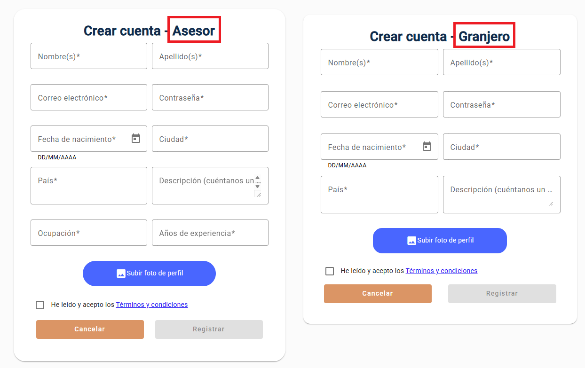

_Imagen 225. Modificación 3_

**Problema #4: Eliminación de un recinto en “Mi Granja” no solicita confirmación**
- Se implementó un cuadro de diálogo de confirmación que se muestra al intentar eliminar un recinto, solicitando al usuario que confirme la acción.

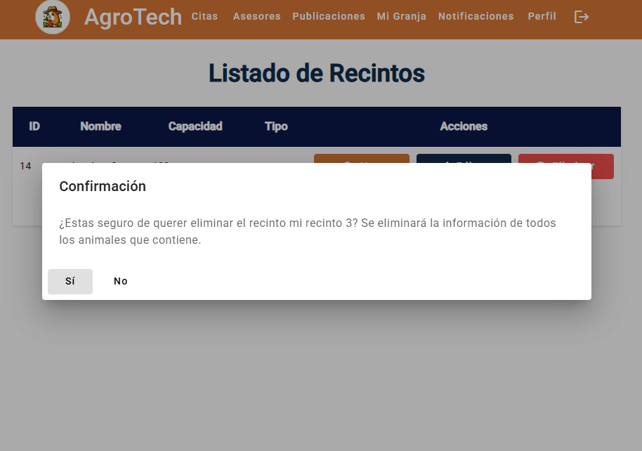

_Imagen 226. Modificación 4_

**Problema #5: Al guardar perfil de asesor, no hay notificación de éxito o error**
- Se añadió una notificación que se muestra al guardar cambios en el perfil de asesor, informando al usuario si la operación fue exitosa o si hubo algún error.


_Imagen 227. Modificación 5_

<div style="page-break-after: always;"></div>

# Capítulo VII: DevOps Practices

## 7.1. Continuous Integration

La integración continua (CI) es una práctica que permite a los desarrolladores integrar cambios frecuentemente en el repositorio compartido. Cada integración es verificada automáticamente mediante pruebas y construcción del software, lo cual reduce errores de integración y permite una validación rápida del código.

### 7.1.1. Tools and Practices

Para la integración continua, hemos utilizado las siguientes herramientas que nos permiten automatizar el proceso de compilación y validación de nuestro backend desarrollado con Spring Boot:

- GitHub: Sistema de control de versiones utilizado para gestionar el código fuente del proyecto. Se ha integrado con GitHub Actions para automatizar la ejecución del flujo de integración continua en cada push o pull request.

- Maven: Herramienta de construcción empleada para compilar el proyecto, ejecutar pruebas y gestionar las dependencias.

- JUnit: Framework utilizado para implementar y ejecutar pruebas unitarias automatizadas que validan el correcto funcionamiento de los componentes del backend.

### 7.1.2. Build & Test Suite Pipeline Components

El pipeline de integración continua implementado con GitHub Actions sigue este flujo:

1. Checkout del código fuente: Se utiliza la acción actions/checkout para clonar el repositorio y obtener el estado actual del código.

2. Configuración del entorno de ejecución: Se instala el JDK mediante actions/setup-java con las necesidades del proyecto Spring Boot.

3. Restauración de dependencias y compilación: Se restauran las dependencias mediante el sistema de caché de Maven (actions/cache) y se ejecuta mvn clean install para compilar el proyecto y preparar los artefactos necesarios.

4. Ejecución de pruebas unitarias: Utilizando mvn test, se ejecutan automáticamente las pruebas definidas con JUnit para asegurar la validez del código.

5. Reporte de resultados: El resultado del workflow se muestra directamente en GitHub, indicando si el pipeline fue exitoso o si se detectaron errores. En caso de fallo, se detiene el proceso y se notifica al equipo mediante el estado del pull request.


_Imagen 228. Diagrama del Pipeline de Integración Continua_


_Imagen 229. Evidencia del Pipeline de Integración Continua_

<div style="page-break-after: always;"></div>

## 7.2. Continuous Delivery

La entrega continua (CD) asegura que el software siempre esté listo para ser desplegado en producción, aunque el despliegue final requiere una aprobación manual. Se automatizan los entornos de prueba y validación para permitir entregas confiables y repetibles.

### 7.2.1. Tools and Practices

Para la entrega continua, utilizamos las siguientes herramientas y prácticas:

- GitHub: Sistema de control de versiones utilizado para gestionar el código fuente del proyecto. Además, permite configurar flujos de automatización a través de GitHub Actions.

GitHub Actions: Plataforma de automatización nativa de GitHub usada para implementar el pipeline de entrega continua. Permite definir workflows que se activan automáticamente al detectar cambios en el repositorio.

- Maven: Herramienta de construcción empleada para compilar el proyecto, ejecutar pruebas y gestionar las dependencias.

- Docker: Utilizado para crear contenedores que encapsulan el backend de Spring Boot, facilitando su despliegue en diferentes entornos.

- Docker Hub: Registro de imágenes Docker donde se almacenan las imágenes generadas del backend, permitiendo su fácil acceso y despliegue.

### 7.2.2. Stages Deployment Pipeline Components

Los componentes del pipeline de entrega continua incluyen:

- Trigger del pipeline: El workflow se activa automáticamente cuando se detectan cambios en la rama main del repositorio.

- Checkout del código fuente: GitHub Actions utiliza la acción actions/checkout para clonar el repositorio en el entorno de ejecución.

- Preparación del entorno: Se configura el entorno con el JDK 22, Maven y Docker, necesarios para compilar y empaquetar el proyecto.

- Compilación del proyecto: Se ejecuta mvn clean package para compilar el código fuente de Spring Boot y generar el archivo .jar, incluyendo la ejecución de pruebas.

- Construcción del artefacto Docker: Se ejecuta docker build para generar una imagen que contiene el backend empaquetado, garantizando portabilidad y consistencia.

- Push a Docker Hub: La imagen generada se sube automáticamente a un repositorio privado en Docker Hub, lista para ser desplegada en producción.


_Imagen 230. Diagrama del Pipeline de Entrega Continua_


_Imagen 231. Evidencia del Pipeline de Entrega Continua_

<div style="page-break-after: always;"></div>

## 7.3. Continuous deployment

El despliegue continuo automatiza completamente el paso del software a producción una vez que ha superado todas las pruebas. Esta práctica elimina la intervención humana en el despliegue, asegurando entregas rápidas, constantes y confiables.

### 7.3.1. Tools and Practices

Para el despliegue continuo, utilizamos las siguientes herramientas y prácticas:

GitHub: Sistema de control de versiones que gestiona el código fuente del proyecto y ejecuta automáticamente los workflows de integración y despliegue.

GitHub Actions: Plataforma de automatización que orquesta el pipeline completo, desde la compilación del proyecto, la construcción de la imagen Docker, su subida a Docker Hub y finalmente el despliegue a producción mediante hooks de Render.

Docker: Utilizado para empaquetar el backend de Spring Boot en contenedores que aseguran consistencia en los diferentes entornos.

Docker Hub: Registro de contenedores que almacena la imagen generada y sirve como fuente para el despliegue en producción.

Render: Plataforma de hosting que detecta los cambios mediante un Deploy Hook y despliega automáticamente la nueva versión del backend.

### 7.3.2. Production Deployment Pipeline Components

Los componentes del pipeline de despliegue continuo incluyen:

- Trigger del pipeline: Se activa automáticamente cuando hay cambios en la rama main.

- Compilación y pruebas: GitHub Actions compila el proyecto, ejecuta los tests y construye la imagen Docker.

- Push a Docker Hub: La imagen se sube al repositorio de Docker Hub como artefacto final.

- Despliegue a producción: Se invoca el Deploy Hook de Render desde un workflow separado (deploy.yml), lo cual inicia automáticamente el despliegue en el entorno de producción.

- Monitoreo continuo: Una vez desplegado, Render ofrece seguimiento del estado de la aplicación, errores y consumo de recursos.

- Rollback: En caso de errores críticos, Render permite revertir rápidamente a una versión previa desde su interfaz.


_Imagen 234. Diagrama del Pipeline de Despliegue Continuo_


_Imagen 235. Evidencia del Pipeline de Despliegue Continuo_

<div style="page-break-after: always;"></div>

## 7.4. Continuous Monitoring

El monitoreo continuo permite supervisar en tiempo real el comportamiento y desempeño de la aplicación una vez desplegada en producción. Esta práctica es clave para detectar fallos, cuellos de botella y garantizar la disponibilidad del sistema.

### 7.4.1. Tools and Practices

Para el monitoreo continuo de nuestro backend desplegado, utilizamos:

- Render Monitoring Tools: Render proporciona herramientas nativas de monitoreo que permiten observar el estado del servicio, uso de CPU, memoria, registros de errores y reinicios automáticos.

- Logs en tiempo real: Render muestra los logs de la aplicación en tiempo real, facilitando la detección de excepciones, advertencias o eventos inesperados.

- Alertas automáticas: Render notifica fallos de despliegue o caídas del servicio mediante correos electrónicos o notificaciones a los administradores del proyecto.

### 7.4.2. Monitoring Pipeline Components

El pipeline de monitoreo incluye los siguientes componentes:

- Log Stream: Los logs generados por el backend son accesibles en tiempo real a través del panel de Render.

- Render Metrics Dashboard: Render recopila métricas de CPU, RAM, latencia y reinicios automáticos.


_Imagen 236. Evidencia del Log Stream para monitoreo continuo_

### 7.4.3. Alerting Pipeline Components

El sistema de alertas contempla lo siguiente:

- Fallo de despliegue o build: GitHub Actions y Render notifican si un despliegue falla.

- Caídas del servicio: Render detecta si el contenedor deja de responder y reinicia el servicio automáticamente.

- Alertas por consumo excesivo: Render alerta cuando el uso de memoria o CPU excede los límites asignados al servicio.


_Imagen 237. Evidencia del sistema de alertas_

### 7.4.4. Notification Pipeline Components

Los canales de notificación incluyen:

- Render Dashboard Notifications: El panel de Render muestra visualmente el estado del servicio y sus logs.

- Correo electrónico: Render envía alertas automáticas por errores críticos o caídas del servicio a los administradores del proyecto.

- GitHub Notifications: GitHub notifica vía interfaz y correo sobre fallos en los workflows de CI/CD.


_Imagen 238. Evidencia de las notificaciones_

<div style="page-break-after: always;"></div>

# Capítulo VIII: Experiment-Driven Development

## 8.1. Experiment Planning
### 8.1.1. As-Is Summary

Actualmente, Innovatech está en la fase de desarrollo inicial de AgroTech, una plataforma integral diseñada para ayudar a los agricultores a gestionar sus granjas de manera más eficiente. La plataforma se encuentra en la fase de validación de la propuesta de valor, con una landing page activa y un formulario de interés para captar usuarios potenciales, principalmente enfocados en agricultores interesados en asesoramiento técnico especializado.

### 8.1.2. Raw Material: Assumptions, Knowledge Gaps, Ideas, Claims

**Assumptions (Suposiciones realistas):**
1. Los agricultores completarán formularios con ≤3 campos si son relevantes
2. El contacto vía WhatsApp tiene mayor adopción que formularios web
3. La personalización de la interfaz de usuario
4. Foro para que los usuarios puedan compartir experiencias y consejos
5. Videos cortos (<1 min) aumentarán la comprensión del servicio


**Knowledge Gaps (Brechas prácticas):**
1. ¿Qué campos mínimos son indispensables para iniciar contacto?
2. ¿Qué canal (WhatsApp vs Formulario) genera más interacciones?
3. ¿Qué elementos de la interfaz son más valorados por los usuarios?
4. ¿Qué temas son de interés para los usuarios en el foro?
5. ¿El contenido audiovisual mejora la comprensión del servicio?


**Ideas Ejecutables:**
1. A/B test de formulario (3 vs 5 campos)
2. Comparar conversión: WhatsApp vs formulario web
3. Personalizar interfaz de usuario con temas oscuros y claros
4. Implementar una sección donde los usuarios puedan compartir consejos y experiencias
5. Testear video explicativo de 60s vs texto descriptivo


**Claims (Afirmaciones testables):**
1. **Formulario de contacto optimizado:** Se espera que un formulario de contacto con una menor cantidad de campos genere más contactos iniciados en comparación con uno de 5 campos.
2. **WhatsApp como canal preferido:** Se afirma que el uso de WhatsApp para iniciar contacto generará un mayor porcentaje de contactos iniciados en comparación con el formulario web.
3. **Personalización de la interfaz:** Se afirmará que la personalización de la interfaz con modo oscuro de usuario incrementará la satisfacción del usuario.
4. **Participación mediante un foro:** Se postula que la creación de un foro de experiencias y consejos puede aumentar la participación activa y la adherencia a las mejores prácticas de agricultura.
5. **Video explicativo efectivo:** Se postula que un video explicativo de 60 segundos aumentará el tiempo promedio en página en comparación con un texto descriptivo equivalente.
   
### 8.1.3. Experiment-Ready Questions

| Question | Confidence | Risk | Impact | Interest | Total Score |
|----------|------------|------|--------|----------|-------------|
| ¿Ayudará el formulario reducido a mejorar la tasa de completado? | 8 - Formularios más cortos suelen tener mejores tasas de completado. | 1 - Bajo riesgo, ya que es una práctica común. | 5 - Puede aumentar la cantidad de contactos iniciados. | 6 - Interés alto, ya que mejora la conversión. | 20 |
| ¿Tendrá Whatsapp una mayor interacción que el formulario web? | 7 - WhatsApp es un canal popular y familiar para los usuarios. | 2 - Riesgo bajo, ya que es una implementación técnica sencilla. | 4 - Puede aumentar la tasa de contactos iniciados. | 6 - Interés alto, ya que mejora la experiencia del usuario. | 19 |
| ¿Mejorará la satisfacción del usuario con la personalización de la interfaz? | 7 - Es una funcionalidad popular, aunque no todos los usuarios la utilizan. | 2 - Bajo riesgo, ya que es una implementación técnica estándar. | 4 - Puede mejorar la experiencia del usuario. | 5 - Interés moderado, ya que la personalización es un tema recurrente. | 18 |
| ¿Incrementará el foro la interacción de usuarios dentro de la aplicación? | 6 - La interacción en foros es variable, pero puede ser un buen canal de comunicación. | 3 - Riesgo moderado, ya que depende de la participación activa de los usuarios. | 6 - Puede aumentar la retención y el engagement. | 6 - Interés alto, ya que fomenta la comunidad. | 21 |
| ¿Se incrementará el engagement medido en tiempo en página con ayuda del video? | 6 - Los videos suelen aumentar el tiempo en página. | 3 - Riesgo moderado, ya que depende de la calidad del contenido. | 5 - Puede mejorar la comprensión del servicio. | 4 - Interés moderado, ya que no todos los usuarios verán el video. | 18 |


### 8.1.4. Question Backlog

| Prioridad | Pregunta | Métrica asociada | Estado |
|-----------|----------|------------------|--------|
| 1 | ¿Ayudará el formulario reducido a mejorar la tasa de completado? | Contactos iniciados | Pendiente |
| 3 | ¿Tendrá Whatsapp una mayor interacción que el formulario web? | Tasa de abandono | Pendiente |
| 3 | ¿Mejorará la satisfacción del usuario con la personalización de la interfaz? | Satisfacción del usuario | Pendiente |
| 3 | ¿Incrementará el foro la interacción de usuarios dentro de la aplicación? | Interacciones en el foro | Pendiente |
| 5 | ¿Se incrementará el engagement medido en tiempo en página con ayuda del video? | Tiempo en página | Pendiente |

### 8.1.5. Experiment Cards

#### **Experiment Card 1: Optimización de Formulario de Contacto**
1. **Nombre:** "Impacto de formulario minimalista en tasa de conversión"
2. **Hipótesis Vinculada:** H1 (*Formularios cortos aumentan completados*)
3. **Objetivo:** Validar si reducir campos mejora la experiencia de usuario
4. **Métricas Principales:**
   - Tasa de completado (meta: +30%)
   - Tiempo promedio de llenado (meta: <1 minuto)
5. **Métricas Secundarias:**
   - Tasa de rebote en formulario
   - Porcentaje de campos opcionales utilizados
6. **Método:** A/B Testing
   - Grupo A: Formulario actual (5 campos obligatorios)
   - Grupo B: Formulario minimalista (3 campos obligatorios)
7. **Población:** 300 agricultores (150 por grupo)
8. **Herramientas:**
   - Google Forms (formularios)
   - Hotjar (mapas de calor)
   - Google Analytics (eventos)
9. **Criterio de Éxito:** 
   - Grupo B muestra ≥30% más completados con p<0.05
10. **Riesgos Identificados:**
    - Pérdida de información valiosa al eliminar campos
    - Posible aumento de leads no calificados
    - Dificultad en segmentación posterior
11. **Mitigaciones:**
    - Incluir campos eliminados como opcionales
    - Implementar preguntas de calificación post-contacto
    - Realizar prueba piloto con 20 usuarios antes del rollout completo
12. **Consideraciones Éticas:**
    - Garantizar protección de datos personales
    - Obtener consentimiento explícito para uso de información

#### **Experiment Card 2: Canal de Contacto Preferido**
1. **Nombre:** "Efectividad de WhatsApp vs Formulario Web"
2. **Hipótesis Vinculada:** H2 (*Canales familiares aumentan engagement*)
3. **Objetivo:** Determinar el canal más efectivo para primer contacto
4. **Métricas Principales:**
   - Tasa de conversión a contacto (meta: +25% para WhatsApp)
   - Tiempo hasta primer respuesta (meta: <15 minutos para WhatsApp)
5. **Métricas Secundarias:**
   - Satisfacción reportada (encuesta post-contacto)
   - Tasa de resolución en primera interacción
6. **Método:** A/B Testing Multivariable
   - Grupo A: Flujo tradicional (formulario web + email)
   - Grupo B: Integración directa con WhatsApp Business
7. **Población:** 400 visitantes (200 por grupo)
8. **Herramientas:**
   - WhatsApp Business API
   - Google Tag Manager
   - Typeform (encuestas)
9. **Criterio de Éxito:**
   - WhatsApp muestra ≥25% más contactos iniciados
   - Tiempo de respuesta promedio <15 minutos
10. **Riesgos Identificados:**
    - Saturación del equipo de atención vía WhatsApp
    - Posible sesgo generacional (agricultores mayores prefieren llamadas)
    - Dificultad para escalar atención personalizada
11. **Mitigaciones:**
    - Implementar chatbot básico para preguntas frecuentes
    - Ofrecer alternativa de llamada telefónica
    - Capacitar al equipo en gestión de conversaciones múltiples
12. **Consideraciones Operativas:**
    - Horarios de atención claramente comunicados
    - Protocolos para manejo de picos de demanda

#### **Experiment Card 3: Personalización de Interfaz**
1. **Nombre:** "Efecto de personalización de interfaz en satisfacción del usuario"
2. **Hipótesis Vinculada:** H3 (*Personalización mejora experiencia de usuario*)
3. **Objetivo:** Evaluar si temas personalizados aumentan la satisfacción
4. **Métricas Principales:**
   - Satisfacción del usuario (meta: +25% en encuesta post-uso)
   - Tasa de retención de usuarios (meta: +15% en 30 días)
5. **Métricas Secundarias:**
   - Tiempo promedio de sesión (meta: +10%)
   - Número de interacciones por sesión (meta: +20%) 
6. **Método:** A/B Testing con Personalización
   - Grupo A: Interfaz estándar (actual)
   - Grupo B: Interfaz personalizada (modo claro/oscuro, temas)
7. **Población:** 600 usuarios registrados (300 por grupo)
8. **Herramientas:**
   - Google Forms (encuesta de satisfacción)
9. **Criterio de Éxito:**
   - Grupo B muestra ≥25% más satisfacción en encuesta
   - Tasa de retención ≥15% superior al grupo A
10. **Riesgos Identificados:**
    - Sobrecarga cognitiva por demasiadas opciones de personalización
    - Posible rechazo a cambios en la interfaz por usuarios acostumbrados
    - Dificultad técnica para implementar personalización en el MVP
11. **Mitigaciones:**
    - Implementar opciones limitadas de personalización inicialmente
    - Realizar pruebas de usabilidad con usuarios representativos
    - Proporcionar tutoriales breves sobre cómo personalizar la interfaz
12. **Consideraciones de Usabilidad:**  
    - Asegurar que la personalización no afecte la accesibilidad
    - Mantener consistencia visual y funcional en todas las opciones de personalización

#### **Experiment Card 4: Interacción en el Foro**
1. **Nombre:** "Impacto del foro en la interacción de usuarios"
2. **Hipótesis Vinculada:** H4 (*Foros aumentan la comunidad y el engagement*)
3. **Objetivo:** Medir si la implementación de un foro incrementa la interacción entre usuarios
4. **Métricas Principales:**
    - Número de publicaciones en el foro (meta: +50% en 2 semanas)
    - Número de comentarios por publicación (meta: +30%)
5. **Métricas Secundarias:**
    - Tasa de retorno al foro (meta: +20% en 30 días)
    - Tiempo promedio de interacción por usuario (meta: +15%)
6. **Método:** Implementación de Foro y Seguimiento
   - Grupo A: Usuarios con acceso al foro
   - Grupo B: Usuarios sin acceso al foro (control)
7. **Población:** 800 usuarios activos (400 por grupo)
8. **Herramientas:**
    - Google Analytics (seguimiento de interacciones)
    - Typeform (encuesta de satisfacción)
9. **Criterio de Éxito:**
    - Grupo A muestra ≥50% más publicaciones y ≥30% más comentarios
    - Tasa de retorno al foro ≥20% superior al grupo B
10. **Riesgos Identificados:**
    - Moderación insuficiente puede llevar a spam o contenido inapropiado
    - Usuarios inactivos que no contribuyen al foro
    - Dificultad para mantener la calidad de las interacciones
11. **Mitigaciones:**
    - Implementar moderación activa y reglas claras de uso
    - Realizar encuestas periódicas para evaluar la calidad del contenido
12. **Consideraciones de Comunidad:**
    - Fomentar un ambiente inclusivo y respetuoso

#### **Experiment Card 5: Contenido Explicativo**
1. **Nombre:** "Impacto de video explicativo en comprensión del servicio"
2. **Hipótesis Vinculada:** H5 (*Medios audiovisuales mejoran retención*)
3. **Objetivo:** Medir efectividad de contenido audiovisual vs texto
4. **Métricas Principales:**
   - Tiempo en página (meta: +20 segundos)
   - Tasa de rebote (meta: reducción del 15%)
5. **Métricas Secundarias:**
   - Porcentaje de reproducción completa del video
   - Conversión a contacto después de ver contenido
6. **Método:** A/B Testing con Segmentación
   - Grupo A: Landing page con texto descriptivo (actual)
   - Grupo B: Landing page con video embedido (60s)
7. **Población:** 500 visitantes orgánicos (250 por grupo)
8. **Herramientas:**
   - Loom (grabación y hosting de video)
   - Google Analytics (comportamiento)
   - Vimeo Analytics (engagement con video)
9. **Criterio de Éxito:**
   - Grupo B muestra ≥20s más tiempo en página
   - Reducción ≥15% en tasa de rebote
10. **Riesgos Identificados:**
    - Problemas de carga en conexiones lentas
    - Barrera de idioma para agricultores indígenas
    - Mensaje no adaptado a diferentes niveles de alfabetización digital
11. **Mitigaciones:**
    - Versión ligera del video para móviles
    - Subtítulos en español y lenguas indígenas principales
    - Versión audio-only como alternativa
12. **Consideraciones de Accesibilidad:**
    - Cumplimiento WCAG 2.1 AA
    - Pruebas con usuarios de diferentes edades y habilidades técnicas

# 8.2. Experiment Design

### 8.2.1. Hypotheses

| ID | Question | Belief | Hypothesis | Null Hypothesis |
|----|-----------|-------------|-----------------|------------------|
| 1 | ¿Ayudará el formulario reducido a mejorar la tasa de completado? | Los formularios con menos campos aumentarán la tasa de completado | Reducir campos a 3 aumentará la tasa de completado en ≥30% a comparación con el anterior | Reducir campos a 3 no tendrá un impacto significativo en la tasa de completado |
| 2 | ¿Tendrá Whatsapp una mayor interacción que el formulario web? | WhatsApp es un canal más familiar y accesible para los usuarios | WhatsApp tendrá ≥20% más contactos iniciados que el formulario web | WhatsApp no tendrá un aumento significativo en la tasa de contactos iniciados comparado con el formulario web |
| 3 | ¿Mejorará la satisfacción del usuario con la personalización de la interfaz? | La personalización de la interfaz mejora la experiencia del usuario | La personalización de la interfaz aumentará la satisfacción del usuario en ≥25% | La personalización de la interfaz no tendrá un impacto significativo en la satisfacción del usuario |
| 4 | ¿Incrementará el foro la interacción de usuarios dentro de la aplicación? | Los foros fomentan la comunidad y el intercambio de conocimientos | La implementación de un foro aumentará la interacción de usuarios en un 50% | La implementación del foro no tendrá un impacto significativo en la interacción de usuarios |
| 5 | ¿Se incrementará el engagement medido en tiempo en página con ayuda del video? | Los videos cortos mejoran la comprensión del servicio | Un video de 60s incrementará el tiempo en página en ≥20 segundos comparado con texto descriptivo | Un video de 60s no tendrá un impacto significativo en el tiempo en página comparado con el texto descriptivo |


### 8.2.2. Measures

- Completion Rate: Porcentaje de usuarios que completan el formulario de contacto.
- Contact Initiation Rate: Porcentaje de usuarios que inician contacto a través de WhatsApp o formulario web.
- User Satisfaction Score: Medido a través de encuestas post-uso, evaluando la satisfacción del usuario con la personalización de la interfaz.
- Forum Engagement: Número de publicaciones y respuestas en el foro, así como la tasa de retorno de usuarios al foro.
- Time on Page: Tiempo promedio que los usuarios pasan en la página después de ver el video comparado con aquellos que leen el texto descriptivo.

| Question | Measure |
|-----------|---------|
| ¿Ayudará el formulario reducido a mejorar la tasa de completado? | Se medirá la tasa de completado del formulario con 3 campos comparado con el formulario actual de 5 campos. Se espera un aumento en la tasa de completado. |
| ¿Tendrá Whatsapp una mayor interacción que el formulario web? | Comparar la tasa de contactos iniciados a través de WhatsApp con la tasa de contactos iniciados mediante el formulario web. Se espera que WhatsApp tenga un mayor número de contactos iniciados. |
| ¿Mejorará la satisfacción del usuario con la personalización de la interfaz? | Medir la satisfacción de los usuarios mediante encuestas y puntajes de valoración de experiencia visual antes y después de habilitar el modo oscuro. Esto permitirá evaluar si la nueva función mejora la comodidad y la percepción general de la aplicación. |
| ¿Incrementará el foro la interacción de usuarios dentro de la aplicación? | Evaluar la cantidad de publicaciones, respuestas y la interacción en el foro, comparando la actividad antes y después de su lanzamiento. También se pueden usar encuestas para medir la percepción de los usuarios sobre el valor del foro. |
| ¿Se incrementará el engagement medido en tiempo en página con ayuda del video? | Comparar el tiempo promedio en página de usuarios que ven el video de 60 segundos con aquellos que leen el texto descriptivo. Se espera un aumento del tiempo en página para los que ven el video. |

### 8.2.3. Conditions

- A/B Testing para formulario de contacto básico vs. detallado.
- WhatsApp como canal de contacto vs. formulario web.
- Test entre modo oscuro y claro.
- Test de foro implementado vs. sin foro.
- Video explicativo de 60 segundos vs. texto descriptivo.

| Question | Condición experimental | Condición de control |
|-----------|------------------------|----------------------|
| ¿Ayudará el formulario reducido a mejorar la tasa de completado? | La tasa de completado del formulario con 3 campos será ≥30% superior al formulario actual de 5 campos | No habrá un aumento significativo en la tasa de completado del formulario actual de 5 campos |
| ¿Tendrá Whatsapp una mayor interacción que el formulario web? | La tasa de contactos iniciados a través de WhatsApp será ≥20% superior a la del formulario web | No habrá un aumento significativo en la tasa de contactos iniciados a través del formulario web |
| ¿Mejorará la satisfacción del usuario con la personalización de la interfaz? | La satisfacción del usuario se medirá con una encuesta post-uso después de habilitar el modo oscuro | No habrá un aumento significativo en la satisfacción del usuario tras la implementación del modo oscuro |
| ¿Incrementará el foro la interacción de usuarios dentro de la aplicación? | La participación de los usuario aumentará en un 50% tras la implementación del foro | No habrá un aumento significativo en la interacción de usuarios tras la implementación del foro |
| ¿Se incrementará el engagement medido en tiempo en página con ayuda del video? | El tiempo promedio en página será ≥20 segundos mayor para usuarios que vean el video de 60 segundos | El tiempo promedio no mostrará un aumento significativo para usuarios que lean el texto descriptivo |

### 8.2.4. Scale Calculations and Decisions

Este enfoque utiliza métricas para evaluar el cumplimiento de las hipótesis en un proyecto. Cada hipótesis se asocia con un indicador de éxito: se considera ideal cuando la métrica alcanza plenamente el objetivo, aceptable cuando está entre el mínimo y el ideal, y desfavorable si queda por debajo del mínimo, requiriendo así una revisión. Un nivel excelente se define como cuando el valor supera el ideal en un 25% o más, indicando un éxito significativo. Este enfoque permite tomar decisiones fundamentadas en métricas para validar o ajustar las hipótesis del proyecto.

- **Tamaño Mínimo de la Muestra:** 200-500 usuarios/grupo (según poder estadístico del 80% y efecto mínimo del 15%).
- **Tiempo estimado para los experimentos:** Se planea una duración de **1 semana** por experimento, con campañas de anuncios pagados en plataformas como **Google Ads** para aumentar el tráfico hacia la landing page.

| Scale Calculation | Decision | Factor |
|-------------------|----------|--------|
| Creemos que al reducir el número de campos en el formulario de contacto a 3, se incrementará la tasa de completado en al menos un 30%. Sabremos que esto es cierto cuando observemos un aumento del 30% en la tasa de completado del formulario. | Implementar el formulario con 3 campos y medir la tasa de completado | Excelente |
| Creemos que al implementar un canal de contacto a través de WhatsApp, se incrementará la tasa de contactos iniciados en al menos un 20% en comparación con el formulario web. Sabremos que esto es cierto cuando observemos un aumento del 20% en la tasa de contactos iniciados a través de WhatsApp. | Implementar el canal de WhatsApp y medir la tasa de contactos iniciados | Aceptable |
| Creemos que al agregar un modo oscuro a la aplicación web, se mejorará la experiencia del usuario en al menos un 25%, reduciendo la fatiga visual y aumentando el tiempo de uso promedio. Sabremos que esto es cierto cuando observemos un aumento del 25% en la satisfacción del usuario. | Implementar el modo oscuro y permitir que el usuario pueda activarlo si desea | Aceptable |
| Creemos que al implementar un foro en la aplicación que permita a los usuarios compartir experiencias y consejos sobre la gestión de granjas, se incrementará la interacción y la participación de los usuarios. Sabremos que esto es cierto cuando observemos un aumento del 50% en la participación de los usuarios en el foro. | Implementar el foro y medir la participación de los usuarios | Excelente |
| Creemos que al agregar un video explicativo de 60 segundos en la landing page, se incrementará el tiempo promedio en página en al menos 20 segundos, mejorando la comprensión del servicio. Sabremos que esto es cierto cuando observemos un aumento del 20% en el tiempo promedio en página. | Implementar el video explicativo y medir el tiempo promedio en página | Aceptable |

### 8.2.5. Methods Selection

- **A/B Testing:** Se utilizarán herramientas simples como **Google Optimize** para las pruebas A/B en la landing page y en los precios.
- **Google Forms / Typeform:** Para facilitar la recolección de datos del formulario de registro.
- **Google Analytics:** Para medir el tráfico, la tasa de conversión y el comportamiento del usuario en la landing page.

### 8.2.6. Data Analytics: Goals, KPIs and Metrics Selection

**Regla de oro:** Cada métrica responde a una hipótesis y se mide con herramientas específicas.  

| Objetivo                          | KPI                              | Métrica de Éxito                          | Herramienta de Tracking       |  
|------------------------------------|----------------------------------|-------------------------------------------|-------------------------------|  
| **Optimizar experiencia de contacto** | Tasa completado formularios      | ≥30% aumento en formulario minimalista    | Google Analytics + Hotjar     |  
| **Validar canal preferido**        | Ratio conversión a contacto      | WhatsApp ≥25% más efectivo que formulario | Google Tag Manager + WhatsApp Business API |  
| **Mejorar satisfacción del usuario** | Satisfacción del usuario         | ≥25% aumento en encuestas post-uso        | Google Forms + Typeform       |
| **Fomentar comunidad activa**      | Interacciones en el foro         | ≥50% más publicaciones y comentarios      | Google Analytics + Foros      |
| **Mejorar comprensión del servicio** | Tiempo en página                | ≥20s aumento con video                    | Google Analytics + Vimeo      |  
| **Garantizar calidad de datos**    | Precisión información contacto   | ≤10% errores en datos críticos            | Validación manual + Google Sheets |  


### 8.2.7. Web and Mobile Tracking Plan

**Herramientas:**
- **Google Analytics:** Para el seguimiento básico de eventos como clics, registros y conversiones.
- **Hotjar (opcional):** Para generar mapas de calor y ver cómo interactúan los usuarios con la landing page. (Opción más accesible y fácil de integrar).
- **Google Tag Manager:** Para facilitar la configuración y gestión de eventos sin necesidad de modificar el código del sitio.

**Eventos principales:**
- **form_complete:** Cuando un usuario completa el formulario de registro o el cuestionario de necesidades en la plataforma.
- **contact_initiated:** Cuando un usuario inicia contacto a través de WhatsApp o el formulario web.
- **video_played:** Cuando un usuario reproduce el video explicativo en la landing page.
- **forum_interaction:** Cuando un usuario publica o responde en el foro.
- **theme_changed:** Cuando un usuario cambia entre el modo claro y oscuro en la aplicación web.


## 8.3. Experimentation

### 8.3.1. To-Be User Stories

| ID | Nombre | Descripción | Criterios de aceptación |
|----|--------|-------------|-------------------------|
| UE01 | Formulario de contacto optimizado | Como  usuario, quiero un formulario de contacto con 3 campos para facilitar el registro | **Escenario:** <br> Given el usuario se encuentra en la sección de contacto de la landing page <br> When completa el formulario con 3 campos necesarios <br> Then recibirá confirmación de registro <br> And notará lo sencillo que fue llenar el formulario reducido |
| UE02 | Video explicativo básico | Como visitante, quiero entender en 1 minuto qué ofrece AgroTech | **Escenario:** <br> Given abro la landing page <br> When veo el video de 60s <br> Then identifico al menos 3 beneficios clave |
| UE03 | Canal de contacto por WhatsApp | Como usuario, quiero contactar a AgroTech por WhatsApp para recibir asesoría rápida | **Escenario:** <br> Given el usuario se encuentra en la landing page <br> When hace clic en el botón de WhatsApp <br> Then se abre una conversación con AgroTech en WhatsApp <br> And puede realizar sus consultas sin problema |
| UE04 | Personalización de interfaz | Como usuario, quiero elegir entre modo claro y oscuro para mejorar mi experiencia visual | **Escenario:** <br> Given el usuario se encuentra en la aplicación web <br> When selecciona el modo oscuro en la configuración <br> Then la interfaz cambia a modo oscuro |
| UE05 | Visualización de foro | Como usuario, quiero participar en un foro para compartir y aprender de otros agricultores | **Escenario:** <br> Given el usuario se encuentra registrado en AgroTech <br> When accede al foro <br> Then puede publicar preguntas y responder a otros usuarios <br> And visualiza las publicaciones recientes |
| UE06 | Guardar publicaciones del foro como favoritas | Como usuario, quiero guardar publicaciones del foro como favoritas para consultarlas después | **Escenario:** <br> Given el usuario está navegando por el foro <br> When hace clic en "Guardar como favorito" en una publicación <br> Then la publicación se agrega a su lista de favoritos <br> And puede acceder a ella desde su perfil |

### 8.3.2. To-Be Product Backlog

| Orden | ID | Título | Story Points |
|------|----|--------|--------------|
| 1 | UE01 | Formulario de contacto optimizado | 3 |
| 2 | UE03 | Canal de contacto por WhatsApp | 8 |
| 3 | UE04 | Personalización de interfaz | 5 |
| 4 | UE05 | Visualización de foro | 5 |
| 5 | UE06 | Guardar publicaciones del foro como favoritas | 3 |
| 6 | UE02 | Video explicativo básico | 3 |

### 8.3.3. Pipeline-supported, Experiment-Driven To-Be Software Platform Lifecycle

#### 8.3.3.1. To-Be Sprint Backlogs

<table><tr><th colspan="1" valign="top">Sprint #</th><th colspan="7" valign="top">Sprint 1</th></tr>
<tr><td colspan="2" valign="top">User Story</td><td colspan="6" valign="top">Work-Item / Task</td></tr>
<tr><td colspan="1" valign="top">Id</td><td colspan="1" valign="top">Title</td><td colspan="1" valign="top">Id</td><td colspan="1" valign="top">Title</td><td colspan="1" valign="top">Description</td><td colspan="1" valign="top">Estimation </td><td colspan="1" valign="top">Assigned To</td><td colspan="1" valign="top">Status (To-Do / In-Process / Review / Done)</td></tr>
<tr><td colspan="1" rowspan="2" valign="top">UE01</td><td colspan="1" rowspan="2" valign="top">Formulario de contacto optimizado</td><td colspan="1" valign="top">WI01</td><td colspan="1" valign="top">Diseñar nueva interfaz de contacto</td><td colspan="1" valign="top">Se diseña e implementa la nueva interfaz del formulario de contacto optimizado.</td><td colspan="1" rowspan="2" valign="top">3</td><td colspan="1" valign="top">Sergio Pecan</td><td colspan="1" valign="top">Done</td></tr>
<tr><td colspan="1" valign="top">WI02</td><td colspan="1" valign="top">Implementación de protocolos HTTP para contacto</td><td colspan="1" valign="top">Se implementan los protocolos HTTP para el envío del nuevo formulario.</td><td colspan="1" valign="top">Salvador Salinas</td><td colspan="1" valign="top">Done</td></tr>
<tr><td colspan="1" rowspan="3" valign="top">UE03</td><td colspan="1" rowspan="3" valign="top">Canal de contacto por WhatsApp</td><td colspan="1" valign="top">WI03</td><td colspan="1" valign="top">Crear botón en Landing Page</td><td colspan="1" valign="top">Se crea el botón que redirige al contacto por WhatsApp.</td><td colspan="1" rowspan="3" valign="top">8</td><td colspan="1" valign="top">Britney Qqueso</td><td colspan="1" valign="top">Done</td></tr>
<tr><td colspan="1" valign="top">WI04</td><td colspan="1" valign="top">Configuración de número de contacto</td><td colspan="1" valign="top">Configurar el número de Agrotech usando la API oficial de WhatsApp.</td><td colspan="1" valign="top">Sergio Pecan</td><td colspan="1" valign="top">Done</td></tr>
<tr><td colspan="1" valign="top">WI05</td><td colspan="1" valign="top">Mensaje de bienvenida</td><td colspan="1" valign="top">Agregar mensaje de bienvenida automático en WhatsApp.</td><td colspan="1" valign="top">Sergio Pecan</td><td colspan="1" valign="top">Done</td></tr>
<tr><td colspan="1" valign="top">UE04</td><td colspan="1" valign="top">Personalización de interfaz</td><td colspan="1" valign="top">WI06</td><td colspan="1" valign="top">Implementación de modo oscuro</td><td colspan="1" valign="top">Implementar la opción de modo oscuro para poder reducir la fatiga visual.</td><td colspan="1" valign="top">5</td><td colspan="1" valign="top">Salvador Salinas</td><td colspan="1" valign="top">Done</td></tr>
<tr><td colspan="1" rowspan="2" valign="top">UE05</td><td colspan="1" rowspan="2" valign="top">Visualización de foro</td><td colspan="1" valign="top">WI07</td><td colspan="1" valign="top">Diseñar interfaz de foro</td><td colspan="1" valign="top">Se diseña e implementa la vista del foro, junto con las publicaciones y comentarios.</td><td colspan="1" rowspan="2" valign="top">5</td><td colspan="1" valign="top">Piero Delgado</td><td colspan="1" valign="top">Done</td></tr>
<tr><td colspan="1" valign="top">WI08</td><td colspan="1" valign="top">Implementación de foro</td><td colspan="1" valign="top">Se implementan los protocolos HTTP para el foro.</td><td colspan="1" valign="top">Sebastian Paredes</td><td colspan="1" valign="top">Done</td></tr>
<tr><td colspan="1" rowspan="1" valign="top">UE06</td><td colspan="1" rowspan="1" valign="top">Guardar publicaciones del foro como favoritas</td><td colspan="1" valign="top">WI09</td><td colspan="1" valign="top">Implementación de listado de favoritos</td><td colspan="1" valign="top">Se implementa el listado de favoritos para que los usuarios puedan guardar publicaciones del foro.</td><td colspan="1" rowspan="1" valign="top">3</td><td colspan="1" valign="top">Sebastian Paredes</td><td colspan="1" valign="top">Done</td></tr>
<tr><td colspan="1" rowspan="1" valign="top">UE02</td><td colspan="1" rowspan="1" valign="top">Video explicativo básico</td><td colspan="1" valign="top">WI10</td><td colspan="1" valign="top">Integrar video en Landing Page</td><td colspan="1" valign="top">Integrar video dentro de la Landing Page.</td><td colspan="1" rowspan="1" valign="top">3</td><td colspan="1" valign="top">Andre La Torre</td><td colspan="1" valign="top">Done</td></tr>
</table>

<div style="page-break-after: always;"></div>

#### 8.3.3.2. Implemented To-Be Landing Page Evidence

Se agregó un video explicativo de 60 segundos en la landing page, junto con un formulario de contacto optimizado que ahora solo requiere 3 campos: nombre, correo electrónico y número de teléfono. Además, se implementó un botón de contacto directo a través de WhatsApp.


#### 8.3.3.3. Implemented To-Be Frontend-Web Application Evidence

Se desarrolló una aplicación web utilizando Angular, que incluye las siguientes características:
- Modo claro y oscuro para mejorar la experiencia visual.
- Integración de un foro donde los usuarios pueden publicar preguntas y respuestas.
- Funcionalidad para guardar publicaciones del foro como favoritas.


#### 8.3.3.4. Implemented To-Be Native-Mobile Application Evidence

Se desarrolló una aplicación móvil nativa en Kotlin que incluye:
- Modo claro y oscuro para mejorar la experiencia visual.
- Integración de un foro donde los usuarios pueden publicar preguntas y respuestas.


#### 8.3.3.5. Implemented To-Be RESTful API and/or Serverless Backend Evidence

Se implementó un backend robusto utilizando Spring Boot, que incluye:
- Endpoints RESTful para manejar la gestión de publicaciones del foro y el guardado de publicaciones como favoritas.


#### 8.3.3.6. Team Collaboration Insights

El equipo de desarrollo utilizó herramientas como GitHub para la gestión del código y la colaboración. Se realizaron reuniones diarias para revisar el progreso y resolver bloqueos. Además, se implementaron revisiones de código para asegurar la calidad del software.


### 8.3.4. To-Be Validation Interviews

#### 8.3.4.1. Diseño de entrevistas

Se realizó el diseño de entrevistas para validar las hipótesis planteadas en los experimentos. Las entrevistas se centraron en obtener retroalimentación directa de los usuarios sobre las nuevas características implementadas en la plataforma.

- ¿Qué te parece la idea de tener un formulario de contacto simple con solo tres campos para facilitar el registro?
- ¿Consideras útil incluir un video explicativo sobre el producto en la página principal de la landing page?
- ¿Qué opinas sobre la opción de recibir asesoría directamente a través de WhatsApp?
- ¿Crees que tener un modo claro y un modo oscuro mejora tu experiencia visual dentro de la aplicación?
- ¿Piensas que incorporar un foro dentro de la app agrega valor a la experiencia del usuario?
- ¿Te resulta útil la función de guardar publicaciones del foro como favoritas? ¿Crees que está bien implementada?

#### 8.3.4.2. Registro de entrevistas

**Entrevista 1**

**Entrevistador:** Salvador Salinas

**Entrevistado:** Anderson Gonza

**Enlace a entrevista:** https://youtu.be/HqaDEVzA3tc


**Resumen:**
Anderson expresó que el formulario de contacto simplificado es muy conveniente y fácil de usar. Apreció la inclusión del video explicativo, ya que le ayudó a entender rápidamente los beneficios del producto. También mencionó que la opción de contacto por WhatsApp es muy útil para recibir respuestas rápidas. En cuanto al modo oscuro, le pareció una excelente adición, ya que él personalmente menciona que le gusta utilizar este modo. Finalmente, valoró positivamente el foro y la función de guardar publicaciones como favoritas.

## 8.4. Experiment Aftermath & Analysis

### 8.4.1. Analysis and Interpretation of Results

### 8.4.2. Re-scored and Re-prioritized Question Backlog

## 8.5. Continuous Learning

### 8.5.1. Shareback Session Artifacts: Learning Workflow

## 8.6. To-Be Software Platform Pre-launch

### 8.6.1. About-the-Product Intro Video

# Conclusiones
## Conclusiones y recomendaciones

En primer lugar, este proyecto se ha desarrollado una aplicación móvil en Kotlin y una aplicación web utilizando Angular, con el objetivo de brindar asesoramiento a granjeros y promover prácticas agrícolas sostenibles.

El proceso Lean UX permitió identificar segmentos objetivos, competidores y necesidades clave del mercado. Desde los problem statements hasta el Lean UX canvas, cada etapa fortaleció la agilidad y enfoque del desarrollo de AgroTech.

Además, se implementó un backend robusto utilizando Spring Boot, aplicando principios de diseño como la arquitectura DDD para mantener una estructura modular y escalable. La documentación con Swagger facilitó la comprensión y el consumo de los servicios, mejorando la colaboración entre los miembros del equipo y permitiendo una integración eficiente entre las aplicaciones móvil y web.

En cuanto a la calidad del software, se aplicó una estrategia de testing robusta. Se desarrollaron pruebas unitarias utilizando JUnit 5 y Mockito para verificar el comportamiento de componentes individuales en aislamiento. También se realizaron pruebas de integración para asegurar el correcto funcionamiento entre capas y módulos del sistema, como servicios, repositorios y controladores. Además, se utilizó el enfoque de BDD (Behavior-Driven Development) para validar el sistema desde la perspectiva del usuario, asegurando que se cumplieran los criterios de aceptación definidos para cada historia. Esta combinación de pruebas permitió garantizar la estabilidad, confiabilidad y mantenibilidad del sistema a lo largo de su desarrollo.

<div style="page-break-after: always;"></div>

# Bibliografía

Aguilar, G., Bustamante, J., Bazán, V. y Falcón, N. (2011). Diagnóstico situacional de la crianza de cuyes en una zona de Cajamarca. _Revista de Investigaciones Veterinarias del Perú, 22(1)_, 09-14. http://www.scielo.org.pe/scielo.php?script=sci_arttext&pid=S1609-91172011000100002&lng=es&tlng=es

Ames, A. (2022). EVIDENCIA para una Nueva Gestión Pública. _Escuela de Gestión Pública de la Universidad del Pacífico_. https://www.up.edu.pe/egp/programas-especializacion_copy(1)/SiteAssets/Lists/Observatorio/AllItems/Informe%20de%20Evidencia%20sector%20Agropecuario%20-%20EGP.pdf

Android Developers. (2024). _Guía de estilo de Kotlin_. https://developer.android.com/kotlin/style-guide?hl=es-419

Google. (s.f.). _Google HTML/CSS Style Guide_. https://google.github.io/styleguide/htmlcssguide.html

Ministerio de Desarrollo Agrario y Riego. (2023). _Cadena productiva de cuyes_. https://cdn.www.gob.pe/uploads/document/file/4061856/Cadena%20productiva%20de%20cuy.pdf

Luque, R. (2023). _Meta Tags | Las 7 más importantes en SEO_. SEOcrawl. https://seocrawl.com/meta-tags/

Soodan, V., Jamwal, M., Rana, N. P., Sharma, D., & Chakraborty, S. (2023). Modelling the adoption of agro-advisory mobile applications: a theoretical extension and analysis using result demonstrability, trust, self-efficacy and mobile usage proficiency. _Journal Of Agribusiness In Developing And Emerging Economies, 14(4)_, 749-768. https://doi.org/10.1108/jadee-05-2022-0087

W3Schools. (s.f.). _HTML Style Guide_. https://www.w3schools.com/html/html5_syntax.asp

<div style="page-break-after: always;"></div>

# Anexos

## Videos de exposiciones

Exposición TB1: [upc-pre-202501-1asi0732-4429-Innovatech-expo-tb1.mp4](https://upcedupe-my.sharepoint.com/:v:/g/personal/u20221b127_upc_edu_pe/ES0jRLUeOCNDl_JIyCSNdC4BQBEyinPG9Z6oFwk4OHAB0g?nav=eyJyZWZlcnJhbEluZm8iOnsicmVmZXJyYWxBcHAiOiJPbmVEcml2ZUZvckJ1c2luZXNzIiwicmVmZXJyYWxBcHBQbGF0Zm9ybSI6IldlYiIsInJlZmVycmFsTW9kZSI6InZpZXciLCJyZWZlcnJhbFZpZXciOiJNeUZpbGVzTGlua0NvcHkifX0&e=3235HQ)

Exposición TP1: [upc-pre-202501-1asi0732-4429-Innovatech-expo-tp1.mp4](https://upcedupe-my.sharepoint.com/:v:/g/personal/u20221b127_upc_edu_pe/EchelIee3UJIlcRnVvB3ttsBlTAfOhAmQLYaLZTOJKrIQw?nav=eyJyZWZlcnJhbEluZm8iOnsicmVmZXJyYWxBcHAiOiJPbmVEcml2ZUZvckJ1c2luZXNzIiwicmVmZXJyYWxBcHBQbGF0Zm9ybSI6IldlYiIsInJlZmVycmFsTW9kZSI6InZpZXciLCJyZWZlcnJhbFZpZXciOiJNeUZpbGVzTGlua0NvcHkifX0&e=FX3rZt)

Exposición TB2: [upc-pre-202501-1asi0732-4429-Innovatech-expo-tb2.mp4](https://upcedupe-my.sharepoint.com/:v:/g/personal/u20221b127_upc_edu_pe/EZkeKtbaIvxNne-T90lBacQBkxjnITuZGZgv0_FjhVdo0A?nav=eyJyZWZlcnJhbEluZm8iOnsicmVmZXJyYWxBcHAiOiJPbmVEcml2ZUZvckJ1c2luZXNzIiwicmVmZXJyYWxBcHBQbGF0Zm9ybSI6IldlYiIsInJlZmVycmFsTW9kZSI6InZpZXciLCJyZWZlcnJhbFZpZXciOiJNeUZpbGVzTGlua0NvcHkifX0&e=ORCx8o)