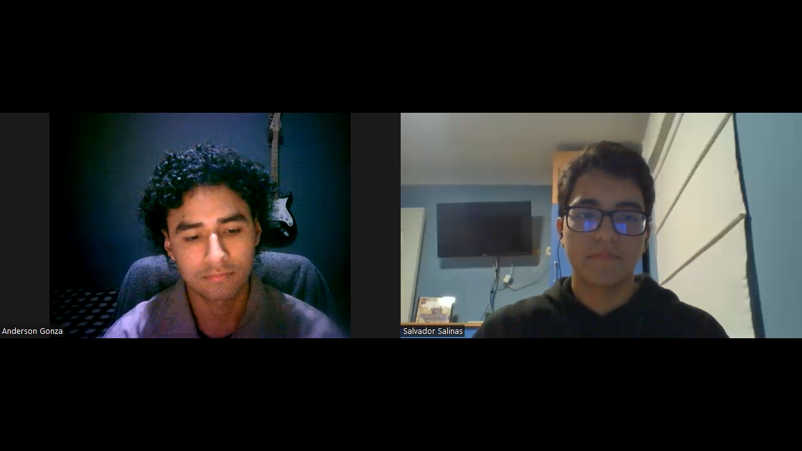
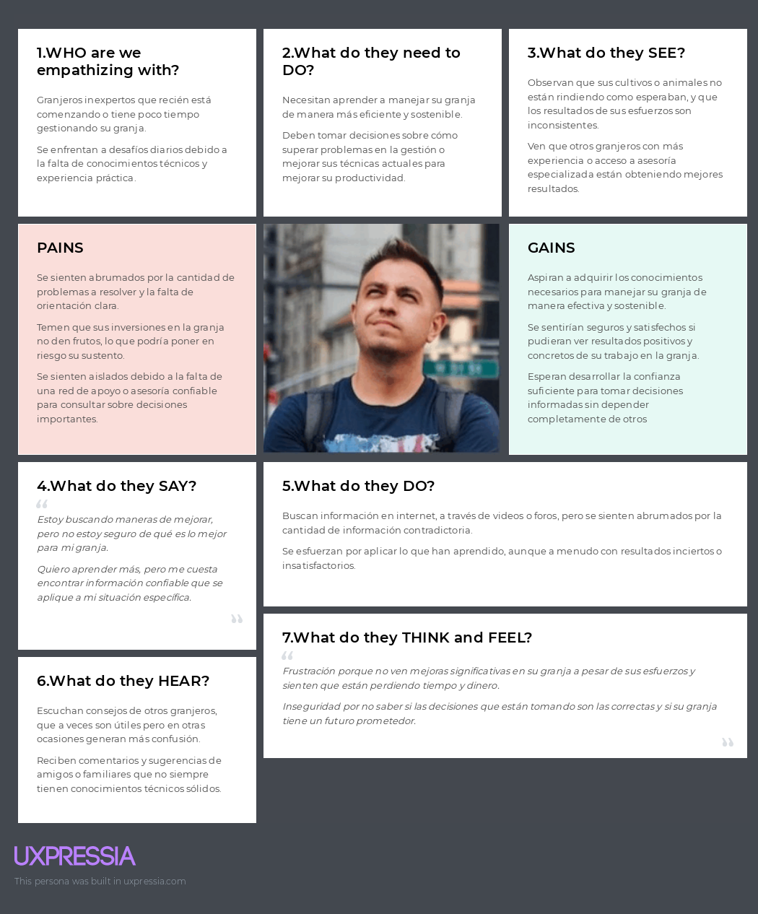

  

  <h1>Universidad Peruana de Ciencias Aplicadas</h1>
  
<strong>Carrera:</strong> Ingeniería de Software

  
<strong>Ciclo:</strong> 2025 - 1

  
<strong>Curso:</strong> Diseño de Experimentos de Ingeniería de Software

  
<strong>Sección:</strong> 4429

  
<strong>Profesor:</strong> Ivan Robles Fernández

  
<strong>"Informe de Trabajo Final"</strong>

  
<strong>Startup:</strong> InnovaTech

  
<strong>Producto:</strong> AgroTech

<table align="center">
  <tr>
    <th>Integrantes</th>
    <th>Código</th>
  </tr>
  <tr>
    <td>Delgado Corrales, Piero Gonzalo</td>
    <td>U202210749</td>
  </tr>
  <tr>
    <td>La Torre Soto, André Sebastián</td>
    <td>U202217772</td>
  </tr>
  <tr>
    <td>Paredes Puente, Sebastián Roberto</td>
    <td>U202217239</td>
  </tr>
  <tr>
    <td>Pecan Pariona, Sergio Joel</td>
    <td>U20201A938</td>
  </tr>
  <tr>
    <td>Salinas Torres, Salvador Antonio</td>
    <td>U20221B127</td>
  </tr>
</table>

<b>Abril 2025</b>

# Registro de versiones

<table>
  <thead>
    <tr>
        <th>Versión</th>
        <th>Fecha</th>
        <th>Autor</th>
        <th>Descripción de modificación</th>
    </tr>
  </thead>
  <tbody>
  <tr>
      <td><strong>TB1</strong></td>
      <td></td>
      <td>
        <ul>
          <li>Delgado Corrales, Piero Gonzalo</li>
          <li>La Torre Soto, André Sebastián</li>
          <li>Paredes Puente, Sebastian Roberto</li>
          <li>Pecan Pariona, Sergio Joel</li>
          <li>Salinas Torres, Salvador Antonio</li>
        </ul>
      </td>
      <td></td>
  </tr>
  </tbody>
</table>

# Project Report Collaboration Insights

# Tabla de Contenido

[Registro de Versiones](#registro-de-versiones)

[Student Outcome](#student-outcome)

**Part I: As-Is Software Project**

[Capítulo I: Introducción](#Capítulo-I-Introducción)
  - [1.1. Startup Profile](#11-startup-profile)
    - [1.1.1. Descripción de la Startup](#111-descripción-de-la-startup)
    - [1.1.2. Perfiles de integrantes del equipo](#112-perfiles-de-integrantes-del-equipo)
  - [1.2. Solution Profile](#12-solution-profile)
    - [1.2.1. Antecedentes y problemática](#121-antecedentes-y-problemática)
    - [1.2.2. Lean UX Process](#122-lean-ux-process)
      - [1.2.2.1. Lean UX Problem Statements](#1221-lean-ux-problem-statements)
      - [1.2.2.2. Lean UX Assumptions](#1222-lean-ux-assumptions)
      - [1.2.2.3. Lean UX Hypothesis Statements](#1223-lean-ux-hypothesis-statements)
      - [1.2.2.4. Lean UX Canvas](#1224-lean-ux-canvas)
  - [1.3. Segmentos objetivo](#13-segmentos-objetivo)

[Capítulo II: Requirements Elicitation & Analysis](#Capítulo-II-Requirements-Elicitation--Analysis)
  - [2.1. Competidores](#21-competidores)
    - [2.1.1. Análisis competitivo](#211-análisis-competitivo)
    - [2.1.2. Estrategias y tácticas frente a competidores](#212-estrategias-y-tácticas-frente-a-competidores)
  - [2.2. Entrevistas](#22-entrevistas)
    - [2.2.1. Diseño de entrevistas](#221-diseño-de-entrevistas)
    - [2.2.2. Registro de entrevistas](#222-registro-de-entrevistas)
    - [2.2.3. Análisis de entrevistas](#223-análisis-de-entrevistas)
  - [2.3. Needfinding](#23-needfinding)
    - [2.3.1. User Personas](#231-user-personas)
    - [2.3.2. User Task Matrix](#232-user-task-matrix)
    - [2.3.3. User Journey Mapping](#233-user-journey-mapping)
    - [2.3.4. Empathy Mapping](#234-empathy-mapping)
    - [2.3.5. As-is Scenario Mapping](#235-as-is-scenario-mapping)
  - [2.4 Ubiquitous Language](#24-ubiquitous-language)

[Capítulo III: Requirements Specification](#Capítulo-III-Requirements-Specification)
  - [3.1. To-Be Scenario Mapping](#31-to-be-scenario-mapping)
  - [3.2. User Stories](#32-user-stories)
  - [3.3. Product Backlog](#33-product-backlog)
  - [3.4. Impact Mapping](#34-impact-mapping)

[Capítulo IV: Product Design](#Capítulo-IV-Product-Design)
  - [4.1. Style Guidelines](#41-style-guidelines)
    - [4.1.1. General Style Guidelines](#411-general-style-guidelines)
    - [4.1.2. Web Style Guidelines](#412-web-style-guidelines)
    - [4.1.3. Mobile Style Guidelines](#413-mobile-style-guidelines)
        - [4.1.3.1. iOS Mobile Style Guidelines](#4131-ios-mobile-style-guidelines)
        - [4.1.3.2. Android Mobile Style Guidelines](#4132-android-mobile-style-guidelines)
  - [4.2. Information Architecture](#42-information-architecture)
    - [4.2.1. Organization Systems](#421-organization-systems)
    - [4.2.2. Labeling Systems](#422-labeling-systems)
    - [4.2.3. SEO Tags and Meta Tags](#423-seo-tags-and-meta-tags)
    - [4.2.4. Searching Systems](#424-searching-systems)
    - [4.2.5. Navigation Systems](#425-navigation-systems)
  - [4.3. Landing Page UI Design](#43-landing-page-ui-design)
    - [4.3.1. Landing Page Wireframe](#431-landing-page-wireframe)
    - [4.3.2. Landing Page Mock-up](#432-landing-page-mock-up)
  - [4.4. Mobile Applications UX/UI Design](#44-mobile-applications-uxui-design)
    - [4.4.1. Mobile Applications Wireframes](#441-mobile-applications-wireframes)
    - [4.4.2. Mobile Applications Wireflow Diagrams](#442-mobile-applications-wireflow-diagrams)
    - [4.4.3. Mobile Applications Mock-ups](#443-mobile-applications-mock-ups)
    - [4.4.4. Mobile Applications User Flow Diagrams](#444-mobile-applications-user-flow-diagrams)
  - [4.5. Mobile Applications Prototyping](#45-mobile-applications-prototyping)
    - [4.5.1. Android Mobile Applications Prototyping](#451-android-mobile-applications-prototyping)
    - [4.5.2. iOS Mobile Applications Prototyping](#452-ios-mobile-applications-prototyping)
  - [4.6. Web Applications UX/UI Design](#46-web-applications-uxui-design)
    - [4.6.1. Web Applications Wireframes](#461-web-applications-wireframes)
    - [4.6.2. Web Applications Wireflow Diagrams](#462-web-applications-wireflow-diagrams)
    - [4.6.3. Web Applications Mock-ups](#463-web-applications-mock-ups)
    - [4.6.4. Web Applications User Flow Diagrams](#464-web-applications-user-flow-diagrams)
  - [4.7. Web Applications Prototyping](#47-web-applications-prototyping)
  - [4.8. Domain-Driven Software Architecture](#48-domain-driven-software-architecture)
    - [4.8.1. Software Architecture Context Diagram](#481-software-architecture-context-diagram)
    - [4.8.2. Software Architecture Container Diagrams](#482-software-architecture-container-diagrams)
    - [4.8.3. Software Architecture Components Diagrams](#483-software-architecture-components-diagrams)
  - [4.9. Software Object-Oriented Design](#49-software-object-oriented-design)
    - [4.9.1. Class Diagrams](#491-class-diagrams)
    - [4.9.2. Class Dictionary](#492-class-dictionary)
  - [4.10. Database Design](#410-database-design)
    - [4.10.1. Relational/Non-Relational Database Diagram](#4101-relationalnon-relational-database-diagram)

[Capítulo V: Product Implementation](#Capítulo-V-Product-Implementation)
  - [5.1. Software Configuration Management](#51-software-configuration-management)
    - [5.1.1. Software Development Environment Configuration](#511-software-development-environment-configuration)
    - [5.1.2. Source Code Management](#512-source-code-management)
    - [5.1.3. Source Code Style Guide & Conventions](#513-source-code-style-guide--conventions)
    - [5.1.4. Software Deployment Configuration](#514-software-deployment-configuration)
  - [5.2. Product Implementation & Deployment](#52-product-implementation--deployment)
    - [5.2.1. Sprint Backlogs](#521-sprint-backlogs)
    - [5.2.2. Implemented Landing Page Evidence](#522-implemented-landing-page-evidence)
    - [5.2.3. Implemented Frontend-Web Application Evidence](#523-implemented-frontend-web-application-evidence)
    - [5.2.4. Implemented Native-Mobile Application Evidence](#524-implemented-native-mobile-application-evidence)
    - [5.2.5. Implemented RESTful API and/or Serverless Backend Evidence](#525-implemented-restful-api-andor-serverless-backend-evidence)
    - [5.2.6. RESTful API documentation](#526-restful-api-documentation)
    - [5.2.7. Team Collaboration Insights](#527-team-collaboration-insights)
  - [5.3. Video About-the-Product](#53-video-about-the-product)

**Part II: Verification, Validation & Pipeline**

[Capítulo VI: Product Verification & Validation](#Capítulo-VI-Product-Verification--Validation)
  - [6.1. Testing Suites & Validation](#61-testing-suites--validation)
    - [6.1.1. Core Entities Unit Tests](#611-core-entities-unit-tests)
    - [6.1.2. Core Integration Tests](#612-core-integration-tests)
    - [6.1.3. Core Behavior-Driven Development](#613-core-behavior-driven-development)
    - [6.1.4. Core System Tests](#614-core-system-tests)
  - [6.2. Static testing & Verification](#62-static-testing--verification)
    - [6.2.1. Static Code Analysis](#621-static-code-analysis)
        - [6.2.1.1. Coding standard & Code conventions](#6211-coding-standard--code-conventions)
        - [6.2.1.2. Code Quality & Code Security](#6212-code-quality--code-security)
    - [6.2.2. Reviews](#622-reviews)
  - [6.3. Validation Interviews](#63-validation-interviews)
    - [6.3.1. Diseño de Entrevistas](#631-diseño-de-entrevistas)
    - [6.3.2. Registro de Entrevistas](#632-registro-de-entrevistas)
    - [6.3.3. Evaluaciones según heurísticas](#633-evaluaciones-según-heurísticas)
  - [6.4. Auditoría de Experiencias de Usuario](#64-auditoría-de-experiencias-de-usuario)
    - [6.4.1. Auditoría realizada](#641-auditoría-realizada)
        - [6.4.1.1. Información del grupo auditado](#6411-información-del-grupo-auditado)
        - [6.4.1.2. Cronograma de auditoría realizada](#6412-cronograma-de-auditoría-realizada)
        - [6.4.1.3. Contenido de auditoría realizada](#6413-contenido-de-auditoría-realizada)
    - [6.4.2. Auditoría recibida](#642-auditoría-recibida)
        - [6.4.2.1. Información del grupo auditor](#6421-información-del-grupo-auditor)
        - [6.4.2.2. Cronograma de auditoría recibida](#6422-cronograma-de-auditoría-recibida)
        - [6.4.2.3. Contenido de auditoría recibida](#6423-contenido-de-auditoría-recibida)
        - [6.4.2.4. Resumen de modificaciones para subsanar hallazgos](#6424-resumen-de-modificaciones-para-subsanar-hallazgos)

[Capítulo VII: DevOps Practices](#Capítulo-VII-DevOps-Practices)
  - [7.1. Continuous Integration](#71-continuous-integration)
    - [7.1.1. Tools and Practices](#711-tools-and-practices)
    - [7.1.2. Build & Test Suite Pipeline Components](#712-build--test-suite-pipeline-components)
  - [7.2. Continuous Delivery](#72-continuous-delivery)
    - [7.2.1. Tools and Practices](#721-tools-and-practices)
    - [7.2.2. Stages Deployment Pipeline Components](#722-stages-deployment-pipeline-components)
  - [7.3. Continuous deployment](#73-continuous-deployment)
    - [7.3.1. Tools and Practices](#731-tools-and-practices)
    - [7.3.2. Production Deployment Pipeline Components](#732-production-deployment-pipeline-components)
  - [7.4. Continuous Monitoring](#74-continuous-monitoring)
    - [7.4.1. Tools and Practices](#741-tools-and-practices)
    - [7.4.2. Monitoring Pipeline Components](#742-monitoring-pipeline-components)
    - [7.4.3. Alerting Pipeline Components](#743-alerting-pipeline-components)
    - [7.4.4. Notification Pipeline Components](#744-notification-pipeline-components)

**Part III: Experiment-Driven Lifecycle**

[Capítulo VIII: Experiment-Driven Development](#Capítulo-VIII-Experiment-Driven-Development)
  - [8.1. Experiment Planning](#81-experiment-planning)
    - [8.1.1. As-Is Summary](#811-as-is-summary)
    - [8.1.2. Raw Material: Assumptions, Knowledge Gaps, Ideas, Claims](#812-raw-material-assumptions-knowledge-gaps-ideas-claims)
    - [8.1.3. Experiment-Ready Questions](#813-experiment-ready-questions)
    - [8.1.4. Question Backlog](#814-question-backlog)
    - [8.1.5. Experiment Cards](#815-experiment-cards)
  - [8.2. Experiment Design](#82-experiment-design)
    - [8.2.1. Hypotheses](#821-hypotheses)
    - [8.2.2. Measures](#822-measures)
    - [8.2.3. Conditions](#823-conditions)
    - [8.2.4. Scale Calculations and Decisions](#824-scale-calculations-and-decisions)
    - [8.2.5. Methods Selection](#825-methods-selection)
    - [8.2.6. Data Analytics: Goals, KPIs and Metrics Selection](#826-data-analytics-goals-kpis-and-metrics-selection)
    - [8.2.7. Web and Mobile Tracking Plan](#827-web-and-mobile-tracking-plan)
  - [8.3. Experimentation](#83-experimentation)
    - [8.3.1. To-Be User Stories](#831-to-be-user-stories)
    - [8.3.2. To-Be Product Backlog](#832-to-be-product-backlog)
    - [8.3.3. Pipeline-supported, Experiment-Driven To-Be Software Platform Lifecycle](#833-pipeline-supported-experiment-driven-to-be-software-platform-lifecycle)
        - [8.3.3.1. To-Be Sprint Backlogs](#8331-to-be-sprint-backlogs)
        - [8.3.3.2. Implemented To-Be Landing Page Evidence](#8332-implemented-to-be-landing-page-evidence)
        - [8.3.3.3. Implemented To-Be Frontend-Web Application Evidence](#8333-implemented-to-be-frontend-web-application-evidence)
        - [8.3.3.4. Implemented To-Be Native-Mobile Application Evidence](#8334-implemented-to-be-native-mobile-application-evidence)
        - [8.3.3.5. Implemented To-Be RESTful API and/or Serverless Backend Evidence](#8335-implemented-to-be-restful-api-andor-serverless-backend-evidence)
        - [8.3.3.6. Team Collaboration Insights](#8336-team-collaboration-insights)
  - [8.4. Experiment Aftermath & Analysis](#84-experiment-aftermath--analysis)
    - [8.4.1. Analysis and Interpretation of Results](#841-analysis-and-interpretation-of-results)
    - [8.4.2. Re-scored and Re-prioritized Question Backlog](#842-re-scored-and-re-prioritized-question-backlog)
  - [8.5. Continuous Learning](#85-continuous-learning)
    - [8.5.1. Shareback Session Artifacts: Learning Workflow](#851-shareback-session-artifacts-learning-workflow)
  - [8.6. To-Be Software Platform Pre-launch](#86-to-be-software-platform-pre-launch)
    - [8.6.1. About-the-Product Intro Video](#861-about-the-product-intro-video)

[Conclusiones](#conclusiones)
  - [Conclusiones y Recomendaciones](#conclusiones-y-recomendaciones)
  - [Video About the Team](#video-about-the-team)

[Bibliografía](#bibliografía)

[Anexos](#anexos)

# Student Outcome

**ABET – EAC - Student Outcome 4**

**Criterio:** La capacidad de reconocer responsabilidades éticas y profesionales en situaciones de ingeniería y hacer juicios informados, que deben considerar el impacto de las soluciones de ingeniería en contextos globales, económicos, ambientales y sociales.

<table>
    <thead>
        <tr>
        <th><strong>Criterio específico</strong></th>
        <th><strong>Acciones realizadas</strong></th>
        <th><strong>Conclusiones</strong></th>
        </tr>
    </thead>
    <tbody>
        <tr>
        <td>4.c.1  Reconoce responsabilidad ética y profesional en situaciones de ingeniería de software</td>
        <td></td>
        <td></td>
        </tr>
        <tr>
        <td>4.c.2 Emite juicios informados considerando el impacto de las soluciones de ingeniería de software en contextos globales, económicos, ambientales y sociales</td>
        <td></td>
        <td></td>
        </tr>
    </tbody>
</table>

# Capítulo I: Introducción
## 1.1. Startup Profile
### 1.1.1. Descripción de la Startup

Nuestra startup se llama Innovatech y está enfocada en resolver los retos de la gestión agrícola mediante nuestro producto AgroTech, una aplicación integral que ofrece soluciones tecnológicas y asesoría especializada para optimizar el manejo de las granjas de forma inteligente y eficiente.

**Misión:**
Facilitar el acceso de los agricultores a asesoramiento experto, impulsando prácticas agrícolas sostenibles y modernas que incrementen la productividad, rentabilidad y el desarrollo de las comunidades rurales.

**Visión:**
Ser referentes en innovación tecnológica para el sector agropecuario, promoviendo la sostenibilidad y el bienestar animal a través de herramientas accesibles y efectivas.

**Logo de AgroTech**

  

_Imagen 1. Logo de AgroTech_

### 1.1.2. Perfiles de integrantes del equipo

<table>
  <tr>
    <th>
      
    </th>
    <td valign="top">
      
<b>Delgado Corrales, Piero Gonzalo</b>

      

        Soy estudiante de séptimo ciclo de Ingeniería de Software, con experiencia en diseño web empleando HTML y CSS, además del uso de Figma para elaborar prototipos. He trabajado con diversos frameworks tanto de frontend (Vue, Angular y React) como de backend (Spring Boot, .NET y Django). Me considero una persona responsable y organizada, comprometida con una gestión eficiente del tiempo.
      

    </td>
  </tr>
</table>

## 1.2. Solution Profile
### 1.2.1. Antecedentes y problemática

**5 W’s**

**What:** Una parte del sector agropecuario enfrenta dificultades en la gestión eficaz de las granjas, acceso limitado a tecnología adecuada, y la necesidad de mejorar tanto el bienestar animal como la sostenibilidad en sus prácticas.

**Where:** El enfoque será a nivel nacional, con especial atención en las regiones del Perú con mayor actividad económica y comercial en el rubro agropecuario.

**When:** Actualmente, el sector agrícola enfrenta estos retos. El crecimiento poblacional y la creciente demanda de alimentos exigen una producción más eficiente. Además, las preocupaciones ambientales exigen buscar prácticas más sostenibles.

**Who:** Los principales beneficiarios son los granjeros, quienes recibirán soluciones adaptadas a su contexto. También participan asesores especializados que aportan su experiencia para apoyar a los agricultores en la toma de decisiones informadas.

**Why:** Es crucial enfrentar estos retos para mejorar la productividad y sostenibilidad de las granjas, garantizar el bienestar animal, y aumentar la rentabilidad de los agricultores, contribuyendo así a la seguridad alimentaria del país.

**2 H's**

**How:** Se resolverá a través de AgroTech, una aplicación web y móvil que brinda asesoramiento, ayudando a los granjeros a gestionar sus granjas con mayor eficiencia, impulsando así su producción y rentabilidad.

**How Much:** Se proyecta un impacto positivo en la eficiencia de las granjas, elevando la productividad y fomentando prácticas sostenibles en el sector.
De acuerdo con Ames (2022), el agro representa cerca del 27.5% del empleo nacional, pero solo aporta un 5.2% al PBI, lo que evidencia una baja productividad frente a otros países de la región. Esto se traduce en menores ingresos para los agricultores y mayor vulnerabilidad ante el clima y los mercados globales.

### 1.2.2. Lean UX Process
#### 1.2.2.1 . Lean UX Problem Statements

**Problem Statement 1**  
| Nuestro producto busca optimizar la gestión de granjas en el Perú. |
|:--|
| Hemos identificado que gran parte de los agricultores en el país enfrentan dificultades al administrar eficientemente sus granjas, lo que impacta negativamente en su productividad y ganancias. |
| ¿Puede nuestra aplicación AgroTech ser una solución efectiva para mejorar la gestión agrícola y elevar la productividad de los granjeros peruanos? |

**Problem Statement 2**  
| Nuestro producto busca incrementar la rentabilidad de los agricultores en el Perú. |
|:--|
| Detectamos que gran parte de los granjeros en el Perú enfrentan obstáculos para alcanzar una rentabilidad constante, principalmente por una gestión ineficiente de sus granjas. |
| ¿Podría AgroTech ser la herramienta que los granjeros necesitan para optimizar sus procesos y mejorar sus ingresos? |

**Problem Statement 3**  
| Nuestro producto busca ofrecer asesoría técnica especializada a los granjeros peruanos. |
|:--|
| Observamos que acceder a orientación profesional en gestión agrícola sigue siendo un reto para muchos productores. |
| ¿De qué manera AgroTech puede facilitar el acceso a asesoramiento experto que impulse una mejor gestión de las granjas? |

#### 1.2.2.2. Lean UX Assumptions

**1. ¿Quién es el usuario?**
El usuario principal es el agricultor con poca experiencia, quien se beneficiará del acompañamiento de asesores especializados que emplean la plataforma para guiarlo en la administración efectiva de su granja. AgroTech facilita la adopción de técnicas sostenibles y contribuye al incremento de la productividad en el sector agrícola.

**2. ¿Dónde encaja nuestro producto en su trabajo o vida?**
AgroTech se integra en la rutina del agricultor al brindar orientación técnica especializada que mejora la gestión de sus actividades diarias. La plataforma se convierte en una aliada constante al proporcionar herramientas para una administración eficiente, mejorar el cuidado de cultivos y animales, implementar prácticas responsables y facilitar la comercialización.

**3. ¿Qué problemas busca resolver nuestro producto?**
El rubro agropecuario presenta múltiples retos como el limitado acceso a conocimientos técnicos y la falta de asesoría especializada. Estas carencias afectan a los agricultores al dificultar prácticas clave como el manejo de suelos, el uso racional de recursos hídricos y fertilizantes, y el control de plagas. Esto genera baja productividad, mayores gastos operativos y compromete la sostenibilidad, reduciendo la competitividad del país y afectando su economía.

**4. ¿Cuándo y cómo se usa nuestro producto?**
AgroTech es una herramienta clave para mejorar la eficiencia operativa, acceder a asesoramiento en tiempo real e implementar prácticas sostenibles. Está diseñada para agricultores con poca experiencia que requieren asistencia en la gestión diaria. Puede usarse desde dispositivos móviles o computadoras, permitiendo el acceso a cualquier hora tanto por parte de los productores como de los asesores.

**5. ¿Qué características son importantes?**

- Proporcionar recomendaciones personalizadas y detalladas sobre la gestión de granjas, abarcando áreas clave como el manejo de recursos, bienestar animal y cultivo, y la implementación de prácticas sostenibles.

- Asegurar que los usuarios reciban asesoramiento en tiempo real, adaptado a sus necesidades específicas y permitiendo una evolución constante en la gestión de sus granjas.

**6. ¿Cómo debe lucir y comportarse nuestro producto?**
AgroTech debe contar con una interfaz intuitiva y atractiva visualmente. Su desempeño debe ser ágil, brindando información útil de forma clara. La seguridad es clave, garantizando la confidencialidad de los datos del usuario.

**Presentación de otros supuestos:**

<table border="1">
  <tr>
    <td>Considero que mis clientes necesitan una solución integral para gestionar sus actividades agropecuarias, incluyendo el bienestar de animales y cultivos, reproducción y comercialización. Planeo generar ingresos mediante suscripciones a la plataforma AgroTech.</td>
    <td>Estas necesidades pueden ser atendidas con tecnología de monitoreo y análisis, junto con el soporte de especialistas que ofrezcan orientación personalizada.</td>
  </tr>
  <tr>
    <td>Mi principal competidor en el mercado es BestFarm.</td>
    <td>Mis clientes iniciales serán agricultores del Perú que buscan hacer más rentables y eficientes sus operaciones.</td>
  </tr>
  <tr>
    <td>AgroTech enfrentará los retos del sector al conectar expertos con productores inexpertos, proporcionando conocimientos prácticos y soluciones adaptadas a distintas áreas de producción.</td>
    <td>El mayor valor que nuestros clientes buscan es incrementar la rentabilidad de sus granjas, cuidando al mismo tiempo el bienestar de cultivos y animales, con un enfoque sostenible.</td>
  </tr>
  <tr>
    <td>El mayor desafío es la resistencia al cambio por parte de ciertos agricultores, quienes podrían mostrarse escépticos ante nuevas formas de trabajo.</td>
    <td>Existe el riesgo de que los clientes no renueven su suscripción si no perciben mejoras reales en la gestión de sus granjas.</td>
  </tr>
  <tr>
    <td>Esto se abordará con una estrategia educativa y de acompañamiento continuo, demostrando el impacto de AgroTech a través de resultados concretos y casos exitosos.</td>
    <td>Captaré a la mayoría de mis clientes mediante marketing digital dirigido, presencia en eventos agrícolas y alianzas con instituciones del sector.</td>
  </tr>
  <tr>
    <td>El eje principal de AgroTech es brindar asesoramiento técnico especializado mediante soluciones inteligentes que potencien la productividad y sostenibilidad en la agricultura.</td>
  </tr>
</table>

#### 1.2.2.3 Lean UX Hypothesis Statements

**Hypothesis Statement 1**

| Creemos que al ofrecer a los agricultores con poca experiencia en Perú acceso a tecnologías de vanguardia y asesoría especializada mediante AgroTech, se logrará una mejora en la eficiencia y rentabilidad de sus granjas. |
| - |
| Sabremos que esto es cierto… |
| Cuando se registre un aumento del 20% en la cantidad de solicitudes de asesoría durante los primeros 6 meses tras el lanzamiento. |

**Hypothesis Statement 2**

| Creemos que al fomentar la adopción de prácticas agrícolas responsables y sostenibles en el sector agropecuario de Perú a través de AgroTech, los agricultores adoptarán un enfoque más consciente del medio ambiente. |
| - |
| Sabremos que esto es cierto… |
| Cuando proporcionemos orientación y recursos enfocados en prácticas sostenibles a través de AgroTech y observemos un incremento del 15% en la implementación de estas prácticas en los primeros 6 meses tras el lanzamiento. |

**Hypothesis Statement 3**

| Creemos que al introducir una nueva estructura de comisiones para los asesores en AgroTech, se incrementará tanto el número de asesores activos como su nivel de satisfacción. |
| - |
| Sabremos que esto es cierto… |
| Cuando veamos un incremento del 20% en el número de asesores activos dentro de los primeros tres meses tras la implementación de la nueva estructura de comisiones. Además, mediremos la retroalimentación de los asesores a través de encuestas regulares, y consideraremos que hemos tenido éxito si al menos el 70% de las respuestas son positivas en relación con la nueva estructura de comisiones. |

#### 1.2.2.4. Lean UX Canvas. 

_Imagen 2. Lean UX Canvas_

## 1.3. Segmentos objetivo

**1. Agricultores con poca experiencia**

Los agricultores con poca experiencia en Perú enfrentan desafíos para gestionar eficientemente sus fincas debido a la falta de conocimientos y recursos. Esto reduce la productividad y rentabilidad. AgroTech ofrece herramientas avanzadas y asesoría especializada para mejorar la gestión, optimizar recursos y aumentar la rentabilidad, contribuyendo a una agricultura más sostenible.

|**Segmento objetivo**|Agricultores con poca experiencia|
| :- | :- |
|**Edad**|18-40 años|
|**Ubicación**|Perú|
|**Sexo**|Masculino y Femenino|
|**Formación educativa**|Educación primaria|
|**Poder adquisitivo**|Bajo y medio|

**2. Asesores con experiencia**

Los asesores con experiencia son claves en el sector agropecuario, brindando orientación técnica y operativa a los productores. AgroTech les permite ampliar su alcance y gestionar sus asesorías de manera eficiente, mejorando la productividad y sostenibilidad de las granjas. Esto refuerza su rol como facilitadores clave en el desarrollo del sector.

|**Segmento objetivo**|Asesores con experiencia|
| :- | :- |
|**Edad**|22-60 años|
|**Ubicación**|Perú|
|**Sexo**|Masculino y Femenino|
|**Formación educativa**|Universitaria o superior|
|**Poder adquisitivo**|Bajo, medio y alto|

# Capítulo 2: Needfinding
## 2.1. Competidores
### 2.1.1. Análisis competitivo

<table>
   <tr>
      <th colspan="6" valign="top"><b>Competitive Analysis Landscape</b></th>
   </tr>
   <tr>
      <td rowspan="2" valign="top">¿Por qué llevar a cabo este análisis? </td>
     <td colspan="5" valign="top">
      <ul>
        <li>Objetivo 1: Obtener información sobre las ofertas de nuestros competidores y aprender de las áreas en las que tienen limitaciones.</li>
        <li>Objetivo 2: Reconocer las fortalezas y debilidades de nuestros competidores para desarrollar una estrategia competitiva robusta y eficaz.</li>
      </ul>
     </td>

   </tr>
   <tr></tr>
   <tr>
      <td colspan="2" valign="top">(En la cabecera colocar por cada competidor nombre y logo)</td>
      <td valign="top">
         
AgroTech

         

      </td>
      <td valign="top">
         
BestFarm

         

      </td>
      <td valign="top">
         
AgriWebb

         

      </td>
      <td valign="top">
         
Trimble Ag 

         

      </td>
   </tr>
   <tr>
      <td rowspan="2">Perfil</td>
      <td valign="top">Overview</td>
      <td valign="top"><b>AgroTech</b> es una plataforma completa que ofrece orientación experta y soluciones tecnológicas para optimizar la gestión de granjas de forma eficiente y sostenible.</td>
      <td valign="top"><b>BestFarm</b> es una plataforma digital diseñada para la gestión integral de granjas agrícolas y ganaderas. Ofrece herramientas para la planificación de cultivos, gestión de recursos, y monitoreo del ganado, todo accesible desde dispositivos móviles</td>
      <td valign="top"><b>AgriWebb</b> es una plataforma digital que ofrece una solución integral para la gestión de granjas, con un enfoque especial en la trazabilidad del ganado y la optimización de la productividad agrícola</td>
      <td valign="top"><b>Trimble Ag</b> ofrece soluciones avanzadas para la gestión de fincas, incluyendo herramientas para la planificación de cultivos, gestión del ganado, y monitoreo de recursos. </td>
   </tr>
   <tr>
      <td valign="top">
         
Ventaja competitiva

         
¿Qué valor ofrece a los clientes?

      </td>
      <td valign="top"><b>AgroTech</b> brinda un acceso sencillo que conecta a agricultores novatos con expertos, facilitando asesoramiento especializado que optimiza la gestión de granjas, promueve prácticas sostenibles y mejora la productividad.</td>
      <td valign="top"><b>BestFarm</b> se destaca por su enfoque en la simplicidad y accesibilidad, permitiendo a los usuarios gestionar tanto cultivos como ganado en una sola plataforma</td>
      <td valign="top">La ventaja de <b>AgriWebb</b> se distingue por su fuerte enfoque en la trazabilidad y la capacidad de capturar datos en tiempo real</td>
      <td valign="top"><b>Trimble Ag</b> se destaca por su tecnología avanzada y su capacidad para integrar datos de múltiples fuentes, proporcionando una visión completa y precisa de las operaciones de la finca</td>
   </tr>
   <tr>
      <td rowspan="2">Perfil de Marketing</td>
      <td valign="top">Mercado objetivo</td>
      <td valign="top">El mercado objetivo de <b>AgroTech</b> son los granjeros con poca experiencia y aquellos que buscan optimizar la gestión de sus granjas</td>
      <td valign="top">El mercado objetivo de <b>BestFarm</b> son los agricultores y ganaderos que buscan una solución unificada para la gestión de todas las operaciones de su finca</td>
      <td valign="top">El mercado objetivo de <b>AgriWebb</b> son ganaderos y agricultores que buscan mejorar la eficiencia y la trazabilidad de sus operaciones</td>
      <td valign="top">El mercado objetivo de <b>Trimble Ag</b> son agricultores y ganaderos de tamaño medio a grande que buscan soluciones integradas para la gestión de sus operaciones</td>
   </tr>
   <tr>
      <td valign="top">Estrategias de marketing</td>
      <td valign="top">Las estrategias que utilizan <b>AgroTech</b> son marketing digital dirigido a granjeros, colaboraciones con asociaciones agrícolas, y promociones en eventos agrícolas</td>
      <td valign="top">Las estrategias que utilizan <b>BestFarm</b> son campañas de marketing digital, demostraciones de producto, y colaboraciones con distribuidores de equipos agrícolas</td>
      <td valign="top">Las estrategias que manejan <b>AgriWebb</b> son marketing digital, talleres educativos, y colaboración con organizaciones agrícolas</td>
      <td valign="top"><b>Trimble Ag</b> realiza participaciones en ferias agrícolas, marketing digital, y demostraciones en campo. También se enfoca en asociaciones estratégicas con proveedores de tecnología agrícola</td>
   </tr>
   <tr>
      <td rowspan="3">Perfil de Producto</td>
      <td valign="top">Productos & Servicios</td>
      <td valign="top"><b>AgroTech</b> ofrece asesoramiento especializado mediante una aplicación web y una móvil para agendar dichas asesorías</td>
      <td valign="top"><b>BestFarm</b> brinda un software de gestión agrícola que incluye planificación de cultivos, gestión de recursos hídricos, y monitoreo de salud animal</td>
      <td valign="top"><b>AgriWebb</b> proporciona un</b> software de gestión de fincas que incluye módulos para la trazabilidad del ganado, monitoreo de la salud animal, y optimización de cultivos</td>
      <td valign="top"><b>Trimble Ag</b> da un software de gestión agrícola y ganadera con módulos para planificación, monitoreo de recursos, y análisis de datos</td>
   </tr>
   <tr>
      <td valign="top">Precios & Costos</td>
      <td valign="top"><b>AgroTech</b> ofrece un modelo de suscripción que puede ser mensual o anual, con precios que dependen de la magnitud de la operación y las funcionalidades necesarias</td>
      <td valign="top"><b>BestFarm</b> ofrece un modelo de suscripción flexible, con precios escalonados según el tamaño y necesidades de la finca</td>
      <td valign="top"><b>AgriWebb</b> ofrece una estructura de precios basada en suscripciones, con planes que se ajustan según el tamaño y las necesidades de la finca.</td>
      <td valign="top"><b>Trimble Ag</b> ofrece precios basados en suscripción, con diferentes niveles según las características y el tamaño de la finca</td>
   </tr>
   <tr>
      <td valign="top">Canales de distribución (Web y/o Móvil)</td>
      <td valign="top"><b>AgroTech</b> está disponible en plataformas web y móviles</td>
      <td valign="top"><b>BestFarm</b> se distribuye a través de una plataforma web</td>
      <td valign="top"><b>AgriWebb</b> se distribuye a través de una plataforma web</td>
      <td valign="top"><b>Trimble Ag</b> se distribuye a través de una plataforma web</td>
   </tr>
   <tr>
      <td rowspan="5">Análisis SWOT</td>
      <td colspan="5" valign="top">Realice esto para su startup y sus competidores. Sus fortalezas deberían apoyar sus oportunidades y contribuir a lo que ustedes definen como su posible ventaja competitiva. </td>
   </tr>
   <tr>
      <td valign="top">
         
Fortalezas

         

      </td>
      <td valign="top">
        
- Plataforma accesible que conecta a granjeros con asesores especializados

        
- Asesoramiento experto en diversas áreas agropecuarias

    </td>
      <td valign="top">
         
- Plataforma integral que cubre tanto la agricultura como la ganadería

         
- Enfoque en la simplicidad y accesibilidad para los usuarios

      </td>
      <td valign="top">
         
- Fuerte enfoque en la trazabilidad y gestión basada en datos

         
- Interfaz intuitiva y fácil de usar

      </td>
      <td valign="top">
         
- Tecnología avanzada y capacidad de integración de datos

         
- Amplia gama de funciones para la gestión integral de fincas

      </td>
   </tr>
   <tr>
      <td valign="top">Debilidades</td>
      <td valign="top">
        
- Dependencia de la adopción tecnológica en un mercado con barreras a la digitalización

        
- Necesidad de una base de asesores con conocimientos bastos

      </td>
      <td valign="top">
         
- Puede carecer de funcionalidades avanzadas específicas para cada sector en comparación con competidores más especializados

         
- Dependencia de un enfoque generalizado, lo que podría limitar la personalización para necesidades específicas

      </td>
      <td valign="top">
         
- Puede ser percibido como costoso para pequeñas fincas

         
- La dependencia de la conectividad a internet podría ser un desafío en áreas rurales

      </td>
      <td valign="top">
         
- Precio alto, lo que puede ser una barrera para pequeños productores

         
- Complejidad en la implementación y el uso inicial

      </td>
   </tr>
   <tr>
      <td valign="top">Oportunidades</td>
      <td valign="top">
        
- Expansión de la plataforma en zonas rurales con mayor demanda de asesoría especializada

        
- Creación de nuevas funcionalidades de asesoría personalizadas según las necesidades de los granjeros

      </td>
      <td valign="top">
         
- Crecimiento en mercados rurales

         
- Creación de características adicionales adaptadas a cada sector

      </td>
      <td valign="top">
         
- Expansión en mercados emergentes que buscan mejorar la trazabilidad y la eficiencia

         
- Integración con tecnologías emergentes como IoT para mejorar el monitoreo en tiempo real

      </td>
      <td valign="top">
         
- Creciente demanda de soluciones integradas en mercados agrícolas avanzados

         
- Innovaciones tecnológicas que pueden mejorar la oferta de productos

      </td>
   </tr>
   <tr>
      <td valign="top">Amenazas</td>
      <td valign="top">
        
- Competencia de plataformas establecidas que ya ofrecen asesorías en el sector agropecuario

        
- Resistencia al cambio en el sector agropecuario que puede dificultar la adopción de nuevas asesorías

      </td>
      <td valign="top">
         
- Competencia de plataformas especializadas en agricultura o ganadería que proporcionan funciones más avanzadas.

         
- Alteraciones en las preferencias de los usuarios que buscan soluciones más personalizadas para sus necesidades particulares.

      </td>
      <td valign="top">
         
- Rivalidad con plataformas especializadas en agricultura o ganadería que disponen de funciones más sofisticadas.

         
- Evolución en las demandas de los usuarios que prefieren soluciones adaptadas a sus necesidades concretas.

      </td>
      <td valign="top">
         
- Competencia de soluciones más accesibles o especializadas

         
- Cambios en la tecnología que pueden requerir actualizaciones frecuentes

      </td>
   </tr>
</table>

### 2.1.2. Estrategias y tácticas frente a competidores

**1. Estrategia: Fortalecimiento del Soporte al Cliente**
- **Táctica:** Implementaremos programas de capacitación integral para granjeros que cubran todos los aspectos de AgroTech.
- **Explicación:** Esto garantizará que los usuarios comprendan completamente las funcionalidades de la plataforma, facilitando su adopción y uso efectivo.

**2. Estrategia: Mejora Continua de la Plataforma**
- **Táctica:** Estableceremos un sistema de retroalimentación continua con los usuarios para identificar áreas de mejora y lanzar actualizaciones periódicas basadas en esa retroalimentación.
- **Explicación:** Mantendremos AgroTech actualizada y alineada con las necesidades cambiantes de los usuarios, asegurando su relevancia y efectividad.

**3. Estrategia: Expansión de la Red de Colaboradores**
- **Táctica:** Formaremos alianzas con universidades y centros de investigación agrícola para desarrollar nuevos conocimientos y tecnologías.
- **Explicación:** Estas colaboraciones facilitarán el acceso a investigaciones avanzadas y tecnologías emergentes, lo que enriquecerá la oferta de AgroTech y promoverá la innovación.

**4. Estrategia: Promoción de la Sostenibilidad**
- **Táctica:** Incorporaremos herramientas y recursos que ayuden a los granjeros a adoptar prácticas agrícolas más sostenibles.
- **Explicación:** Fomentar prácticas agrícolas sostenibles no solo beneficiará al medio ambiente, sino que también responderá a la creciente demanda de prácticas responsables entre los consumidores y reguladores.

**5. Estrategia: Optimización de la Experiencia del Usuario**
- **Táctica:** Rediseñaremos la interfaz de AgroTech para hacerla más intuitiva y accesible para usuarios con diferentes niveles de experiencia.
- **Explicación:** Esto facilitará la adopción de la plataforma por parte de los granjeros, especialmente aquellos con menos familiaridad con tecnologías avanzadas, mejorando la eficiencia y satisfacción del usuario.

## 2.2. Entrevistas
### 2.2.1. Diseño de entrevistas

**Preguntas generales**

**Objetivo:** Obtener información general de todos los entrevistados, los cuales serán muy útiles al momento de crear nuestros User Personas.

1. ¿Cuál es su nombre?
2. ¿Qué edad tiene?
3. ¿Dónde reside actualmente?
4. ¿A qué se dedica?
5. ¿Qué navegador usa normalmente?
6. ¿Qué dispositivo móvil tiene?

**Segmento Objetivo: Granjeros con poca experiencia**

**Objetivo:** Entender las necesidades, desafíos y expectativas de granjeros con poca experiencia para adaptar AgroSupport a sus requerimientos específicos.

1. ¿Cuánto tiempo lleva gestionando su granja y qué tipo de formación ha recibido en manejo agrícola (informal o formal)?
2. ¿Cuáles son sus principales objetivos para el desarrollo de su granja?
3. ¿Cuáles son los principales desafíos que enfrenta en la gestión de su granja?
4. ¿Qué obstáculos ha encontrado al intentar implementar prácticas agrícolas más sostenibles y modernas?
5. ¿A través de qué canales digitales suele buscar información o interactuar con expertos agrícolas?
6. ¿Qué tipo de asesoramiento considera más valioso para su granja: técnico, financiero, de gestión, u otro?
7. ¿Con qué frecuencia cree que necesitaría asesoramiento especializado para resolver problemas específicos en su granja?
8. ¿Qué formato de asesoramiento prefiere (por ejemplo, consultas en línea, reuniones presenciales, guías escritas)?
9. ¿Ha tenido experiencias previas con asesores agrícolas? Si no, ¿qué esperaría de una asesoría con un experto?
10. ¿Qué dificultades tiene para obtener el asesoramiento que necesita para su granja?
11. ¿Qué cualidades le gustaría que tuviera una aplicación para separación de asesorías para que sea útil para usted?
12. ¿Cómo preferiría recibir seguimiento después de una sesión de asesoramiento (revisiones periódicas, informes o consultas adicionales)?

**Segmento Objetivo: Asesores experimentados**

**Objetivo:** Comprender las necesidades y expectativas de los asesores para optimizar su uso de AgroSupport y mejorar su eficacia en la asesoría.

1. ¿Cuánto tiempo lleva trabajando como asesor y en qué áreas específicas de la gestión de granjas se especializa?
2. ¿Cuál es su enfoque principal al ofrecer asesoría a los granjeros?
3. Según su experiencia, ¿qué tipo de asesoramiento buscan más los granjeros (técnico, financiero, gestión, etc.)?
4. ¿Cuáles son los mayores desafíos que enfrenta en la prestación de asesoría a los granjeros?
5. ¿Qué problemas ha encontrado al coordinar horarios y medios de comunicación para llevar a cabo las sesiones de asesoría?
6. ¿Qué tan complejo es mantener a los granjeros como clientes recurrentes? ¿Qué factores considera cruciales para la retención de clientes?
7. ¿Qué funcionalidades le gustaría ver en una plataforma de asesoramiento para mejorar su capacidad de asesorar a los granjeros?
8. Después de una sesión de asesoría, ¿cómo suele hacer el seguimiento con el granjero? ¿Qué tan importante es este seguimiento para el éxito de la asesoría?

### 2.2.2. Registro de entrevistas

**Segmento: Granjero con poca experiencia**

**Entrevista 1**

**Entrevistador:** Sebastian Paredes

**Entrevistado:** Marcelo Neyra

**Enlace a entrevista:** https://youtu.be/rHiZI37vcJY

_Imagen 3. Entrevista con Marcelo Neyra_

**Resumen:**
Marcelo Neyra, un joven estudiante que asiste a su padre en la administración de una pequeña granja familiar, expresa que, en sus tareas diarias como regar el huerto o cuidar los animales, requiere apoyo y asesoramiento confiable. Al hablarle sobre la propuesta de una aplicación para recibir consejos de expertos en el ámbito agrícola, consideró que le sería de gran utilidad.

----

**Entrevista 2**

**Entrevistador:** Salvador Salinas

**Entrevistado:** Anderson Gonza

**Enlace a entrevista:** https://youtu.be/f_8SsNOV2Ew

_Imagen 4. Entrevista con Anderson Gonza_

**Resumen:** Anderson Gonza es un joven estudiante que suele ayudar a su padre en la gestión de una pequeña granja de cuyes. Comenta que necesita apoyo para conocer sobre ciertas técnicas para el cuidado de los animales y cultivos, así como sobre el clima, el cual influye bastante en la producción. Al comentarle sobre la idea de una app para recibir asesorías con expertos en este sector, mencionó que le sería muy útil a través de reuniones en línea o a través de un chat virtual. Asimismo, comenta que debería ser una aplicación fácil de usar y accesible para todos.

----

**Entrevista 3**

**Entrevistador:** X

**Entrevistado:** X

**Enlace a entrevista:** enlace a yt

_Imagen 5. Entrevista con X_

**Resumen:** X

-----

**Segmento: Asesores experimentados**

**Entrevista 1**

**Entrevistador:** Piero Delgado

**Entrevistado:** Adrián Espinoza

**Enlace a entrevista:** https://youtu.be/ANKhs9e_x5E

_Imagen 6. Entrevista con Adrián Espinoza_

**Resumen:** Adrián ha estado involucrado en la crianza de cuyes desde joven por su familia y recientemente ha empezado a ofrecer asesoramiento a otras familias en alimentación, manejo sanitario y selección de razas de cuyes. Por ello, decidió estudiar Medicina Veterinaria en Arequipa para aprender más de la crianza de animales. Durante la entrevista, destacó los desafíos comunes que enfrentan los criadores principiantes, como el manejo de la alimentación y la prevención de enfermedades. Actualmente, utiliza principalmente su conocimiento personal y recursos en línea para brindar asesoramiento, pero está interesado en explorar nuevas herramientas como aplicaciones.

----

**Entrevista 2**

**Entrevistador:** Salvador Salinas

**Entrevistado:** Tamara García

**Enlace a entrevista:** https://youtu.be/Xoqhu8TpxRc

_Imagen 7. Entrevista con Tamara García_

**Resumen:** Tamara García es una potencial asesora con conocimientos en la gestión de una granja de mangos y está dispuesta a aconsejar a granjeros que necesiten apoyo. Su principal recurso es la experiencia que ha ganado gracias a su familia. Menciona que ya ha apoyado a otras personas anteriormente, pero han sido conocidos como familia y amigos. Igualmente, está interesada en poder ayudar a muchas más personas, brindando asesorías cada cierto tiempo cuando haya granjeros que necesiten.

----

**Entrevista 3**

**Entrevistador:** X

**Entrevistado:** X

**Enlace a entrevista:** enlace a yt

_Imagen 8. Entrevista con X_

**Resumen:** X

### 2.2.3. Análisis de entrevistas
**Segmento: Granjeros con poca experiencia**

El análisis de entrevistas a granjeros con poca experiencia revela patrones comunes que permiten identificar características clave para crear arquetipos representativos. Este grupo se distingue por su falta de experiencia en la gestión de granjas y su gran necesidad de apoyo técnico. Las entrevistas proporcionan una visión detallada de los desafíos y expectativas de estos granjeros, especialmente respecto al uso de herramientas tecnológicas para recibir asesoría.

*Segmento Demográfico:*

- **Edad:** Principalmente jóvenes (16 a 30 años).
- **Sexo:** Masculino y Femenino.
- **Ocupación:** Estudiantes que ayudan en la gestión de granjas familiares.

*Segmento Geográfico:*

- **País:** Perú.
- **Idioma:** Español.

*Segmento Psicográfico:*

- **Clase Social:** NSE C y NSE D, debido a que trabajan en granjas familiares pequeñas con recursos limitados.
- **Intereses:** Buscan mejorar sus habilidades en el manejo de granjas, aumentar la producción y aprender sobre nuevas técnicas de cultivo y cuidado animal.

*Segmento Conductual:*

- **Conocimientos:** X
- **Actitudes:** X

*Características Objetivas:*
X

*Características Subjetivas:*
X

**Segmento: Asesores experimentados**

Las entrevistas con asesores experimentados ofrecen valiosa información sobre sus prácticas, motivaciones y desafíos. A partir de sus respuestas, se pueden identificar los rasgos más representativos que influyen en su enfoque de asesoramiento. Este análisis se centra en comprender las necesidades tecnológicas y barreras que enfrentan, así como en cómo su experiencia y especialización guían su interés en utilizar herramientas avanzadas para mejorar la calidad de la asesoría que brindan.

*Segmento Demográfico:*

- **Edad:** Adultos jóvenes a adultos (20 a 45 años).
- **Sexo:** Masculino y Femenino.
- **Ocupación:** Asesores en gestión agrícola y veterinaria.

*Segmento Geográfico:*

- **País:** Perú.
- **Idioma:** Español.

*Segmento Psicográfico:*

- **Clase Social:** NSE A y NSE B, por su nivel de especialización y experiencia en el sector.
- **Intereses:** Ofrecer asesoramiento profesional, mejorar la productividad agrícola y encontrar herramientas que faciliten la gestión de granjas.

*Segmento Conductual:*

- **Conocimientos:** X
- **Actitudes:** X

*Características Objetivas:*
X

*Características Subjetivas:*
X

## 2.3. Needfinding
### 2.3.1. User Personas

El User Persona es una representación ficticia de un usuario ideal, creada a partir de datos reales y patrones de comportamiento observados. Esta descripción incluye sus características demográficas, metas, necesidades, desafíos y comportamientos en relación con un producto o servicio. En este contexto, nos ha ayudado a representar de manera efectiva nuestros dos segmentos objetivo, proporcionando una comprensión más detallada de sus perfiles y necesidades.

**Segmento: Granjeros con poca experiencia**

_Imagen 9. User Persona: Granjero con poca experiencia_

**Segmento: Asesores experimentados**

_Imagen 10. User Persona: Asesor experimentado_

### 2.3.2. User Task Matrix

El User Task Matrix es una herramienta que organiza y presenta las tareas que los usuarios deben ejecutar al interactuar con un producto o servicio. Esta matriz cruza las tareas con diversas variables, como la frecuencia, la relevancia o la dificultad, para identificar las funciones más esenciales y cómo priorizarlas en el diseño. Es útil para comprender las necesidades de los usuarios y mejorar su experiencia al optimizar las tareas clave.

<table>
  <tr>
    <th rowspan="2" valign="top"><b>Task Matrix</b></th>
    <th colspan="2" valign="top"><b>Asesores</b></th>
    <th colspan="2" valign="top"><b>Granjeros</b></th>
  </tr>
  <tr>
    <td valign="top"><b>Frecuencia</b></td>
    <td valign="top"><b>Importancia</b></td>
    <td valign="top"><b>Frecuencia</b></td>
    <td valign="top"><b>Importancia</b></td>
  </tr>
  <tr>
    <td>Participar en sesiones de asesoría</td>
    <td>Mensual</td>
    <td>Media</td>
    <td>Mensual</td>
    <td>Media</td>
  </tr>
  <tr>
    <td>Resolver problemas específicos en granjas</td>
    <td>Según necesidad</td>
    <td>Muy Alta</td>
    <td>Según necesidad</td>
    <td>Muy Alta</td>
  </tr>
  <tr>
    <td>Desarrollar sesiones de capacitación</td>
    <td>A veces</td>
    <td>Alta</td>
    <td>A veces</td>
    <td>Media</td>
  </tr>
  <tr>
    <td>Evaluar condiciones y necesidades de las granjas</td>
    <td>Casi nunca</td>
    <td>Alta</td>
    <td>Diaria</td>
    <td>Media</td>
  </tr>
  <tr>
    <td>Proveer retroalimentación sobre prácticas agrícolas</td>
    <td>Mensual</td>
    <td>Alta</td>
    <td>Casi nunca</td>
    <td>Baja</td>
  </tr>
  <tr>
    <td>Guiar sobre nuevas tecnologías</td>
    <td>Mensual</td>
    <td>Alta</td>
    <td>Casi nunca</td>
    <td>Baja</td>
  </tr>
  <tr>
    <td>Revisar avances de asesorías previas</td>
    <td>Mensual</td>
    <td>Alta</td>
    <td>Semanal</td>
    <td>Alta</td>
  </tr>
  <tr>
    <td>Asistir a eventos sobre tendencias agrícolas</td>
    <td>A veces</td>
    <td>Media</td>
    <td>Nunca</td>
    <td>Baja</td>
  </tr>
  <tr>
    <td>Analizar datos de producción y dar recomendaciones</td>
    <td>Mensual</td>
    <td>Alta</td>
    <td>Mensual</td>
    <td>Alta</td>
  </tr>
  <tr>
    <td>Orientar sobre selección de cultivos adecuados</td>
    <td>Según necesidad</td>
    <td>Alta</td>
    <td>Según necesidad</td>
    <td>Alta</td>
  </tr>
  <tr>
    <td>Realizar seguimiento de asesorías anteriores</td>
    <td>Semanal</td>
    <td>Alta</td>
    <td>Semanal</td>
    <td>Alta</td>
  </tr>
  <tr>
    <td>Proporcionar asesoramiento sobre sostenibilidad</td>
    <td>Mensual</td>
    <td>Alta</td>
    <td>Casi nunca</td>
    <td>Baja</td>
  </tr>
</table>

A partir del Task Matrix, se ha observado que las tareas diarias de los granjeros, como recibir apoyo técnico y participar en sesiones de asesoramiento, son cruciales para su desarrollo. Mientras que los asesores se concentran en evaluar, capacitar y ofrecer orientación especializada. Este análisis sugiere que la plataforma debe adaptarse a las necesidades específicas de ambos grupos, ofreciendo soporte eficiente tanto para la resolución de problemas como para la formación y mejora continua.

### 2.3.3. User Journey Mapping

El User Journey Mapping es una técnica que ayuda a representar el proceso que sigue un usuario al interactuar con un producto o servicio, desde el inicio hasta alcanzar su objetivo final. Este mapa destaca los momentos de contacto, emociones, necesidades y dificultades que enfrenta el usuario en cada fase. Su propósito es entender mejor la experiencia del usuario para optimizar el diseño y proporcionar soluciones más eficaces.

**Segmento: Granjeros con poca experiencia**

_Imagen 11. User Journey Mapping: Granjero con poca experiencia_

**Segmento: Asesores experimentados**

_Imagen 12. User Journey Mapping: Asesor experimentado_

### 2.3.4. Empathy Mapping

El Empathy Mapping es una herramienta clave para entender a los usuarios, en este caso, tanto a los granjeros novatos como a los asesores expertos. Al crear un Empathy Map, se obtiene una visión completa de sus necesidades, motivaciones, frustraciones y comportamientos al analizar lo que piensan, sienten, dicen y hacen. Esto permite diseñar una solución que se ajuste mejor a sus expectativas y optimizar su experiencia con la aplicación.

**Segmento: Granjeros con poca experiencia**

_Imagen 13. Empathy Map: Granjero con poca experiencia_

**Segmento: Asesores experimentados**

_Imagen 14. Empathy Map: Asesor experimentado_

### 2.3.5. As-is Scenario Mapping

El As-Is Scenario Mapping es una herramienta utilizada para analizar y documentar los procesos y experiencias actuales de los usuarios antes de implementar una nueva solución. En este proyecto, se centra en cómo los granjeros sin experiencia y los asesores expertos abordan sus necesidades de asesoría agrícola sin la aplicación propuesta. Este mapeo es crucial para identificar los problemas y las ineficiencias en los métodos existentes, proporcionando una base para comparar con los escenarios futuros (To-Be) y garantizar que la nueva solución aborde adecuadamente las necesidades detectadas.

**Segmento: Granjeros con poca experiencia**

<table>
  <thead>
    <tr>
      <td>Fases</td>
      <td>Enfrentando problemas</td>
      <td>Búsqueda de soluciones</td>
      <td>Consulta con fuentes locales</td>
      <td>Toma de decisiones</td>
    </tr>
  </thead>
  <tbody>
    <tr>
      <td>Doing</td>
      <td>Los granjeros se enfrentan a dificultades en sus cultivos sin saber cómo abordarlas.</td>
      <td>Intentan resolver los problemas por su cuenta a través de internet, foros o consejos de otros granjeros.</td>
      <td>Consultan con otros granjeros locales o comerciantes, quienes ofrecen recomendaciones basadas en su experiencia personal.</td>
      <td>Deciden qué hacer basándose en la información que han reunido.</td>
    </tr>
    <tr>
      <td>Thinking</td>
      <td>"Este cultivo tiene plagas, pero no sé qué tratamiento aplicar o si lo que tengo servirá."</td>
      <td>"Vi en línea que podría usar un pesticida, pero algunos dicen que puede dañar las plantas. No estoy seguro."</td>
      <td>"El vecino sugiere que use el mismo tratamiento que él, pero mi situación es distinta, y no sé si funcionará."</td>
      <td>"Estoy aplicando este pesticida, pero no tengo claro si es la mejor opción. Espero no perder toda la cosecha."</td>
    </tr>
    <tr>
      <td>Feeling</td>
      <td>Frustración por no contar con el conocimiento necesario para resolver los problemas.</td>
      <td>Confusión debido a la gran cantidad de información contradictoria o poco relevante.</td>
      <td>Incertidumbre por la falta de asesoría adecuada y específica.</td>
      <td>Miedo a las posibles repercusiones de sus decisiones.</td>
    </tr>
  </tbody>
</table>

**Segmento: Asesores experimentados**

<table>
  <thead>
    <tr>
      <td>Fases</td>
      <td>Búsqueda de trabajo</td>
      <td>Promoción de servicios</td>
      <td>Contacto con granjeros</td>
      <td>Coordinación de asesorías</td>
    </tr>
  </thead>
  <tbody>
    <tr>
      <td>Doing</td>
      <td>Los asesores buscan oportunidades de trabajo en asesoría agrícola a través de anuncios en línea, redes sociales y recomendaciones.</td>
      <td>Promocionan sus servicios mediante redes sociales, sitios web personales y referencias.</td>
      <td>Se comunican con los granjeros por correo electrónico, redes sociales o llamadas telefónicas.</td>
      <td>Coordinan las sesiones de asesoría.</td>
    </tr>
    <tr>
      <td>Thinking</td>
      <td>"Es difícil encontrar oportunidades de asesoría. Los anuncios son pocos y no sé dónde más buscar para ofrecer mis servicios."</td>
      <td>"He promocionado mis servicios en varias plataformas, pero no veo un aumento en los clientes potenciales. ¿Qué más puedo hacer para atraerlos?"</td>
      <td>"He enviado varios mensajes y correos, pero no obtengo respuestas o la comunicación es poco clara. Esto hace que sea difícil conectar con clientes potenciales."</td>
      <td>"¡Qué difícil coordinar horarios a través de mensajes y llamadas! Muchas veces los granjeros tienen horarios impredecibles, lo que complica la planificación."</td>
    </tr>
    <tr>
      <td>Feeling</td>
      <td>Desánimo por la escasez de oportunidades y la falta de claridad sobre dónde encontrar clientes potenciales.</td>
      <td>Estrés debido a la baja visibilidad y el esfuerzo que no se traduce en resultados concretos.</td>
      <td>Desánimo por la falta de respuestas y la dificultad de establecer una comunicación efectiva.</td>
      <td>Frustración por las dificultades de elegir una fecha y medio adecuados.</td>
    </tr>
  </tbody>
</table>

# Capítulo III: Requirements Specification
## 3.1. To-Be Scenario Mapping

El To-Be Scenario Mapping es una herramienta que ilustra cómo cambiarán los procesos y las experiencias de los usuarios después de la implementación de una nueva solución. En este caso, se centra en cómo la aplicación mejorará el acceso de los granjeros inexpertos a asesorías especializadas y cómo los asesores experimentados podrán encontrar y comunicarse con los granjeros. Este mapeo resalta las mejoras en eficiencia, facilidad y beneficios que la aplicación ofrecerá, permitiendo visualizar el futuro deseado y garantizando que la solución cumpla con las expectativas de los usuarios, resolviendo los problemas detectados en el escenario actual (As-Is).

**Segmento: Granjeros con poca experiencia**

<table>
  <thead>
    <tr>
      <td>Phases</td>
      <td>Promoción de servicios</td>
      <td>Contacto con granjeros</td>
      <td>Realización de asesorías</td>
      <td>Seguimiento</td>
    </tr>
  </thead>
  <tbody>
    <tr>
      <td>Doing</td>
      <td>Los asesores crean publicaciones destacando los servicios que ofrecen para atraer la atención de los granjeros.</td>
      <td>Reciben alertas sobre solicitudes de asesoría de los granjeros y revisan los detalles para conocer la fecha y hora de la asesoría.</td>
      <td>Llevan a cabo las sesiones de asesoría acordadas, proporcionando recomendaciones y soluciones personalizadas durante la consulta.</td>
      <td>Realizan un seguimiento con los granjeros a través de la aplicación, revisan los avances obtenidos y ajustan las recomendaciones si es necesario.</td>
    </tr>
    <tr>
      <td>Thinking</td>
      <td>"La aplicación me permite exhibir mis habilidades y experiencia de forma efectiva, lo cual puede atraer a más granjeros interesados en asesoría."</td>
      <td>"La aplicación facilita la gestión de solicitudes y el contacto inicial, permitiéndome organizar rápidamente las consultas y centrarme en proporcionar una asesoría efectiva."</td>
      <td>"La aplicación me proporciona una forma sencilla de unirme a una videoconferencia para llevar a cabo la asesoría, eliminando la necesidad de otras coordinaciones."</td>
      <td>"El seguimiento es sencillo, ya que puedo contactar al granjero directamente a través de la aplicación."</td>
    </tr>
    <tr>
      <td>Feeling</td>
      <td>Motivación al poder presentar sus servicios de forma atractiva y eficiente para recibir más oportunidades de trabajo.</td>
      <td>Alivio al poder gestionar todas las solicitudes de asesoría de manera ágil y sin complicaciones.</td>
      <td>Contento al contar con una plataforma que facilita unirse a videoconferencias para realizar la asesoría sin complicaciones adicionales.</td>
      <td>Alivio al contar con una herramienta que hace más sencillo el seguimiento y mantiene una comunicación fluida con los granjeros.</td>
    </tr>
  </tbody>
</table>

**Segmento: Asesores experimentados**

<table>
  <thead>
    <tr>
      <td>Phases</td>
      <td>Promoción de servicios</td>
      <td>Contacto con granjeros</td>
      <td>Realización de asesorías</td>
      <td>Seguimiento</td>
    </tr>
  </thead>
  <tbody>
    <tr>
      <td>Doing</td>
      <td>Los asesores crean publicaciones detallando los servicios que ofrecen con el fin de atraer a los granjeros.</td>
      <td>Reciben alertas de solicitudes de asesoría de los granjeros y revisan los detalles para conocer la fecha y hora de la consulta.</td>
      <td>Llevan a cabo las sesiones de asesoría programadas, brindando recomendaciones y soluciones personalizadas durante la consulta.</td>
      <td>Realizan un seguimiento con los granjeros a través de la aplicación, revisando los resultados obtenidos y ajustando las recomendaciones según sea necesario.</td>
    </tr>
    <tr>
      <td>Thinking</td>
      <td>"La aplicación me permite destacar mis habilidades y experiencia de manera efectiva, lo que puede atraer a más granjeros interesados en recibir asesoría."</td>
      <td>"La aplicación facilita la gestión de solicitudes y el contacto inicial, permitiéndome organizar rápidamente las consultas y concentrarme en ofrecer una asesoría efectiva."</td>
      <td>"La aplicación me ofrece una opción simple para unirme a una videoconferencia y llevar a cabo la asesoría, eliminando la necesidad de coordinar otros aspectos logísticos."</td>
      <td>"El seguimiento se vuelve sencillo, ya que puedo contactar al granjero directamente a través de la aplicación."</td>
    </tr>
    <tr>
      <td>Feeling</td>
      <td>Motivación al poder exhibir sus servicios de manera atractiva y efectiva, lo que puede resultar en más oportunidades laborales.</td>
      <td>Alivio al poder gestionar todas las solicitudes de asesoría de manera simple y eficiente.</td>
      <td>Satisfacción al contar con una plataforma que facilita unirse a la videoconferencia para realizar la asesoría sin complicaciones adicionales.</td>
      <td>Alivio al disponer de una herramienta que facilita el seguimiento y permite mantener una comunicación fluida y continua con los granjeros.</td>
    </tr>
  </tbody>
</table>