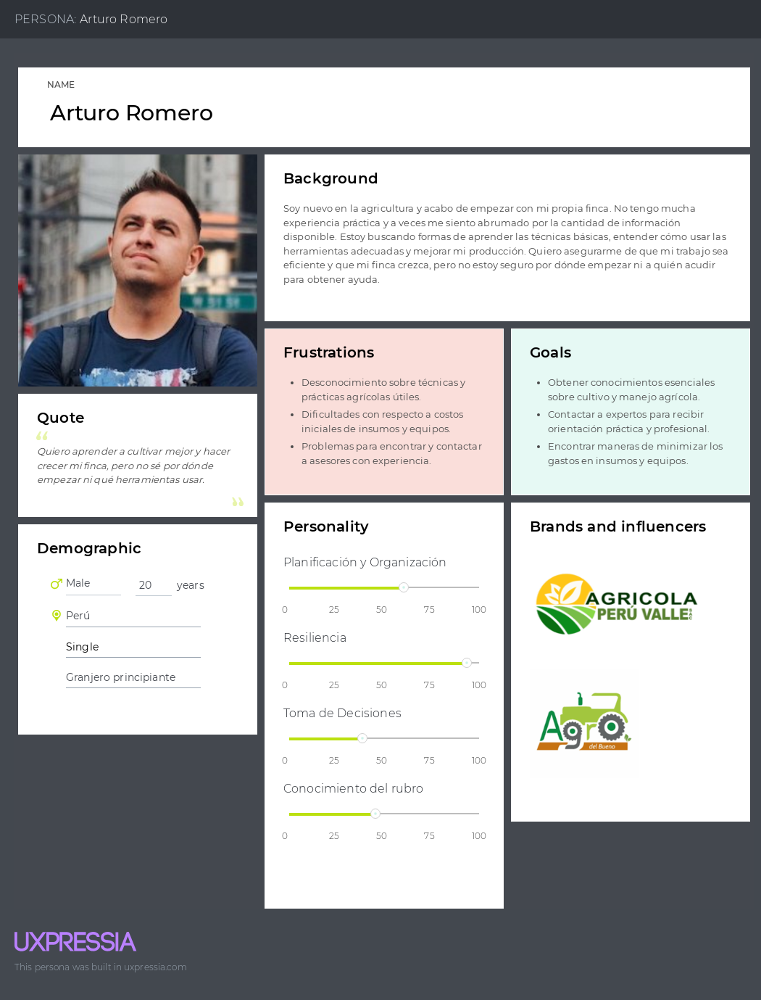

<p align="center">
  
</p>

<div align="center">
  <h1>Universidad Peruana de Ciencias Aplicadas</h1>
  <p><strong>Carrera:</strong> Ingeniería de Software</p>
  <p><strong>Ciclo:</strong> 2025 - 1</p>
  <p><strong>Curso:</strong> Diseño de Experimentos de Ingeniería de Software</p>
  <p><strong>Sección:</strong> 4429</p>
  <p><strong>Profesor:</strong> Ivan Robles Fernández</p>
  <p><strong>"Informe de Trabajo Final"</strong></p>
  <p><strong>Startup:</strong> InnovaTech</p>
  <p><strong>Producto:</strong> AgroTech</p>
</div>

<table align="center">
  <tr>
    <th>Integrantes</th>
    <th>Código</th>
  </tr>
  <tr>
    <td>Delgado Corrales, Piero Gonzalo</td>
    <td>U202210749</td>
  </tr>
  <tr>
    <td>La Torre Soto, André Sebastián</td>
    <td>U202217772</td>
  </tr>
  <tr>
    <td>Paredes Puente, Sebastián Roberto</td>
    <td>U202217239</td>
  </tr>
  <tr>
    <td>Pecan Pariona, Sergio Joel</td>
    <td>U20201A938</td>
  </tr>
  <tr>
    <td>Salinas Torres, Salvador Antonio</td>
    <td>U20221B127</td>
  </tr>
</table>

<p align="center"><b>Abril 2025</b></p>


# Registro de versiones

<table>
  <thead>
    <tr>
        <th>Versión</th>
        <th>Fecha</th>
        <th>Autor</th>
        <th>Descripción de modificación</th>
    </tr>
  </thead>
  <tbody>
  <tr>
      <td><strong>TB1</strong></td>
      <td></td>
      <td>
        <ul>
          <li>Delgado Corrales, Piero Gonzalo</li>
          <li>La Torre Soto, André Sebastián</li>
          <li>Paredes Puente, Sebastian Roberto</li>
          <li>Pecan Pariona, Sergio Joel</li>
          <li>Salinas Torres, Salvador Antonio</li>
        </ul>
      </td>
      <td></td>
  </tr>
  </tbody>
</table>


# Project Report Collaboration Insights

# Tabla de Contenido


[Registro de Versiones](#registro-de-versiones)

[Student Outcome](#student-outcome)

**Part I: As-Is Software Project**

[Capítulo I: Introducción](#Capítulo-I-Introducción)
  - [1.1. Startup Profile](#11-startup-profile)
    - [1.1.1. Descripción de la Startup](#111-descripción-de-la-startup)
    - [1.1.2. Perfiles de integrantes del equipo](#112-perfiles-de-integrantes-del-equipo)
  - [1.2. Solution Profile](#12-solution-profile)
    - [1.2.1. Antecedentes y problemática](#121-antecedentes-y-problemática)
    - [1.2.2. Lean UX Process](#122-lean-ux-process)
      - [1.2.2.1. Lean UX Problem Statements](#1221-lean-ux-problem-statements)
      - [1.2.2.2. Lean UX Assumptions](#1222-lean-ux-assumptions)
      - [1.2.2.3. Lean UX Hypothesis Statements](#1223-lean-ux-hypothesis-statements)
      - [1.2.2.4. Lean UX Canvas](#1224-lean-ux-canvas)
  - [1.3. Segmentos objetivo](#13-segmentos-objetivo)

[Capítulo II: Requirements Elicitation & Analysis](#Capítulo-II-Requirements-Elicitation--Analysis)
  - [2.1. Competidores](#21-competidores)
    - [2.1.1. Análisis competitivo](#211-análisis-competitivo)
    - [2.1.2. Estrategias y tácticas frente a competidores](#212-estrategias-y-tácticas-frente-a-competidores)
  - [2.2. Entrevistas](#22-entrevistas)
    - [2.2.1. Diseño de entrevistas](#221-diseño-de-entrevistas)
    - [2.2.2. Registro de entrevistas](#222-registro-de-entrevistas)
    - [2.2.3. Análisis de entrevistas](#223-análisis-de-entrevistas)
  - [2.3. Needfinding](#23-needfinding)
    - [2.3.1. User Personas](#231-user-personas)
    - [2.3.2. User Task Matrix](#232-user-task-matrix)
    - [2.3.3. User Journey Mapping](#233-user-journey-mapping)
    - [2.3.4. Empathy Mapping](#234-empathy-mapping)
    - [2.3.5. As-is Scenario Mapping](#235-as-is-scenario-mapping)
  - [2.4 Ubiquitous Language](#24-ubiquitous-language)

[Capítulo III: Requirements Specification](#Capítulo-III-Requirements-Specification)
  - [3.1. To-Be Scenario Mapping](#31-to-be-scenario-mapping)
  - [3.2. User Stories](#32-user-stories)
  - [3.3. Product Backlog](#33-product-backlog)
  - [3.4. Impact Mapping](#34-impact-mapping)

[Capítulo IV: Product Design](#Capítulo-IV-Product-Design)
  - [4.1. Style Guidelines](#41-style-guidelines)
    - [4.1.1. General Style Guidelines](#411-general-style-guidelines)
    - [4.1.2. Web Style Guidelines](#412-web-style-guidelines)
    - [4.1.3. Mobile Style Guidelines](#413-mobile-style-guidelines)
        - [4.1.3.1. iOS Mobile Style Guidelines](#4131-ios-mobile-style-guidelines)
        - [4.1.3.2. Android Mobile Style Guidelines](#4132-android-mobile-style-guidelines)
  - [4.2. Information Architecture](#42-information-architecture)
    - [4.2.1. Organization Systems](#421-organization-systems)
    - [4.2.2. Labeling Systems](#422-labeling-systems)
    - [4.2.3. SEO Tags and Meta Tags](#423-seo-tags-and-meta-tags)
    - [4.2.4. Searching Systems](#424-searching-systems)
    - [4.2.5. Navigation Systems](#425-navigation-systems)
  - [4.3. Landing Page UI Design](#43-landing-page-ui-design)
    - [4.3.1. Landing Page Wireframe](#431-landing-page-wireframe)
    - [4.3.2. Landing Page Mock-up](#432-landing-page-mock-up)
  - [4.4. Mobile Applications UX/UI Design](#44-mobile-applications-uxui-design)
    - [4.4.1. Mobile Applications Wireframes](#441-mobile-applications-wireframes)
    - [4.4.2. Mobile Applications Wireflow Diagrams](#442-mobile-applications-wireflow-diagrams)
    - [4.4.3. Mobile Applications Mock-ups](#443-mobile-applications-mock-ups)
    - [4.4.4. Mobile Applications User Flow Diagrams](#444-mobile-applications-user-flow-diagrams)
  - [4.5. Mobile Applications Prototyping](#45-mobile-applications-prototyping)
    - [4.5.1. Android Mobile Applications Prototyping](#451-android-mobile-applications-prototyping)
    - [4.5.2. iOS Mobile Applications Prototyping](#452-ios-mobile-applications-prototyping)
  - [4.6. Web Applications UX/UI Design](#46-web-applications-uxui-design)
    - [4.6.1. Web Applications Wireframes](#461-web-applications-wireframes)
    - [4.6.2. Web Applications Wireflow Diagrams](#462-web-applications-wireflow-diagrams)
    - [4.6.3. Web Applications Mock-ups](#463-web-applications-mock-ups)
    - [4.6.4. Web Applications User Flow Diagrams](#464-web-applications-user-flow-diagrams)
  - [4.7. Web Applications Prototyping](#47-web-applications-prototyping)
  - [4.8. Domain-Driven Software Architecture](#48-domain-driven-software-architecture)
    - [4.8.1. Software Architecture Context Diagram](#481-software-architecture-context-diagram)
    - [4.8.2. Software Architecture Container Diagrams](#482-software-architecture-container-diagrams)
    - [4.8.3. Software Architecture Components Diagrams](#483-software-architecture-components-diagrams)
  - [4.9. Software Object-Oriented Design](#49-software-object-oriented-design)
    - [4.9.1. Class Diagrams](#491-class-diagrams)
    - [4.9.2. Class Dictionary](#492-class-dictionary)
  - [4.10. Database Design](#410-database-design)
    - [4.10.1. Relational/Non-Relational Database Diagram](#4101-relationalnon-relational-database-diagram)

[Capítulo V: Product Implementation](#Capítulo-V-Product-Implementation)
  - [5.1. Software Configuration Management](#51-software-configuration-management)
    - [5.1.1. Software Development Environment Configuration](#511-software-development-environment-configuration)
    - [5.1.2. Source Code Management](#512-source-code-management)
    - [5.1.3. Source Code Style Guide & Conventions](#513-source-code-style-guide--conventions)
    - [5.1.4. Software Deployment Configuration](#514-software-deployment-configuration)
  - [5.2. Product Implementation & Deployment](#52-product-implementation--deployment)
    - [5.2.1. Sprint Backlogs](#521-sprint-backlogs)
    - [5.2.2. Implemented Landing Page Evidence](#522-implemented-landing-page-evidence)
    - [5.2.3. Implemented Frontend-Web Application Evidence](#523-implemented-frontend-web-application-evidence)
    - [5.2.4. Implemented Native-Mobile Application Evidence](#524-implemented-native-mobile-application-evidence)
    - [5.2.5. Implemented RESTful API and/or Serverless Backend Evidence](#525-implemented-restful-api-andor-serverless-backend-evidence)
    - [5.2.6. RESTful API documentation](#526-restful-api-documentation)
    - [5.2.7. Team Collaboration Insights](#527-team-collaboration-insights)
  - [5.3. Video About-the-Product](#53-video-about-the-product)

**Part II: Verification, Validation & Pipeline**

[Capítulo VI: Product Verification & Validation](#Capítulo-VI-Product-Verification--Validation)
  - [6.1. Testing Suites & Validation](#61-testing-suites--validation)
    - [6.1.1. Core Entities Unit Tests](#611-core-entities-unit-tests)
    - [6.1.2. Core Integration Tests](#612-core-integration-tests)
    - [6.1.3. Core Behavior-Driven Development](#613-core-behavior-driven-development)
    - [6.1.4. Core System Tests](#614-core-system-tests)
  - [6.2. Static testing & Verification](#62-static-testing--verification)
    - [6.2.1. Static Code Analysis](#621-static-code-analysis)
        - [6.2.1.1. Coding standard & Code conventions](#6211-coding-standard--code-conventions)
        - [6.2.1.2. Code Quality & Code Security](#6212-code-quality--code-security)
    - [6.2.2. Reviews](#622-reviews)
  - [6.3. Validation Interviews](#63-validation-interviews)
    - [6.3.1. Diseño de Entrevistas](#631-diseño-de-entrevistas)
    - [6.3.2. Registro de Entrevistas](#632-registro-de-entrevistas)
    - [6.3.3. Evaluaciones según heurísticas](#633-evaluaciones-según-heurísticas)
  - [6.4. Auditoría de Experiencias de Usuario](#64-auditoría-de-experiencias-de-usuario)
    - [6.4.1. Auditoría realizada](#641-auditoría-realizada)
        - [6.4.1.1. Información del grupo auditado](#6411-información-del-grupo-auditado)
        - [6.4.1.2. Cronograma de auditoría realizada](#6412-cronograma-de-auditoría-realizada)
        - [6.4.1.3. Contenido de auditoría realizada](#6413-contenido-de-auditoría-realizada)
    - [6.4.2. Auditoría recibida](#642-auditoría-recibida)
        - [6.4.2.1. Información del grupo auditor](#6421-información-del-grupo-auditor)
        - [6.4.2.2. Cronograma de auditoría recibida](#6422-cronograma-de-auditoría-recibida)
        - [6.4.2.3. Contenido de auditoría recibida](#6423-contenido-de-auditoría-recibida)
        - [6.4.2.4. Resumen de modificaciones para subsanar hallazgos](#6424-resumen-de-modificaciones-para-subsanar-hallazgos)

[Capítulo VII: DevOps Practices](#Capítulo-VII-DevOps-Practices)
  - [7.1. Continuous Integration](#71-continuous-integration)
    - [7.1.1. Tools and Practices](#711-tools-and-practices)
    - [7.1.2. Build & Test Suite Pipeline Components](#712-build--test-suite-pipeline-components)
  - [7.2. Continuous Delivery](#72-continuous-delivery)
    - [7.2.1. Tools and Practices](#721-tools-and-practices)
    - [7.2.2. Stages Deployment Pipeline Components](#722-stages-deployment-pipeline-components)
  - [7.3. Continuous deployment](#73-continuous-deployment)
    - [7.3.1. Tools and Practices](#731-tools-and-practices)
    - [7.3.2. Production Deployment Pipeline Components](#732-production-deployment-pipeline-components)
  - [7.4. Continuous Monitoring](#74-continuous-monitoring)
    - [7.4.1. Tools and Practices](#741-tools-and-practices)
    - [7.4.2. Monitoring Pipeline Components](#742-monitoring-pipeline-components)
    - [7.4.3. Alerting Pipeline Components](#743-alerting-pipeline-components)
    - [7.4.4. Notification Pipeline Components](#744-notification-pipeline-components)

**Part III: Experiment-Driven Lifecycle**

[Capítulo VIII: Experiment-Driven Development](#Capítulo-VIII-Experiment-Driven-Development)
  - [8.1. Experiment Planning](#81-experiment-planning)
    - [8.1.1. As-Is Summary](#811-as-is-summary)
    - [8.1.2. Raw Material: Assumptions, Knowledge Gaps, Ideas, Claims](#812-raw-material-assumptions-knowledge-gaps-ideas-claims)
    - [8.1.3. Experiment-Ready Questions](#813-experiment-ready-questions)
    - [8.1.4. Question Backlog](#814-question-backlog)
    - [8.1.5. Experiment Cards](#815-experiment-cards)
  - [8.2. Experiment Design](#82-experiment-design)
    - [8.2.1. Hypotheses](#821-hypotheses)
    - [8.2.2. Measures](#822-measures)
    - [8.2.3. Conditions](#823-conditions)
    - [8.2.4. Scale Calculations and Decisions](#824-scale-calculations-and-decisions)
    - [8.2.5. Methods Selection](#825-methods-selection)
    - [8.2.6. Data Analytics: Goals, KPIs and Metrics Selection](#826-data-analytics-goals-kpis-and-metrics-selection)
    - [8.2.7. Web and Mobile Tracking Plan](#827-web-and-mobile-tracking-plan)
  - [8.3. Experimentation](#83-experimentation)
    - [8.3.1. To-Be User Stories](#831-to-be-user-stories)
    - [8.3.2. To-Be Product Backlog](#832-to-be-product-backlog)
    - [8.3.3. Pipeline-supported, Experiment-Driven To-Be Software Platform Lifecycle](#833-pipeline-supported-experiment-driven-to-be-software-platform-lifecycle)
        - [8.3.3.1. To-Be Sprint Backlogs](#8331-to-be-sprint-backlogs)
        - [8.3.3.2. Implemented To-Be Landing Page Evidence](#8332-implemented-to-be-landing-page-evidence)
        - [8.3.3.3. Implemented To-Be Frontend-Web Application Evidence](#8333-implemented-to-be-frontend-web-application-evidence)
        - [8.3.3.4. Implemented To-Be Native-Mobile Application Evidence](#8334-implemented-to-be-native-mobile-application-evidence)
        - [8.3.3.5. Implemented To-Be RESTful API and/or Serverless Backend Evidence](#8335-implemented-to-be-restful-api-andor-serverless-backend-evidence)
        - [8.3.3.6. Team Collaboration Insights](#8336-team-collaboration-insights)
  - [8.4. Experiment Aftermath & Analysis](#84-experiment-aftermath--analysis)
    - [8.4.1. Analysis and Interpretation of Results](#841-analysis-and-interpretation-of-results)
    - [8.4.2. Re-scored and Re-prioritized Question Backlog](#842-re-scored-and-re-prioritized-question-backlog)
  - [8.5. Continuous Learning](#85-continuous-learning)
    - [8.5.1. Shareback Session Artifacts: Learning Workflow](#851-shareback-session-artifacts-learning-workflow)
  - [8.6. To-Be Software Platform Pre-launch](#86-to-be-software-platform-pre-launch)
    - [8.6.1. About-the-Product Intro Video](#861-about-the-product-intro-video)

[Conclusiones](#conclusiones)
  - [Conclusiones y Recomendaciones](#conclusiones-y-recomendaciones)
  - [Video About the Team](#video-about-the-team)

[Bibliografía](#bibliografía)

[Anexos](#anexos)

# Student Outcome

**ABET – EAC - Student Outcome 4**

**Criterio:** La capacidad de reconocer responsabilidades éticas y profesionales en situaciones de ingeniería y hacer juicios informados, que deben considerar el impacto de las soluciones de ingeniería en contextos globales, económicos, ambientales y sociales.

<table>
    <thead>
        <tr>
        <th><strong>Criterio específico</strong></th>
        <th><strong>Acciones realizadas</strong></th>
        <th><strong>Conclusiones</strong></th>
        </tr>
    </thead>
    <tbody>
        <tr>
        <td>4.c.1  Reconoce responsabilidad ética y profesional en situaciones de ingeniería de software</td>
        <td></td>
        <td></td>
        </tr>
        <tr>
        <td>4.c.2 Emite juicios informados considerando el impacto de las soluciones de ingeniería de software en contextos globales, económicos, ambientales y sociales</td>
        <td></td>
        <td></td>
        </tr>
    </tbody>
</table>

# Capítulo I: Introducción
## 1.1. Startup Profile
### 1.1.1. Descripción de la Startup

Nuestra startup se llama Innovatech y está enfocada en resolver los retos de la gestión agrícola mediante nuestro producto AgroTech, una aplicación integral que ofrece soluciones tecnológicas y asesoría especializada para optimizar el manejo de las granjas de forma inteligente y eficiente.

**Misión:**
Facilitar el acceso de los agricultores a asesoramiento experto, impulsando prácticas agrícolas sostenibles y modernas que incrementen la productividad, rentabilidad y el desarrollo de las comunidades rurales.

**Visión:**
Ser referentes en innovación tecnológica para el sector agropecuario, promoviendo la sostenibilidad y el bienestar animal a través de herramientas accesibles y efectivas.

**Logo de AgroTech**
<p align="center">
  
</p>

_Imagen 1. Logo de AgroTech_

### 1.1.2. Perfiles de integrantes del equipo

<table>
  <tr>
    <th>
      
    </th>
    <td valign="top">
      <p><b>Delgado Corrales, Piero Gonzalo</b></p>
      <p>
        Soy estudiante de séptimo ciclo de Ingeniería de Software, con experiencia en diseño web empleando HTML y CSS, además del uso de Figma para elaborar prototipos. He trabajado con diversos frameworks tanto de frontend (Vue, Angular y React) como de backend (Spring Boot, .NET y Django). Me considero una persona responsable y organizada, comprometida con una gestión eficiente del tiempo.
      </p>
    </td>
  </tr>
  <tr>
    <th>
      
    </th>
    <td valign="top">
      <p><b>Salinas Torres, Salvador Antonio</b></p>
      <p>
        Soy Salvador y actualmente curso el séptimo ciclo de la carrera de Ingeniería de Software. Poseo conocimientos en: programación orientada a objetos en C++, Python, C# y Java; desarrollo de Frontend Web con frameworks de Angular y Vue; desarrollo de backend con frameworks de Spring Boot y .NET; desarrollo móvil con Kotlin y Dart; gestión de base de datos en SQL Server, MySQL y SQLite. Considero que soy una persona responsable y siempre organizo el tiempo para hacerlos tranquilamente antes de la fecha de entrega.
      </p>
    </td>
  </tr>
</table>

## 1.2. Solution Profile
### 1.2.1. Antecedentes y problemática

**5 W’s**

**What:** Una parte del sector agropecuario enfrenta dificultades en la gestión eficaz de las granjas, acceso limitado a tecnología adecuada, y la necesidad de mejorar tanto el bienestar animal como la sostenibilidad en sus prácticas.

**Where:** El enfoque será a nivel nacional, con especial atención en las regiones del Perú con mayor actividad económica y comercial en el rubro agropecuario.

**When:** Actualmente, el sector agrícola enfrenta estos retos. El crecimiento poblacional y la creciente demanda de alimentos exigen una producción más eficiente. Además, las preocupaciones ambientales exigen buscar prácticas más sostenibles.

**Who:** Los principales beneficiarios son los granjeros, quienes recibirán soluciones adaptadas a su contexto. También participan asesores especializados que aportan su experiencia para apoyar a los agricultores en la toma de decisiones informadas.

**Why:** Es crucial enfrentar estos retos para mejorar la productividad y sostenibilidad de las granjas, garantizar el bienestar animal, y aumentar la rentabilidad de los agricultores, contribuyendo así a la seguridad alimentaria del país.

**2 H's**

**How:** Se resolverá a través de AgroTech, una aplicación web y móvil que brinda asesoramiento, ayudando a los granjeros a gestionar sus granjas con mayor eficiencia, impulsando así su producción y rentabilidad.

**How Much:** Se proyecta un impacto positivo en la eficiencia de las granjas, elevando la productividad y fomentando prácticas sostenibles en el sector.
De acuerdo con Ames (2022), el agro representa cerca del 27.5% del empleo nacional, pero solo aporta un 5.2% al PBI, lo que evidencia una baja productividad frente a otros países de la región. Esto se traduce en menores ingresos para los agricultores y mayor vulnerabilidad ante el clima y los mercados globales.

### 1.2.2. Lean UX Process
#### 1.2.2.1 . Lean UX Problem Statements

**Problem Statement 1**  
| Nuestro producto busca optimizar la gestión de granjas en el Perú. |
|:--|
| Hemos identificado que gran parte de los agricultores en el país enfrentan dificultades al administrar eficientemente sus granjas, lo que impacta negativamente en su productividad y ganancias. |
| ¿Puede nuestra aplicación AgroTech ser una solución efectiva para mejorar la gestión agrícola y elevar la productividad de los granjeros peruanos? |

**Problem Statement 2**  
| Nuestro producto busca incrementar la rentabilidad de los agricultores en el Perú. |
|:--|
| Detectamos que gran parte de los granjeros en el Perú enfrentan obstáculos para alcanzar una rentabilidad constante, principalmente por una gestión ineficiente de sus granjas. |
| ¿Podría AgroTech ser la herramienta que los granjeros necesitan para optimizar sus procesos y mejorar sus ingresos? |

**Problem Statement 3**  
| Nuestro producto busca ofrecer asesoría técnica especializada a los granjeros peruanos. |
|:--|
| Observamos que acceder a orientación profesional en gestión agrícola sigue siendo un reto para muchos productores. |
| ¿De qué manera AgroTech puede facilitar el acceso a asesoramiento experto que impulse una mejor gestión de las granjas? |

#### 1.2.2.2. Lean UX Assumptions

**1. ¿Quién es el usuario?**
El usuario principal es el agricultor con poca experiencia, quien se beneficiará del acompañamiento de asesores especializados que emplean la plataforma para guiarlo en la administración efectiva de su granja. AgroTech facilita la adopción de técnicas sostenibles y contribuye al incremento de la productividad en el sector agrícola.

**2. ¿Dónde encaja nuestro producto en su trabajo o vida?**
AgroTech se integra en la rutina del agricultor al brindar orientación técnica especializada que mejora la gestión de sus actividades diarias. La plataforma se convierte en una aliada constante al proporcionar herramientas para una administración eficiente, mejorar el cuidado de cultivos y animales, implementar prácticas responsables y facilitar la comercialización.

**3. ¿Qué problemas busca resolver nuestro producto?**
El rubro agropecuario presenta múltiples retos como el limitado acceso a conocimientos técnicos y la falta de asesoría especializada. Estas carencias afectan a los agricultores al dificultar prácticas clave como el manejo de suelos, el uso racional de recursos hídricos y fertilizantes, y el control de plagas. Esto genera baja productividad, mayores gastos operativos y compromete la sostenibilidad, reduciendo la competitividad del país y afectando su economía.

**4. ¿Cuándo y cómo se usa nuestro producto?**
AgroTech es una herramienta clave para mejorar la eficiencia operativa, acceder a asesoramiento en tiempo real e implementar prácticas sostenibles. Está diseñada para agricultores con poca experiencia que requieren asistencia en la gestión diaria. Puede usarse desde dispositivos móviles o computadoras, permitiendo el acceso a cualquier hora tanto por parte de los productores como de los asesores.

**5. ¿Qué características son importantes?**

- Proporcionar recomendaciones personalizadas y detalladas sobre la gestión de granjas, abarcando áreas clave como el manejo de recursos, bienestar animal y cultivo, y la implementación de prácticas sostenibles.

- Asegurar que los usuarios reciban asesoramiento en tiempo real, adaptado a sus necesidades específicas y permitiendo una evolución constante en la gestión de sus granjas.

**6. ¿Cómo debe lucir y comportarse nuestro producto?**
AgroTech debe contar con una interfaz intuitiva y atractiva visualmente. Su desempeño debe ser ágil, brindando información útil de forma clara. La seguridad es clave, garantizando la confidencialidad de los datos del usuario.

**Presentación de otros supuestos:**

<table border="1">
  <tr>
    <td>Considero que mis clientes necesitan una solución integral para gestionar sus actividades agropecuarias, incluyendo el bienestar de animales y cultivos, reproducción y comercialización. Planeo generar ingresos mediante suscripciones a la plataforma AgroTech.</td>
    <td>Estas necesidades pueden ser atendidas con tecnología de monitoreo y análisis, junto con el soporte de especialistas que ofrezcan orientación personalizada.</td>
  </tr>
  <tr>
    <td>Mi principal competidor en el mercado es BestFarm.</td>
    <td>Mis clientes iniciales serán agricultores del Perú que buscan hacer más rentables y eficientes sus operaciones.</td>
  </tr>
  <tr>
    <td>AgroTech enfrentará los retos del sector al conectar expertos con productores inexpertos, proporcionando conocimientos prácticos y soluciones adaptadas a distintas áreas de producción.</td>
    <td>El mayor valor que nuestros clientes buscan es incrementar la rentabilidad de sus granjas, cuidando al mismo tiempo el bienestar de cultivos y animales, con un enfoque sostenible.</td>
  </tr>
  <tr>
    <td>El mayor desafío es la resistencia al cambio por parte de ciertos agricultores, quienes podrían mostrarse escépticos ante nuevas formas de trabajo.</td>
    <td>Existe el riesgo de que los clientes no renueven su suscripción si no perciben mejoras reales en la gestión de sus granjas.</td>
  </tr>
  <tr>
    <td>Esto se abordará con una estrategia educativa y de acompañamiento continuo, demostrando el impacto de AgroTech a través de resultados concretos y casos exitosos.</td>
    <td>Captaré a la mayoría de mis clientes mediante marketing digital dirigido, presencia en eventos agrícolas y alianzas con instituciones del sector.</td>
  </tr>
  <tr>
    <td>El eje principal de AgroTech es brindar asesoramiento técnico especializado mediante soluciones inteligentes que potencien la productividad y sostenibilidad en la agricultura.</td>
  </tr>
</table>

#### 1.2.2.3 Lean UX Hypothesis Statements

**Hypothesis Statement 1**

| Creemos que al ofrecer a los agricultores con poca experiencia en Perú acceso a tecnologías de vanguardia y asesoría especializada mediante AgroTech, se logrará una mejora en la eficiencia y rentabilidad de sus granjas. |
| - |
| Sabremos que esto es cierto… |
| Cuando se registre un aumento del 20% en la cantidad de solicitudes de asesoría durante los primeros 6 meses tras el lanzamiento. |

**Hypothesis Statement 2**

| Creemos que al fomentar la adopción de prácticas agrícolas responsables y sostenibles en el sector agropecuario de Perú a través de AgroTech, los agricultores adoptarán un enfoque más consciente del medio ambiente. |
| - |
| Sabremos que esto es cierto… |
| Cuando proporcionemos orientación y recursos enfocados en prácticas sostenibles a través de AgroTech y observemos un incremento del 15% en la implementación de estas prácticas en los primeros 6 meses tras el lanzamiento. |

**Hypothesis Statement 3**

| Creemos que al introducir una nueva estructura de comisiones para los asesores en AgroTech, se incrementará tanto el número de asesores activos como su nivel de satisfacción. |
| - |
| Sabremos que esto es cierto… |
| Cuando veamos un incremento del 20% en el número de asesores activos dentro de los primeros tres meses tras la implementación de la nueva estructura de comisiones. Además, mediremos la retroalimentación de los asesores a través de encuestas regulares, y consideraremos que hemos tenido éxito si al menos el 70% de las respuestas son positivas en relación con la nueva estructura de comisiones. |

#### 1.2.2.4. Lean UX Canvas. 


_Imagen 2. Lean UX Canvas_

## 1.3. Segmentos objetivo

**1. Agricultores con poca experiencia**

Los agricultores con poca experiencia en Perú enfrentan desafíos para gestionar eficientemente sus fincas debido a la falta de conocimientos y recursos. Esto reduce la productividad y rentabilidad. AgroTech ofrece herramientas avanzadas y asesoría especializada para mejorar la gestión, optimizar recursos y aumentar la rentabilidad, contribuyendo a una agricultura más sostenible.

|**Segmento objetivo**|Agricultores con poca experiencia|
| :- | :- |
|**Edad**|18-40 años|
|**Ubicación**|Perú|
|**Sexo**|Masculino y Femenino|
|**Formación educativa**|Educación primaria|
|**Poder adquisitivo**|Bajo y medio|

**2. Asesores con experiencia**

Los asesores con experiencia son claves en el sector agropecuario, brindando orientación técnica y operativa a los productores. AgroTech les permite ampliar su alcance y gestionar sus asesorías de manera eficiente, mejorando la productividad y sostenibilidad de las granjas. Esto refuerza su rol como facilitadores clave en el desarrollo del sector.

|**Segmento objetivo**|Asesores con experiencia|
| :- | :- |
|**Edad**|22-60 años|
|**Ubicación**|Perú|
|**Sexo**|Masculino y Femenino|
|**Formación educativa**|Universitaria o superior|
|**Poder adquisitivo**|Bajo, medio y alto|

# Capítulo 2: Needfinding
## 2.1. Competidores
### 2.1.1. Análisis competitivo

<table>
   <tr>
      <th colspan="6" valign="top"><b>Competitive Analysis Landscape</b></th>
   </tr>
   <tr>
      <td rowspan="2" valign="top">¿Por qué llevar a cabo este análisis? </td>
     <td colspan="5" valign="top">
      <ul>
        <li>Objetivo 1: Obtener información sobre las ofertas de nuestros competidores y aprender de las áreas en las que tienen limitaciones.</li>
        <li>Objetivo 2: Reconocer las fortalezas y debilidades de nuestros competidores para desarrollar una estrategia competitiva robusta y eficaz.</li>
      </ul>
     </td>

   </tr>
   <tr></tr>
   <tr>
      <td colspan="2" valign="top">(En la cabecera colocar por cada competidor nombre y logo)</td>
      <td valign="top">
         <p>AgroTech</p>
         <p></p>
      </td>
      <td valign="top">
         <p>BestFarm</p>
         <p></p>
      </td>
      <td valign="top">
         <p>AgriWebb</p>
         <p></p>
      </td>
      <td valign="top">
         <p>Trimble Ag </p>
         <p></p>
      </td>
   </tr>
   <tr>
      <td rowspan="2">Perfil</td>
      <td valign="top">Overview</td>
      <td valign="top"><b>AgroTech</b> es una plataforma completa que ofrece orientación experta y soluciones tecnológicas para optimizar la gestión de granjas de forma eficiente y sostenible.</td>
      <td valign="top"><b>BestFarm</b> es una plataforma digital diseñada para la gestión integral de granjas agrícolas y ganaderas. Ofrece herramientas para la planificación de cultivos, gestión de recursos, y monitoreo del ganado, todo accesible desde dispositivos móviles</td>
      <td valign="top"><b>AgriWebb</b> es una plataforma digital que ofrece una solución integral para la gestión de granjas, con un enfoque especial en la trazabilidad del ganado y la optimización de la productividad agrícola</td>
      <td valign="top"><b>Trimble Ag</b> ofrece soluciones avanzadas para la gestión de fincas, incluyendo herramientas para la planificación de cultivos, gestión del ganado, y monitoreo de recursos. </td>
   </tr>
   <tr>
      <td valign="top">
         <p>Ventaja competitiva</p>
         <p>¿Qué valor ofrece a los clientes?</p>
      </td>
      <td valign="top"><b>AgroTech</b> brinda un acceso sencillo que conecta a agricultores novatos con expertos, facilitando asesoramiento especializado que optimiza la gestión de granjas, promueve prácticas sostenibles y mejora la productividad.</td>
      <td valign="top"><b>BestFarm</b> se destaca por su enfoque en la simplicidad y accesibilidad, permitiendo a los usuarios gestionar tanto cultivos como ganado en una sola plataforma</td>
      <td valign="top">La ventaja de <b>AgriWebb</b> se distingue por su fuerte enfoque en la trazabilidad y la capacidad de capturar datos en tiempo real</td>
      <td valign="top"><b>Trimble Ag</b> se destaca por su tecnología avanzada y su capacidad para integrar datos de múltiples fuentes, proporcionando una visión completa y precisa de las operaciones de la finca</td>
   </tr>
   <tr>
      <td rowspan="2">Perfil de Marketing</td>
      <td valign="top">Mercado objetivo</td>
      <td valign="top">El mercado objetivo de <b>AgroTech</b> son los granjeros con poca experiencia y aquellos que buscan optimizar la gestión de sus granjas</td>
      <td valign="top">El mercado objetivo de <b>BestFarm</b> son los agricultores y ganaderos que buscan una solución unificada para la gestión de todas las operaciones de su finca</td>
      <td valign="top">El mercado objetivo de <b>AgriWebb</b> son ganaderos y agricultores que buscan mejorar la eficiencia y la trazabilidad de sus operaciones</td>
      <td valign="top">El mercado objetivo de <b>Trimble Ag</b> son agricultores y ganaderos de tamaño medio a grande que buscan soluciones integradas para la gestión de sus operaciones</td>
   </tr>
   <tr>
      <td valign="top">Estrategias de marketing</td>
      <td valign="top">Las estrategias que utilizan <b>AgroTech</b> son marketing digital dirigido a granjeros, colaboraciones con asociaciones agrícolas, y promociones en eventos agrícolas</td>
      <td valign="top">Las estrategias que utilizan <b>BestFarm</b> son campañas de marketing digital, demostraciones de producto, y colaboraciones con distribuidores de equipos agrícolas</td>
      <td valign="top">Las estrategias que manejan <b>AgriWebb</b> son marketing digital, talleres educativos, y colaboración con organizaciones agrícolas</td>
      <td valign="top"><b>Trimble Ag</b> realiza participaciones en ferias agrícolas, marketing digital, y demostraciones en campo. También se enfoca en asociaciones estratégicas con proveedores de tecnología agrícola</td>
   </tr>
   <tr>
      <td rowspan="3">Perfil de Producto</td>
      <td valign="top">Productos & Servicios</td>
      <td valign="top"><b>AgroTech</b> ofrece asesoramiento especializado mediante una aplicación web y una móvil para agendar dichas asesorías</td>
      <td valign="top"><b>BestFarm</b> brinda un software de gestión agrícola que incluye planificación de cultivos, gestión de recursos hídricos, y monitoreo de salud animal</td>
      <td valign="top"><b>AgriWebb</b> proporciona un</b> software de gestión de fincas que incluye módulos para la trazabilidad del ganado, monitoreo de la salud animal, y optimización de cultivos</td>
      <td valign="top"><b>Trimble Ag</b> da un software de gestión agrícola y ganadera con módulos para planificación, monitoreo de recursos, y análisis de datos</td>
   </tr>
   <tr>
      <td valign="top">Precios & Costos</td>
      <td valign="top"><b>AgroTech</b> ofrece un modelo de suscripción que puede ser mensual o anual, con precios que dependen de la magnitud de la operación y las funcionalidades necesarias</td>
      <td valign="top"><b>BestFarm</b> ofrece un modelo de suscripción flexible, con precios escalonados según el tamaño y necesidades de la finca</td>
      <td valign="top"><b>AgriWebb</b> ofrece una estructura de precios basada en suscripciones, con planes que se ajustan según el tamaño y las necesidades de la finca.</td>
      <td valign="top"><b>Trimble Ag</b> ofrece precios basados en suscripción, con diferentes niveles según las características y el tamaño de la finca</td>
   </tr>
   <tr>
      <td valign="top">Canales de distribución (Web y/o Móvil)</td>
      <td valign="top"><b>AgroTech</b> está disponible en plataformas web y móviles</td>
      <td valign="top"><b>BestFarm</b> se distribuye a través de una plataforma web</td>
      <td valign="top"><b>AgriWebb</b> se distribuye a través de una plataforma web</td>
      <td valign="top"><b>Trimble Ag</b> se distribuye a través de una plataforma web</td>
   </tr>
   <tr>
      <td rowspan="5">Análisis SWOT</td>
      <td colspan="5" valign="top">Realice esto para su startup y sus competidores. Sus fortalezas deberían apoyar sus oportunidades y contribuir a lo que ustedes definen como su posible ventaja competitiva. </td>
   </tr>
   <tr>
      <td valign="top">
         <p>Fortalezas</p>
         <p></p>
      </td>
      <td valign="top">
        <p>- Plataforma accesible que conecta a granjeros con asesores especializados</p>
        <p>- Asesoramiento experto en diversas áreas agropecuarias</p>
    </td>
      <td valign="top">
         <p>- Plataforma integral que cubre tanto la agricultura como la ganadería</p>
         <p>- Enfoque en la simplicidad y accesibilidad para los usuarios</p>
      </td>
      <td valign="top">
         <p>- Fuerte enfoque en la trazabilidad y gestión basada en datos</p>
         <p>- Interfaz intuitiva y fácil de usar</p>
      </td>
      <td valign="top">
         <p>- Tecnología avanzada y capacidad de integración de datos</p>
         <p>- Amplia gama de funciones para la gestión integral de fincas</p>
      </td>
   </tr>
   <tr>
      <td valign="top">Debilidades</td>
      <td valign="top">
        <p>- Dependencia de la adopción tecnológica en un mercado con barreras a la digitalización</p>
        <p>- Necesidad de una base de asesores con conocimientos bastos</p>
      </td>
      <td valign="top">
         <p>- Puede carecer de funcionalidades avanzadas específicas para cada sector en comparación con competidores más especializados</p>
         <p>- Dependencia de un enfoque generalizado, lo que podría limitar la personalización para necesidades específicas</p>
      </td>
      <td valign="top">
         <p>- Puede ser percibido como costoso para pequeñas fincas</p>
         <p>- La dependencia de la conectividad a internet podría ser un desafío en áreas rurales</p>
      </td>
      <td valign="top">
         <p>- Precio alto, lo que puede ser una barrera para pequeños productores</p>
         <p>- Complejidad en la implementación y el uso inicial</p>
      </td>
   </tr>
   <tr>
      <td valign="top">Oportunidades</td>
      <td valign="top">
        <p>- Expansión de la plataforma en zonas rurales con mayor demanda de asesoría especializada</p>
        <p>- Creación de nuevas funcionalidades de asesoría personalizadas según las necesidades de los granjeros</p>
      </td>
      <td valign="top">
         <p>- Crecimiento en mercados rurales</p>
         <p>- Creación de características adicionales adaptadas a cada sector</p>
      </td>
      <td valign="top">
         <p>- Expansión en mercados emergentes que buscan mejorar la trazabilidad y la eficiencia</p>
         <p>- Integración con tecnologías emergentes como IoT para mejorar el monitoreo en tiempo real</p>
      </td>
      <td valign="top">
         <p>- Creciente demanda de soluciones integradas en mercados agrícolas avanzados</p>
         <p>- Innovaciones tecnológicas que pueden mejorar la oferta de productos</p>
      </td>
   </tr>
   <tr>
      <td valign="top">Amenazas</td>
      <td valign="top">
        <p>- Competencia de plataformas establecidas que ya ofrecen asesorías en el sector agropecuario</p>
        <p>- Resistencia al cambio en el sector agropecuario que puede dificultar la adopción de nuevas asesorías</p>
      </td>
      <td valign="top">
         <p>- Competencia de plataformas especializadas en agricultura o ganadería que proporcionan funciones más avanzadas.</p>
         <p>- Alteraciones en las preferencias de los usuarios que buscan soluciones más personalizadas para sus necesidades particulares.</p>
      </td>
      <td valign="top">
         <p>- Rivalidad con plataformas especializadas en agricultura o ganadería que disponen de funciones más sofisticadas.</p>
         <p>- Evolución en las demandas de los usuarios que prefieren soluciones adaptadas a sus necesidades concretas.</p>
      </td>
      <td valign="top">
         <p>- Competencia de soluciones más accesibles o especializadas</p>
         <p>- Cambios en la tecnología que pueden requerir actualizaciones frecuentes</p>
      </td>
   </tr>
</table>

### 2.1.2. Estrategias y tácticas frente a competidores

**1. Estrategia: Fortalecimiento del Soporte al Cliente**
- **Táctica:** Implementaremos programas de capacitación integral para granjeros que cubran todos los aspectos de AgroTech.
- **Explicación:** Esto garantizará que los usuarios comprendan completamente las funcionalidades de la plataforma, facilitando su adopción y uso efectivo.

**2. Estrategia: Mejora Continua de la Plataforma**
- **Táctica:** Estableceremos un sistema de retroalimentación continua con los usuarios para identificar áreas de mejora y lanzar actualizaciones periódicas basadas en esa retroalimentación.
- **Explicación:** Mantendremos AgroTech actualizada y alineada con las necesidades cambiantes de los usuarios, asegurando su relevancia y efectividad.

**3. Estrategia: Expansión de la Red de Colaboradores**
- **Táctica:** Formaremos alianzas con universidades y centros de investigación agrícola para desarrollar nuevos conocimientos y tecnologías.
- **Explicación:** Estas colaboraciones facilitarán el acceso a investigaciones avanzadas y tecnologías emergentes, lo que enriquecerá la oferta de AgroTech y promoverá la innovación.

**4. Estrategia: Promoción de la Sostenibilidad**
- **Táctica:** Incorporaremos herramientas y recursos que ayuden a los granjeros a adoptar prácticas agrícolas más sostenibles.
- **Explicación:** Fomentar prácticas agrícolas sostenibles no solo beneficiará al medio ambiente, sino que también responderá a la creciente demanda de prácticas responsables entre los consumidores y reguladores.

**5. Estrategia: Optimización de la Experiencia del Usuario**
- **Táctica:** Rediseñaremos la interfaz de AgroTech para hacerla más intuitiva y accesible para usuarios con diferentes niveles de experiencia.
- **Explicación:** Esto facilitará la adopción de la plataforma por parte de los granjeros, especialmente aquellos con menos familiaridad con tecnologías avanzadas, mejorando la eficiencia y satisfacción del usuario.

## 2.2. Entrevistas
### 2.2.1. Diseño de entrevistas

**Preguntas generales**

**Objetivo:** Obtener información general de todos los entrevistados, los cuales serán muy útiles al momento de crear nuestros User Personas.

1. ¿Cuál es su nombre?
2. ¿Qué edad tiene?
3. ¿Dónde reside actualmente?
4. ¿A qué se dedica?
5. ¿Qué navegador usa normalmente?
6. ¿Qué dispositivo móvil tiene?

**Segmento Objetivo: Granjeros con poca experiencia**

**Objetivo:** Entender las necesidades, desafíos y expectativas de granjeros con poca experiencia para adaptar AgroSupport a sus requerimientos específicos.

1. ¿Cuánto tiempo lleva gestionando su granja y qué tipo de formación ha recibido en manejo agrícola (informal o formal)?
2. ¿Cuáles son sus principales objetivos para el desarrollo de su granja?
3. ¿Cuáles son los principales desafíos que enfrenta en la gestión de su granja?
4. ¿Qué obstáculos ha encontrado al intentar implementar prácticas agrícolas más sostenibles y modernas?
5. ¿A través de qué canales digitales suele buscar información o interactuar con expertos agrícolas?
6. ¿Qué tipo de asesoramiento considera más valioso para su granja: técnico, financiero, de gestión, u otro?
7. ¿Con qué frecuencia cree que necesitaría asesoramiento especializado para resolver problemas específicos en su granja?
8. ¿Qué formato de asesoramiento prefiere (por ejemplo, consultas en línea, reuniones presenciales, guías escritas)?
9. ¿Ha tenido experiencias previas con asesores agrícolas? Si no, ¿qué esperaría de una asesoría con un experto?
10. ¿Qué dificultades tiene para obtener el asesoramiento que necesita para su granja?
11. ¿Qué cualidades le gustaría que tuviera una aplicación para separación de asesorías para que sea útil para usted?
12. ¿Cómo preferiría recibir seguimiento después de una sesión de asesoramiento (revisiones periódicas, informes o consultas adicionales)?

**Segmento Objetivo: Asesores experimentados**

**Objetivo:** Comprender las necesidades y expectativas de los asesores para optimizar su uso de AgroSupport y mejorar su eficacia en la asesoría.

1. ¿Cuánto tiempo lleva trabajando como asesor y en qué áreas específicas de la gestión de granjas se especializa?
2. ¿Cuál es su enfoque principal al ofrecer asesoría a los granjeros?
3. Según su experiencia, ¿qué tipo de asesoramiento buscan más los granjeros (técnico, financiero, gestión, etc.)?
4. ¿Cuáles son los mayores desafíos que enfrenta en la prestación de asesoría a los granjeros?
5. ¿Qué problemas ha encontrado al coordinar horarios y medios de comunicación para llevar a cabo las sesiones de asesoría?
6. ¿Qué tan complejo es mantener a los granjeros como clientes recurrentes? ¿Qué factores considera cruciales para la retención de clientes?
7. ¿Qué funcionalidades le gustaría ver en una plataforma de asesoramiento para mejorar su capacidad de asesorar a los granjeros?
8. Después de una sesión de asesoría, ¿cómo suele hacer el seguimiento con el granjero? ¿Qué tan importante es este seguimiento para el éxito de la asesoría?

### 2.2.2. Registro de entrevistas

**Segmento: Granjero con poca experiencia**

**Entrevista 1**

**Entrevistador:** Sebastian Paredes

**Entrevistado:** Marcelo Neyra

**Enlace a entrevista:** https://youtu.be/rHiZI37vcJY


_Imagen 3. Entrevista con Marcelo Neyra_

**Resumen:**
Marcelo Neyra, un joven estudiante que asiste a su padre en la administración de una pequeña granja familiar, expresa que, en sus tareas diarias como regar el huerto o cuidar los animales, requiere apoyo y asesoramiento confiable. Al hablarle sobre la propuesta de una aplicación para recibir consejos de expertos en el ámbito agrícola, consideró que le sería de gran utilidad.

----

**Entrevista 2**

**Entrevistador:** Salvador Salinas

**Entrevistado:** Anderson Gonza

**Enlace a entrevista:** https://youtu.be/f_8SsNOV2Ew


_Imagen 4. Entrevista con Anderson Gonza_

**Resumen:** Anderson Gonza es un joven estudiante que suele ayudar a su padre en la gestión de una pequeña granja de cuyes. Comenta que necesita apoyo para conocer sobre ciertas técnicas para el cuidado de los animales y cultivos, así como sobre el clima, el cual influye bastante en la producción. Al comentarle sobre la idea de una app para recibir asesorías con expertos en este sector, mencionó que le sería muy útil a través de reuniones en línea o a través de un chat virtual. Asimismo, comenta que debería ser una aplicación fácil de usar y accesible para todos.

----

**Entrevista 3**

**Entrevistador:** X

**Entrevistado:** X

**Enlace a entrevista:** enlace a yt


_Imagen 5. Entrevista con X_

**Resumen:** X

-----

**Segmento: Asesores experimentados**

**Entrevista 1**

**Entrevistador:** Piero Delgado

**Entrevistado:** Adrián Espinoza

**Enlace a entrevista:** https://youtu.be/ANKhs9e_x5E


_Imagen 6. Entrevista con Adrián Espinoza_

**Resumen:** Adrián ha estado involucrado en la crianza de cuyes desde joven por su familia y recientemente ha empezado a ofrecer asesoramiento a otras familias en alimentación, manejo sanitario y selección de razas de cuyes. Por ello, decidió estudiar Medicina Veterinaria en Arequipa para aprender más de la crianza de animales. Durante la entrevista, destacó los desafíos comunes que enfrentan los criadores principiantes, como el manejo de la alimentación y la prevención de enfermedades. Actualmente, utiliza principalmente su conocimiento personal y recursos en línea para brindar asesoramiento, pero está interesado en explorar nuevas herramientas como aplicaciones.

----

**Entrevista 2**

**Entrevistador:** Salvador Salinas

**Entrevistado:** Tamara García

**Enlace a entrevista:** https://youtu.be/Xoqhu8TpxRc


_Imagen 7. Entrevista con Tamara García_

**Resumen:** Tamara García es una potencial asesora con conocimientos en la gestión de una granja de mangos y está dispuesta a aconsejar a granjeros que necesiten apoyo. Su principal recurso es la experiencia que ha ganado gracias a su familia. Menciona que ya ha apoyado a otras personas anteriormente, pero han sido conocidos como familia y amigos. Igualmente, está interesada en poder ayudar a muchas más personas, brindando asesorías cada cierto tiempo cuando haya granjeros que necesiten.

----

**Entrevista 3**

**Entrevistador:** X

**Entrevistado:** X

**Enlace a entrevista:** enlace a yt


_Imagen 8. Entrevista con X_

**Resumen:** X

### 2.2.3. Análisis de entrevistas
**Segmento: Granjeros con poca experiencia**

El análisis de entrevistas a granjeros con poca experiencia revela patrones comunes que permiten identificar características clave para crear arquetipos representativos. Este grupo se distingue por su falta de experiencia en la gestión de granjas y su gran necesidad de apoyo técnico. Las entrevistas proporcionan una visión detallada de los desafíos y expectativas de estos granjeros, especialmente respecto al uso de herramientas tecnológicas para recibir asesoría.

*Segmento Demográfico:*

- **Edad:** Principalmente jóvenes (16 a 30 años).
- **Sexo:** Masculino y Femenino.
- **Ocupación:** Estudiantes que ayudan en la gestión de granjas familiares.

*Segmento Geográfico:*

- **País:** Perú.
- **Idioma:** Español.

*Segmento Psicográfico:*

- **Clase Social:** NSE C y NSE D, debido a que trabajan en granjas familiares pequeñas con recursos limitados.
- **Intereses:** Buscan mejorar sus habilidades en el manejo de granjas, aumentar la producción y aprender sobre nuevas técnicas de cultivo y cuidado animal.

*Segmento Conductual:*

- **Conocimientos:** X
- **Actitudes:** X

*Características Objetivas:*
X

*Características Subjetivas:*
X


**Segmento: Asesores experimentados**

Las entrevistas con asesores experimentados ofrecen valiosa información sobre sus prácticas, motivaciones y desafíos. A partir de sus respuestas, se pueden identificar los rasgos más representativos que influyen en su enfoque de asesoramiento. Este análisis se centra en comprender las necesidades tecnológicas y barreras que enfrentan, así como en cómo su experiencia y especialización guían su interés en utilizar herramientas avanzadas para mejorar la calidad de la asesoría que brindan.

*Segmento Demográfico:*

- **Edad:** Adultos jóvenes a adultos (20 a 45 años).
- **Sexo:** Masculino y Femenino.
- **Ocupación:** Asesores en gestión agrícola y veterinaria.

*Segmento Geográfico:*

- **País:** Perú.
- **Idioma:** Español.

*Segmento Psicográfico:*

- **Clase Social:** NSE A y NSE B, por su nivel de especialización y experiencia en el sector.
- **Intereses:** Ofrecer asesoramiento profesional, mejorar la productividad agrícola y encontrar herramientas que faciliten la gestión de granjas.

*Segmento Conductual:*

- **Conocimientos:** X
- **Actitudes:** X

*Características Objetivas:*
X

*Características Subjetivas:*
X

## 2.3. Needfinding
### 2.3.1. User Personas

El User Persona es una representación ficticia de un usuario ideal, creada a partir de datos reales y patrones de comportamiento observados. Esta descripción incluye sus características demográficas, metas, necesidades, desafíos y comportamientos en relación con un producto o servicio. En este contexto, nos ha ayudado a representar de manera efectiva nuestros dos segmentos objetivo, proporcionando una comprensión más detallada de sus perfiles y necesidades.

**Segmento: Granjeros con poca experiencia**




_Imagen 9. User Persona: Granjero con poca experiencia_

**Segmento: Asesores experimentados**


_Imagen 10. User Persona: Asesor experimentado_

### 2.3.2. User Task Matrix

El User Task Matrix es una herramienta que organiza y presenta las tareas que los usuarios deben ejecutar al interactuar con un producto o servicio. Esta matriz cruza las tareas con diversas variables, como la frecuencia, la relevancia o la dificultad, para identificar las funciones más esenciales y cómo priorizarlas en el diseño. Es útil para comprender las necesidades de los usuarios y mejorar su experiencia al optimizar las tareas clave.

<table>
  <tr>
    <th rowspan="2" valign="top"><b>Task Matrix</b></th>
    <th colspan="2" valign="top"><b>Asesores</b></th>
    <th colspan="2" valign="top"><b>Granjeros</b></th>
  </tr>
  <tr>
    <td valign="top"><b>Frecuencia</b></td>
    <td valign="top"><b>Importancia</b></td>
    <td valign="top"><b>Frecuencia</b></td>
    <td valign="top"><b>Importancia</b></td>
  </tr>
  <tr>
    <td>Participar en sesiones de asesoría</td>
    <td>Mensual</td>
    <td>Media</td>
    <td>Mensual</td>
    <td>Media</td>
  </tr>
  <tr>
    <td>Resolver problemas específicos en granjas</td>
    <td>Según necesidad</td>
    <td>Muy Alta</td>
    <td>Según necesidad</td>
    <td>Muy Alta</td>
  </tr>
  <tr>
    <td>Desarrollar sesiones de capacitación</td>
    <td>A veces</td>
    <td>Alta</td>
    <td>A veces</td>
    <td>Media</td>
  </tr>
  <tr>
    <td>Evaluar condiciones y necesidades de las granjas</td>
    <td>Casi nunca</td>
    <td>Alta</td>
    <td>Diaria</td>
    <td>Media</td>
  </tr>
  <tr>
    <td>Proveer retroalimentación sobre prácticas agrícolas</td>
    <td>Mensual</td>
    <td>Alta</td>
    <td>Casi nunca</td>
    <td>Baja</td>
  </tr>
  <tr>
    <td>Guiar sobre nuevas tecnologías</td>
    <td>Mensual</td>
    <td>Alta</td>
    <td>Casi nunca</td>
    <td>Baja</td>
  </tr>
  <tr>
    <td>Revisar avances de asesorías previas</td>
    <td>Mensual</td>
    <td>Alta</td>
    <td>Semanal</td>
    <td>Alta</td>
  </tr>
  <tr>
    <td>Asistir a eventos sobre tendencias agrícolas</td>
    <td>A veces</td>
    <td>Media</td>
    <td>Nunca</td>
    <td>Baja</td>
  </tr>
  <tr>
    <td>Analizar datos de producción y dar recomendaciones</td>
    <td>Mensual</td>
    <td>Alta</td>
    <td>Mensual</td>
    <td>Alta</td>
  </tr>
  <tr>
    <td>Orientar sobre selección de cultivos adecuados</td>
    <td>Según necesidad</td>
    <td>Alta</td>
    <td>Según necesidad</td>
    <td>Alta</td>
  </tr>
  <tr>
    <td>Realizar seguimiento de asesorías anteriores</td>
    <td>Semanal</td>
    <td>Alta</td>
    <td>Semanal</td>
    <td>Alta</td>
  </tr>
  <tr>
    <td>Proporcionar asesoramiento sobre sostenibilidad</td>
    <td>Mensual</td>
    <td>Alta</td>
    <td>Casi nunca</td>
    <td>Baja</td>
  </tr>
</table>

A partir del Task Matrix, se ha observado que las tareas diarias de los granjeros, como recibir apoyo técnico y participar en sesiones de asesoramiento, son cruciales para su desarrollo. Mientras que los asesores se concentran en evaluar, capacitar y ofrecer orientación especializada. Este análisis sugiere que la plataforma debe adaptarse a las necesidades específicas de ambos grupos, ofreciendo soporte eficiente tanto para la resolución de problemas como para la formación y mejora continua.

### 2.3.3. User Journey Mapping

El User Journey Mapping es una técnica que ayuda a representar el proceso que sigue un usuario al interactuar con un producto o servicio, desde el inicio hasta alcanzar su objetivo final. Este mapa destaca los momentos de contacto, emociones, necesidades y dificultades que enfrenta el usuario en cada fase. Su propósito es entender mejor la experiencia del usuario para optimizar el diseño y proporcionar soluciones más eficaces.


**Segmento: Granjeros con poca experiencia**


_Imagen 11. User Journey Mapping: Granjero con poca experiencia_

**Segmento: Asesores experimentados**


_Imagen 12. User Journey Mapping: Asesor experimentado_

### 2.3.4. Empathy Mapping

El Empathy Mapping es una herramienta clave para entender a los usuarios, en este caso, tanto a los granjeros novatos como a los asesores expertos. Al crear un Empathy Map, se obtiene una visión completa de sus necesidades, motivaciones, frustraciones y comportamientos al analizar lo que piensan, sienten, dicen y hacen. Esto permite diseñar una solución que se ajuste mejor a sus expectativas y optimizar su experiencia con la aplicación.

**Segmento: Granjeros con poca experiencia**


_Imagen 13. Empathy Map: Granjero con poca experiencia_

**Segmento: Asesores experimentados**


_Imagen 14. Empathy Map: Asesor experimentado_

### 2.3.5. As-is Scenario Mapping

El As-Is Scenario Mapping es una herramienta utilizada para analizar y documentar los procesos y experiencias actuales de los usuarios antes de implementar una nueva solución. En este proyecto, se centra en cómo los granjeros sin experiencia y los asesores expertos abordan sus necesidades de asesoría agrícola sin la aplicación propuesta. Este mapeo es crucial para identificar los problemas y las ineficiencias en los métodos existentes, proporcionando una base para comparar con los escenarios futuros (To-Be) y garantizar que la nueva solución aborde adecuadamente las necesidades detectadas.

**Segmento: Granjeros con poca experiencia**

<table>
  <thead>
    <tr>
      <td>Fases</td>
      <td>Enfrentando problemas</td>
      <td>Búsqueda de soluciones</td>
      <td>Consulta con fuentes locales</td>
      <td>Toma de decisiones</td>
    </tr>
  </thead>
  <tbody>
    <tr>
      <td>Doing</td>
      <td>Los granjeros se enfrentan a dificultades en sus cultivos sin saber cómo abordarlas.</td>
      <td>Intentan resolver los problemas por su cuenta a través de internet, foros o consejos de otros granjeros.</td>
      <td>Consultan con otros granjeros locales o comerciantes, quienes ofrecen recomendaciones basadas en su experiencia personal.</td>
      <td>Deciden qué hacer basándose en la información que han reunido.</td>
    </tr>
    <tr>
      <td>Thinking</td>
      <td>"Este cultivo tiene plagas, pero no sé qué tratamiento aplicar o si lo que tengo servirá."</td>
      <td>"Vi en línea que podría usar un pesticida, pero algunos dicen que puede dañar las plantas. No estoy seguro."</td>
      <td>"El vecino sugiere que use el mismo tratamiento que él, pero mi situación es distinta, y no sé si funcionará."</td>
      <td>"Estoy aplicando este pesticida, pero no tengo claro si es la mejor opción. Espero no perder toda la cosecha."</td>
    </tr>
    <tr>
      <td>Feeling</td>
      <td>Frustración por no contar con el conocimiento necesario para resolver los problemas.</td>
      <td>Confusión debido a la gran cantidad de información contradictoria o poco relevante.</td>
      <td>Incertidumbre por la falta de asesoría adecuada y específica.</td>
      <td>Miedo a las posibles repercusiones de sus decisiones.</td>
    </tr>
  </tbody>
</table>

**Segmento: Asesores experimentados**

<table>
  <thead>
    <tr>
      <td>Fases</td>
      <td>Búsqueda de trabajo</td>
      <td>Promoción de servicios</td>
      <td>Contacto con granjeros</td>
      <td>Coordinación de asesorías</td>
    </tr>
  </thead>
  <tbody>
    <tr>
      <td>Doing</td>
      <td>Los asesores buscan oportunidades de trabajo en asesoría agrícola a través de anuncios en línea, redes sociales y recomendaciones.</td>
      <td>Promocionan sus servicios mediante redes sociales, sitios web personales y referencias.</td>
      <td>Se comunican con los granjeros por correo electrónico, redes sociales o llamadas telefónicas.</td>
      <td>Coordinan las sesiones de asesoría.</td>
    </tr>
    <tr>
      <td>Thinking</td>
      <td>"Es difícil encontrar oportunidades de asesoría. Los anuncios son pocos y no sé dónde más buscar para ofrecer mis servicios."</td>
      <td>"He promocionado mis servicios en varias plataformas, pero no veo un aumento en los clientes potenciales. ¿Qué más puedo hacer para atraerlos?"</td>
      <td>"He enviado varios mensajes y correos, pero no obtengo respuestas o la comunicación es poco clara. Esto hace que sea difícil conectar con clientes potenciales."</td>
      <td>"¡Qué difícil coordinar horarios a través de mensajes y llamadas! Muchas veces los granjeros tienen horarios impredecibles, lo que complica la planificación."</td>
    </tr>
    <tr>
      <td>Feeling</td>
      <td>Desánimo por la escasez de oportunidades y la falta de claridad sobre dónde encontrar clientes potenciales.</td>
      <td>Estrés debido a la baja visibilidad y el esfuerzo que no se traduce en resultados concretos.</td>
      <td>Desánimo por la falta de respuestas y la dificultad de establecer una comunicación efectiva.</td>
      <td>Frustración por las dificultades de elegir una fecha y medio adecuados.</td>
    </tr>
  </tbody>
</table>

# Capítulo III: Requirements Specification
## 3.1. To-Be Scenario Mapping

El To-Be Scenario Mapping es una herramienta que ilustra cómo cambiarán los procesos y las experiencias de los usuarios después de la implementación de una nueva solución. En este caso, se centra en cómo la aplicación mejorará el acceso de los granjeros inexpertos a asesorías especializadas y cómo los asesores experimentados podrán encontrar y comunicarse con los granjeros. Este mapeo resalta las mejoras en eficiencia, facilidad y beneficios que la aplicación ofrecerá, permitiendo visualizar el futuro deseado y garantizando que la solución cumpla con las expectativas de los usuarios, resolviendo los problemas detectados en el escenario actual (As-Is).

**Segmento: Granjeros con poca experiencia**

<table>
  <thead>
    <tr>
      <td>Phases</td>
      <td>Promoción de servicios</td>
      <td>Contacto con granjeros</td>
      <td>Realización de asesorías</td>
      <td>Seguimiento</td>
    </tr>
  </thead>
  <tbody>
    <tr>
      <td>Doing</td>
      <td>Los asesores crean publicaciones destacando los servicios que ofrecen para atraer la atención de los granjeros.</td>
      <td>Reciben alertas sobre solicitudes de asesoría de los granjeros y revisan los detalles para conocer la fecha y hora de la asesoría.</td>
      <td>Llevan a cabo las sesiones de asesoría acordadas, proporcionando recomendaciones y soluciones personalizadas durante la consulta.</td>
      <td>Realizan un seguimiento con los granjeros a través de la aplicación, revisan los avances obtenidos y ajustan las recomendaciones si es necesario.</td>
    </tr>
    <tr>
      <td>Thinking</td>
      <td>"La aplicación me permite exhibir mis habilidades y experiencia de forma efectiva, lo cual puede atraer a más granjeros interesados en asesoría."</td>
      <td>"La aplicación facilita la gestión de solicitudes y el contacto inicial, permitiéndome organizar rápidamente las consultas y centrarme en proporcionar una asesoría efectiva."</td>
      <td>"La aplicación me proporciona una forma sencilla de unirme a una videoconferencia para llevar a cabo la asesoría, eliminando la necesidad de otras coordinaciones."</td>
      <td>"El seguimiento es sencillo, ya que puedo contactar al granjero directamente a través de la aplicación."</td>
    </tr>
    <tr>
      <td>Feeling</td>
      <td>Motivación al poder presentar sus servicios de forma atractiva y eficiente para recibir más oportunidades de trabajo.</td>
      <td>Alivio al poder gestionar todas las solicitudes de asesoría de manera ágil y sin complicaciones.</td>
      <td>Contento al contar con una plataforma que facilita unirse a videoconferencias para realizar la asesoría sin complicaciones adicionales.</td>
      <td>Alivio al contar con una herramienta que hace más sencillo el seguimiento y mantiene una comunicación fluida con los granjeros.</td>
    </tr>
  </tbody>
</table>

**Segmento: Asesores experimentados**

<table>
  <thead>
    <tr>
      <td>Phases</td>
      <td>Promoción de servicios</td>
      <td>Contacto con granjeros</td>
      <td>Realización de asesorías</td>
      <td>Seguimiento</td>
    </tr>
  </thead>
  <tbody>
    <tr>
      <td>Doing</td>
      <td>Los asesores crean publicaciones detallando los servicios que ofrecen con el fin de atraer a los granjeros.</td>
      <td>Reciben alertas de solicitudes de asesoría de los granjeros y revisan los detalles para conocer la fecha y hora de la consulta.</td>
      <td>Llevan a cabo las sesiones de asesoría programadas, brindando recomendaciones y soluciones personalizadas durante la consulta.</td>
      <td>Realizan un seguimiento con los granjeros a través de la aplicación, revisando los resultados obtenidos y ajustando las recomendaciones según sea necesario.</td>
    </tr>
    <tr>
      <td>Thinking</td>
      <td>"La aplicación me permite destacar mis habilidades y experiencia de manera efectiva, lo que puede atraer a más granjeros interesados en recibir asesoría."</td>
      <td>"La aplicación facilita la gestión de solicitudes y el contacto inicial, permitiéndome organizar rápidamente las consultas y concentrarme en ofrecer una asesoría efectiva."</td>
      <td>"La aplicación me ofrece una opción simple para unirme a una videoconferencia y llevar a cabo la asesoría, eliminando la necesidad de coordinar otros aspectos logísticos."</td>
      <td>"El seguimiento se vuelve sencillo, ya que puedo contactar al granjero directamente a través de la aplicación."</td>
    </tr>
    <tr>
      <td>Feeling</td>
      <td>Motivación al poder exhibir sus servicios de manera atractiva y efectiva, lo que puede resultar en más oportunidades laborales.</td>
      <td>Alivio al poder gestionar todas las solicitudes de asesoría de manera simple y eficiente.</td>
      <td>Satisfacción al contar con una plataforma que facilita unirse a la videoconferencia para realizar la asesoría sin complicaciones adicionales.</td>
      <td>Alivio al disponer de una herramienta que facilita el seguimiento y permite mantener una comunicación fluida y continua con los granjeros.</td>
    </tr>
  </tbody>
</table>

## 3.2. User Stories

Se identificaron las siguientes épicas que se componen de las historias de usuario.

<table>
  <tr>
    <th><b>Epic ID</b></th>
    <th><b>Epic</b></th>
    <th><b>User Story ID</b></th>
    <th><b>User Stories</b></th>
  </tr>

  <tr>
    <td rowspan="10">1</td>
    <td rowspan="10">Sistema de búsqueda y programación de citas</td>
    <td>US01</td>
    <td>Visualización del catálogo de asesores</td>
  </tr>
  <tr><td>US02</td><td>Visualización de información de un asesor</td></tr>
  <tr><td>US03</td><td>Visualización de horarios de asesores</td></tr>
  <tr><td>US04</td><td>Programación de citas con asesores</td></tr>
  <tr><td>US05</td><td>Calificación del asesor luego de una cita</td></tr>
  <tr><td>US06</td><td>Separación de horarios de disponibilidad para asesorías</td></tr>
  <tr><td>US18</td><td>Navegación dentro de la plataforma</td></tr>
  <tr><td>US19</td><td>Visualización de historial de citas</td></tr>
  <tr><td>US20</td><td>Cancelación de citas</td></tr>
  <tr><td>US21</td><td>Búsqueda y filtrado de citas</td></tr>

  <tr>
    <td rowspan="2">2</td>
    <td rowspan="2">Publicaciones de asesores</td>
    <td>US07</td>
    <td>Gestión de publicaciones de asesores</td>
  </tr>
  <tr><td>US08</td><td>Visualización de publicaciones de los asesores</td></tr>

  <tr>
    <td rowspan="4">3</td>
    <td rowspan="4">Sistema de gestión de usuarios</td>
    <td>US09</td>
    <td>Registro de un usuario nuevo</td>
  </tr>
  <tr><td>US10</td><td>Inicio de sesión</td></tr>
  <tr><td>US11</td><td>Visualización de notificaciones del usuario</td></tr>
  <tr><td>US12</td><td>Modificar perfil de usuario</td></tr>

  <tr>
    <td rowspan="5">4</td>
    <td rowspan="5">Landing Page de App Móvil</td>
    <td>US13</td>
    <td>Visualización de la sección de inicio de la Landing Page</td>
  </tr>
  <tr><td>US14</td><td>Visualización de la sección 'Acerca de' de la Landing Page</td></tr>
  <tr><td>US15</td><td>Visualización de la sección 'Sobre Nosotros' de la Landing Page</td></tr>
  <tr><td>US16</td><td>Visualización de la sección 'Características' de la Landing Page</td></tr>
  <tr><td>US17</td><td>Visualización de la sección 'Contacto' de la Landing Page</td></tr>

  <tr>
    <td rowspan="2">5</td>
    <td rowspan="2">Gestión de granja</td>
    <td>US22</td>
    <td>Gestión de recintos</td>
  </tr>
  <tr><td>US23</td><td>Gestión de animales</td></tr>

  <tr>
    <td rowspan="7">6</td>
    <td rowspan="7">Funcionalidades de Web API (Backend)</td>
    <td>TS01</td>
    <td>Uso de una API para videollamadas</td>
  </tr>
  <tr><td>TS02</td><td>Uso de una API para alojar imágenes</td></tr>
  <tr><td>TS03</td><td>Uso de nuestra API para gestionar perfiles</td></tr>
  <tr><td>TS04</td><td>Uso de nuestra API para gestionar asesorías</td></tr>
  <tr><td>TS05</td><td>Uso de nuestra API para gestionar publicaciones</td></tr>
  <tr><td>TS06</td><td>Uso de nuestra API para gestionar recintos de animales</td></tr>
  <tr><td>TS07</td><td>Uso de nuestra API para gestionar autenticación</td></tr>
</table>

<table>
  <thead>
    <tr>
      <th>Epic / Story ID</th>
      <th>Título</th>
      <th>Descripción</th>
      <th>Criterios de Aceptación</th>
      <th>Relacionado con (Epic ID)</th>
    </tr>
  </thead>
  <tbody>
    <tr>
      <td>US01</td>
      <td>Visualización del catálogo de asesores</td>
      <td>Como granjero con poca experiencia, quiero explorar el catálogo de asesores para conocer quiénes me pueden apoyar con asesorías.</td>
      <td>
        <p><strong>Escenario 1: Explorar catálogo de asesores</strong></p>
        <p><strong>Given</strong> el granjero con poca experiencia quiere explorar el catálogo de asesores.</p>
        <p><strong>And</strong> se encuentra en la plataforma.</p>
        <p><strong>When</strong> seleccione el botón relacionado con el "Catálogo de asesores".</p>
        <p><strong>Then</strong> el sistema le mostrará una lista de todos los asesores disponibles en la plataforma.</p>
        <p><strong>Escenario 2: Filtrar búsqueda de asesores</strong></p>
        <p><strong>Given</strong> el granjero con poca experiencia quiere personalizar su búsqueda.</p>
        <p><strong>And</strong> se encuentra en el apartado de "Asesores".</p>
        <p><strong>When</strong> seleccione el botón de filtros.</p>
        <p><strong>Then</strong> el sistema le permitirá filtrar el catálogo de asesores por nombre o reputación.</p>
      </td>
      <td>E01</td>
    </tr>
    <tr>
      <td>US02</td>
      <td>Visualización de información de un asesor</td>
      <td>Como granjero con poca experiencia, quiero ver la información de un asesor para tomar una decisión informada antes de separar una cita.</td>
      <td>
        <p><strong>Escenario 1: Ver información de un asesor</strong></p>
        <p><strong>Given</strong> el granjero con poca experiencia quiere ver información de un asesor.</p>
        <p><strong>And</strong> se encuentra en el apartado del "Catálogo de Asesores".</p>
        <p><strong>When</strong> seleccione al cuadro de un asesor.</p>
        <p><strong>Then</strong> el sistema le mostrará la información del asesor como nombre, experiencia, calificación y reseñas.</p>
        <p><strong>Escenario 2: Fallar al visualizar la información del asesor</strong></p>
        <p><strong>Given</strong> el granjero con poca experiencia quiere ver información relevante del asesor.</p>
        <p><strong>And</strong> se encuentra en el apartado de "Asesores".</p>
        <p><strong>When</strong> seleccione al cuadro de un asesor en la interfaz.</p>
        <p><strong>And</strong> se encuentre con un error al cargar la información.</p>
        <p><strong>Then</strong> el sistema le mostrará un mensaje de error de carga en la interfaz.</p>
      </td>
      <td>E01</td>
    </tr>
    <tr>
      <td>US03</td>
      <td>Visualización de horarios de asesores</td>
      <td>Como granjero con poca experiencia, quiero ver los horarios disponibles de los asesores para seleccionar un horario que se ajuste a mi agenda.</td>
      <td>
        <p><strong>Escenario 1: Visualizar horarios disponibles</strong></p>
        <p><strong>Given</strong> el granjero con poca experiencia desea visualizar los horarios disponibles de un asesor elegido.</p>
        <p><strong>And</strong> se encuentra viendo la información del perfil de un asesor.</p>
        <p><strong>When</strong> haga clic en el botón "Reservar Cita" en la interfaz.</p>
        <p><strong>Then</strong> el sistema le mostrará una interfaz con los horarios disponibles del asesor.</p>
        <p><strong>Escenario 2: Fallar al intentar visualizar horarios</strong></p>
        <p><strong>Given</strong> el granjero con poca experiencia desea visualizar los horarios disponibles del asesor elegido.</p>
        <p><strong>And</strong> se encuentra viendo la información del perfil de un asesor.</p>
        <p><strong>When</strong> haga clic en el botón "Reservar Cita" en la interfaz.</p>
        <p><strong>And</strong> el asesor no tenga horarios disponibles.</p>
        <p><strong>Then</strong> el sistema le mostrará un mensaje de error "El asesor no tiene horarios disponibles" en la interfaz.</p>
      </td>
      <td>E01</td>
    </tr>
    <tr>
      <td>US04</td>
      <td>Programación de citas con asesores</td>
      <td>Como granjero con poca experiencia, quiero programar una cita con un asesor para recibir orientación personalizada en el sector agropecuario.</td>
      <td>
        <p><strong>Escenario 1: Programar cita</strong></p>
        <p><strong>Given</strong> el granjero con poca experiencia desea programar una cita.</p>
        <p><strong>And</strong> se encuentra en el apartado de "Horarios Disponibles" del perfil de un asesor.</p>
        <p><strong>When</strong> seleccione un horario disponible.</p>
        <p><strong>And</strong> complete los campos solicitados.</p>
        <p><strong>And</strong> haga clic en el botón "Reservar Cita".</p>
        <p><strong>Then</strong> el sistema le mostrará un mensaje de confirmación.</p>
        <p><strong>Escenario 2: Fallar al programar cita</strong></p>
        <p><strong>Given</strong> el granjero con poca experiencia desea programar una cita.</p>
        <p><strong>And</strong> se encuentra en el apartado de "Horarios Disponibles" del perfil de un asesor.</p>
        <p><strong>When</strong> seleccione un horario disponible.</p>
        <p><strong>And</strong> se encuentra un error técnico o de conexión que impide completar la programación.</p>
        <p><strong>Then</strong> el sistema le mostrará un mensaje de error.</p>
      </td>
      <td>E01</td>
    </tr>
    <tr>
      <td>US05</td>
      <td>Calificación del asesor luego de una cita</td>
      <td>Como granjero con poca experiencia, quiero calificar al asesor luego de la consulta para ayudar a otros granjeros a tomar una decisión informada antes de separar una cita.</td>
      <td>
        <p><strong>Escenario 1: Calificar al asesor</strong></p>
        <p><strong>Given</strong> el granjero con poca experiencia desea hacer un feedback referente al servicio del asesor.</p>
        <p><strong>And</strong> se encuentra en la vista de historial de asesorías.</p>
        <p><strong>And</strong> selecciona una asesoría sin reseña.</p>
        <p><strong>When</strong> haga clic en el botón "Calificar" en la interfaz.</p>
        <p><strong>Then</strong> el sistema le permitirá asignarle un número de estrellas y comentar el servicio del asesor.</p>
        <p><strong>Escenario 2: Omitir Calificación</strong></p>
        <p><strong>Given</strong> el granjero con poca experiencia no desea dar feedback al asesor referente al servicio.</p>
        <p><strong>And</strong> se encuentra en la vista de historial de asesorías.</p>
        <p><strong>And</strong> selecciona una asesoría sin reseña.</p>
        <p><strong>When</strong> haga clic en el botón "Regresar" en la interfaz.</p>
        <p><strong>Then</strong> el sistema le permitirá omitir la reseña.</p>
      </td>
      <td>E01</td>
    </tr>
    <tr>
      <td>US06</td>
      <td>Separación de horarios de disponibilidad para asesorías</td>
      <td>Como asesor, quiero poder separar los horarios en los que estoy disponible para que los usuarios interesados puedan agendar una asesoría en un momento conveniente.</td>
      <td>
        <p><strong>Escenario 1: Registrar disponibilidad para asesorías</strong></p>
        <p><strong>Given</strong> el asesor desea registrar su horario de disponibilidad para una asesoría.</p>
        <p><strong>And</strong> está visualizando la sección de "Horarios disponibles" en su dispositivo.</p>
        <p><strong>When</strong> haga clic en el botón para registrar un nuevo horario.</p>
        <p><strong>And</strong> complete los datos del nuevo horario.</p>
        <p><strong>Then</strong> el sistema actualizará y guardará los horarios y horas seleccionadas como disponibles.</p>
        <p><strong>Escenario 2: Eliminar horario de disponibilidad para asesorías</strong></p>
        <p><strong>Given</strong> el asesor desea eliminar un horario de disponibilidad para asesorías.</p>
        <p><strong>And</strong> está visualizando la página de "Horario disponible" en su dispositivo.</p>
        <p><strong>When</strong> haga clic en el botón "Eliminar" relacionado al horario que desea eliminar.</p>
        <p><strong>And</strong> confirme la eliminación del horario.</p>
        <p><strong>Then</strong> el sistema eliminará el horario de disponibilidad seleccionado.</p>
      </td>
      <td>E01</td>
    </tr>
    <tr>
      <td>US07</td>
      <td>Gestión de publicaciones de asesores</td>
      <td>Como asesor, quiero hacer publicaciones referentes a mis trabajos para tener una mayor visibilidad con los granjeros inexpertos.</td>
      <td>
        <p><strong>Escenario 1: Crear una nueva publicación</strong></p>
        <p><strong>Given</strong> que el asesor está en el apartado de "Mis publicaciones".</p>
        <p><strong>When</strong> hace clic en "Crear Publicación".</p>
        <p><strong>And</strong> completa el formulario y presiona "Publicar".</p>
        <p><strong>Then</strong> el sistema confirma la acción y la publicación se vuelve visible para los granjeros.</p>
        <p><strong>Escenario 2: Editar una publicación existente</strong></p>
        <p><strong>Given</strong> que el asesor tiene una publicación</p>
        <p><strong>And</strong> está en el apartado "Mis publicaciones".</p>
        <p><strong>When</strong> selecciona "Editar"</p>
        <p><strong>And</strong> modifica el contenido y guarda los cambios.</p>
        <p><strong>Then</strong> el sistema confirma la acción y actualiza la publicación.</p>
        <p><strong>Escenario 3: Eliminar una publicación existente</strong></p>
        <p><strong>Given</strong> que el asesor tiene una publicación</p>
        <p><strong>And</strong> está en el apartado "Mis publicaciones".</p>
        <p><strong>When</strong> selecciona "Eliminar"</p>
        <p><strong>And</strong> confirma la acción.</p>
        <p><strong>Then</strong> el sistema confirma la eliminación y la publicación desaparece de la lista.</p>
      </td>
      <td>E02</td>
    </tr>
    <tr>
      <td>US08</td>
      <td>Visualización de publicaciones de los asesores</td>
      <td>Como granjero con poca experiencia, quiero poder ver las publicaciones de los asesores para obtener información útil y solicitar asesoramiento en base a esas publicaciones.</td>
      <td>
        <p><strong>Escenario 1: Visualizar publicaciones de asesores</strong></p>
        <p><strong>Given</strong> el granjero con poca experiencia desea ver las publicaciones de los asesores.</p>
        <p><strong>When</strong> haga clic en el botón de publicaciones.</p>
        <p><strong>Then</strong> el sistema le mostrará una lista de las publicaciones de los asesores.</p>
        <p><strong>Escenario 2: Fallo al cargar publicaciones de asesores</strong></p>
        <p><strong>Given</strong> el granjero con poca experiencia desea ver las publicaciones de los asesores.</p>
        <p><strong>When</strong> haga clic en el botón de publicaciones.</p>
        <p><strong>And</strong> ocurre un error en la conexión con el servidor.</p>
        <p><strong>Then</strong> el sistema mostrará un mensaje de error indicando que no se pudieron cargar las publicaciones.</p>
      </td>
      <td>E02</td>
    </tr>
    <tr>
      <td>US09</td>
      <td>Registro de un usuario nuevo</td>
      <td>Como usuario, quiero registrarme para acceder a las funciones de usuario.</td>
      <td>
        <p><strong>Escenario 1: Registro de cuenta por formulario</strong></p>
        <p><strong>Given</strong> el usuario desea registrarse en la plataforma.</p>
        <p><strong>And</strong> se encuentra en el apartado de "Registrarse".</p>
        <p><strong>When</strong> complete el formulario de registro con su información personal de forma correcta.</p>
        <p><strong>And</strong> seleccione su rol en la aplicación entre "Granjero" o "Asesor".</p>
        <p><strong>Then</strong> la cuenta se creará exitosamente.</p>
        <p><strong>Escenario 2: Registro incorrecto de cuenta</strong></p>
        <p><strong>Given</strong> el usuario se encuentra en el apartado de "Registrarse".</p>
        <p><strong>When</strong> ingrese los datos solicitados de manera errónea.</p>
        <p><strong>Then</strong> la cuenta no se creará.</p>
        <p><strong>And</strong> recibirá un mensaje indicando el error en los datos ingresados.</p>
      </td>
      <td>E03</td>
    </tr>
    <tr>
      <td>US10</td>
      <td>Inicio de sesión</td>
      <td>Como usuario quiero acceder a mi cuenta registrada para acceder a las funciones de usuario.</td>
      <td>
        <p><strong>Escenario 1: Inicio de sesión exitoso</strong></p>
        <p><strong>Given</strong> el usuario desea acceder a su cuenta registrada.</p>
        <p><strong>And</strong> se encuentra en el apartado de "Iniciar Sesión".</p>
        <p><strong>When</strong> introduzca sus credenciales correctamente.</p>
        <p><strong>Then</strong> será redireccionado a su vista de usuario.</p>
        <p><strong>Escenario 2: Inicio de sesión fallido</strong></p>
        <p><strong>Given</strong> el usuario desea acceder a su cuenta registrada.</p>
        <p><strong>And</strong> se encuentra en el apartado de "Iniciar Sesión".</p>
        <p><strong>When</strong> introduzca sus credenciales incorrectamente.</p>
        <p><strong>Then</strong> no se le permitirá acceso a su cuenta.</p>
        <p><strong>And</strong> recibirá un mensaje indicando el error.</p>
      </td>
      <td>E03</td>
    </tr>
    <tr>
      <td>US11</td>
      <td>Visualización de notificaciones del usuario</td>
      <td>Como usuario de la aplicación, quiero recibir notificaciones referentes al estado de las asesorías u otra información relevante para mantenerme informado.</td>
      <td>
        <p><strong>Escenario 1: Recibir notificaciones de asesorías programadas</strong></p>
        <p><strong>Given</strong> el usuario está registrado en la plataforma.</p>
        <p><strong>When</strong> se aproxime la fecha de una asesoría.</p>
        <p><strong>Then</strong> el sistema le enviará una notificación indicando la proximidad de la asesoría.</p>
        <p><strong>Escenario 2: Recibir notificaciones de información relevante</strong></p>
        <p><strong>Given</strong> el usuario está registrado en la plataforma.</p>
        <p><strong>When</strong> se genere información relevante para el usuario, como cambios en la política de privacidad, actualizaciones importantes, o nuevas funcionalidades.</p>
        <p><strong>Then</strong> el sistema le enviará una notificación indicando la relevancia de dicha información.</p>
      </td>
      <td>E03</td>
    </tr>
    <tr>
      <td>US12</td>
      <td>Modificar perfil de usuario</td>
      <td>Como usuario, quiero poder modificar mi perfil para actualizar los datos que desee.</td>
      <td>
        <p><strong>Escenario 1: Modificación de datos de perfil exitosa</strong></p>
        <p><strong>Given</strong> el usuario desea modificar los datos de su perfil.</p>
        <p><strong>When</strong> ingrese a la sección de Perfil del menú.</p>
        <p><strong>And</strong> llene los campos sobre los que desea modificar.</p>
        <p><strong>Then</strong> se verificará los datos ingresados.</p>
        <p><strong>And</strong> el sistema actualizará los datos del perfil.</p>
        <p><strong>Escenario 2: Modificación de datos de perfil fallida</strong></p>
        <p><strong>Given</strong> el usuario desea modificar los datos de su perfil.</p>
        <p><strong>When</strong> ingrese a la sección de Perfil del menú.</p>
        <p><strong>And</strong> llene los campos sobre los que desea modificar.</p>
        <p><strong>Then</strong> se verificará los datos ingresados.</p>
        <p><strong>And</strong> el sistema mostrará un mensaje de error indicando el dato erróneo.</p>
      </td>
      <td>E03</td>
    </tr>
    <tr>
      <td>US13</td>
      <td>Visualización de la sección de inicio de la Landing Page</td>
      <td>Como potencial usuario quiero acceder a una página de inicio para conocer la idea principal de la plataforma y ver un diseño agradable.</td>
      <td>
        <p><strong>Escenario 1: Visualización de página de inicio</strong></p>
        <p><strong>Given</strong> el usuario desea conocer sobre la plataforma.</p>
        <p><strong>When</strong> ingresa al Landing Page.</p>
        <p><strong>Then</strong> se mostrará la página inicial sencilla que da a entender la idea principal.</p>
      </td>
      <td>E04</td>
    </tr>
    <tr>
      <td>US14</td>
      <td>Visualización de la sección 'Acerca de' de la Landing Page</td>
      <td>Como potencial usuario quiero acceder a una página sobre el problema que resuelve para conocer el propósito de la plataforma.</td>
      <td>
        <p><strong>Escenario 1: Visualización de la sección</strong></p>
        <p><strong>Given</strong> el usuario desea conocer sobre el problema que resuelve la plataforma.</p>
        <p><strong>When</strong> ingresa al Landing Page.</p>
        <p><strong>And</strong> ingresa a la sección 'Acerca De'.</p>
        <p><strong>Then</strong> se mostrará la página Acerca De, en la que se detalla la problemática que resolverá la aplicación.</p>
      </td>
      <td>E04</td>
    </tr>
    <tr>
      <td>US15</td>
      <td>Visualización de la sección 'Sobre Nosotros' de la Landing Page</td>
      <td>Como potencial usuario quiero acceder a una página sobre la startup para conocer el propósito de la empresa detrás de la plataforma.</td>
      <td>
        <p><strong>Escenario 1: Visualización de la sección</strong></p>
        <p><strong>Given</strong> el usuario desea conocer sobre la empresa detrás de la plataforma.</p>
        <p><strong>When</strong> ingresa al Landing Page.</p>
        <p><strong>And</strong> ingresa a la sección 'Sobre Nosotros'.</p>
        <p><strong>Then</strong> se mostrará la página Sobre Nosotros, en la que detalla información sobre la startup, su misión y visión.</p>
      </td>
      <td>E04</td>
    </tr>
    <tr>
      <td>US16</td>
      <td>Visualización de la sección 'Características' de la Landing Page</td>
      <td>Como potencial usuario quiero acceder a una página sobre las características para conocer las principales funcionalidades de la plataforma.</td>
      <td>
        <p><strong>Escenario 1: Visualización de la sección</strong></p>
        <p><strong>Given</strong> el usuario desea conocer sobre las características de la plataforma.</p>
        <p><strong>When</strong> ingresa al Landing Page.</p>
        <p><strong>And</strong> ingresa a la sección 'Características'.</p>
        <p><strong>Then</strong> se mostrará la página Características en la que detalla información sobre las funcionalidades principales que ofrece la plataforma.</p>
      </td>
      <td>E04</td>
    </tr>
    <tr>
      <td>US17</td>
      <td>Visualización de la sección 'Contacto' de la Landing Page</td>
      <td>Como potencial usuario quiero acceder a una página de contacto para poder contactar con la empresa en caso tenga algún problema, duda o sugerencia.</td>
      <td>
        <p><strong>Escenario 1: Visualización de la sección</strong></p>
        <p><strong>Given</strong> el usuario desea contactar con el área de soporte de la empresa.</p>
        <p><strong>When</strong> ingresa al Landing Page.</p>
        <p><strong>And</strong> ingresa a la sección 'Contacto'.</p>
        <p><strong>Then</strong> se mostrará la página Contacto, en la que se muestra los medios de contacto que puede usar el usuario para hacer consultas.</p>
      </td>
      <td>E04</td>
    </tr>
    <tr>
      <td>US18</td>
      <td>Navegación dentro de la plataforma</td>
      <td>Como usuario, quiero acceder fácilmente a las funcionalidades principales de la aplicación para explorar la aplicación de forma intuitiva según el dispositivo.</td>
      <td>
        <p><strong>Escenario 1: Navegación en aplicación móvil</strong></p>
        <p><strong>Given</strong> el usuario ha ingresado a la aplicación desde un dispositivo móvil.</p>
        <p><strong>When</strong> inicie sesión correctamente.</p>
        <p><strong>Then</strong> el sistema lo redirigirá a la pantalla de inicio, donde podrá visualizar y acceder a las funcionalidades principales de la aplicación.</p>
        <p><strong>Escenario 2: Navegación en página web</strong></p>
        <p><strong>Given</strong> el usuario ha ingresado a la aplicación desde un navegador web.</p>
        <p><strong>When</strong> inicie sesión correctamente.</p>
        <p><strong>Then</strong> el sistema mostrará la barra de navegación en la interfaz principal, permitiendo acceder fácilmente a las diferentes secciones de la aplicación.</p>
      </td>
      <td>E01</td>
    </tr>
    <tr>
      <td>US19</td>
      <td>Visualización de historial de citas</td>
      <td>Como usuario, quiero ver un historial de mis citas anteriores para tener un registro de las reuniones y sus detalles.</td>
      <td>
        <p><strong>Escenario 1: Acceso al historial de citas</strong></p>
        <p><strong>Given</strong> el usuario está en la sección de perfil de su cuenta.</p>
        <p><strong>When</strong> selecciona la opción para ver el historial de citas.</p>
        <p><strong>Then</strong> podrá ver una lista de todas las citas anteriores, incluyendo fechas, horas y detalles de las reuniones</p>
      </td>
      <td>E01</td>
    </tr>
    <tr>
      <td>US20</td>
      <td>Cancelación de citas</td>
      <td>Como usuario, quiero poder cancelar mis citas existentes para ajustarlas a mis nuevas disponibilidades o necesidades.</td>
      <td>
        <p><strong>Escenario 1: Cancelación de una cita</strong></p>
        <p><strong>Given</strong> el usuario tiene una cita programada y desea cancelarla.</p>
        <p><strong>When</strong> selecciona la cita del listado de citas.</p>
        <p><strong>And</strong> selecciona la opción para cancelar la cita.</p>
        <p><strong>Then</strong> el sistema cancelará la cita y notificará al usuario y al asesor sobre el cambio.</p>
      </td>
      <td>E01</td>
    </tr>
    <tr>
      <td>US21</td>
      <td>Búsqueda y filtrado de citas</td>
      <td>Como usuario, quiero buscar y filtrar mis citas programadas para encontrar fácilmente una cita específica o consultar citas en una fecha determinada.</td>
      <td>
        <p><strong>Escenario 1: Búsqueda de citas</strong></p>
        <p><strong>Given</strong> el usuario está en la sección de citas de la aplicación.</p>
        <p><strong>When</strong> se elija la fecha a filtrar para la cita</p>
        <p><strong>Then</strong> el sistema mostrará una lista de citas que coincidan con la fecha elegida.</p>
      </td>
      <td>E01</td>
    </tr>
    <tr>
      <td>US22</td>
      <td>Gestión de recintos</td>
      <td>Como granjero con poca experiencia, quiero registrar, editar y eliminar recintos de mis animales, para mantener un control organizado y actualizado sobre los espacios donde se encuentran.</td>
      <td>
        <p><strong>Escenario 1: Registrar un recinto</strong></p>
        <p><strong>Given</strong> el usuario accede a la sección de recintos.</p>
        <p><strong>When</strong> complete el formulario con los datos del nuevo recinto.</p>
        <p><strong>Then</strong> el sistema guardará el recinto y lo mostrará en la lista.</p>
        <p><strong>Escenario 2: Editar un recinto existente</strong></p>
        <p><strong>Given</strong> el usuario visualiza un recinto en la lista.</p>
        <p><strong>When</strong> seleccione la opción de editar y modifique los datos.</p>
        <p><strong>Then</strong> el sistema actualizará la información del recinto.</p>
        <p><strong>Escenario 3: Eliminar un recinto</strong></p>
        <p><strong>Given</strong> el usuario visualiza un recinto en la lista.</p>
        <p><strong>When</strong> seleccione la opción de eliminar.</p>
        <p><strong>Then</strong> el sistema pedirá confirmación y, al aceptarla, eliminará el recinto.</p>
      </td>
      <td>E05</td>
    </tr>
    <tr>
      <td>US23</td>
      <td>Gestión de animales</td>
      <td>Como granjero con poca experiencia, quiero registrar, editar y eliminar animales, asignándoles a recintos específicos, para llevar un registro claro y ordenado de cada uno de ellos.</td>
      <td>
        <p><strong>Escenario 1: Registrar un animal en un recinto</strong></p>
        <p><strong>Given</strong> el usuario accede a la sección de recintos.</p>
        <p><strong>When</strong> complete el formulario con los datos del animal y seleccione un recinto.</p>
        <p><strong>Then</strong> el sistema guardará el animal y lo asociará al recinto elegido.</p>
        <p><strong>Escenario 2: Editar información de un animal</strong></p>
        <p><strong>Given</strong> el usuario visualiza un animal en la lista.</p>
        <p><strong>When</strong> seleccione la opción de editar y realice los cambios.</p>
        <p><strong>Then</strong> el sistema actualizará la información del animal.</p>
        <p><strong>Escenario 3: Eliminar un animal</strong></p>
        <p><strong>Given</strong> el usuario visualiza un animal en la lista.</p>
        <p><strong>When</strong> seleccione la opción de eliminar.</p>
        <p><strong>Then</strong> el sistema pedirá confirmación y, al aceptarla, eliminará al animal del registro.</p>
      </td>
      <td>E05</td>
    </tr>
    <tr>
      <td>TS01</td>
      <td>Uso de una API para videollamadas</td>
      <td>Como desarrollador quiero integrar la creación de videollamadas utilizando la API de Jitsi Meet para facilitar las asesorías en la aplicación.</td>
      <td>
        <p><strong>Escenario 1: Creación de videollamada</strong></p>
        <p><strong>Given</strong> el usuario tiene una asesoría pendiente.</p>
        <p><strong>When</strong> seleccione la opción de ingresar a la asesoría.</p>
        <p><strong>Then</strong> el sistema lo redireccionará a un enlace con la videollamada de Jitsi Meet para que el usuario acceda a la asesoría.</p>
      </td>
      <td>E06</td>
    </tr>
    <tr>
      <td>TS02</td>
      <td>Uso de una API para alojar imágenes</td>
      <td>Como desarrollador quiero integrar la API de almacenamiento de Firebase para que los usuarios puedan subir y visualizar sus imágenes de foto de perfil y publicaciones.</td>
      <td>
        <p><strong>Escenario 1: Subir imagen en la aplicación</strong></p>
        <p><strong>Given</strong> el usuario desea subir una imagen en nuestra plataforma.</p>
        <p><strong>When</strong> se reciba la imagen en el formato compatible.</p>
        <p><strong>Then</strong> el sistema sube la imagen usando la API del almacenamiento de Firebase para generar el enlace de visualización.</p>
      </td>
      <td>E06</td>
    </tr>
      <tr>
      <td>TS03</td>
      <td>Uso de nuestra API para gestionar perfiles</td>
      <td>Como desarrollador quiero integrar un API para gestionar la información de los perfiles de los usuarios en la base de datos, de manera que pueda realizar operaciones CRUD (Crear, Leer, Actualizar, Borrar) a través de solicitudes HTTP.</td>
      <td>
        <p><strong>Escenario 1: Integrar un API para manejar las solicitudes HTTP de los perfiles de usuario</strong></p>
        <p><strong>Given</strong> la aplicación tiene acceso a la documentación de la API y las credenciales necesarias para realizar la integración.</p>
        <p><strong>When</strong> se envía una solicitud de tipo GET, POST o PUT con los datos solicitados del usuario a la API.</p>
        <p><strong>Then</strong> la API responde con un código de estado correspondiente (200 OK o 201 Created).</p>
        <p><strong>And</strong> se realiza la operación solicitada.</p>
        <p><strong>Escenario 2: Manejar errores en la Integración de API para Solicitudes HTTP de perfiles de usuario</strong></p>
        <p><strong>Given</strong> la aplicación tiene acceso a la documentación de la API y las credenciales necesarias para realizar la integración.</p>
        <p><strong>When</strong> se envía una solicitud de tipo GET, POST o PUT con los datos solicitados del usuario a la API.</p>
        <p><strong>And</strong> ocurre un error.</p>
        <p><strong>Then</strong> la API responde con un código de estado correspondiente al error (400 Bad Request, 401 Unauthorized, 403 Forbidden, 404 Not Found, 500 Internal Server Error).</p>
        <p><strong>And</strong> el sistema proporciona un mensaje de error descriptivo que ayuda al desarrollador a identificar y corregir el problema.</p>
      </td>
      <td>E06</td>
    </tr>
    <tr>
      <td>TS04</td>
      <td>Uso de nuestra API para gestionar asesorías</td>
      <td>Como desarrollador quiero integrar un API para gestionar la información de las asesorías en la base de datos, de manera que pueda realizar operaciones CRUD (Crear, Leer, Actualizar, Borrar) a través de solicitudes HTTP.</td>
      <td>
        <p><strong>Escenario 1: Integrar un API para manejar las solicitudes HTTP de las asesorías</strong></p>
        <p><strong>Given</strong> la aplicación tiene acceso a la documentación de la API y las credenciales necesarias para realizar la integración.</p>
        <p><strong>When</strong> se envía una solicitud de tipo GET, POST o PUT con los datos solicitados relacionados a las asesorías a la API.</p>
        <p><strong>Then</strong> la API responde con un código de estado correspondiente (200 OK o 201 Created).</p>
        <p><strong>And</strong> se realiza la operación solicitada.</p>
        <p><strong>Escenario 2: Manejar errores en la Integración de API para Solicitudes HTTP de asesorías</strong></p>
        <p><strong>Given</strong> la aplicación tiene acceso a la documentación de la API y las credenciales necesarias para realizar la integración.</p>
        <p><strong>When</strong> se envía una solicitud de tipo GET, POST o PUT con los datos solicitados relacionados a las asesorías a la API.</p>
        <p><strong>And</strong> ocurre un error.</p>
        <p><strong>Then</strong> la API responde con un código de estado correspondiente al error (400 Bad Request, 401 Unauthorized, 403 Forbidden, 404 Not Found, 500 Internal Server Error).</p>
        <p><strong>And</strong> el sistema proporciona un mensaje de error descriptivo que ayuda al desarrollador a identificar y corregir el problema.</p>
      </td>
      <td>E06</td>
    </tr>
    <tr>
      <td>TS05</td>
      <td>Uso de nuestra API para gestionar publicaciones</td>
      <td>Como desarrollador quiero integrar un API para gestionar la información de las publicaciones en la base de datos, de manera que pueda realizar operaciones CRUD (Crear, Leer, Actualizar, Borrar) a través de solicitudes HTTP.</td>
      <td>
        <p><strong>Escenario 1: Integrar un API para manejar las solicitudes HTTP de las publicaciones</strong></p>
        <p><strong>Given</strong> la aplicación tiene acceso a la documentación de la API y las credenciales necesarias para realizar la integración.</p>
        <p><strong>When</strong> se envía una solicitud de tipo GET, POST o PUT con los datos solicitados de las publicaciones a la API.</p>
        <p><strong>Then</strong> la API responde con un código de estado correspondiente (200 OK o 201 Created).</p>
        <p><strong>And</strong> se realiza la operación solicitada.</p>
        <p><strong>Escenario 2: Manejar errores en la Integración de API para Solicitudes HTTP de publicaciones</strong></p>
        <p><strong>Given</strong> la aplicación tiene acceso a la documentación de la API y las credenciales necesarias para realizar la integración.</p>
        <p><strong>When</strong> se envía una solicitud de tipo GET, POST o PUT con los datos solicitados de las publicaciones a la API.</p>
        <p><strong>And</strong> ocurre un error.</p>
        <p><strong>Then</strong> la API responde con un código de estado correspondiente al error (400 Bad Request, 401 Unauthorized, 403 Forbidden, 404 Not Found, 500 Internal Server Error).</p>
        <p><strong>And</strong> el sistema proporciona un mensaje de error descriptivo que ayuda al desarrollador a identificar y corregir el problema.</p>
      </td>
      <td>E06</td>
    </tr>
    <tr>
      <td>TS06</td>
      <td>Uso de nuestra API para gestionar recintos de animales</td>
      <td>Como desarrollador quiero integrar un API para gestionar la información de los recintos de animales en la base de datos, de manera que pueda realizar operaciones CRUD (Crear, Leer, Actualizar, Borrar) a través de solicitudes HTTP.</td>
      <td>
        <p><strong>Escenario 1: Integrar un API para manejar las solicitudes HTTP de los recintos</strong></p>
        <p><strong>Given</strong> la aplicación tiene acceso a la documentación de la API y las credenciales necesarias para realizar la integración.</p>
        <p><strong>When</strong> se envía una solicitud de tipo GET, POST o PUT con los datos solicitados relacionados a los recintos a la API.</p>
        <p><strong>Then</strong> la API responde con un código de estado correspondiente (200 OK o 201 Created).</p>
        <p><strong>And</strong> se realiza la operación solicitada.</p>
        <p><strong>Escenario 2: Manejar errores en la Integración de API para Solicitudes HTTP de recintos</strong></p>
        <p><strong>Given</strong> la aplicación tiene acceso a la documentación de la API y las credenciales necesarias para realizar la integración.</p>
        <p><strong>When</strong> se envía una solicitud de tipo GET, POST o PUT con los datos solicitados relacionados a los recintos a la API.</p>
        <p><strong>And</strong> ocurre un error.</p>
        <p><strong>Then</strong> la API responde con un código de estado correspondiente al error (400 Bad Request, 401 Unauthorized, 403 Forbidden, 404 Not Found, 500 Internal Server Error).</p>
        <p><strong>And</strong> el sistema proporciona un mensaje de error descriptivo que ayuda al desarrollador a identificar y corregir el problema.</p>
      </td>
      <td>E06</td>
    </tr>
    <tr>
      <td>TS07</td>
      <td>Uso de nuestra API para gestionar autenticación</td>
      <td>Como desarrollador quiero integrar un API para gestionar la información de los usuarios en la base de datos, de manera que pueda realizar operaciones CRUD (Crear, Leer, Actualizar, Borrar) a través de solicitudes HTTP.</td>
      <td>
        <p><strong>Escenario 1: Registro de un nuevo usuario con verificación de seguridad (sign-up)</strong></p>
        <p><strong>Given</strong> el usuario desea registrarse</p>
        <p><strong>When</strong> el sistema recibe una solicitud POST con los datos del nuevo usuario a la API</p>
        <p><strong>Then</strong> se registrará el nuevo usuario</p>
        <p><strong>And</strong> brindará respuesta a la petición realizada</p>
        <p><strong>Escenario 2: Inicio de sesión del usuario con verificación de seguridad exitoso (sign-in)</strong></p>
        <p><strong>Given</strong> el usuario desea iniciar sesión de forma segura</p>
        <p><strong>When</strong> el sistema recibe una solicitud POST con las credenciales de inicio de sesión del usuario (correo electrónico y contraseña) a la API</p>
        <p><strong>Then</strong> se verificarán las credenciales</p>
        <p><strong>And</strong> la API responde con un código de estado 200 y el token de autenticación válido</p>
        <p><strong>Escenario 3: Inicio de sesión del usuario con verificación de seguridad fallido (sign-in)</strong></p>
        <p><strong>Given</strong> el usuario desea iniciar sesión de forma segura</p>
        <p><strong>When</strong> el sistema recibe una solicitud POST con las credenciales de inicio de sesión del usuario (correo electrónico y contraseña) a la API</p>
        <p><strong>Then</strong> se verificarán las credenciales</p>
        <p><strong>And</strong> la API responde con un código de estado 400 indicando que no se encontró un usuario con las credenciales ingresadas</p>
      </td>
      <td>E06</td>
    </tr>
  </tbody>
</table>


## 3.3. Product Backlog

|**# Orden**|**User Story Id**|**Título**|**Descripción**|**Story Points (1/2/3/5/8)**|
| :- | :- | :- | :- | :- |
|1|TS03|Uso de nuestra API para gestionar perfiles|Como desarrollador quiero integrar un API para gestionar la información de los perfiles de los usuarios en la base de datos, de manera que pueda realizar operaciones CRUD (Crear, Leer, Actualizar, Borrar) a través de solicitudes HTTP.|5|
|2|TS04|Uso de nuestra API para gestionar asesorías|Como desarrollador quiero integrar un API para gestionar la información de las asesorías en la base de datos, de manera que pueda realizar operaciones CRUD (Crear, Leer, Actualizar, Borrar) a través de solicitudes HTTP.|5|
|3|TS05|Uso de nuestra API para gestionar publicaciones|Como desarrollador quiero integrar un API para gestionar la información de las publicaciones en la base de datos, de manera que pueda realizar operaciones CRUD (Crear, Leer, Actualizar, Borrar) a través de solicitudes HTTP.|5|
|4|TS06|Uso de nuestra API para gestionar recintos de animales|Como desarrollador quiero integrar un API para gestionar la información de los recintos de animales en la base de datos, de manera que pueda realizar operaciones CRUD (Crear, Leer, Actualizar, Borrar) a través de solicitudes HTTP.|5|
|5|TS07|Uso de nuestra API para gestionar autenticación|Como desarrollador quiero integrar un API para gestionar la información de los usuarios en la base de datos, de manera que pueda realizar operaciones CRUD (Crear, Leer, Actualizar, Borrar) a través de solicitudes HTTP.|5|
|6|TS01|Uso de una API para videollamadas|Como desarrollador quiero integrar la creación de videollamadas utilizando la API de Jitsi Meet para facilitar las asesorías en la aplicación.|3|
|7|TS02|Uso de una API para alojar imágenes|Como desarrollador quiero integrar la API de almacenamiento de Firebase para que los usuarios puedan subir y visualizar sus imágenes de foto de perfil y publicaciones.|3|
|8|US13|Visualización de la sección de inicio de la Landing Page|Como potencial usuario quiero acceder a una página de inicio para conocer la idea principal de la plataforma y ver un diseño agradable.|2|
|9|US14|Visualización de la sección 'Acerca de' de la Landing Page|Como potencial usuario quiero acceder a una página sobre el problema que resuelve para conocer el propósito de la plataforma.|2|
|10|US15|Visualización de la sección 'Sobre Nosotros' de la Landing Page|Como potencial usuario quiero acceder a una página sobre la startup para conocer el propósito de la empresa detrás de la plataforma.|2|
|11|US16|Visualización de la sección 'Características' de la Landing Page|Como potencial usuario quiero acceder a una página sobre las características para conocer las principales funcionalidades de la plataforma.|2|
|12|US17|Visualización de la sección 'Contacto' de la Landing Page|Como potencial usuario quiero acceder a una página de contacto para poder contactar con la empresa en caso tenga algún problema, duda o sugerencia.|2|
|13|US18|Navegación dentro de la plataforma|Como usuario, quiero acceder fácilmente a las funcionalidades principales de la aplicación para explorar la aplicación de forma intuitiva según el dispositivo.|3|
|14|US01|Visualización del catálogo de asesores|Como granjero con poca experiencia, quiero explorar el catálogo de asesores para conocer quiénes me pueden apoyar con asesorías.|2|
|15|US02|Visualización de información de un asesor|Como granjero con poca experiencia, quiero ver la información de un asesor para tomar una decisión informada antes de separar una cita.|2|
|16|US06|Separación de horarios de disponibilidad para asesorías|Como asesor, quiero poder separar los horarios en los que estoy disponible para que los usuarios interesados puedan agendar una asesoría en un momento conveniente.|5|
|17|US03|Visualización de horarios de asesores|Como granjero con poca experiencia, quiero ver los horarios disponibles de los asesores para seleccionar un horario que se ajuste a mi agenda.|3|
|18|US04|Programación de citas con asesores|Como granjero con poca experiencia, quiero programar una cita con un asesor para recibir orientación personalizada en el sector agropecuario.|5|
|19|US05|Calificación del asesor luego de una cita|Como granjero con poca experiencia, quiero calificar al asesor luego de la consulta para ayudar a otros granjeros a tomar una decisión informada antes de separar una cita.|3|
|20|US19|Visualización de historial de citas|Como usuario, quiero ver un historial de mis citas anteriores para tener un registro de las reuniones y sus detalles.|3|
|21|US20|Cancelación de citas|Como usuario, quiero poder cancelar mis citas existentes para ajustarlas a mis nuevas disponibilidades o necesidades.|2|
|22|US21|Búsqueda y filtrado de citas|Como usuario, quiero buscar y filtrar mis citas programadas para encontrar fácilmente una cita específica o consultar citas en una fecha determinada.|3|
|23|US22|Gestión de recintos|Como granjero con poca experiencia, quiero registrar, editar y eliminar recintos de mis animales, para mantener un control organizado y actualizado sobre los espacios donde se encuentran.|5|
|24|US23|Gestión de animales|Como granjero con poca experiencia, quiero registrar, editar y eliminar animales, asignándoles a recintos específicos, para llevar un registro claro y ordenado de cada uno de ellos.|5|
|25|US07|Gestión de publicaciones de asesores|Como asesor, quiero hacer publicaciones referentes a mis trabajos para tener una mayor visibilidad con los granjeros inexpertos.|5|
|26|US08|Visualización de publicaciones de los asesores|Como granjero con poca experiencia, quiero poder ver las publicaciones de los asesores para obtener información útil y solicitar asesoramiento en base a esas publicaciones.|2|
|27|US09|Registro de un usuario nuevo|Como usuario, quiero registrarme para acceder a las funciones de usuario.|3|
|28|US10|Inicio de sesión|Como usuario quiero acceder a mi cuenta registrada para acceder a las funciones de usuario.|2|
|29|US11|Visualización de notificaciones del usuario|Como usuario de la aplicación, quiero recibir notificaciones referentes al estado de las asesorías u otra información relevante para mantenerme informado.|2|
|30|US12|Modificar perfil de usuario|Como usuario, quiero poder modificar mi perfil para actualizar los datos que desee.|3|

## 3.4. Impact Mapping

El Impact Mapping es una técnica estratégica que se utiliza para planificar y comunicar cómo un proyecto o producto contribuirá a alcanzar los objetivos de negocio. A través de esta herramienta, se identifican los Business Goals que se desean lograr, las Personas clave que influirán en estos objetivos, los Impacts que se espera de estas personas, y los Deliverables que se desarrollarán para generar esos impactos. Además, se detallan las User Stories que describen cómo los usuarios interactuarán con los entregables para lograr el impacto deseado. De esta manera, el Impact Mapping ayuda a alinear el desarrollo de productos con los objetivos estratégicos, asegurando que cada esfuerzo contribuya directamente al éxito del proyecto.

**Segmento: Granjeros con poca experiencia**


_Imagen 15: Impact Map para Granjero con poca experiencia_

**Segmento: Asesores experimentados**


_Imagen 16: Impact Map para Asesor experimentado_

# Capítulo IV: Product Design

## 4.1. Style Guidelines

El estilo de nuestro producto jugará un papel fundamental en brindar a nuestros usuarios una experiencia visual que sea tanto satisfactoria como atractiva. A continuación, se proporcionará una descripción detallada más detallada de las características de nuestro proyecto.

### 4.1.1. General Style Guidelines

<strong>Consistencia Visual: </strong>Mantener una coherencia visual en todos los aspectos de la aplicación es clave para crear una experiencia intuitiva. Esto incluye el uso de una paleta de colores uniforme que refleje la naturaleza y la vida agrícola, una tipografía legible y tamaños de fuente adecuados para facilitar la lectura en diferentes condiciones de luz.

<p align="center">
  
</p>

_Imagen 17. Imagen de consistencia visual_

<strong>Simplicidad y Claridad: </strong>La interfaz debe ser sencilla y fácil de navegar, con un diseño limpio que evite la sobrecarga de información. El uso de un lenguaje claro y directo es fundamental para asegurar que los usuarios, independientemente de su nivel de experiencia con la tecnología, puedan entender rápidamente cómo utilizar la aplicación.

<p align="center">
  
</p>

_Imagen 18. Imagen de simplicidad y claridad_

<strong>Accesibilidad: </strong>Diseñar la aplicación teniendo en cuenta las necesidades de accesibilidad, como texto ampliable, contraste de colores para personas con discapacidades visuales, y compatibilidad con tecnologías de asistencia como lectores de pantalla.

<p align="center">
  
</p>

_Imagen 19. Imagen de necesidades de accesibilidad de usuarios_

<strong>Tipografía: </strong>La tipografía seleccionada para AgroTech es "Roboto", una fuente sans-serif moderna y altamente legible. Roboto destaca por su estilo limpio y contemporáneo, transmitiendo profesionalismo y actualización. La elección de Roboto garantiza que el texto en las interfaces de usuario sea fácilmente legible y mantenga una apariencia moderna y uniforme. Además, Roboto es una fuente versátil que ofrece una amplia gama de pesos y estilos, permitiendo una adaptación flexible a diferentes contextos y tamaños de texto en la aplicación.

<p align="center">
  
</p>

_Imagen 20. Imagen de tipografía_


<strong>Branding: </strong>El logotipo de AgroTech tiene un diseño circular, simbolizando la conexión y la unidad que queremos fomentar entre las comunidades agrícolas peruanas. En el corazón del círculo, se encuentra un animal, representando la esencia de la agricultura y la ganadería. Este animal está rodeado por un campo verde, que simboliza la fertilidad y el crecimiento. La combinación de estos elementos refleja nuestro compromiso con el desarrollo sostenible y la mejora de la calidad de vida de los agricultores.

<p align="center">
  
</p>

_Imagen 21. Imagen de logo de AgroTech_

<strong>Colors: </strong> AgroTech ha seleccionado cuidadosamente una paleta de colores que refleja los valores y la identidad de la plataforma. Los tonos elegidos comunican confiabilidad y eficiencia en la contratación de asesores especializados y en el uso de herramientas avanzadas.

<p align="center">
  
</p>

_Imagen 22. Imagen de paleta de colores_

### 4.1.2. Web Style Guidelines

<strong>Spacing: </strong> El espaciado adecuado entre elementos es esencial para lograr una apariencia equilibrada y una experiencia de usuario cómoda en AgroTech. Hemos establecido pautas claras de espaciado que garantizan coherencia y claridad en toda la plataforma.

<p align="center">
  
</p>

_Imagen 23. Spacing de AgroTech_

<strong>Grid System: </strong>El grid system es una herramienta esencial en el diseño y la organización de la interfaz de usuario de AgroTech. Proporciona una estructura visual que ayuda a distribuir y alinear los elementos de la página de manera consistente y armoniosa en diferentes tamaños de pantalla.

<p align="center">
  
</p>

_Imagen 24. Grid System de AgroTech_

<strong>Buttons: </strong>Los botones son elementos importantes en la interfaz de usuario de AgroTech, ya que proporcionan una forma clara y visualmente destacada para que los usuarios realicen acciones importantes. Hemos definido un estilo de botón consistente que refleja la identidad visual de la plataforma y promueve una experiencia de usuario intuitiva y coherente.

<p align="center">
  
</p>

_Imagen 25. Buttons de AgroTech_

<strong>Input System: </strong>El input system es fundamental en la experiencia del usuario, ya que proporciona formas para que los usuarios ingresen datos y realicen acciones dentro de la plataforma. Hemos definido un sistema de entrada consistente que garantiza una experiencia de usuario intuitiva y coherente en toda la interfaz.

<p align="center">
  
</p>

_Imagen 26. Input System de AgroTech_

### 4.1.3. Mobile Style Guidelines
#### 4.1.3.1. iOS Mobile Style Guidelines
#### 4.1.3.2. Android Mobile Style Guidelines

## 4.2. Information Architecture

La arquitectura de información desempeña un papel fundamental en la organización y estructuración del contenido para garantizar su accesibilidad y comprensión por parte de los usuarios. En este apartado, se detallarán los sistemas de organización, etiquetado, etiquetas SEO y metaetiquetas, sistema de búsqueda y sistemas de navegación que componen la arquitectura de la información de nuestro producto.

### 4.2.1. Organization Systems

En AgroTech, utilizamos un sistema de jerarquía visual adaptado a la interfaz móvil para resaltar la información clave y permitir a los usuarios encontrar fácilmente lo que necesitan. La organización secuencial en la aplicación guía a los usuarios a través del proceso de búsqueda y contacto con asesores. La categorización del contenido se realiza en función de la audiencia principal: Granjeros y Asesores.

### 4.2.2. Labeling Systems

Hemos desarrollado un sistema de etiquetado claro y conciso para facilitar la navegación en la aplicación móvil. Las etiquetas utilizadas son:

**Vista de Granjero:**

<table>
  <tbody>
  <tr>
      <th>Appointments - Citas</th>
      <td>Se implementará un botón que permitirá visualizar la información de las citas registradas.</td>
  </tr>
  <tr>
      <th>Advisors - Asesores</th>
      <td>Se implementará un botón que permitirá a los usuarios buscar asesores.</td>
  </tr>
  <tr>
      <th>Posts - Publicaciones</th>
      <td>Se implementará un botón que permitirá a los usuarios ver publicaciones de asesores.</td>
  </tr>
  <tr>
      <th>My Farm - Mi Granja</th>
      <td>Se implementará un botón que permitirá al usuario llevar un registro y seguimiento de los recintos de animales en la granja.</td>
  </tr>
  <tr>
      <th>Notifications - Notificaciones</th>
      <td>Se implementará un botón que permitirá visualizar notificaciones de citas.</td>
  </tr>
  <tr>
      <th>Profile - Perfil</th>
      <td>Se implementará un botón que permitirá al usuario visualizar y editar su perfil.</td>
  </tr>
  <tr>
      <th>Logout</th>
      <td>Se implementará un botón que permitirá al usuario cerrar sesión.</td>
  </tr>
  </tbody>
</table>

**Vista de Asesor:**

<table>
  <tbody>
  <tr>
      <th>Appointments - Citas</th>
      <td>Se implementará un botón que permitirá visualizar la información de las citas registradas.</td>
  </tr>
  <tr>
      <th>My Posts - Mis publicaciones</th>
      <td>Se implementará un botón que permitirá al asesor gestionar sus publicacion.</td>
  </tr>
  <tr>
      <th>Schedules - Horarios</th>
      <td>Se implementará un botón que permitirá gestionar los horarios para sus citas.</td>
  </tr>
  <tr>
      <th>Notifications - Notificaciones</th>
      <td>Se implementará un botón que permitirá visualizar notificaciones de citas.</td>
  </tr>
  <tr>
      <th>Profile - Perfil</th>
      <td>Se implementará un botón que permitirá al usuario visualizar y editar su perfil.</td>
  </tr>
  <tr>
      <th>Logout</th>
      <td>Se implementará un botón que permitirá al usuario cerrar sesión.</td>
  </tr>
  </tbody>
</table>

### 4.2.3. SEO Tags and Meta Tags

Para mejorar la visibilidad y el rendimiento de Agrosupport en motores de búsqueda y en las tiendas de aplicaciones, se han implementado las siguientes etiquetas SEO y metaetiquetas:

<strong>Metaetiqueta de Descripción: </strong>Proporciona una breve descripción del contenido y propósito de la aplicación, ayudando a los usuarios a entender de qué se trata la aplicación y a mejorar la tasa de clics.

````
<meta name="description" content="AgroSupport is a platform that provides farmers with the necessary information to improve their farming practices.">
````


<strong>Metaetiqueta de Autor: </strong>Especifica el autor de la aplicación, lo que ayuda a atribuir la propiedad intelectual y la fuente del contenido.

````
<meta name="author" content="AgroTech">
````

<strong>Metaetiqueta de Robots: </strong>Indica a los motores de búsqueda cómo deben indexar y rastrear la página, permitiendo que se indexe y que se sigan los enlaces en la aplicación.

````
<meta name="robots" content="index, follow">
````

<strong>Etiqueta de Título: </strong> Define el título de la aplicación que aparece en los resultados de búsqueda y en las pestañas del navegador.

````
<title>AgroTech</title>
````

<strong>Etiqueta de Idioma: </strong> Especifica el idioma principal del contenido de la aplicación para ayudar a los motores de búsqueda a entender y clasificar el contenido adecuadamente.

````
<html lang="es">
````

<p align="center">
  
</p>

_Imagen 27. Imagen de SEO Tags and Meta Tags_


### 4.2.4. Searching Systems

La aplicación AgroTech desarrollará un sistema de búsqueda intuitivo, diseñado para que los usuarios encuentren rápidamente la información que necesitan. Este sistema se basará en filtros inteligentes que simplificarán la búsqueda de asesores y citas, evitando así que los usuarios se vean abrumados por la cantidad de información disponible. Con esta mejora, nuestra aplicación garantizará una experiencia de usuario más fluida y satisfactoria al buscar información relevante.

<table>
  <tbody>
  <tr>
      <th>Nombre</th>
      <td>Permite al usuario buscar según el nombre del asesor.</td>
  </tr>
  <tr>
      <th>Experiencia</th>
      <td>Permite al usuario buscar asesores con un nivel de experiencia específico.</td>
  </tr>
  <tr>
      <th>Calificación</th>
      <td>Permite al usuario buscar asesores según las calificaciones obtenidas.</td>
  </tr> 
  <tr>
      <th>Palabras Clave</th>
      <td>Proporciona un cuadro de búsqueda donde los usuarios pueden ingresar palabras clave específicas relacionadas con el tipo de asesoría que necesitan.</td>
  </tr>
  <tr>
      <th>Fecha</th>
      <td>Permite al usuario buscar citas acorde a la fecha.</td>
  </tr>
  </tbody>
</table>

### 4.2.5. Navigation Systems

Tanto la interfaz web como móvil están diseñadas para una navegación eficiente. La navegación es intuitiva y permite a los usuarios acceder fácilmente a las diferentes secciones de la aplicación. A continuación, se describen los sistemas de navegación implementados:

**Web:**

- ***Menú Superior:*** Un menú de navegación horizontal en la parte superior de la página que incluye enlaces a las secciones principales de la aplicación, como "Citas", "Asesores", "Publicaciones", "Perfil", etc.

**Móvil:**

 - ***Menú de Navegación:*** Menús adaptados para dispositivos móviles, que pueden incluir menús desplegables, botones en la parte superior o inferior de la pantalla, y accesos directos en la barra lateral.


## 4.3. Landing Page UI Design

### 4.3.1. Landing Page Wireframe

Los wireframes son el esquema básico de la Landing page, mostrando la estructura principal y la disposición de los elementos. Aquí se detallan las secciones clave como el encabezado, el área de beneficios, las llamadas a la acción y la ubicación de imágenes, enfocándose en la usabilidad y el flujo de la página sin distracciones visuales.

**Página de inicio**

<p align="center">
  
</p>

_Imagen 28. Wireframe de la página de inicio_

<p align="center">
  
</p>

_Imagen 29. Wireframe de la página de inicio (Mobile)_

**Página de Problemática**

<p align="center">
  
</p>

_Imagen 30. Wireframe de la página de problemática_

<p align="center">
  
</p>

_Imagen 31. Wireframe de la página de problemática (Mobile)_

**Página de Características**

<p align="center">
  
</p>

_Imagen 32. Wireframe de la página de características_

<p align="center">
  
</p>

_Imagen 33. Wireframe de la página de características (Mobile)_

**Página de Sobre Nosotros**

<p align="center">
  
</p>

_Imagen 34. Wireframe de la página de sobre nosotros_

<p align="center">
  
</p>

_Imagen 35. Wireframe de la página de sobre nosotros (Mobile)_

**Página de Contacto**

<p align="center">
  
</p>

_Imagen 36. Wireframe de la página de contacto_

<p align="center">
  
</p>

_Imagen 37. Wireframe de la página de contacto (Mobile)_


### 4.3.2. Landing Page Mock-up

Los mockups añaden detalles visuales y de diseño a los wireframes, mostrando la paleta de colores, tipografía y estilo gráfico que tendrá la landing page. Representan cómo se verá la página final, integrando los elementos visuales que harán la experiencia más atractiva y coherente con la marca.

**Página de inicio**

<p align="center">
  
</p>

_Imagen 38. Mockup de la página de inicio_

<p align="center">
  
</p>

_Imagen 39. Mockup de la página de inicio (Mobile)_

**Página de Problemática**

<p align="center">
  
</p>

_Imagen 40. Mockup de la página de problemática_

<p align="center">
  
</p>

_Imagen 41. Mockup de la página de problemática (Mobile)_

**Página de Características**

<p align="center">
  
</p>

_Imagen 42. Mockup de la página de características_

<p align="center">
  
</p>

_Imagen 43. Mockup de la página de características (Mobile)_

**Página de Sobre Nosotros**

<p align="center">
  
</p>

_Imagen 44. Mockup de la página de sobre nosotros_

<p align="center">
  
</p>

_Imagen 45. Mockup de la página de sobre nosotros (Mobile)_

**Página de Contacto**

<p align="center">
  
</p>

_Imagen 46. Mockup de la página de contacto_

<p align="center">
  
</p>

_Imagen 47. Mockup de la página de contacto (Mobile)_


## 4.4. Mobile Applications UX/UI Design
### 4.4.1. Mobile Applications Wireframes
### 4.4.2. Mobile Applications Wireflow Diagrams
### 4.4.3. Mobile Applications Mock-ups
### 4.4.4. Mobile Applications User Flow Diagrams

## 4.5. Mobile Applications Prototyping
### 4.5.1. Android Mobile Applications Prototyping
### 4.5.2. iOS Mobile Applications Prototyping

## 4.6. Web Applications UX/UI Design
### 4.6.1. Web Applications Wireframes

En este apartado, se muestran todos los wireframes necesarios para cumplir las funcionalidades indicadas en las User Stories con sus escenarios relacionados con el Web Application.

**Sign up y Log In**

<p align="center">
  
</p>

_Imagen 48. Wireframes de la página de inicio de sesión y registro_

**Vista de Citas (Granjero)**

<p align="center">
  
</p>

_Imagen 49. Wireframe de la vista de citas (Granjero)_

**Vista de asesores (Granjero)**

<p align="center">
  
</p>

_Imagen 50. Wireframe de la vista de asesores (Granjero)_

**Vista de Mi Granja (Granjero)**

<p align="center">
  
</p>

_Imagen 51. Wireframe de la vista de mi granja (Granjero)_

**Vista de notificaciones, publicaciones y perfil (Granjero)**

<p align="center">
  
</p>

_Imagen 52. Wireframe de la vista de notificaciones, publicaciones y perfil (Granjero)_

**Vista de citas (Asesor)**

<p align="center">
  
</p>

_Imagen 53. Wireframe de la vista de citas (Asesor)_

**Vista de publicaciones (Asesor)**

<p align="center">
  
</p>

_Imagen 54. Wireframe de la vista de publicaciones (Asesor)_

**Vista de horarios (Asesor)**

<p align="center">
  
</p>

_Imagen 55. Wireframe de la vista de horarios (Asesor)_

**Vista de notificaciones y perfil (Asesor)**

<p align="center">
  
</p>

_Imagen 56. Wireframe de la vista de notificaciones y perfil (Asesor)_

### 4.6.2. Web Applications Wireflow Diagrams

<p align="center">
  
</p>

_Imagen 57. Wireflow Diagram 1_

<p align="center">
  
</p>

_Imagen 58. Wireflow Diagram 2_

<p align="center">
  
</p>

_Imagen 59. Wireflow Diagram 3_

<p align="center">
  
</p>

_Imagen 60. Wireflow Diagram 4_

<p align="center">
  
</p>

_Imagen 61. Wireflow Diagram 5_

<p align="center">
  
</p>

_Imagen 62. Wireflow Diagram 6_

<p align="center">
  
</p>

_Imagen 63. Wireflow Diagram 7_

<p align="center">
  
</p>

_Imagen 64. Wireflow Diagram 8_

<p align="center">
  
</p>

_Imagen 65. Wireflow Diagram 9_

<p align="center">
  
</p>

_Imagen 66. Wireflow Diagram 10_

<p align="center">
  
</p>

_Imagen 67. Wireflow Diagram 11_

### 4.6.3. Web Applications Mock-ups

En este apartado, se muestran todos los mock-ups basados de los wireframes previamento mencionados. Añadiendo los colores del general style guidelines e imágenes para mejorar la visibilidad de la aplicación.

**Sign Up y Log In**

<p align="center">
  
</p>

_Imagen 68. Mockup de la página de inicio de sesión y registro_

**Vista de Citas (Granjero)**

<p align="center">
  
</p>

_Imagen 69. Mockup de la vista de citas (Granjero)_

**Vista de asesores (Granjero)**

<p align="center">
  
</p>

_Imagen 70. Mockup de la vista de asesores (Granjero)_

**Vista de Mi Granja (Granjero)**

<p align="center">
  
</p>

_Imagen 71. Mockup de la vista de mi granja (Granjero)_

**Vista de notificaciones, publicaciones y perfil (Granjero)**

<p align="center">
  
</p>

_Imagen 72. Mockup de la vista de notificaciones, publicaciones y perfil (Granjero)_

**Vista de citas (Asesor)**

<p align="center">
  
</p>

_Imagen 73. Mockup de la vista de citas (Asesor)_

**Vista de publicaciones (Asesor)**

<p align="center">
  
</p>

_Imagen 74. Mockup de la vista de publicaciones (Asesor)_

**Vista de horarios (Asesor)**

<p align="center">
  
</p>

_Imagen 75. Mockup de la vista de horarios (Asesor)_

**Vista de notificaciones y perfil (Asesor)**

<p align="center">
  
</p>

_Imagen 76. Mockup de la vista de notificaciones y perfil (Asesor)_

### 4.6.4. Web Applications User Flow Diagrams

<p align="center">
  
</p>

_Imagen 77. User Flow Diagram 1_

<p align="center">
  
</p>

_Imagen 78. User Flow Diagram 2_

<p align="center">
  
</p>

_Imagen 79. User Flow Diagram 3_

<p align="center">
  
</p>

_Imagen 80. User Flow Diagram 4_

<p align="center">
  
</p>

_Imagen 81. User Flow Diagram 5_

<p align="center">
  
</p>

_Imagen 82. User Flow Diagram 6_

<p align="center">
  
</p>

_Imagen 83. User Flow Diagram 7_

<p align="center">
  
</p>

_Imagen 84. User Flow Diagram 8_

<p align="center">
  
</p>

_Imagen 85. User Flow Diagram 9_

<p align="center">
  
</p>

_Imagen 86. User Flow Diagram 10_

<p align="center">
  
</p>

_Imagen 87. User Flow Diagram 11_

## 4.7. Web Applications Prototyping

## 4.8. Domain-Driven Software Architecture
### 4.8.1. Software Architecture Context Diagram
### 4.8.2. Software Architecture Container Diagrams
### 4.8.3. Software Architecture Components Diagrams

## 4.9. Software Object-Oriented Design
### 4.9.1. Class Diagrams
### 4.9.2. Class Dictionary

## 4.10. Database Design
### 4.10.1. Relational/Non-Relational Database Diagram
